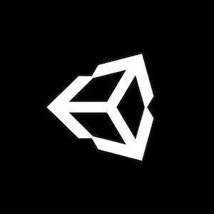

# 制作 RTS 游戏#50:实现技术树 1/3 (Unity/C#)

> 原文：<https://medium.com/codex/making-a-rts-game-50-implementing-a-technology-tree-1-3-unity-c-1c516ba78712?source=collection_archive---------3----------------------->

## 让我们继续致力于我们的 RTS 并实现一些技术树！

[*【⬅️】插曲#4:提高生命值*](/codex/rts-interlude-4-improving-the-healthbars-unity-c-48ee8d663e09)*|*[*TOC*](https://mina-pecheux.medium.com/making-an-rts-game-in-unity-91a8a0720edc)*|*[*教程#51:实现一个科技树 2/3 ➡️*](https://mina-pecheux.medium.com/making-a-rts-game-51-implementing-a-technology-tree-2-3-unity-c-8f2e757ac5b)

*📕* [*获取 Gumroad 上的电子书和奖励资料！*](https://mpecheux.gumroad.com/l/rrylr)🚀 [*在我的 Github 上找到这个教程系列的代码！*](https://github.com/MinaPecheux/UnityTutorials-RTS)

