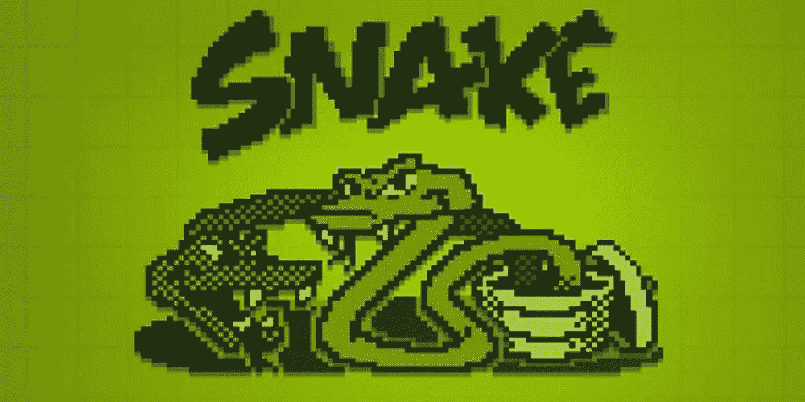

# 用 PyGame 制作一个蛇游戏

> 原文：<https://medium.com/codex/making-a-snake-game-with-pygame-7144cc40094?source=collection_archive---------15----------------------->

《贪吃蛇》是一款标志性游戏，在新一代手机上仍有翻拍版。这是因为制作一个贪吃蛇游戏相当简单，但仍然很有趣，主要是因为怀旧。所以为什么不制作我们自己的贪吃蛇游戏呢。

用 python 制作一个贪吃蛇游戏很简单，但是用 pygame 已经完成了大部分工作，比如制作棋盘、打印蛇以及每一步更新游戏。PyGame 是 python 库，用于制作简单的 2D 游戏。这是最著名的用 python 制作游戏的库之一。它还可以用来为强化学习代理创造环境。

所以让我们开始吧。首先让我们创建一个环境，激活它并在其中安装 pygame。

好了，我们都准备好做蛇游戏了。

好吧，我明白这是太多的代码了，但是这是给那些只想要代码而不想要解释的人的。

现在让我们将代码分解成简单的块。

首先是一些参数的初始化。颜色不需要初始化，但是因为它们被多次使用，我初始化了它，以便在需要的时候更容易设置它们。x 和 y 是蛇的坐标。开始时，它被设置在棋盘的中间。“foodx”和“foody”是蛇的食物坐标。位置被设置为棋盘内的随机点。等式是将食物的位置设置为远离蛇，但在棋盘内。虽然可以应用一个更简单的等式，但有时它会在蛇的正上方产生食物。蛇的长度最初设置为 1。最后初始化一个时钟来更新屏幕。可以说是维持游戏的 fps。

现在让我们看看主要的播放功能。首先，我们画出棋盘并为显示添加标题，即设置游戏的标题。然后我们运行一个循环来玩游戏，直到玩家输了或者按下退出按钮。Pygame 提供了一些非常有用的方法来识别键盘上的某个键何时被按下以及哪个键被按下了。

这条蛇在 2D 空间运动，它可以向左、向右、向上或向下运动。类似地，它的位置将改变为(-x，y)，(+x，y)，(x，-y)或(x，+y)。这就是 if 语句检查的内容。它将按照用户按上面初始化的 snake_block 的单位按下的方向移动。

现在，我们在每个时间步长后设置蛇的新位置，并重新绘制棋盘。我们还要检查蛇头是否接触到身体。如果是的话，游戏结束。同样，如果头部在食物的位置，一个新的块被添加到蛇的身体，使它的尺寸更大。同样，如果头部接触到食物，食物会被抹去，新的食物会在远离蛇的另一个随机位置产生。

游戏难度也有所增加，我做的是如果蛇碰到边界，玩家就输了。

这是两个小函数，用于在每个时间步长后绘制和刷新面板。

最后，我们制作蛇的游戏并玩耍。瞧啊。！游戏结束了。虽然一个完整的游戏可以有更多的逻辑和方程式，这个游戏仍然有所有的基本功能。玩我们自己制作的游戏也很有趣。

请在这里查看完整的代码。感谢您的阅读。