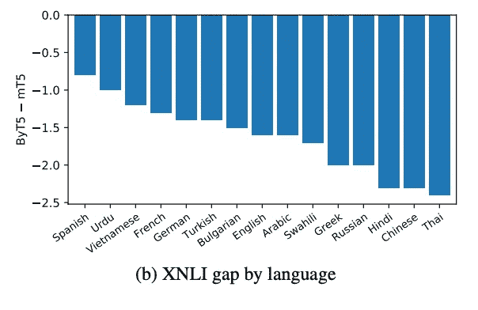

# 制作泰语字节级语言模型

> 原文：<https://medium.com/codex/making-a-thai-byte-level-language-model-5d27d2fd57dd?source=collection_archive---------5----------------------->

## 当单词和子单词不起作用时

我采用的一个泰国伯特模型最近出现在一篇关于生物医学中跨语言学习的论文中。同样的模型在空间文件中。人们在 GitHub 和 Kaggle 上使用它。正如在大多数 NLP 模型中一样，我使用了一个标记器，它将文本分成一串单词和子单词前缀和后缀，单词在分成前缀和后缀之前用空格分隔。但这一假设在许多全球语言中并不成立。例如，泰语在[大多数]单词之间不加空格。

[泰国 AI 研究院 2021 年发布的 WangchanBERTa](https://huggingface.co/airesearch/wangchanberta-base-att-spm-uncased) 就是一个比较好的模型。[模型卡](https://huggingface.co/airesearch/wangchanberta-base-att-spm-uncased#preprocessing)显示了使用 PyThaiNLP 库进行预处理所需的步骤。我推荐那个而不是我自己的。但通常，编码人员会寻找可以放入现有管道中的模型。我们可以在 HuggingFace 中添加文档或支持更多的标记器，但后来有两种新方法引起了我的注意…

# 输入 Charformer 和 ByT5

2021 年 6 月，谷歌研究院的不同小组发布了关于字符和字节级变压器模型的论文。在计算语言学家如此努力地将文本解析为有意义的语素和嵌入之后，应该将“波霸”和“狒狒”拆分为单独的字母或字节，以便模型推导出自己的规则……这是对传统的重大突破。第一个网络层的架构也必须改变(从数万个单词嵌入到少数几个)。但是在深入研究了其他模型上的记号化器问题之后，这可能是一个改进？

ByT5 论文的作者科林·拉斐尔:

Charformer 论文的作者 Yi Tay 说:

我的观点是，谷歌参与了这些模型，因为规定性的令牌词汇对于像谷歌搜索这样的超级通用任务来说是一个障碍。单是英语的单词列表就已经非常庞大了，语言的多样性也非常具有挑战性，以至于他们想让模型找出一个神经解决方案。

我应该提到，字节级标记化并不新鲜，[脸书研究公司在 2019 年底探索了它的翻译功能](https://arxiv.org/abs/1909.03341)，wav2vec 在语音到文本方面做了类似的事情，谷歌在 2021 年早些时候发表了另一篇论文[犬类](https://arxiv.org/abs/2103.06874)(我喜欢这篇论文对包括阿拉伯语、格陵兰语和泰语在内的语言进行分组，讨论它们如何受益)。

# 预训练和微调 ByT5

幸运的是，ByT5 在 mC4 上进行了预训练，mC4 是一个包括泰语的多语言数据集。如果你只想预先训练泰语，不幸的是，阅读和从 mC4 中分离出一种语言需要[大量资源](https://github.com/tensorflow/datasets/issues/2762)(这里是[韩语示例](https://github.com/chrisjihee/tensorflow-datasets-ko/blob/master/tensorflow_datasets_ko/text/c4ko.py))。
如果你想对你自己的数据集或 mC4 之外的语言进行预训练，我在这里开始[一个笔记本。*我真的希望在不久的将来为迪维希尝试一下。*](https://colab.research.google.com/drive/1PEBsdTwNlgigLLoL7wfUPpsMluvNM6Wv?usp=sharing)

大多数用户可能希望将 5-large 放入他们的微调管道，然后就到此为止。不幸的是，大多数 T5 代码样本是为文本到文本(例如 HuggingFace 的`T5ForConditionalGeneration`)设计的，制作一个分类器需要编写一些 PyTorch。我大量借用了 Suraj Patil 的 T5 笔记本，并在这里更新了我的更新:

*   适应 T5 车型的变化
*   较新版本的依赖项
*   使用 HuggingFace 的数据集库代替原来的 CSV。

[最终笔记本](https://colab.research.google.com/drive/1H8jbvjnBdd0AoIuwxBf79dR8oanmyyIb?usp=sharing) —在对 IMDB 和 Wongnai 数据集进行问题训练后，我对 Wisesight 情感数据集进行了微调`byt5-small`。在谷歌云 A100 上，你可以升级到`byt5-base`，但不能升级到`byt5-large`或更大的版本。

有人看了我的笔记本，推荐了一个不太 DIY 的 T5 训练库——它将很快支持 by T5:[pypi.org/project/simplet5/](https://pypi.org/project/simplet5/)

图来自 ByT5 论文

我们现在应该使用字节模型吗？ByT5 论文承认 *mT5* (一个多语种模型，带有一个更标准的标记器)在泰语 XNLI 上仍然表现更好。

> 句子块标记压缩率较高的语言(例如泰语和泰卢固语)倾向于使用 mT5，而压缩率较低的语言则倾向于使用 ByT5

我想知道一个泰国独有的或训练时间更长的模型在这里是否会显示出一些更好的结果，或者每个模型在不同的任务上是否表现得更好。

# Charformer

Charformer 的代码 6 月 29 日才在 GitHub 上发布，所以还没有 HuggingFace 模型([问题](https://github.com/huggingface/transformers/issues/12410))。
主要开发的是一个*基于软梯度的子词标记化* (GBST)模块，它被训练并添加到一个更大的变压器神经网络的开始。Letitia Parcalabescu 的这段视频有助于解释这个概念。

在 GitHub 上搜索一些非官方的实现，我找到了牟的[这个文本嵌入库](https://github.com/ChenghaoMou/embeddings)。一切都还在开发中，每晚都要用到 PyTorch，但是这些例子给出了如何将 Charformer 嵌入到 PyTorch Lightning 模块中的想法。

# 更新？

这篇文章发表于 2021 年 7 月。关于我的最新建议，请查看 GitHub 自述文件的泰语 NLP 部分。