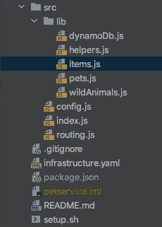

# 使现有的应用程序更加实用

> 原文：<https://medium.com/codex/making-an-existing-application-more-functional-4e1ed8b53131?source=collection_archive---------6----------------------->

## **第 1 部分，起点**


由[马丁·施瑞德](https://unsplash.com/@martinshreder?utm_source=medium&utm_medium=referral)在 [Unsplash](https://unsplash.com?utm_source=medium&utm_medium=referral) 上拍摄的照片

## **简介**

在这一系列的博客文章中，我们将看看**宠物服务**，一个使用对象和函数以命令式风格编写的简单应用程序。尽管有一些优点(您可以在合适的时间和地点使用函数/对象)，但它也有许多问题。在这篇博文中，我们将探讨这些问题。后续文章将展示使用 [fp-ts](https://github.com/gcanti/fp-ts) 框架的(更多)功能重写。无耻之徒:我[写了一本书](https://leanpub.com/functionalprogrammingintypescriptapracticalguide)来帮助人们使用那个框架快速编写功能代码！

## **原申请概述**

宠物服务是一个 CRUD 应用程序，可以存储关于宠物和野生动物的信息。宠物比野生动物有更多的属性(比如可爱)，但对于后者，我们为每种动物都保留了一个计数器，因为知道外面有多少狮子可能会很好。出于保存*和*安全目的。

我们的代码位于一个 [API 网关 HTTP API](https://docs.aws.amazon.com/apigateway/latest/developerguide/http-api.html) 之后，它将每个调用路由到一个贪婪的端点，一个负责进一步路由的(fat) [Lambda](https://aws.amazon.com/lambda/) 。 [DynamoDB](https://aws.amazon.com/dynamodb/) 作为数据库。你可以在 [GitHub](https://github.com/VanOvermeire/pet-project-original-version) 上查看这个项目。以下是概述。



*infrastructure.yaml* 包含我们的应用基础设施，作为一个 [SAM](https://docs.aws.amazon.com/serverless-application-model/latest/developerguide/what-is-sam.html) Cloudformation 文件，而 *setup.sh* 帮助我们构建和部署我们的代码。所有应用程序代码都位于 *src* 文件夹中。 *index.js* 公开了一个处理函数，作为 Lambda 的[入口点。处理程序使用](https://docs.aws.amazon.com/lambda/latest/dg/nodejs-handler.html) [lambda-api](https://www.npmjs.com/package/lambda-api) ，它类似于 express 或 serverless-express，负责路由来电。

```
// **index.js**const api = require('lambda-api')({
    // options config
});
const ***routes*** = require('./routing');

***routes***.apply(api);

exports.handler = async (event, context) => {
    ***console***.log(event);
    // lambda-api library cannot handle newer type of event
    if(event.version === "2.0") {
        event.httpMethod = event.requestContext.http.method;
        event.path = event.requestContext.http.path;
    }
    return api.run(event, context);
};
```

*config.js* 包含一些常量，包括从 Lambda 环境变量中检索的 DynamoDB 表名。 *routing.js* 包含一些更多的 lambda-api 设置。它配置验证并创建选项、GET 和 POST 端点。

```
// **routing.js**// imports

// code for generating options

function apply(api) {
    const pets = callFor(Pet);
    const wild = callFor(WildAnimal);

    api.use(queryParamValidation);
    api.use(bodyValidation);

    api.get('/pets/:id/client/:clientId', pets.get);
    api.post('/pets/:id/client/:clientId', pets.post);
    api.get('/wild/:id/type/:type', wild.get);
    api.post('/wild/:id/type/:type', wild.post);

    generateOptionCalls(api);
}

module.exports = { apply };
```

所有其他文件都在 *lib* 文件夹下。 *helpers.js* 包含用于验证的函数；pets.js 和 *wildAnimals.js* 有描述这两种动物的类。每个类对其属性进行分组，并可以生成[键，用于存储在数据库](https://docs.aws.amazon.com/amazondynamodb/latest/developerguide/HowItWorks.CoreComponents.html#HowItWorks.CoreComponents.PrimaryKey)中或从数据库中检索。

```
// **pets.js** (wildAnimals, not shown here, is very similar)// imports

class Pet {
    constructor(request) {
        const { id, clientId } = request.params;
        const { name, age, cuteness, type } = request.body ? request.body : {};
        ***Object***.assign(this, { id, clientId, name, age, cuteness, type });
        this.typeId = PETS_ID;
    }

    get item() {
        const { id, clientId, name, age, cuteness, type } = this;
        return { id, clientId, name, age, cuteness, type };
    }

    get ppId() {
        return `${this.typeId}#${this.clientId}`;
    }

    get psId() {
        return this.id;
    }
}

module.exports = {
    Pet,
};
```

*items.js* 作为一种实现 GET 和 POST 调用的门面，抽象出动物的类型。

```
// **items.js**const ***ddb*** = require('./dynamoDb');

function returnServerError(e, response) {
    ***console***.error(e);
    return response.status(500).send({});
}

async function getItem(request, response, animal) {
    // call to db
}

async function postItem(request, response, animal) {
    // call to db
}

function callFor(AnimalClass) {
    return {
        get(request, response) {
            return getItem(request, response, new AnimalClass(request));
        },
        post(request, response) {
            return postItem(request, response, new AnimalClass(request));
        },
    };
}

module.exports = {
    callFor,
};
```

最后， *dynamoDb.js* 是任何与数据库相关的地方。它包含数据库设置、参数、调用、返回值的转换等。

```
// **dynamoDb.js**// imports, setup of DynamoDB DocumentClient
// init/update/get counter, putWith, getWith...function get(animal) {
    const params = {
        TableName: DDB_TABLE,
        Key: {
            ppId: animal.ppId,
            psId: animal.psId,
        },
    };
    return dynamoGet(params)
        .then(data => {
            if (data.Item) return { item: data.Item };
        });
}

function put(animal) {
    const { ppId, psId, item } = animal;
    ***Object***.assign(item, { ppId, psId });
    const dynamoDbParams = {
        TableName: DDB_TABLE,
        Item: item,
    };
    return dynamoPut(dynamoDbParams);
}

function getItem(animal) {
    if (animal.getCounter) return getWithCounter(animal);
    return get(animal);
}

function putItem(animal) {
    if (animal.updateCounter) return putWithCounter(animal);
    return put(animal);
}

module.exports = {
    getItem,
    putItem,
};
```

单元和集成测试不包括在演示应用程序中。

## **评估**

该项目有其特点:

*   一些想法已经进入了组织代码和文件名给我们一个很好的想法是什么包含在里面，即使“助手”和“库”可能更有帮助。
*   依赖性少，[导致性能好](https://docs.aws.amazon.com/lambda/latest/dg/best-practices.html)。
*   只要不需要新的特殊行为，添加新的动物类型*是相当容易的。无论有没有计数器，存储信息只需要创建新的类和路由。*
*   目前，代码并不太复杂(但这也是因为它是一个简单的例子)。

话虽如此，但缺点呢？我在这个项目中具体看到了什么问题，这告诉我们关于以类似风格编写的其他项目的什么信息？

首先，传递一个“请求”、“响应”和“下一个”参数,[表达的东西](https://expressjs.com/)似乎已经在节点生态系统中流行起来:

```
// from **helpers.js**function bodyValidation(request, response, next) {
    if (!request.body && request.method !== 'POST') {
        next();
    } else {
        try {
            bodyValidate(request.body);
            next();
        } catch (e) {
            ***console***.error(`body: ${e}`);
            return response.sendStatus(400);
        }
    }
}function queryParamValidation(request, response, next) {
    // quite similar to bodyValidation
}
```

尽管这种方法很受欢迎，但它也有很多缺点。其中最重要的是:许多代码“意识到”我们正在使用什么样的框架。所以如果我们决定切换到一个不注入参数的框架，我们必须改变我们代码库的很大一部分。由于 Javascript 的动态特性，改变到一个相似但不完全相同的框架会带来额外的困难。微小的差异可能会导致我们的测试和手动验证所忽略的细微错误。尤其是因为我们可能会在大多数测试中嘲笑这三个参数。

说到测试，如果框架“感染”了我们更多的代码，我们就不得不做更多的模仿，使得我们的测试代码更加复杂和不可预测。检查传入请求是否包含 id 的简单函数应该会产生一个我们可以验证的返回值。对于类似 express 的框架，我们必须检查响应参数。

在更一般的问题类别中，框架提供的选项鼓励我们破坏应用程序的“流程”。我们可以通过调用 *response.send()* ，在传递响应参数的任何地方停止并返回一个 HTTP 响应。这意味着您需要详细的文档或代码本身来理解特定函数的行为。它可能会将框架参数传递给下一个函数。也许在某些情况下它会返回一个响应，但不是所有的情况。由于框架无处不在，你需要记住整个应用程序才能理解其中的一小部分。让事情变得更加困难的是，可以使用 *next* 参数来停止执行并继续下一个函数。

最后，鼓励参数的突变。您希望一些数据最终出现在下游的函数中吗？只需将其添加到请求参数中即可！方便但危险，原因有几个。首先，不熟悉您的应用程序的人会突然看到未知属性出现在请求参数中。其次，我们可能会意外地破坏或更改下游需要的数据(如请求体)。

同时，为每种动物(在我们的例子中是宠物和野生动物)创建的**类**限制了重用。观察该类是如何被注入到获取信息的函数中的:

```
// from **items.js**async function getItem(request, response, animal) {
    await ***ddb***.getItem(animal)
        .then(data => {
            if (data && data.item) {
                return response.status(200).send(data.item);
            }
            return response.status(404).send({});
        })
        .catch(e => returnServerError(e, response));
}

function callFor(AnimalClass) {
    return {
        get(request, response) {
            return getItem(request, response, new AnimalClass(request));
        },
        // ...
    };
}
```

在兔子洞的更深处:

```
// from **dynamoDb.js**function get(animal) {
    // ...
}

async function getWithCounter(animal) {
    // ...
} function getItem(animal) {
    if (animal.getCounter) return getWithCounter(animal);
    return get(animal);
}
```

因此，我们的大多数函数需要我们传入一个动物参数，它本身*需要为其构造函数*传入请求参数。然而，令人遗憾的是，我们又一次将代码和框架以及动物类绑在了一起。

这种方法直接和间接地限制了重用。对于前者，我的意思是我们只能使用那些我们可以创建或伪造正确的动物对象的函数。间接的问题，分层，是相关的。比方说，数据检索的底层应该可以由代码使用，而不需要了解 HTTP 请求(请求和响应参数)等更高层次的问题。在当前的设置下，如果没有请求参数，很难“挂钩”到底层而不遇到一堆错误。试图检索来自队列或主题而不是网关的动物信息？要么复制代码并使其在没有动物类的情况下工作，要么伪造该对象，添加大量测试并希望它们覆盖所有可能的场景。由于这个额外的参数，测试再次变得更加令人厌倦。

现在登上 ***dynamoDb.js*** 。它的主要问题是做太多的事情。大约三分之一的*代码位于这个文件中，它比大多数其他文件大三倍。它的职责是什么？一大堆事情。它设置与 DynamoDB 对话的客户端，调用 AWS SDK 方法，为调用创建参数，并对返回的数据应用一些(但不是全部)“转换”。随着项目变得越来越复杂，它将不受控制地增长。想要添加另一种具有额外行为的动物吗？添加一个新文件，大小类似于 *pets.js* 加上几行 routing 和 *items.js* 。其他的都会发生在 *dynamoDB.js* 里。要添加删除吗？写几行路由；所有其他代码将进入我们最喜欢的文件！*

所以在宏观层面上，这个文件包含了太多的内容，做了太多的事情。内部的函数也是如此。因此，如果我们的应用程序开始扩展，这些函数将呈指数级增长，并且将变得更难阅读、更难重用(因为它们变得更加具体)和更难测试，需要您模仿整个 AWS 设置。

```
// from **dynamoDb.js**// this function creates parameters, does the call to dynamo and performs logic on the returned valuefunction getCounter(animal) {
    const params = {
        TableName: DDB_TABLE,
        Key: {
            ppId: animal.ppCountId,
            psId: animal.psCountId,
        },
    };
    return dynamoGet(params)
        .then(data => {
            if (data.Item) {
                return data.Item.itemCount;
            }
            return 0;
        });
}
```

**错误处理**不理想。它分布在整个应用程序中。当然你有一个 *helpers.js* 来检查传入的参数和主体。但是看一看 *items.js* ，你会看到它处理一些额外的场景:

```
// from **items.js**// this is handling errors (a 404 or 500) and creating returns (200)
// in addition, it is an example of passing on the animal info, using the req/res params from the framework and more than one responsabilityasync function getItem(request, response, animal) {
    await ***ddb***.getItem(animal)
        .then(data => {
            if (data && data.item) {
                return response.status(200).send(data.item);
            }
            return response.status(404).send({});
        })
        .catch(e => returnServerError(e, response));
}
```

还有多种处理错误的方法。在应用程序的一部分，当出错时我们抛出错误。在另一个示例中，我们使用传入的参数捕捉错误并返回响应。这种方法使应用程序的流程变得复杂。当我抛出一个错误时，其他函数可能会也可能不会捕捉到它。我必须检查代码，找出实际发生了什么。

**配置**文件有问题，因为它包含常量和环境变量。为什么这是一个问题？首先，它使测试变得有点困难，因为我们必须确保环境变量已经设置好了。第二，我们再一次让所有的函数“知道”配置来自哪里。那不关他们的事该死的！第三，大多数函数只需要常量，而不需要(可变的)环境变量。然而他们两者都得到了，而不是局限于他们实际需要的东西。

```
// **config.js**const CONSTANTS = {
    PETS_ID: 'P',
    WILD_ANIMALS_ID: 'W',
    COUNTER_ID: 'C',
};

module.exports = {
    ...CONSTANTS,
    DDB_TABLE: ***process***.env.DATABASE_NAME,
};
```

这些评论听起来可能有点吹毛求疵，但是在首次指出这是实际应用程序中的一个潜在缺陷几个月后(但是没有采取任何措施——哎呀，我的错！)，实际上造成了严重的 bug。两台 Lambdas 使用相同的源代码，包括一个配置文件。为 Lambda A 编写了一个特性，它需要一个额外的环境变量。该变量被添加到基础设施和配置中。Lambda B 没有任何变化，因为它不需要新的变量。但是当它试图加载更新的配置时开始崩溃，因为它没有新变量的值，并且有一个检查来确保它存在！如果 Lambda B 只加载了它需要的常量和环境变量，这些崩溃就可以避免。

最后，一些额外的小问题:

*   **业务逻辑**分散在应用程序中，而不是核心。*但是*这是一个简单的 CRUD 应用程序，只有有限的特定业务相关代码，所以这可能是可以接受的。
*   *forEach* 用于多个位置。这没什么，但确实指向了**突变**，这会导致更多的应用程序出错。
*   我们的类主要用作数据容器。哪个不差*本身*。但是，如果您只想存储一些数据，为什么要使用成熟的类呢？

## 我们该如何改进呢？

我关于如何改进这个应用程序的想法分为两类:**适用于任何类型代码的一般建议**和**与函数式编程相关的建议**(缩写为 **FP** )。

首先，关于**框架及其参数**:将这样的参数传递给尽可能少的函数。你会希望与接收和响应相关的一切尽可能地靠近应用程序的“表面”。应该是在一座[六角形建筑](https://en.wikipedia.org/wiki/Hexagonal_architecture_(software))的外层。在分层架构中，这类问题应该只出现在控制器中，而不会出现在底层服务或数据库层中。这将使应用程序的大部分更容易理解和测试。

FP 有助于关注纯函数和不变性。纯函数是那些没有副作用，参数决定返回值的函数。当编写这样的函数时，你会尽量避免像请求/响应参数这样的东西，至少关注纯粹性会鼓励你只在有限的地方使用它们。不变性将避免由于改变传入的请求和响应而导致的错误和复杂性。所以默认情况下，FP 鼓励你遵循不要让这些框架问题感染你的整个代码的建议。

就**班**而言，总的建议是相似的。确保框架的细节——以及使用它的类——不会出现在整个代码中。限制影响。能够处理通用数据的代码将更具可重用性。另一个一般性建议是使用类型来描述函数的需求。我们的函数将是可重用的，因为它们不依赖于特定的类，但是它们通过类型告诉我们它们需要什么。这给了我们一些额外的保证，当“挂钩”到我们代码的一部分时，如果这不起作用，编译器会警告我们。

函数式编程还鼓励我们尽可能使函数通用，能够处理各种各样的数据结构。像 *map* 和 *filter* 这样的函数很少关心你的底层类或对象。它们只是工作，不管它们处理的是什么类型的数据。对于这样的函数来说，封装(这在面向对象的世界中非常重要)实际上是一个缺点。将一个泛型函数封装在一个类中，这样它就可以和它的私有变量一起工作，并且你必须在每次创建一个新类的时候编写它。

应将 **dynamoDb** 文件拆分，并简化其功能。从面向对象编程中，我们可以回忆起“单一责任”的坚实原则来指导我们。FP 告诉我们将纯粹的功能集中在一个单一的任务上，这个任务可以被组合来执行更复杂的行为。这将提高可读性和可测试性。

就**错误处理**而言，一般的建议是集中在一个地方处理错误，例如用 Spring 的[控制器 Advice](https://www.baeldung.com/exception-handling-for-rest-with-spring) 。这只是部分修复，因为我们仍然可以在应用程序的任何地方抛出异常，阻止代码运行，使流程复杂化。但这无疑是朝着正确方向迈出的一步。像 Haskell 这样的函数式语言提供了一种不同的方法。他们试图避免抛出异常，而是使用像单子这样的东西来处理失败场景。这避免了中断流动。这样，类型也变得更具信息性，签名清楚地显示了我们可能面临的不愉快的道路。

更改**配置**文件的一般建议可能是不言而喻的:将真正的常量和注入的环境变量分开。在 FP 中，我们可能会使用 Effect 或 IO monad 来检索后者，将信息添加到相关函数的类型中。如果我们也为注入的配置使用一个类型，我们的编译器可能会警告我们缺少一个环境变量。

最后，在一个更复杂的应用程序中(不仅仅是简单的 CRUD ),我们将使用 [DDD](https://en.wikipedia.org/wiki/Domain-driven_design) 和可能的六边形架构来确保我们的业务逻辑与其他关注点明确分离。FP 再次鼓励我们使用不变性来避免关于突变的问题。

## **接下来的步骤**

在这篇博文中，我们展示了一个演示应用程序，尽管它有一些好的品质，但也有一些问题，可能会损害可维护性和未来的扩展。我们讨论了如何改进应用程序，使用了通用的软件工程原则以及来自函数式编程世界的流行思想。在下一篇博文中，我们将通过使用 functional Typescript 重写应用程序，开始将这些想法付诸实践。

萨姆·范·奥弗迈尔