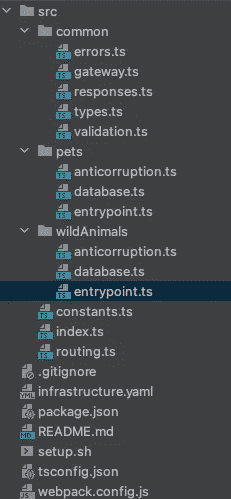

# 使现有的应用程序更加实用

> 原文：<https://medium.com/codex/making-an-existing-application-more-functional-7835ac7bc605?source=collection_archive---------17----------------------->

## **第二部分，验证**


由[都铎·巴休](https://unsplash.com/@baciutudor?utm_source=medium&utm_medium=referral)在 [Unsplash](https://unsplash.com?utm_source=medium&utm_medium=referral) 上拍摄

## **简介**

在[之前的博客文章](/codex/making-an-existing-application-more-functional-4e1ed8b53131)中，我们做了一个示例节点应用程序的演练，讨论了它的优点和问题。我们还从高层次概述了改进其设计的方法。在这篇博文中，我们将开始以函数式风格重写应用程序，从而展示函数式编程(FP)技术如何帮助改进应用程序的几个重要方面(比如可读性和可测试性)。这次重写的所有代码都可以在 [GitHub](https://github.com/VanOvermeire/pet-project-new-version) 上找到。

## **函数而非 FP；重写——不是重构**

*“等等！原始应用程序已经使用了函数。所以那不是 FP 吗？”不。原因有很多，其中包括:它的功能是以命令的方式使用的，大多数有一个或多个副作用，因此是不纯的。这部分是由于使用了类似 Express 的框架和大量的 CRUD 焦点，但是即使是验证“助手”也会抛出异常。此外，高阶函数和组合在构建功能性方面的作用非常有限，并且有很大的可变性。所以我们的目标是开始尽可能多地使用纯函数的组合，同时避免变异。结果无疑是*而不是*功能完全正常。但在精神上，它将与第一版相去甚远。正如在上一篇博文中提到的，我用 Typescript 写了一本关于 FP 的[书](https://leanpub.com/functionalprogrammingintypescriptapracticalguide)，所以如果这篇博文中的一些基本概念不清楚，你可以随时去买那本书并阅读这方面的内容，让我开心。*

为了清楚起见，我们将在这里展示的是应用程序的*重写*，而不是重构，因为这将是或者应该是一部分一部分的，保持现有的应用程序正常运行。重构通常是更有用的方法，因为你在保持现有产品运行的同时对其进行改进。但是为了演示的目的，一个全新的功能应用程序允许更容易的并排比较。

## **新项目设置**

让我们回顾一下新宠物服务的基本设置。



*setup.sh* 除了栈名不变。基础设施基本上是相同的，除了 Lambda zip 文件和处理程序的位置发生了变化。因为我们切换到了 Typescript，所以我们添加了一个 *tsconfig.json* 和一个 webpack 配置来编译我们的代码。对 Typescript 的更改也在我们的 *package.json* 中引入了一些更改，添加了新的依赖项(主要与我们的新功能框架相关)，去掉了旧的用于 *lambda-api* 的依赖项。

在 src 文件夹里面，我们有 *index.ts* 、 *routing.ts* 和 *constants.ts* ，包含了一些基本的功能。索引文件再次成为我们的 Lambda 入口点。除了将传入事件传递给路由文件之外，它做的事情很少。在 *index.ts* 中做得很少的好处是，这使得我们的代码更容易测试。例如，我们可以使用索引文件来设置需要很长时间加载的依赖项。如果我们在处理函数之外这样做，它们在每个 Lambda 容器**中只被加载一次，并且**我们不需要花费时间来初始化它们。这就是众所周知的 Lambda [优化](https://docs.aws.amazon.com/lambda/latest/dg/runtimes-context.html)。但是这确实使文件更难测试，因为即使不调用处理程序，仅仅导入文件就会运行这个设置。因此，将我们自己的业务逻辑转移到其他文件是一个简单的解决办法。另外，如果我们将这些依赖关系作为参数传递，用模拟和单元测试替换它们就变得容易了。(有趣的是，在这种情况下，参数使测试变得更容易，因为依赖性相对更难模仿，而模仿*响应*参数却很复杂，因为它提供了许多行为和副作用。)

在我们的路由中，我们希望避免将信息包装在请求/响应参数中的库，因此我们的代码对于演示目的和简单项目来说已经足够好了。不要做太多 AWS 能帮你做的事情是他们的无服务器最佳实践之一。最大的问题是它如何抛出一个错误(副作用！)如果它找不到正确的路线。我们将在下一篇博文中提出一个更好的方法。

```
// **routing.ts**
// note that we switched to using query string params instead of path to simplify things// some imports

export const route = async (event: APIGatewayProxyEventV2) => {
    const path = event.requestContext?.http?.path;
    const method = event.requestContext?.http?.method;

    if (path === '/pets') {
        if (method === ***GET_METHOD***) {
            return getPet(event);
        } else if(method === ***POST_METHOD***) {
            return postPet(event);
        }
    } else if(path === '/wild') {
        if (method === ***GET_METHOD***) {
            return getWildAnimal(event);
        } else if(method === ***POST_METHOD***) {
            return postWildAnimal(event);
        }
    }
    throw new ***Error***(`Invalid route for ${***JSON***.stringify(event)}`);
};
```

*src* 下的文件夹包含宠物和野生动物实现。需要注意的一点是，结构发生了变化。这两种动物现在都有自己的文件夹，里面有它们需要的一切！这是基于 DDD 的一些建议:我们应该根据领域而不是技术细节对代码进行分组。这样做的原因是，每当您更改某些东西(修复一个 bug，添加一个特性)时，您只有一个地方/一个文件夹需要更改代码。一个*公共*段用于代码重用。任何看起来足够普通，可以在生物之间共享的东西都放在那里。在我们的动物文件夹中有多个文件，但是在这篇博文中，我们将聚焦于**验证**。因此，我们将查看*入口点*和*反腐败*文件，重点是那些来自**宠物**文件夹的文件(野生动物的代码在验证方面非常相似)。

## **验证用户输入**

让我们从 *entrypoint.ts* 开始。这个名字告诉我们，这是所有宠物/野生动物代码的入口点。(命名非常难我尽了最大努力挑选的名字。)

```
// **entrypoint.ts** (in pets)// imports

export const getPet = async (event: APIGatewayProxyEventV2): Promise<Response> =>
    pipe(
        preparePetGet(event),
        TE.***fromEither***,
        TE.***chain***(retrieveFromDatabase),
        TE.***map***(***JSON***.stringify),
        TE.***bimap***(handleError, okResponse),
        TE.***getOrElse***(T.***of***)
    )();

export const postPet = async (event: APIGatewayProxyEventV2): Promise<Response> =>
    pipe(
        preparePetPost(event),
        TE.***fromEither***,
        TE.***chain***(putInDatabase),
        TE.***bimap***(handleError, createdResponse),
        TE.***getOrElse***(T.***of***)
    )();
```

暂时忽略这些东西。我们可以看到，有 GET 和 POST 函数。如果我们想要一个删除，我们将在这里添加一个删除函数，这个函数将被“外部”代码调用(例如，在 pets 文件夹之外的任何东西)。这是使用入口点的第一个原因:它们限制了我们的 pets 模块的表面积。遗憾的是，应用程序的其他部分仍然可以从其他文件导入，因为目前没有办法在 Javascript/Typescript 中强制进行更多的本地导出。因此，要实施这一点，需要依靠团队内部的一致意见或编写一些代码来自动完成。在任何情况下，这种表面积限制对于功能性应用程序都特别有用，因为大量的功能与大量的文件相结合，并且从任何地方导入都会很快变得非常混乱。构建分层(控制器-服务-数据库)应用程序也有类似的众所周知的规则。

入口点的第二个原因是我们需要一个地方来组合应用程序的各个部分。上面的函数就是这么做的:它们接受传入的事件，并通过管道发送它，最后返回一个结果。所以我们使用*组合*更小的函数来构建我们的应用程序。在我们最喜欢的例子中，单子(TE)帮助我们构建异步函数。但稍后会详细介绍。

当传入的事件进入我们的文件夹时，我们会对其进行验证(参见 *preparePetGet* 和 *preparePetPost* )。为此，我们使用反腐败文件中的功能。查看导出的函数，我们可以看到它完全是海龟(或者，参考电影*盗梦空间*)因为*准备** 函数本身是由函数组成的:

```
// **anticorruption.ts** (in pets)import * as E from 'fp-ts/Either';
// other importsconst parseEvent = (event: APIGatewayProxyEventV2): RetrievePetRequest => ({
    id: event.queryStringParameters.id,
    clientId: event.queryStringParameters.clientId,
});

const parseEventFromBody = (parsedBody: E.Json): AddPetRequest => {
    const records = parsedBody as E.JsonRecord;

    return {
        id: records.id as string,
        clientId: records.clientId as string,
        name: records.name as string,
        age: records.age as number,
        cuteness: records.cuteness as string,
        type: records.type as string,
    };
};

export const preparePetGet = (event: APIGatewayProxyEventV2): E.Either<Errors, RetrievePetRequest> =>
    pipe(
        checkQueryString(event),
        E.***map***(parseEvent),
    );

export const preparePetPost = (event: APIGatewayProxyEventV2): E.Either<Errors, AddPetRequest> =>
    pipe(
        E.parseJSON(event.body, () => clientError('Invalid json body')),
        E.***chain***(checkBody),
        E.***map***(parseEventFromBody),
    );
```

进一步研究代码，我们看到公开的函数有两个任务。首先，它们检查传入事件中包含的值。对于 GET，我们检查查询字符串，对于 POST，我们检查主体。这些函数很小，专注于一项任务(例如:检查查询字符串),它们输出的值完全取决于通过参数提供的输入。换句话说，**它们是纯函数**，这使得它们很容易组合。

因为它们是纯函数，所以不会有副作用，比如抛出异常，这是发出问题信号的常见方式。但是如果他们不能使用异常，我们应该用什么来代替呢？嗯，单子！更具体地说**要么单子**(也称为结果)。这是一种值的容器，按照惯例，*或者是在“右”框中的正常值，或者是在“左”框中指示问题的值。看一下 *checkQueryString* ，特别是最后几行:*

```
// **validation.ts** (in common)import * as E from 'fp-ts/Either';
// other importsconst inValid = (value: string) => !value.trim();export const checkQueryString = (event: APIGatewayProxyEventV2): E.Either<Errors, APIGatewayProxyEventV2> => {
    return ***Object*** .entries(event.queryStringParameters)
        .some(entry => inValid(entry[0]) || inValid(entry[1])) ?
            E.***left***(clientError('Query string validation error')) :
            E.***right***(event);
}
```

如果一个查询字符串名称或者它的值为空，我们放置一个适当的消息指示问题*离开*。注意，这个消息实际上不是一个字符串，而是一个对 *clientError* 的调用，它是一个 *ClientError* 类型的构造函数。我们稍后将讨论其原因。这些检查非常基本，就像最初的应用程序一样。但是它们是灵活的和可扩展的。再看一下*prepare post*。

```
// **anticorruption.ts** (in pets)import * as E from 'fp-ts/Either';
// other importsexport const preparePetPost = (event: APIGatewayProxyEventV2): E.Either<Errors, AddPetRequest> =>
    pipe(
        E.parseJSON(event.body, () => clientError('Invalid json body')),
        E.***chain***(checkBody),
        E.***map***(parseEventFromBody),
    );
```

我们用 fp-ts 中一个叫做 *parsejson 的助手来解析 JSON。那个函数可能会返回一个错误，在这种情况下，我们不必运行 *checkBody，*因为我们已经知道发生了什么。由于*两个*函数都返回一个要么单子，我们必须在*管道*中使用*链*(也称为*平面图*)来组合这些调用。现在，如果之前出现错误，我们的代码将自动跳过 *checkBody* 。*

扩展这种验证非常简单:编写一个函数进行一些验证并返回一个要么，并使用*链*将其添加到您的*管道*中。并行执行检查的另一种方法是**验证**，但是原理是一样的:构建简单、集中的函数，这些函数可以被组合并且不会产生副作用。

*anticorruption.ts* 的下一个任务是获取传入的有效载荷并对其进行转换。这是由*parseventfrombody，*完成的，与之前的调用不同，它返回一个普通的值，而不是一个单子，这就是为什么它与之前的函数结合使用*映射*而不是*链*。

我们为什么要为这种转变而烦恼呢？传入事件与使用 AWS 和 HTTP 产生的实现细节有很大的联系，因此得名 *APIGatewayProxyEventV2* 和各种属性，如 body、cookies、headers 等。我们希望避免这些概念污染我们的整个代码库，所以一旦我们知道请求是有效的，我们就只取我们需要的，并用它来构建一个新的对象。我们从 *preparePetPost* 返回的类型称为 *RetrievePetRequest* ，只包含一个 id 和客户端 id，这是我们查找宠物所需的全部内容。这就是为什么我选择了听起来很奇怪的名字“反腐败”。在 DDD，一个[反腐败层](https://docs.microsoft.com/en-us/azure/architecture/patterns/anti-corruption-layer)被用来在两个系统之间进行转换。

所以 *anticorruption.ts* 最终我们要么得到一个错误消息，要么得到一个可以在以后使用的对象。在后一种情况下，我们可以做一些转换，调用数据库并向用户返回一些内容。我们将在下一篇文章中研究这种情况。现在我们想继续探索错误处理。

## **处理我们的错误 ADTs**

正如我们之前看到的，当我们的反腐败文件中有一个错误案例时，我们调用一个函数来创建一个名为 *ClientError* 的东西。那是什么？你可以通过查看 *types.ts* 找到答案:

```
// types.ts (common)export type ClientError = {
    readonly type: 'ClientError',
    readonly message: string,
}

export type ServerError = {
    readonly type: 'ServerError',
    readonly message: string,
}

export type NotFoundError = {
    readonly type: 'NotFoundError',
}

export type Errors = ClientError | ServerError | NotFoundError;
```

熟悉(高级)Typescript 的人现在可以看到， *ClientError* 实际上是被称为 *Errors* 的 **ADT** ( [代数数据类型](https://en.wikipedia.org/wiki/Algebraic_data_type) —更具体地说是一种 Sum 类型)的一部分。如果一个对象的类型是*错误*，它或者是*客户端错误*或者是*服务器错误*或者是*未找到错误*。比较*客户端错误*和*未发现错误*。您可以看到，第一个包含一个名为 message 的字段，而后者不包含其他字段。对于 Sum 类型，每个“子类型”可以有不同的字段，这给了我们很大的灵活性。如果我们被迫向 *NotFoundError* 添加一个无用的消息字段，只是因为另一种错误需要它(子类化场景)，这可能会导致难看的代码和危险的情况。

为了简单起见，我们可以用一个字符串来表示我们的错误。不过，这种简单是有代价的。首先，它限制了我们的选择。那个 *NotFoundError* 我们根本没有任何感兴趣的字段怎么办？我们是否将字符串保留为 null 或空，并假设我们有一个 NotFound？填写“未找到”并采取一些具体行动？其次，我们的类型不会给编译器提供很多额外的信息。一个字符串可以接受很多值，所有的值都可以被接受为有效的错误值。同时我们的*错误*类型目前仅限于三个值！把其他东西放进去，编译器就知道有问题了。

通过使用 Sum 类型，我们可以很容易地指出错误的类型，并且可以自由地传递任何我们认为有用的信息。也许请求的路径对调试调用者问题会有用？当然可以，只要给 *ClientError* 添加一个 path 属性就可以了！另外，在许多函数式语言中，我们可以使用高级模式匹配来处理这样的 ADT。Javascript/Typescript 方式不太优雅，但仍然带来了很多好处:

```
// responses.ts (common)export const handleError = (err: Errors) => {
    switch (err.type) {
        case 'ClientError': {
            return badRequestResponse(err.message);
        }
        case 'NotFoundError': {
            return notFoundResponse();
        }
        case 'ServerError': {
            ***console***.warn(err.message);
            return internalServerErrorResponse();
        }
        default: {
            const oops: never = err;
            return oops;
        }
    }
}
```

当我们创建一个错误时，我们将它包装成一个 *Errors* 的子类型，因此 *handleError* 接受该“超类型”的传入对象，这样它就可以对所有这些对象采取行动。接下来，我们对类型字段进行切换，并返回正确的响应。一个客户端错误导致一个错误的请求(400 ),我们将之前创建的消息作为附加信息进行传递。对于未找到的，我们发送一个没有消息的 404。

额外的便利在于编译器。一旦我们进入开关的特定部分，Typescript 就足够聪明地知道我们正在处理的确切“子类型”。在 *ClientError* 的情况下，它知道我们有一个名为 message 的字段。但是，如果我们试图访问“someOtherField ”,它会警告我们，即使*错误*的不同“子类型”具有该名称的字段。我们还可以进行穷举检查，这就是为什么我们有默认情况。通过返回类型为 *never* 的东西，这是不可能的，我们强迫 Typescript 警告我们，如果我们忘记覆盖一个案例并以默认结束。这意味着当我们添加新类型的错误时，如果我们不在 *handleError* 中采取行动，我们的代码将在编译时失败。因为这个函数是由我们的 entrypoint 函数调用的，所以在这些函数结束时，我们要么有一个响应返回给调用者，要么有一个正确的错误状态代码。

**优点**

让我们想想这种方法相对于我们早期的“天真”版本的优势。当然，我们还不具备之前应用程序中的所有功能，因为我们只讨论了错误处理/验证。但是有些事情已经很清楚了:

*   我们的代码是按域组织的，这使得导航更容易。新功能很大程度上将包含在单个文件夹中。想增加一个类似健康的新宠物属性？在当前设置中，你只需要检查*宠物*文件夹和*类型*文件夹。(您甚至可以通过将特定类型放在正确的文件夹中来重构应用程序。)
*   我们也尽了最大努力限制我们的代码“表面”，只为我们的宠物和野生动物创建几个入口点。由这些文件夹中的其他文件导出的函数不应在该文件夹之外的任何地方使用。
*   我们的代码由简单的纯函数组成，这些函数很容易测试，因为它们只依赖于给定的参数。因为更大的功能是通过组合这些更小的功能构建的，所以它们也很容易测试和理解，没有奇怪的行为。与我们之前的情况相比，我们传递的参数可能会发生变异，并有一些副作用。
*   说到框架参数，我们应用程序的一部分现在已经变得不知道我们与外界通信的方式。当一个事件进入我们的应用程序时，我们把它变成我们的领域/代码可以处理的东西。最后，我们把结果转化成适合休息的东西。这显然是受到了[六角形建筑](https://en.wikipedia.org/wiki/Hexagonal_architecture_(software))的启发。我们现在确实有一个函数框架，fp-ts，出现在我们代码的许多层中。在像 Javascript 这样的语言中，我们缺少一些编写功能代码的基本组件，这是不可避免的。也许有一天，语言本身会给我们一系列的单子来使用。
*   我们不再抛出可能在任何地方(或任何地方)被捕获的异常。相反，我们的流动变成了一条简单的直线。为了取代异常，我们转向了任一单子。使用任何一个都迫使我们处理无效值的问题，因为在进行验证之后，我们的值被“固定”在任何一个框中。在某个时候，我们必须把它取出来，否则编译器会开始抱怨。而 Javascript 一点也不关心您对异常的处理。
*   错误的处理现在在一个地方完成，如果我们忘记处理一种类型的错误，Typescript 会警告我们。

## **可能的改进**

在结束之前，我想指出示例代码显然不是完美的，所以让我们讨论一些可能的改进，作为对读者的练习。例如，没有测试。但是因为我们专注于创建纯粹的功能和消除副作用，所以添加这些功能会很容易。

此外，还有一些重复。在 *entrypoint.ts* 和 *anticorruption.ts* 中的高级功能对于宠物和野生动物来说非常相似。在一个更大的项目中，我们可能会创建一个接受其他函数的函数来实现更具体的行为，比如创建正确的域对象。这类似于 OOP 中的[模板模式](https://en.wikipedia.org/wiki/Template_method_pattern)，但是由于高阶函数的多功能性而更加简单。然而，在像这样的小项目中，这样的优化可能是不成熟的，对我们不利。也许野生动物和宠物的访问或验证模式目前偶然是相似的，而在未来将会分开。如果是这种情况，并且我们已经将这个看似普通的功能移到了一个公共的部分，那么这个函数可能会变成一个有很多条件的复杂的一团糟。当前位于*公共*文件夹中的大部分代码都非常通用，因此很有可能跨模块重用。

一个更严重的问题是过于简单的路由，但我们已经说过，这将在下一篇文章中讨论。最后，表名的环境变量的注入特别明显，因为我们已经指出了这在最初的项目中是一个缺点！在实际的应用程序中，我们必须使用 **(IO)单子**来检索这样的变量，然后可以将值作为参数注入到需要它的函数中，可能使用 [**currying**](https://blog.bitsrc.io/understanding-currying-in-javascript-ceb2188c339) 。如果我们必须在很多地方注入这样一个变量，我们会求助于 **Reader monad** 来简化事情。

## **总结**

在这篇博客文章中，我们开始完全重写我们在上一篇文章中介绍的宠物服务应用程序。除了我们项目的不同组织(基于 DDD 的想法)，我们的新代码基于 FP 的想法。我们创建了小而纯的函数，这些函数可以组合成更大的功能，通过使用 monad 进行错误处理，并为我们的错误值提供灵活且类型安全的 ADT。在下一个主题中，我们将添加对底层数据库的调用，并查看新应用程序的整个流程。

萨姆·范·奥弗迈尔