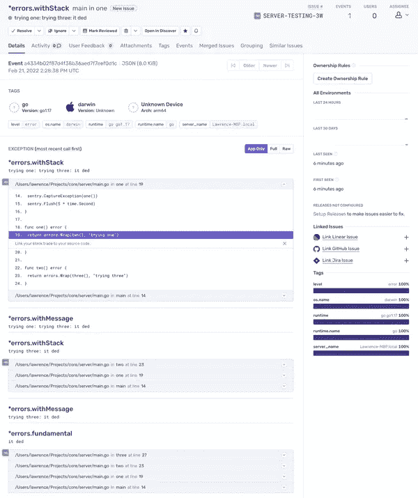
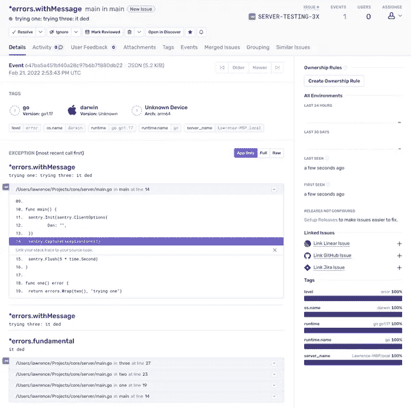

# 使 Go 错误与哨兵玩得很好

> 原文：<https://medium.com/codex/making-go-errors-play-nicely-with-sentry-3ac2cc423cd0?source=collection_archive---------8----------------------->

在 [incident.io](https://incident.io/) 这里，我们提供了一个基于 Slack 的事件响应工具。该产品由一个单片 Go 后端服务提供支持，为一个支持 Slack 交互的 API 提供服务，为我们的 web 仪表板提供 API，并运行后台作业来帮助运行我们的客户事件。

事件是高风险的，我们想知道什么时候出了问题。我们使用的工具之一是 [Sentry](https://sentry.io/welcome/) ，这是我们的 Go 后端发送错误的地方。


当出现问题时，我们:

*   打开岗哨中的错误
*   使用 stacktrace 找到出错的代码
*   进入代码以应用修复

遗憾的是，标准的 Go 错误没有堆栈跟踪。事实上，Go 想要对错误建模的方式使得它很难从像 Sentry 这样的工具中获得太多的价值。

我们已经做了一个让错误为我们工作的噩梦。虽然我们离完美还有很长的路要走，但我们的设置更接近我们在其他语言中所习惯的，因此 Sentry 更有用。

我们是这样做的。

# 麻烦你了。

没有堆栈跟踪，哨兵几乎是无用的。

由于 Go 的标准库选择不实现它们，我们需要找到一个实现它们的库。

戴夫·切尼写的 [pkg/errors](https://github.com/pkg/errors) 是 Go 应用程序事实上的标准。多年来，这个包一直是 Go 的标准错误库，尽管这个项目现在已经存档了。我建议我们忽略这一点，因为库的无处不在意味着它不太可能消失，并且没有替代方案提供相同的功能。

[pkg/errors](https://github.com/pkg/errors) 实现了一个 StackTracer 错误，它提供了我们需要的东西。许多工具都是针对这个接口构建的——包括 Sentry——所以只要我们使用它的`errors.New` , Sentry 就能够提取跟踪信息并呈现出来。

```
import (
  "github.com/pkg/errors"
)func main() {
  errors.New("it ded") // will include a stacktrace
}
```

顺便说一下，理解使用哪个包花了一些时间。虽然 [pkg/errors](https://github.com/pkg/errors) 似乎已经赢了，但它已经存档且无人维护，这不是最好的迹象。然后 [xerrors](https://pkg.go.dev/golang.org/x/xerrors) 也有类似的目标，但是也关闭了，只是部分并入了标准库中。

对于像如何处理错误这样重要的事情，你会发现自己处在一个混乱的生态系统中。

# 所有错误都会得到堆栈跟踪

使用 pkg/errors，我们现在可以创建包含堆栈跟踪的错误。但是并不总是我们的代码产生错误，虽然我们可以 lint 我们自己的代码来确保我们总是使用 pkg/errors，但是我们的许多依赖项(包括标准库)不会。

例如，如果我们有:

```
f, err := os.Open(filename)
```

我们吃饱了，因为`err`根本没有堆栈跟踪。

从 stdlib 返回的错误是非常基本的，不想为构建 stacktrace 付出性能代价。作为一个例子，下面是`fs.PathError`的定义，如果`Open`找不到文件，就会收到这个定义:

```
type PathError struct {
	Op   string
	Path string
	Err  error
}
```

如您所见，在该结构中找不到 stacktrace。

为了解决这个问题，我们将尝试使用 pkg/errors 附带的`Wrap`函数来“包装”我们的错误。

在我们的代码库中，当处理错误时，您几乎总是会看到以下模式:

```
f, err := os.Open(filename)
if err != nil {
  return errors.Wrap(err, "opening configuration file")
}
```

`Wrap`在这里做了两件事:首先，它创建了一个错误，将 stacktrace 设置为您调用`Wrap`的位置。当我们将这个错误发送给 Sentry 时，它将包含一个 stacktrace，帮助我们进行调试。

其次，它用我们的上下文提示作为错误消息的前缀。完整的消息包装后可能是:

```
opening configuration file: open /etc/config.json: no such file or directory
```

通过始终如一地包装我们的错误，我们有助于在尽可能深的框架中生成 stacktraces，帮助 Sentry 异常给出尽可能多的关于这个错误是如何发生的上下文。

# 包装的危险

你可能认为这就是全部:可悲的是，还有更多。

虽然包装错误确保了任何到达 Sentry 的错误都有一个堆栈跟踪，但我们的一些错误在最终到达 Sentry 时看起来非常奇怪。

以这段代码为例:

```
package mainimport (
	"time" "github.com/getsentry/sentry-go"
	"github.com/pkg/errors"
)func main() {
	sentry.CaptureException(one())
}func one() error {
	return errors.Wrap(two(), "trying one")
}func two() error {
	return errors.Wrap(three(), "trying three")
}func three() error {
	return errors.New("it ded")
}
```

虽然是人为设计的，但您的大多数应用程序代码最终都是这样的，其中一个源错误被包装了几次。

这让 Sentry 很难过，因为不是得到一个 stacktrace，而是每次包装一个错误都会得到一个 stack trace:



这并不理想:每个 stacktrace 只是另一个 stack trace 的子集，因为它们是在删除单个帧的情况下一次拍摄一个。更大的调用堆栈可能会变得更糟，从而更难从报告中获得价值。

更糟糕的是，有时错误会超过 Sentry 的大小限制，并在您看到它之前被丢弃。

嗯，这个需要修理。

# 我们自己的 pkg/错误

在这一点上，很明显，如果我们希望我们的工具能够很好地相互协作，我们需要控制我们是如何产生错误的。

那么，第一步:我们创建了自己的 pkg/errors，并应用了禁止任何`errors`或`github.com/pkg/errors`导入的林挺规则，以确保一致性。

我们的包导出了几个关键的 pkg/errors 函数，因为我们没有理由改变它们的行为方式:

```
package errorsimport (
	"github.com/pkg/errors"
)// Export a number of functions or variables from pkg/errors.
// We want people to be able to use them, if only via the
// entrypoints we've vetted in this file.
var (
	As     = errors.As
	Is     = errors.Is
	Cause  = errors.Cause
	Unwrap = errors.Unwrap
)
```

然而，我们想要改变的是`Wrap`的行为方式。原来的每次调用都会添加一个 stacktrace，而我们的应该只添加一个 stacktrace，如果错误还没有我们的祖先的踪迹的话。

术语祖先可能需要一些解释，所以让我们回到我们以前的例子。让我们对在 1 和 3 的调用点包装每个错误时创建的 stacktraces 进行注释:

```
// main
// one
func one() error {
	return errors.Wrap(two(), "trying one")
}// main
// one
// two
// three
func three() error {
	return errors.New("it ded")
}
```

当我们在`one`中包装错误时，它已经有了一个从我们在`three`中包装它时附加的 stacktrace。我们的`Wrap`功能将:

*   在包装点评估当前堆栈跟踪(主，一)
*   查看现有 stacktrace 的原始错误(我们将找到一个，它将是 main、one、two、three)
*   如果我们当前的 stacktrace 前缀与现有的 stacktrace 匹配，我们知道我们是祖先，可以避免生成新的跟踪

将我们的示例代码切换为使用去重复`Wrap`意味着我们将只生成一个跟踪，并且它将是最全面的(也就是最深入的)。

以下是《哨兵》中的场景:



去杜平可以很好地工作，因为前缀匹配堆栈跟踪意味着:

*   只有直接祖先堆栈跟踪被消除重复
*   如果您包装来自其他 go routine 的错误，您将保留单独的 stacktraces，因为 go routine 从一个空堆栈开始
*   沿着通道传递的错误也无法进行前缀匹配，从而保留了单个堆栈跟踪

这很难实现，所以如果你想自己使用，我们已经上传了一份副本到这个要点。

# 这是一个总结！

有时候，围棋是一门复杂的语言。作为一名 Rails 工作背景的人，我在构建 web 应用程序时认为理所当然的许多东西要么不存在，要么没有那么好，而且很难从更广泛的社区中找到一致的答案。

异常/错误报告就是一个例子。作为一个团队，我们惊讶于在我们的应用程序中配置好错误报告是多么困难，特别是当它在其他语言中可以正常工作的时候。

谢天谢地，我们已经找到了一些变通办法，让我们更接近我们错过的东西。这是一个循序渐进的过程，寻找并移除笨拙的活板门，就像这篇文章一样，让语言与我们熟悉的工具一起玩。

此后，我们扩展了我们的 pkg/errors，以支持错误紧急性和一般元数据，我们将在另一篇文章中保存这些内容。对于那些面临类似问题的人来说，这应该是一个良好的开端，并避免其他团队遇到同样的障碍！