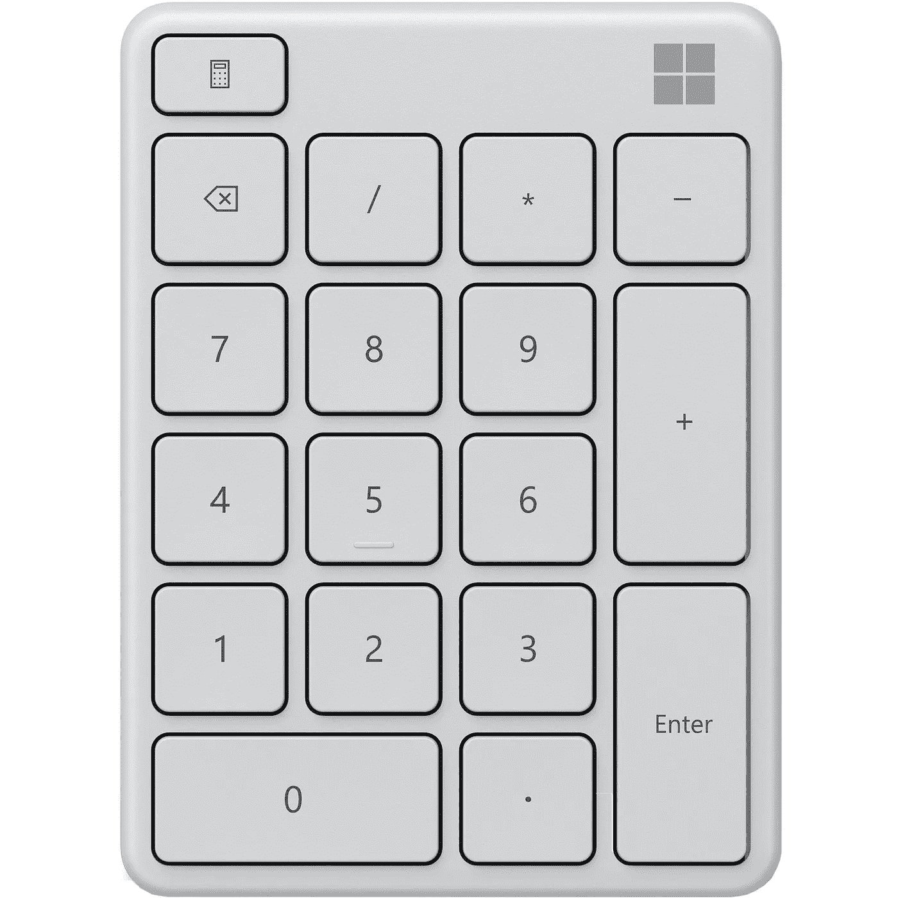

# 让 HTML 5 数字输入只接受整数

> 原文：<https://medium.com/codex/making-html-5-numeric-inputs-only-accept-integers-d3d117973d56?source=collection_archive---------0----------------------->

在过去的几年里，我看到了很多关于这方面的文章和帖子，这是一种非常有用的引导用户输入的方式。然而，太多的实现都有明显的缺陷、严重的疏忽和实现错误。

**整体概念是健全的:**用 HTML 5 属性限制什么可以发送到服务器，然后用 Javascript 增强限制用户是什么…