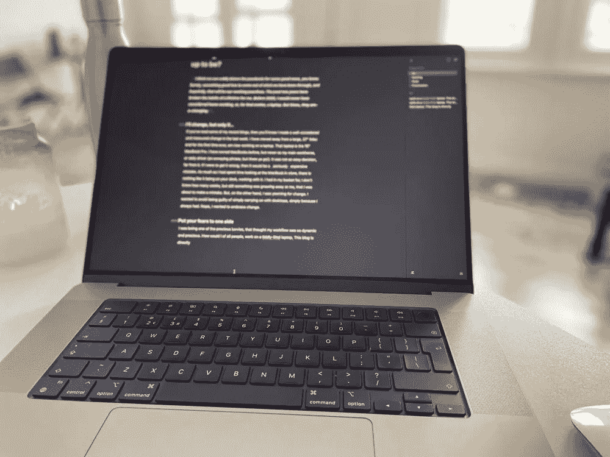
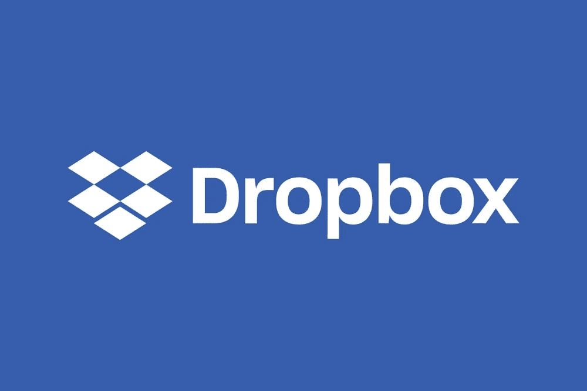
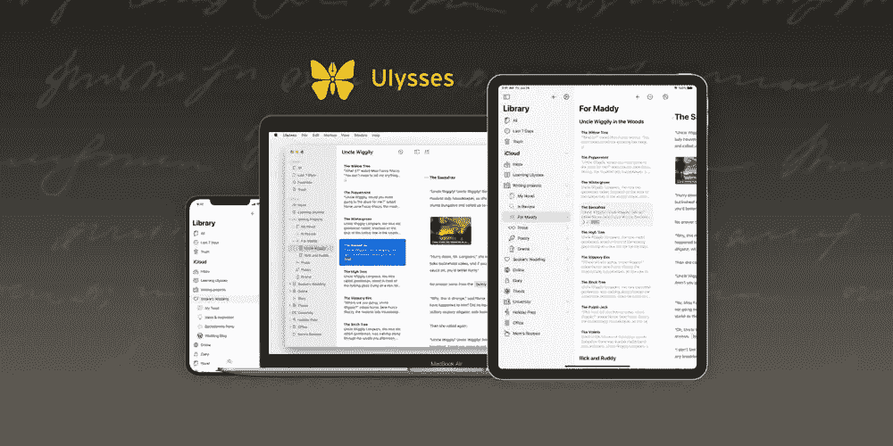
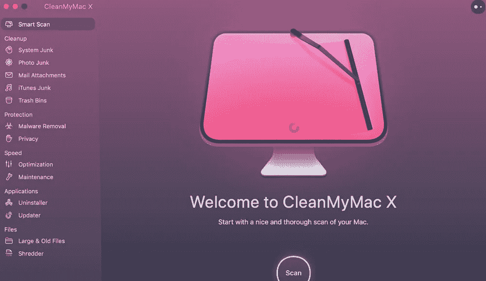

# 让我的 M1·马克斯 MacBook 成为头号创意机器

> 原文：<https://medium.com/codex/making-my-m1-max-macbook-the-1-creative-machine-aa4483668c63?source=collection_archive---------8----------------------->

## 我的 M1 Max MacBook Pro 上必须安装的五个创意应用

图片由作者提供

不到一个月前，我打开了我的 16 英寸 Max MacBook Pro。它的价格相当昂贵，所以让它为我工作是我的首要任务。我决定将这台 Mac 设置为全新安装。当然，从另一台 Mac 电脑上复制会更容易，但也会带来“臃肿软件”，或者我不再需要的程序和应用。这款 Mac 的用途一直是专注和小众的。我买它是为了提高我的 Talkingtech 品牌的速度和工作流程，也是为了我的平面设计业务。它永远不会是一台*万能的*笔记本电脑，而是一只瘦瘦的、吝啬的创意野兽。

所以，在决定安装我所需要的软件来更快地完成这些任务后，这里有 5 个我认为对我的创造性工作流程至关重要的应用程序。

# 1.Dropbox

我在 2007 年推出 Dropbox 后不久就开始使用它。我仍然记得一位设计师告诉我这件事。就是这个巫毒云的东西…你可以随时随地从任何桌面访问任何东西。我持怀疑态度，并不真的相信它，但心想，管它呢！此外，我推荐的人越多，Dropbox 给我的免费存储空间就越多。我就是*爱*自由！因此，从那些早期的低使用率的日子开始，我现在是一个拥有 3TB 云存储的企业帐户用户。我也使用原生的 Mac iCloud 存储，并让[写了](https://talkingtechandaudio.com/blog/icloud-the-perfect-storage-solution/)关于它的好处。但是，它对我来说一直是 Dropbox。Google Drive 和我从来没合得来——我觉得它古怪、笨重、缓慢而且笨拙。另一方面，Dropbox 无缝且高效。我在所有的苹果电脑上都安装了桌面应用程序，没有它我无法生存。智能同步非常聪明。它可以让你在本地查看和访问所有的 Dropbox 内容，但是它几乎不占用任何存储空间。太棒了。如果你没有尝试过，或者正在考虑云存储，我怎么推荐 [Dropbox](https://www.dropbox.com) 都不为过。

 [## Premiere Pro 和 M1 MacBook Pro 工作流程

### 最新的 M1 MacBook Pro 和 Adobe 的 Premiere Pro 配合得如何？

medium.com](/codex/premiere-pro-and-m1-macbook-pro-workflow-ae62d1be343c) 

# 2.创意云

我没有一天不对 Adobe 的 Creative Cloud 应用程序套件感兴趣。这是我创造性地做每一件事的出发点。好像需要证明一样，在今天写这篇文章之前，我已经使用了 Photoshop、Illustrator 和 In Design。成为 CC (Creative Cloud)成员是我的视频和音频 DAW 成为 Premiere Pro 和 Audition 的原因。我每月支付不到 50 英镑来使用*的整套*应用程序……甚至一些我知道我永远不会使用的程序。有些人认为，订阅的基础是不公平的最终用户，但我不同意。花 50 英镑买最新版本的、可以说是最强大、最专业的创意应用程序并不贵。你也可以获得测试版，他们的备份也很棒。对我来说，没有 CC 我会迷失。你看到的每个缩略图都是在 Photoshop 中制作的，每个视频都是在 Premiere 中编辑的，每个播客都是在 Audition 中编辑的。你知道要点了——我爱《T4》CC 就像我爱我的 Mac 电脑一样多！

 [## 使用 AirPods Pro 一个月

### AirPods Pro 值得改变吗？

medium.com](/codex/one-month-with-airpods-pro-f1c56da76c89) 

# 3.尤利塞斯探测器

我写的所有博客都从尤利西斯开始。在遇到这个应用程序之前，我曾用页面来写东西。还可以，但它不是一个专门的作家应用程序。我注意到的第一件事是它不会让人分心。这使得我能够专注于我的想法和写作，这是巨大的差异。它也是一个强大的校对和编辑。你的手停留在打字上，而不是飞来飞去，看着文本变成粗体或斜体等等。它还存储了我放在博客中的所有图片，并允许我对其进行格式化。我可以在应用程序中添加标签和类别，这标志着我在所有博客上的 SEO 工作的开始。其他很棒的特性是它可以跨所有设备同步，并且可以完美地导出到我的 WordPress [网站](https://talkingtechandaudio.com)。它承载了我所有写作的完整轨迹，这在现在被证明是无价的。刚刚推出了我网站的最新版本，我不得不手动一个接一个地更新我的博客。虽然很慢，但是多亏了尤利西斯，我所有的博客都在那里，就像我第一次写博客的那天一样。没有它我会不知所措，现在它已经成为我日常写作的一部分。如果你是认真写作的，那就试试[尤利西斯](https://ulysses.app)。以后谢我吧！

# 4.CleanMyMac

作为一名 Mac 用户，我觉得自己碰不得。我们从未遇到过问题或恶意软件，对吗？是的，我们很幸运。购买苹果生态系统的部分原因是它是如此可靠和防弹。没错，但是我们仍然需要一些帮助。我去年才开始在我的 2015 年 27 英寸 iMac 上使用这个强大的应用程序，因为我注意到它变慢了。我不确定它是否会有什么魔力，但它确实有。我似乎记得，在我第一次运行 CleanMyMac 后，它从我的 Mac 上删除了大约 *9GB* 不想要的垃圾。最棒的是它的简单。没有奇怪的权限或勾选框，只需安装并运行它。它在删除不想要的应用程序方面也很酷。毫无疑问，你会知道，在 Mac 电脑上，删除一个应用程序&并不像把它拖到垃圾箱里那么简单。各种各样的琐事都被抛在脑后。当谈到我的新 MacBook 时，CleanMyMac 是一个完全不用动脑筋的人。我认为这是一项长期投资，希望从第一天起就尽可能保持干净。简单易用，让我安心，让 Mac 保持最佳状态。没有创造性，但仍然是必不可少的。

 [## Studio Display 和 MacBook Pro —天作之合

### MacBook Pro 和 Studio display 是完美的搭档

medium.com](/codex/a-match-made-in-heaven-590f355b065f) 

# 5.特雷罗

多年来，我一直习惯于经营企业，而组织是这样做的核心。无论是记录我想到的随机想法，一个简单的当天待办事项列表，还是更复杂的视频和博客工作流程，它们都在 Trello 中。试图记住这些想法将是一个错误，一个简单的应用程序，如苹果的笔记，并不能真正做到这一点。使用 Trello，您可以创建板或瓷砖，并随着项目的发展移动它们。因此，如果一个视频被拍摄，并等待编辑，我可以看一眼我的 Trello 板，而不是我在哪里。这对于我经营业务是不可或缺的，也能减轻一些压力。知道没有项目被遗忘，或想法半途而废，对我来说是一个巨大的胜利。想法总是在最不方便的时候出现！这款应用可以在所有设备上同步，这意味着无论我身在何处，都可以随时掌握日程安排、生产和创意。

# 结论

对我们任何人来说，购买一台新的 Mac 电脑都是一笔很大的支出。确保你的新投资尽可能好地运转是有意义的。我很高兴我走了一条全新安装的道路。我现在知道了，我的新 M1 Max 上没有混乱，只有纯粹的生产力应用程序来帮助我完成我的日常任务。这是我放在上面的第一批五个应用程序，我知道它们中的每一个都会在减轻我的压力和提高我的工作效率方面发挥作用。

那你呢？我很想知道，如果你刚买了一台新的 iMac、MacBook 或 Mac mini，你最先加载的应用程序是什么？

## 在你走之前

[**加入我的幕后邮件列表**](https://www.talkingtechandaudio.com)

***原载于***[***https://talkingtechandaudio.com***](https://talkingtechandaudio.com/blog/m1-max-macbook/)***2022 年 5 月 23 日***