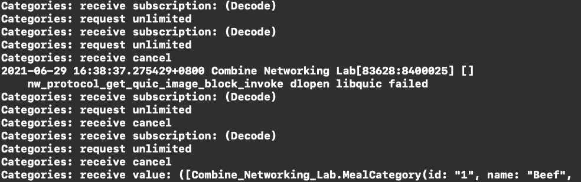
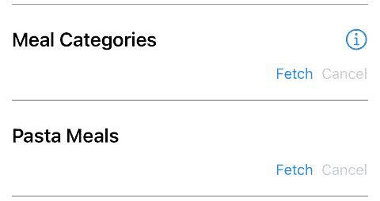
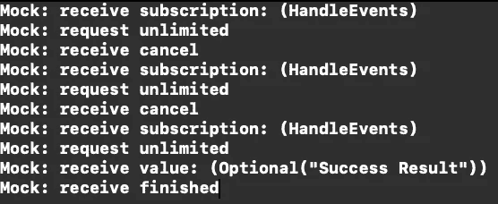

# 使用 Combine 框架发出网络请求

> 原文：<https://medium.com/codex/making-network-requests-using-combine-framework-ff34151611db?source=collection_archive---------0----------------------->

## *我在 iOS 联合网络实践项目中的发现*


封面图像

之前我开始了一个小项目来练习使用苹果的 Combine 框架。在这篇文章中，我想讨论一下我对发出网络请求的代码的一些发现。

首先，我将首先谈论一些执行简单网络请求的常用代码。接下来我将集中讨论两个主题，即**处理加载状态和取消**，并分享我对如何很好地实现这些特性的发现和看法。

在此之前，您可以先了解一下实验项目的背景:

[](/@rdchc/my-combine-networking-lab-project-86c63404ca7c) [## 我的联合网络实验室项目

### 我做了一个小的 iOS 项目来练习如何使用 Combine 框架来处理网络请求。

medium.com](/@rdchc/my-combine-networking-lab-project-86c63404ca7c) 

# 网络请求

在过去，当我们发出网络请求时，我们通常会创建一个`URLSession`并调用`dataTask(with:completionHandler:)`函数，然后在完成处理程序中处理返回的响应或错误。

用反应式风格写并不难。`URLSession`类有一个`DataTaskPublisher`让我们在订阅后获取发布的结果。该发布者或者以元组格式发布返回的数据和响应，或者因出错而终止订阅。我们遵循常见的网络请求模式:**创建 URL →创建数据任务→解码返回的响应或处理错误**:

```
let url = URL(string: \(urlString))!
URLSession.shared.dataTaskPublisher(for: url)
  .map(\.data)
  .decode(type: MealsResponse.self, decoder: JSONDecoder())
  .map { ... }
  .mapError { ... }
  .eraseToAnyPublisher()
  .sink(receiveCompletion: ..., receiveValue: ...)
```

对于正常流程，我们获取返回的`Data`，将其解码以适应响应结构，最后将其映射到一些模型，以便在`sink`的`receiveValue`块中处理。

如果数据任务或解码操作失败，我们可以将错误映射到我们想要的类型，并在`sink`的`receiveCompletion`块中处理它。注意，在上面的代码中，`dataTaskPublisher`可能会带来`URLError`，而`decode`操作符可能会带来`DecodingError`。

## 检查 URL 响应

我们通常希望向返回的 URL 响应添加一些额外的验证，例如，检查响应是否返回表示成功的状态代码 200。我们可以按照[苹果文档](https://developer.apple.com/documentation/foundation/urlsession/processing_url_session_data_task_results_with_combine)的示例代码来添加这个额外的检查:

```
urlSession.dataTaskPublisher(for: url)
  .tryMap() { element -> Data in
    guard let httpResponse = element.response as? HTTPURLResponse,
      httpResponse.statusCode == 200 else {
        throw URLError(.badServerResponse)
      }
    return element.data
  }
  .decode(...)
  .sink(...)
```

当然，我们可以添加更多的检查，并在闭包内抛出其他错误。这里的重点是**使用** `**tryMap**` **操作符来抛出任何一种错误，或者将结果的数据映射到最后**进行进一步处理。

上面的示例代码只是在出现问题时抛出一个`URLError`。您可能会考虑在项目中创建自定义错误类型。在这种情况下，我们可以利用`mapError`操作符将错误映射成我们想要的错误类型。

然而，在我看来，**将原始错误类型向下传递到业务逻辑层**(例如，视图模型)更简单，除非您想要列举您的应用程序处理的每个错误案例，并且您不关心底层错误。这样，我们可以避免任何由映射错误引起的逻辑错误解释，这可能是一件不必要的事情。

## 总结常见操作

由于检查 URL 响应和解码数据是常见的任务，我们可以**简单地将它们组合在一起，并包装在一个自定义操作符**中，这样我们就可以在整个应用程序中统一所有这些通用逻辑。在练习项目中，我创建了一个`tryDecodeResponse`操作符，并在其中调用了`tryMap`和`decode`操作符:

然后，每当我们需要执行网络请求时(例如在`APIClient`类内部)，我们可以调用我们的操作符来使我们的代码更简洁:

```
func fetchCategories() -> AnyPublisher<[MealCategory], Error> {
  let url = URL(string: ...)
  return urlSession.dataTaskPublisher(for: url)
    **.tryDecodeResponse(type: MealCategoriesResponse.self, decoder: JSONDecoder())**
    .map { ... }
    .eraseToAnyPublisher()
}
```

## 显示提取的值

最后一项任务是在用户界面中显示我们刚刚获取的值。由于网络回调使用另一个队列，**当我们在 UI 中显示任何东西时，我们必须切换到主线程**。

通过使用`receive(on:options:)`操作符，我们可以选择许多选项来指定主线程。在项目中，**我选择将它放在每次** `**assign(to:on:)**` **调用**之前，因为我认为这是确保和检查 UI 绑定是否在主线程上的最佳位置:

```
func bindViewModel(_ vm: MealItemViewModel) {
  vm.$title
    **.receive(on: DispatchQueue.main)**
    .assign(to: \.text, on: titleLabel)
    .store(in: &subscriptions) vm.$detail
    **.receive(on: DispatchQueue.main)**
    .assign(to: \.text, on: statusLabel)
    .store(in: &subscriptions) vm.statusSubject
    .map { $0 != .ongoing }
    **.receive(on: DispatchQueue.main)**
    .assign(to: \.isEnabled, on: fetchButton)
    .store(in: &subscriptions) vm.$cancellable
    **.receive(on: DispatchQueue.main)**
    .assign(to: \.isEnabled, on: cancelButton)
    .store(in: &subscriptions)
```

# 装载状态

网络请求的一个常见规范是处理加载状态。特别是，为了更好的用户体验，大多数应用程序中都有跑步活动指示器(无论是小图标还是全屏显示)。

## 使用加载状态枚举

我从 Sundell 的文章的一个 [*Swift 中获取了加载状态的概念，并创建了一个`FetchStatus` enum，其值为`.ongoing`、`.finished`和`.ready`，指示组件是否正在加载、加载成功或其他情况。*](https://www.swiftbysundell.com/articles/combine-self-cancellable-memory-management/)

**为了跟踪数据任务发布者的状态，我使用了** `**.handleEvents**` **操作符**来更新网络请求开始、取消、成功完成或出错的时间:

```
@Published var status: FetchStatus = .readyfunc fetch() {
  apiClient.fetch()
    .handleEvents(receiveSubscription: { [weak self] _ in
      self?.status = .ongoing
    }, receiveCompletion: { [weak self] completion in
      switch completion {
      case .finished:
        self?.status = .finished
      case .failure:
        self?.status = .ready
      }
    }, receiveCancel: { [weak self] in
      self?.status = .ready
    })
    .sink(...)
}
```

在我的实践项目中，我将类似的逻辑放在了`ViewModel`的`mockFetch()`函数中，以便在模拟组件中进行测试。我使用了`@Published`属性包装器来进一步绑定到 UI 层。

然后我在想，有没有什么方法可以隐藏这个丑陋、繁琐的实现，让它在所有调用者之间通用？所以我在 `**Publisher**` **协议内创建了一个**新操作符，带有一个** `**Subject**` **参数**，负责记录新的加载状态。**

首先，我们用新的速记操作符扩展了`Publisher`协议:

我改用`Subject`类型，而不是原来的`Published`，因为我发现使用`Published`类型很难发送新值。

然后我们可以将它绑定到其他与 UI 相关的元素。在这个项目中，我使用了我们新的速记操作符，并将状态主题绑定到一个已发布的`showLoading`布尔值来操作加载 UI:

```
private(set) var categoriesItemViewModel = MealItemViewModel()
@Published var showLoading: Bool = false

private func setupBindings() {
  categoriesItemViewModel.statusSubject
    **.map { $0 == .ongoing }
    .assign(to: &$showLoading)**
}

func fetchCategories() {
  sharedFetchSubscription = mealApiClient.fetchCategories()
    **.observeFetchStatus(with: categoriesItemViewModel.statusSubject)**
    .sink(...)
}
```

注意，上面的代码片段只处理一种状态。如果类中有多个状态主题，我们需要使用更多的发布器，如`CombineLatest`或`Merge`来组合所有的状态，以确定是否有项目正在加载。

## 使用布尔值

有时我们可能只是想知道是否有东西在加载。在这种情况下，将装载状态分成几种情况可能过于复杂。**鉴于一次只能有一个任务处于加载状态**，我们可以使用一个更简单的布尔主语来达到目的:

然后我们稍微修改上面的绑定和调用以适应这个新的操作符:

```
**private(set) var isLoadingSubject = PassthroughSubject<Bool, Never>()**
@Published var showLoading: Bool = false

private func setupBindings() {
  **isLoadingSubject
**    .assign(to: &$showLoading)
}

func fetchCategories() {
  sharedFetchSubscription = mealApiClient.fetchCategories()
    **.observeFetchStatus(with: isLoadingSubject)**
    .sink(...)
}
```

请注意，由于我们只能向布尔主题发送 true 和 false 值，因此只有当我们确定一次只执行一个加载任务时，这个解决方案才是有用的。

## 使用计数变量

如果一个屏幕可以同时运行几个加载任务，并且您希望在一个或多个任务正在加载时显示加载指示器，我们可以更改主题来存储加载任务计数。

首先，我们创建一个`CurrentValueSubject`来保存我们的加载任务计数。我们只能选择`CurrentValueSubject`作为选项，因为我们需要它的当前值来增加或减少计数。

```
private var loadingTaskCountSubject = CurrentValueSubject<Int, Never>(0)
```

然后，我们用一个存储加载任务计数的`CurrentValueSubject`创建一个速记操作符来观察获取状态。

然后，当执行网络请求时，我们用新的操作符替换以前的`observeFetchStatus(with:)`操作符:

```
func fetchCategories() {
  mealApiClient.fetchCategories()
 **.observeFetchStatus(with: loadingTaskCountSubject)**
    .sink(...)
    .store(in: &subscriptions)
}
```

为了设置绑定，我们用下面的新逻辑替换原来的逻辑，只要加载任务计数大于 0，就表示有东西正在加载:

```
private func setupBindings() {
  loadingTaskCountSubject
    **.map { $0 > 0 }
**    .assign(to: &$showLoading)
}
```

# 取消

因为`Subscription`协议符合`Cancellable`协议，所以所有的订阅都可以被取消。事实上，取消约会随处可见:

*   我们可以手动调用`cancel()`来取消特定的订阅。
*   丢失对某个订阅的所有引用会触发取消初始化，这会自动使该订阅对自身进行调用`cancel()`。

## 取消特定订阅

在通常的实践中，我们经常创建一个取消令牌包作为`Set<AnyCancellable>`，这样所有的订阅都可以通过在类中强烈引用它们来保存。但是，如果我们希望可以单独取消订阅，则不可能使用这种方法，因为如果只给定了集合，我们就无法取出特定的取消令牌。

相反，我们可以**在类中创建一个单独的** `**AnyCancellable?**` **属性**，这样我们就可以直接引用它。基本上这个属性在去初始化的时候也会自动调用`cancel()`。

```
var mySubscription: AnyCancellable?mySubscription = Future<String, Never> { resolve in
  resolve(.success("Success"))
}
  .delay(for: .seconds(2), scheduler: RunLoop.current)
  .sink { print($0) }mySubscription?.cancel()
```

从这个概念延伸，如果我们有不同的订阅，每次最多运行一个，我们可以**创建一个共享的** `**AnyCancellable?**` **属性**并让那些发布者订阅它，这样当新的订阅替换旧的订阅时，旧的订阅可以自动取消。

```
var sharedSubscription: AnyCancellable?sharedSubscription = <some subscription to publisher A>
sharedSubscription = <some subscription to publisher B> // The subscription with publisher A is cancelled at this moment
```

看看这个例子，我多次调用了`fetchCategories()`，注意订阅何时被取消:

```
var sharedFetchSubscription: AnyCancellable?func fetchCategories() {
  sharedFetchSubscription = mealApiClient.fetchCategories()
    **.print("Categories")**
    .sink(receiveCompletion: { [weak self] in **...** }, receiveValue: { [weak self] in
      ...
    })
}
```



当收到新的订阅时，原来的订阅立即被取消

以项目的`ViewModel`为例。我一直将膳食类别和膳食列表订阅提取到同一个`sharedFetchSubscription`变量中，类似于上面的代码。如果我们移除全屏加载逻辑(并添加一些临时代码来显示状态)，我们可以尝试快速点击不同的获取按钮，以查看之前的获取是否没有产生任何结果:



获取面食后，餐饮类别网络获取立即被取消

## 取消主题触发的先前订阅

当订阅设置在函数内部时，上述情况有效，每次触发事件时都会调用该函数。然而，**有时我们将网络请求绑定到主题**上，这样当主题接收到一个值时，它可以创建一个新的网络请求订阅:

```
var fetchTriggeredSubject = PassthroughSubject<Void, Never>()
private var subscriptions = Set<AnyCancellable>()private func setupBindings() {
  fetchTriggeredSubject
    .flatMap { [weak self] () -> AnyPublisher<MyType, Error> in
      guard let self = self else {
        return Empty().eraseToAnyPublisher()
      }
      return self.apiClient.fetch()
        .eraseToAnyPublisher()
    }
    .sink(receiveCompletion: { ... }, receiveValue: { ... })
    .store(in: &subscriptions)
}
```

这在正常情况下不会带来任何问题。但是，如果我们希望可以手动取消获取订阅，使用这种方法会很麻烦，因为**网络请求是从主题**映射的。取消订阅意味着我们将操作与主题分离，这不是我们想要做的。

而且多次向 subject 发送值会触发内网请求多次运行，这意味着我们无法在代码级取消之前正在进行的网络请求。

我在 StackOverflow 中找到了一个[答案，似乎对这个案例有用。主要思路是将`flatMap(_:)`改为`map(_:)`保留主体的错误类型，然后**使用** `**switchToLatest()**` **只保留最新订阅**。根据苹果文件:](https://stackoverflow.com/a/61403996)

> 当该操作者从上游发布者接收到新的发布者时，**它取消其先前的订阅**。使用此功能可以防止早期发布者执行不必要的工作，如创建网络请求发布者，避免频繁更新用户界面发布者。

所以我们可以将上面的代码修改如下:

```
var fetchTriggeredSubject = PassthroughSubject<Void, Never>()
private var subscriptions = Set<AnyCancellable>()private func setupBindings() {
  fetchTriggeredSubject
    **.map** { [weak self] () -> AnyPublisher<MyType, Error> in
      guard let self = self else {
        return Empty().eraseToAnyPublisher()
      }
      return self.apiClient.fetch()
        .eraseToAnyPublisher()
    }
    **.switchToLatest()**
    .sink(receiveCompletion: { ... }, receiveValue: { ... })
    .store(in: &subscriptions)
}
```

我在模拟网络请求组件中试用了这个模板，打印的结果显示以前的订阅确实被取消了:



旧的订阅在新的订阅进来之前就被取消了

因此，这解决了自动取消先前订阅的问题。但是，由于内部发布者仍然存在于`map`操作符的转换闭包中，**我们仍然不能将其取出来进行手动取消**。如果你有更好的想法，欢迎分享讨论！与此同时，我认为在函数中创建和存储订阅可能是实现这一目的的一种更简单而有效的方法。

# 结论

在本文中，我们已经使用 Combine 框架完成了一些常见的网络任务。最基本的是，我们创建一个`URLSession.dataTaskPublisher`并订阅它来发出网络请求。然后我们**检查它返回的响应，解码数据并将其映射到我们的模型中，并在业务逻辑层做进一步的操作**。

为了制作加载状态，我们使用了`**handleEvents**` **操作符**并重点关注了`**receiveSubscription**`**`**receiveCompletion**`**和** `**receiveCancel**` **事件**来执行实际网络任务之外的副作用。根据用例，我们可以将副作用绑定到枚举、布尔或计数主题，以我们想要的方式操纵加载状态。**

**为了使网络任务可取消，我们应该记住**引用数据任务的订阅**，这样我们就可以直接在那些引用上调用`cancel()`。对于像`Subject` s 这样由其他信号触发的网络任务，即使我们允许自动取消之前的网络请求，但由于无法管理(取消)这类发布者，因此**不直接将信号映射到数据任务发布者**中仍然是必要的。**

**这些概括了整篇文章。如果您有任何意见或想法，请随时留下评论，这样每个人都可以讨论它！**