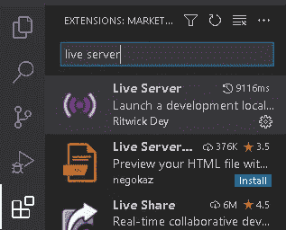
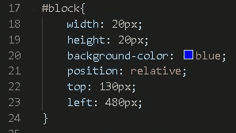
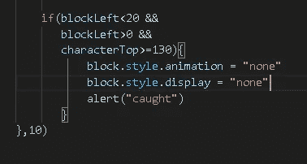

# 制作最简单的 JavaScript 游戏

> 原文：<https://medium.com/codex/making-the-easiest-javascript-game-b1a0b21794b4?source=collection_archive---------5----------------------->

一个带有 200 美元 merch 赠品挑战的休闲 eli5 教程。


制作 3 个文件:

```
script.js, index.html, and style.css
```


复制基本 HTML 样板文件:

```
<!DOCTYPE html>
<html lang="en">
    <head>
        <meta charset="UTF-8">
        <title>Game</title>
    </head>
</html>
```


通过添加以下内容来链接样式表(在中)和 JavaScript(在中)文件:

```
<link rel="stylesheet" href="style.css">
```

&

```
<script src="script.js"></script>
```


是时候制作真正的游戏了！

我们首先制作一个带有 div 的几何体。

这个 div 包含整个游戏，在包含我们的角色和一个方块的 div 中有 2 个较小的 div。

所有这些都位于我们的标签中

```
<body>
    <div id="game">
        <div id="character"></div>
        <div id="block"></div>
</div>
</body>
```


# index.html 完成(1/3)拉特🆙

我们从一些基本的造型开始。

这将处理任何浏览器默认填充或空白，我们可以从 0 开始我们的设计。

```
*{
padding: 0;
margin: 0;
}
```


然后我们去游戏部。

添加一些样式，让我们可以看到它。

```
#game{
    width: 500px;
    height: 200px;
    border: 1px solid black;
}
```


这是一个很好的时间来启动我们的服务器，看看发生了什么。


## 如何安装直播服务器？

如果您已经有了，请跳过这一部分。

单击扩展。


在搜索栏中输入“live server”并安装它



点击 VSC 编辑器右下角的“上线”按钮，你的服务器应该上线了！


## 回到 CSS 文件

通过向字符 div 添加一些样式来创建字符。

```
#character {
    width: 20px;
    height: 50px;
    background-color: red;
}
```


让我们把角色放在盒子的底部。

```
position: relative;
top: 150px;
```

盒子是 200 像素，我们的字符是 50px，所以我们需要把它放下 150px，把它放在最底部。


让我们继续前进到我们的街区。

```
#block{
    width: 20px;
    height: 20px;
    background-color: blue;
    position: relative;
    top: 130px;
    left: 480px;
}
```



这次我们把它推到最右边。


为了让我们的角色滑向砖块，我们创建了一个动画并将其添加到砖块中。

```
#block{
    width: 20px;
    height: 20px;
    background-color: blue;
    position: relative;
    top: 130px;
    left: 480px;
    animation: block 1s;
}@keyframes block {
    0%{left:480px;}
    100%{left:-40px;}
}
```


为了让动画重复，我们给动画添加了无限

```
animation: block 1s infinite;
```


Woops，屏幕记录器去了整个标签。啊，好吧，这就行了。

它像拉链一样穿过。让我们也加入线性。

```
animation: block 1s infinite linear;
```

现在对于跳跃，我们创建第二个动画，让盒子跳到顶部。

我们把它设置为 30%和 70%。这使得它跳起来，悬停一会儿，然后再降下来。

```
@keyframes jump{
    0%{top: 150px;}
    30%{top: 100px;}
    70%{top: 100px;}
    100%{top: 150px;}
}
```


就像我们对 block 所做的那样，我们给角色添加了动画。

```
animation: jump 500ms infinite;
```


我们想控制跳跃。

更具体地说，我们希望它在我们调用将要创建的 JavaScript 函数时跳转。

更具体地说，我们运行一个函数，将这个类添加到我们的角色，
让它跳转，然后它再次删除这个类，所以它停止了。先从班级说起吧。

```
.animate{
animation: jump 500ms;
}
```


# style . CSS done \\( 2/3)Lvl🆙

我们首先创建两个变量来访问我们的角色和块。

```
let character = document.getElementById("character")
let block = document.getElementById("block")
```


现在让我们制作前面提到的跳转函数。

```
function jump() {
    character.classList.add("animate")
}
```


很抱歉让你误以为我们已经不再使用 HTML 了。我们算是吧，但是我们确实需要给我们的新东西添加一些“链接”。就这样，我保证。

为了运行我们的函数，我们需要向我们的索引(HTML 文件)添加一个 onClick。

```
<html lang="en" onclick = "jump()">
```


为了实现这一点，我们需要删除我们原来的跳转自动化，这样它就不会覆盖我们新的。

删除以下行:

```
animation: jump 500ms ;
```


它跳了！但只是在我们第一次点击的时候。

我们通过以下方式解决此问题:

1.  我们设定一个间隔
2.  运行功能(500 毫秒后，动画长度)

动画完成后，此操作将移除该类。

在代码中:

```
setTimeout(function(){
    character.classList.remove("anime")
    }, 500)
    setTimeout(function(){
    character.classList.remove("anime")
}, 500)
```


现在我们的角色每次点击都会跳，不只是第一次。


需要一点修正:如果已经添加了这个类，我们不希望再添加它。否则我们的浏览器会被数百行我们的类弄得臃肿不堪。

我们用一些 if-else 代码包装我们的 classList.add:

```
if (character.classList != "animate") {
   character.classList.add("animate")
}
```


剩下的就是增加碰撞，当我们没有跳跃躲避障碍物的时候。

为此，我们将创建一个每 10 毫秒运行一次的函数，检查您是否丢失。

```
var checkDead = setInterval(function(){},10)
```


现在我们获取字符的顶部位置和块的左侧位置。

我们设置运行函数的时间间隔(每 10ms)。我们把它放在一个变量中并解析为一个整数，所以解析返回的是数字，而不是像 69px 这样的字符串。

```
var checkDead = setInterval(function(){
   var characterTop =
   parseInt(
   window.getComputedStyle(character)
   .getPropertyValue(“top”))
},10)
```


这将恢复我们角色的最高位置。

换句话说，我们角色现在的最高位置是 50。当我点击时，它上升到 100，然后回到 50。

换句话说:函数检查字符是向上还是向下。

现在我们对我们的街区，敌人，做同样的事情。

```
var checkDead = setInterval(function(){ var characterTop =
    parseInt(
    window.getComputedStyle(character)
    .getPropertyValue("top")) var blockLeft =
    parseInt(
    window.getComputedStyle(block)
    .getPropertyValue("left"))},10)
```


现在是实际检查的时候了。

如果 blockLeft 小于 20，
大于 0，
并且角色上方有超过 130px 的空间(意味着它没有跳跃)，
玩家输。

```
if(blockLeft<20 &&
   blockLeft>0 &&
   characterTop>=130){
   alert("caught")
}
```


我们还想删除该块的动画，这样在玩家被这一行捕获后它就不会继续了。

```
if(blockLeft<20 &&
   blockLeft>0 &&
   characterTop>=130){
 **block.style.animation = "none** alert("caught")
}
```



# script . js done \\( 3/3)🏆

搞定了。

如果你已经读到这里，我有东西给你！

# 一个秘密的超级惊喜价格！

如果你能回答以下问题，我将赠送价值 200 美元的 Lambda 商品:

> 你仍然必须重新加载页面才能玩新游戏，我们该如何解决这个问题？(带代码)

挑战将持续到十月底或第一个人进入！(我假设这可能需要一段时间，我现在在 Medium 上有大约 2 个追随者)。


*免责声明:如果你不是美国人，你仍然需要支付相当可观的运费。*

我推荐点二十次可爱的喇嘛！