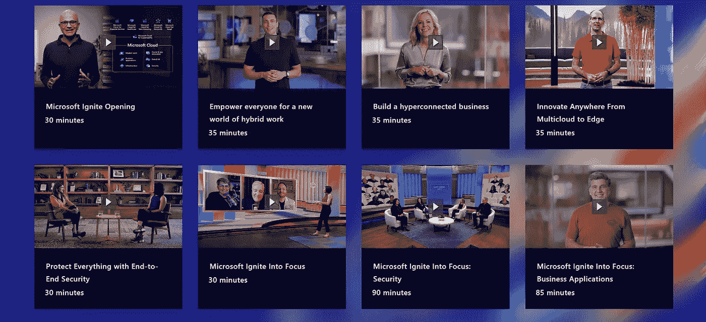
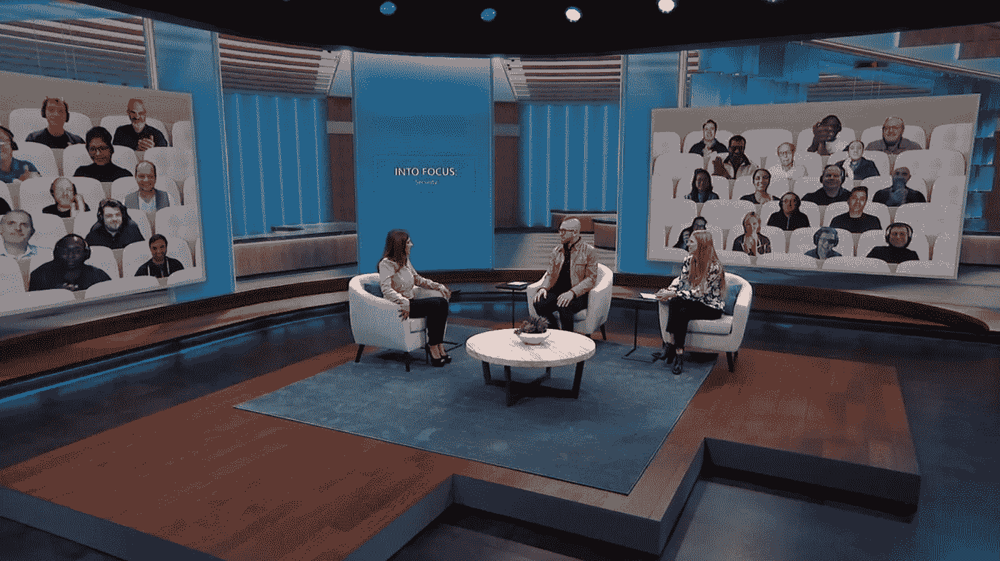
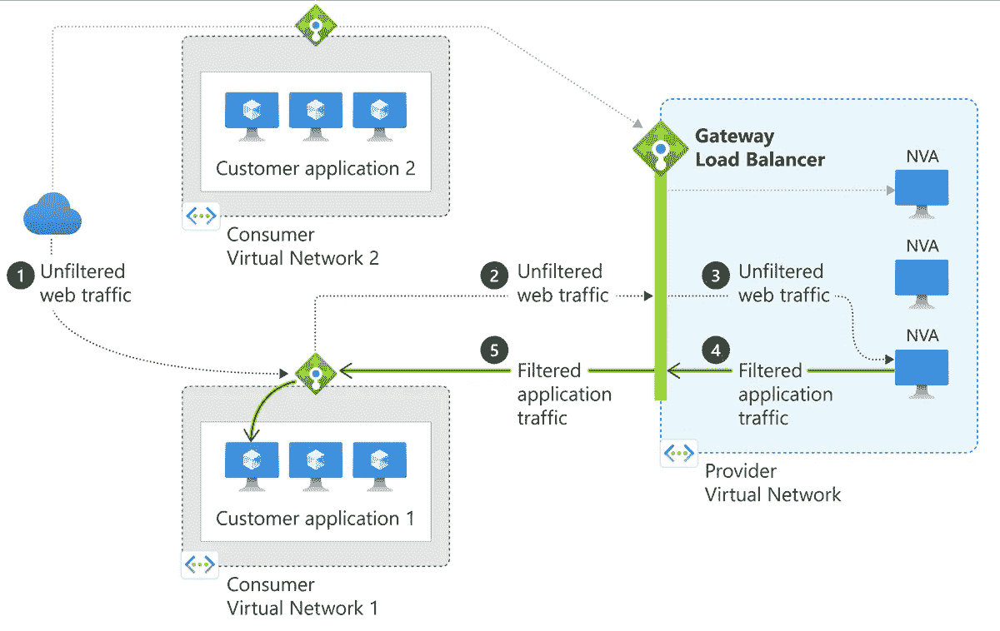

# 👨‍💻充分利用 Microsoft Ignite 2021！

> 原文：<https://medium.com/codex/making-the-most-of-microsoft-ignite-2021-204da9e95330?source=collection_archive---------6----------------------->

充分利用 Microsoft Ignite 2021！

在 2021 年 11 月举行的微软 Ignite 2021(技术领袖和从业者的年度聚会，作为数字活动体验)期间，信息很明确:每个组织都需要一个更加分布式、更加智能、更加自主的计算结构，一个他们可以用来在任何地方快速构建、管理和部署应用的结构。

**关键趋势**:

*   如何优化[混合工作的新世界](https://www.microsoft.com/en-us/microsoft-365/blog/2021/11/02/whats-new-in-microsoft-365how-were-empowering-everyone-for-a-new-world-of-hybrid-work/)
*   如何帮助客户[建立超连接业务](https://aka.ms/TaylorIgnite21)
*   如何让每个企业[成为数字企业](https://aka.ms/IgniteNov21/InnovateAnywhereBlog)
*   如何利用[端到端安全性保护一切](https://www.microsoft.com/security/blog/?p=98445)

当然，其中一个核心公告是**元宇宙**，这是一个与物理世界的许多方面相连的数字世界，包括人、地点和事物。

正如多场会议所示，元宇宙将实现物理和数字世界的共享体验。请随意查看这篇文章，了解微软团队的 [Mesh 如何在“元宇宙”中实现个人和有趣的协作](https://news.microsoft.com/innovation-stories/mesh-for-microsoft-teams/)。

另一个巨大的独家内容是“聚焦”。

# 什么是焦点？

**聚焦**是一档引人入胜、富有娱乐性的“秀中秀”，利用了快节奏、充满活力的日间脱口秀的形式。

除了典型的主题演讲之外，这些节目片段还对高管内容进行了透视，提供了背景信息和信息丰富的观点，以说明为什么 Ignite 发布会对我们的观众至关重要。

与会者了解微软改变我们所有人生活和工作方式的计划，看到微软领导团队人性化的一面并与之联系，并在此过程中获得一些乐趣。

聚焦包括各种主题，包括基础设施、安全性、数据和人工智能、应用创新、M365 管理等。

# 《焦点访谈》与其他高管内容有何不同？

**聚焦**两人一组，高管演讲包含更深入的讨论和分析，为我们的观众提供内幕信息，帮助他们提供创新的解决方案并发展业务。

通过深入的圆桌对话、独家高管访谈和幕后见解，观众与微软工具和社区建立了更深层次的联系。

微软 IGNITE 2021 —聚焦安全

我很高兴作为“**关注焦点:安全性**”会议的屏幕观众成员加入微软 Ignite 2021！😉

非常感谢让这一切发生的微软的人们和朋友们。我们玩得很开心！

向所有组织者、工作人员和参与者致敬！—如果你参与其中，请在评论中随意标记自己！[乔纳·安德森](https://twitter.com/cjkodare)，[托马斯·索顿](https://twitter.com/tamstar1234)，[乔·卡莱尔](https://twitter.com/wedoAzure)，[皮特·加拉格尔](https://twitter.com/pete_codes)，[格雷戈尔·萨蒂](https://twitter.com/gregor_suttie)，[阿布·孔德](https://twitter.com/abu_conde)

# **聚焦安全期间的专题**

*   我们从国土安全部网络安全和基础设施安全前主任 Christopher Krebs 那里了解了新出现的国家安全事件以及组织如何变得更有弹性。
*   我们还听取了微软首席信息安全官 Bret Arsenault 关于最近全球网络攻击的影响和教训，以及零信任方法如何成为确保混合工作未来的关键。
*   关于如何准备和发现网络攻击的见解
*   与**瓦苏·杰克卡尔、CVP、微软安全、合规&身份、**和安全解锁团队的问答。

您可以在这里随意查看 INTO FOCUS: Security 会话:[https://my ignite . Microsoft . com/sessions/a 3d 82 b 5d-5132-41bd-bbae-15a 116727 AC 3？source=/home](https://myignite.microsoft.com/sessions/a3d82b5d-5132-41bd-bbae-15a116727ac3?source=/home)

# 准备就是一切。

作为这次微软 Ignite 2021 的观众成员，我对如此重大的活动所付出的努力感到特别惊讶。

我有机会在佛罗里达州奥兰多举行的 Microsoft Ignite 2019 上发言，我可以说，Microsoft Ignite 2019 虚拟版需要更多的努力来协调和参与所有参与者。

所有的参与者都被邀请参加一次排练，MS 分享了这次训练的技术技巧。如果您运行实时会议，您可能会发现以下提示很有帮助:

**技术提示**

*   坐在离电脑大约一臂远的地方
*   强烈建议使用硬线以太网连接(非 Wi-Fi)。
*   请务必下载、安装或更新微软团队的“桌面”版本(而不是网络浏览器)。
*   熟悉微软团队—如何使用聊天、静音/取消静音、打开/关闭摄像头。
*   在您直播时，请其他家庭成员不要联网。
*   附近有一盏灯，以保证有足够的照明。

Microsoft Ignite 活动的一大好处是获得有关最新技术、最佳实践和真实客户体验的信息，以及高管、现场专家和技术负责人的信息。

你可以在微软 IGNITEBOOK OF NEWS 中找到所有的公告:[https://NEWS . MICROSOFT . com/ignite-November-2021-book-OF-NEWS/](https://news.microsoft.com/ignite-november-2021-book-of-news/)

# ☁️Core Azure 公告

现在，您可以在我们遍布全球的 60 多个数据中心区域中的任何一个区域使用微软云。

*提示*:如果你不能按时参加会议，把它存到你的背包里，记录你的日程

## 混合云和多云

Azure 是最全面的混合和多云平台。Azure 让您几乎可以在任何地方无缝地构建、部署和管理您的工作负载。

有了 Azure，您不仅可以利用虚拟机技术，还可以利用提供高可用性、自动修补、备份、安全管理等功能的完全托管的云服务。

Azure Arc 现在发挥着关键作用，可以在任何地方使用这些托管云服务，并以一致的方式保护和管理您的服务器、应用程序和数据库，无论它们位于何处。

Azure Arc 可以帮助您保护和管理现有硬件和 VM/vSphere 环境上的 VM、Azure 应用程序服务、数据库和 AI 功能。

## 治理。

azure without 是统一的数据治理服务，有助于管理和治理内部、多云和基于 SaaS 的数据。

它通过自动数据发现、数据敏感度分类和端到端数据谱系，轻松创建全面、最新的数据环境图，帮助数据消费者找到有价值、值得信赖的数据。

## 云原生应用

最新的云原生产品 Azure Container Apps 提供了与 Kubernetes 相同的微服务优势，但运行在完全托管的无服务器平台上。这使得团队无需理解和掌握 Kubernetes 的全部概念就可以开始构建微服务。

 [## Azure Container Apps 简介:用于大规模运行现代应用的无服务器容器服务

### 当今创新的快节奏要求企业关注差异化的业务逻辑和高速度…

techcommunity.microsoft.com](https://techcommunity.microsoft.com/t5/apps-on-azure/introducing-azure-container-apps-a-serverless-container-service/ba-p/2867265) 

另外，检查网关负载平衡器服务。它有助于确保所有公共端点的流量在应用程序之前发送到设备，并确保一致路由到网络虚拟设备，而无需手动更新路由。

*网关负载平衡器示意图。由微软*

## **数据和 AI**

Azure 的数据库服务提供了完全托管的关系数据库和非 SQL 数据库的选择，跨越了专有和开源引擎，以满足现代应用程序开发人员的需求。

查看 Cosmos DB、Azure SQL DB Hyperscale 和具有 Azure Synapse Link 功能的实时洞察的一些改进。

你可以在这里回顾一些人工智能会议:【https://myignite.microsoft.com/sessions?q=AI 

# 认识新的同龄人！

除了专题讲座目录，我强烈建议您查看“联系区”和“圆桌会议”,与其他社区成员和 MS PMs 联系，以解决问题、分享经验和反馈。

# 微软点燃云技能挑战—2021 年 11 月:免费认证考试

在 2021 年 11 月举行的 [Microsoft Ignite Cloud 技能挑战赛中至少完成一项挑战](https://aka.ms/ignitecsc)，您将有资格参加免费的认证考试，并遵守[条款和条件](https://docs.microsoft.com/en-us/learn/certifications/microsoft-ignite-free-certification-exam-offer-nov-2021#terms-and-conditions)，帮助您继续提高技能，向雇主和同行证明您的技术专长。

查看这里的所有细节:[https://docs . Microsoft . com/en-us/learn/certificates/Microsoft-ignite-free-certification-exam-offer-nov-2021](https://docs.microsoft.com/en-us/learn/certifications/microsoft-ignite-free-certification-exam-offer-nov-2021)

# 还有…最重要的…玩得开心！

参加 Microsoft Ignite 是您每年想要进行的最佳投资之一。

你会发现独特和优秀的内容，以促进你的专业知识和职业生涯，同时建立社区。

拥有个性化的议程是最大化您的 Microsoft Ignite 体验的最佳和最有效的方式。

期待在下一版 Microsoft Ignite 中与您见面。

👉 [*在此加入****azin sider****邮件列表。*](http://eepurl.com/gKmLdf)

*-戴夫·r·*