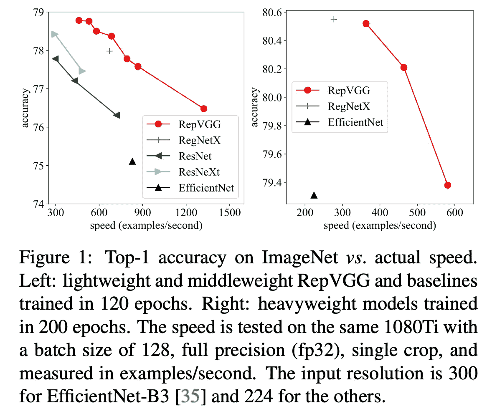
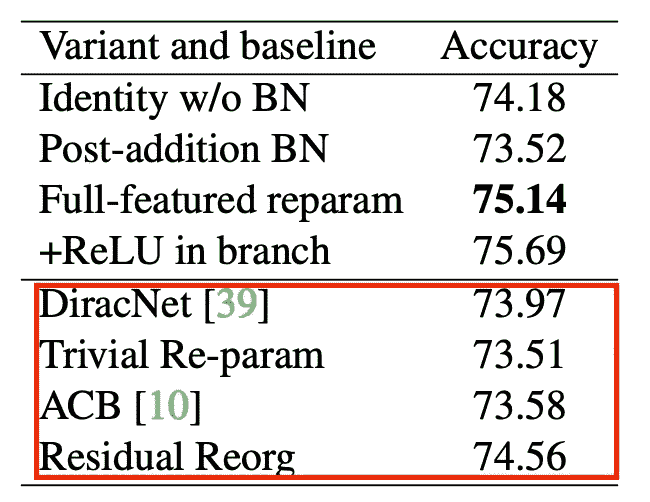

# 用 RepVGG 让 VGG 风格的 convnets 再次变得伟大

> 原文：<https://medium.com/codex/making-vgg-style-convnets-great-again-with-repvgg-df8ed7205318?source=collection_archive---------2----------------------->

克拉克·蒂布斯在 [Unsplash](https://unsplash.com?utm_source=medium&utm_medium=referral) 上拍摄的照片

VGG 被认为是深度 CNN 的基石之一。VGG 的作者为设计 CNN 提供了广泛接受的原则。特别是，他们认为多重 3 × 3 卷积比使用更大的内核更有效。

然而，与复杂的现代最先进的 CNN 架构相比，仅由 3 × 3 卷积和 ReLU 的连续堆栈组成的 VGG 架构可能显得粗糙和脆弱，其中大多数架构涉及复杂的卷积变体和神经架构搜索(NAS)。最近的一篇论文表明，使用一些技术，平面设计可以显示相当的图像识别推理性能。

RepVGG 是一种设计类似多分支模型(例如 ResNet、Inception)的架构，但可以通过*结构重新参数化*转换为类似 VGG 的模型，该模型具有连续的 3 × 3 卷积和 ReLU 堆栈，在推理时产生相同的结果。在本帖中，我们将讨论建议的 RepVGG 架构的细节，以及它为什么有用。

作者建议

*   与现代 CNN 架构中使用的某些组件相比，简单架构在推理方面的优势。
*   设计多分支模型的一个聪明的技巧
*   RepVGG，一个多分支架构，可以转换成 VGG 风格的架构，优于许多复杂的模型。

> 本文不仅仅是证明简单模型可以相当好地收敛，也不打算训练像 ResNets 这样的非常深的网络。相反，我们的目标是建立一个简单的模型，具有合理的深度和良好的精度-速度平衡，可以用最常见的组件(*例如*)简单地实现。正则 conv 和 BN)和简单代数。

*原文:* [*RepVGG:让 VGG 式的康文网再次伟大*](https://arxiv.org/pdf/2101.03697.pdf)

## VGG 的可能优势:快速、节省内存和灵活

虽然以前的方法已经提出了复杂而有效的网络结构，但它们在真实设备中的表现通常不如预期。具体来说，作者认为:

1.  多分支设计，如 ResNets 中的跳过连接和 Inception 网络中的分支级联，是内存低效的，因为每个分支的结果都需要保留，直到相加或级联。
2.  一些组件，通常是许多高效架构(Xception、MobileNets、EfficientNetV2)中使用的深度方向卷积和 ShuffleNets 中的通道混洗，会大幅增加内存成本，并且没有在硬件加速器(也称为 GPU)上完全优化。如下表所述，许多最新的多分支架构的理论 FLOPs 低于 VGG，但运行速度可能不会更快。

在 1080ti 上，速度是以每秒采样数来衡量的，越高越快

3.多分支网络不太灵活，而且很难修改，因为在应用某些技术时，某些体系结构规范会造成限制。例如，多分支拓扑限制了通道修剪的应用。相比之下，简单的架构允许我们根据自己的需求自由配置每个 conv 层。

这些可能是为什么 VGG 和 ResNets 的原始版本仍然被大量用于学术界和工业界的真实世界应用程序的一些原因，尽管它们缺乏性能。

第二个问题与特定架构设计和操作的 GPU 利用率低有关，这是一个众所周知的问题。此外，VGG 的主要运算 3 × 3 卷积通过现代计算库(如 NVIDIA cuDNN 和英特尔 MKL)在 GPU 和 CPU 上使用 Winograd 算法进行了高度优化。下表说明了使用 3 × 3 卷积时计算时间的实际优势。

## 概述和直觉

RepVGG 背后的直觉是，多分支网络的好处在训练时间上是有限的，而与推理速度相关的弊端在测试时间上是不可取的。

然而，声称

> 一种解释是多分支拓扑，*，例如*。ResNet 使模型成为众多较浅模型的隐式集合[36]，因此训练多分支模型避免了梯度消失问题。
> 
> 由于多分支架构**的好处都是为了训练**而缺点是不希望用于推理的，

对我来说似乎有问题，尤其是作者认为多分支模型的好处都是为了培训，尽管只提出了一个对培训有用的案例。尽管如此，考虑到本文中描述的多分支体系结构在转换为普通体系结构后可能会执行得更快，作者确实有一些令人信服的观点。

RepVGG 是一种设计类似多分支模型(例如 ResNet、Inception)的架构，但可以通过*结构重新参数化*转换为类似 VGG 的模型，该模型具有连续的 3 × 3 卷积和 ReLU 堆栈，在推理时产生相同的结果，但通过现代计算库进行了高度优化。这种设计受益于多分支模型在训练中的优势和简单模型在推理中的优势。

[36]安德烈亚斯·维特、迈克尔·J·威尔伯和塞尔日·贝隆吉。剩余网络的行为类似于相对较浅的网络的集合。神经信息处理系统进展，第 550–558 页，2016 年

## RepVGG 架构

ResNets 构造了一个快捷方式，并将信息流建模为 y = x + f(x)，其中 f 是学习到的剩余块。当 x 和 f(x)的维数因为步幅不匹配时，建模为 y = g(x)+f (x)其中 g 是 1 × 1 卷积。使用相似的捷径和 1 × 1 卷积来构造训练时间 RepVGG 网络的构建块，这导致模型 y = x + g(x) + f(x)。该架构如上图所示。

一个区别是 ResNets 中的残差块通常由 2 个 conv 和 ReLU 层组成，而 RepVGG 每层仅使用一个层。在每个分支的操作之后应用批量归一化，因此构造块被精确地定义为 y = ReLU( BN(x) + BN(g(x)) + BN(f(x))。

## 结构重新参数化

结构重新参数化是一系列步骤，通过利用 RepVGG 的构造块的设计特征，将训练块转换成单个 3 × 3 conv 层用于推理。

结构重新参数化的第一步是将批量标准化融合到卷积参数中。

在推断时对输入 M 应用批量归一化可以描述为上面的等式。请注意，μ、σ、γ、β分别是 BN 层的累积平均值、标准偏差、学习比例因子和偏差。

跟随有批量归一化 BN(M∫W)的卷积层可以表示为具有偏置向量的 conv，如下式所示。

具体地说，w’和 b’定义如下式。给定这些参数，我们可以很容易地证明上面等式的两边是相等的。

bn(M∫W，μ，σ，γ，β)=(M∫W—μ)×(γ/σ)+β和

(M∫W `)+b ` =(M∫W)×(γ/σ)—μ×(γ/σ)+β=(M∫W—μ)×(γ/σ)+β

这种变换也适用于 identity 分支，它可以看作是一个具有固定内核的 1×1 conv。因此，我们使用 w’和 b’的定义来转换每个分支的参数，以获得一个 3×3 核、两个 1×1 核和三个偏置向量。

在通过变换核来融合批量归一化操作之后，我们将这些核添加到单个 3×3 conv 核中。这是通过首先将两个 1×1 内核零填充为 3×3，然后将三个内核相加来实现的，如上图中的(B)所示。结果是一个单一的 3×3 conv 层，这意味着三个分支和批量归一化。酷！

## 细节和比例

RepVGG 是 VGG 风格的，它采用简单的拓扑结构，大量使用 3×3 conv，但它不像最初的 VGG 那样使用最大池。事实上，架构和训练配置非常不同，因为作者利用了更现代的改进和设计原则。RepVGG 的设计遵循以下原则:

*   第一级以高分辨率运行，因此我们仅使用一层来降低延迟。
*   最后一级应该有更多的通道，所以我们只使用一层来保存参数。
*   我们将大多数层放入倒数第二个阶段，跟随 ResNet 及其最近的变体。

结果是一个类似上表的架构。虽然这些超参数有改进的空间，但它们是类似于许多深度 CNN 的合理设计。此外，在奇数层(第 3 层、第 5 层、第 7 层、…第 21 层、…)使用 g=1、2、4 的*分组卷积*来加速训练和推理。

作者通过增加或减少 A 和 b 的值来缩放模型的宽度，并使用两种配置 RepVGG-A 和 RepVGG-B 来缩放模型的深度。本文描述了用于进一步提高性能的技巧和配置的规格(例如，学习速率衰减、余弦退火、数据扩充)。

## 实验

作者提供了在各种设置下对 RepVGG 模型的性能的实验。结果是“如预期”的，因为作者基本上训练了一个 ResNet 变体，只是它被优化以在推理时间上利用简单架构的好处。因此，它在速度-精度权衡方面明显更好。

在一项消融研究中，作者表明，RepVGG-B0 的简单训练时间模型仅产生 72.39%的准确性，而两个额外的分支将其提高到 75.14%。

作者还比较了他们的结构重新参数化，这不会对最终性能造成损害，与通过重新参数化融合分支的类似变体。没有详细描述变体，但是与提议的结构重新参数化(全功能重新参数化)的比较证明了 RepVGG 的有效性。

## 讨论

作者展示了简单架构的好处，如快速、灵活和节省内存。为了结合两种设计的优点，作者提出了一种网络，该网络可以被训练为多分支网络，但可以被转换为用于推理的平面网络。结合现代训练配置，作者能够用一个简单的 VGG 式网络展示与流行的现代 CNN 相当的速度-准确度曲线。

我认为 RepVGG 架构是一种压缩方法，通过将 ResNets 转换为普通架构来加速 ResNets，这在许多方面都是有益的。这实际上与许多以前的经常在初始化或训练时进行的重新参数化技术非常不同，因为该方法对最终性能没有负面影响。