# 使用 Python 制作 Tweets 的单词云

> 原文：<https://medium.com/codex/making-wordcloud-of-tweets-using-python-ca114b7a4ef4?source=collection_archive---------1----------------------->

## 一篇关于从包含特定标签(如#SpaceX)的推文中生成词云的帖子

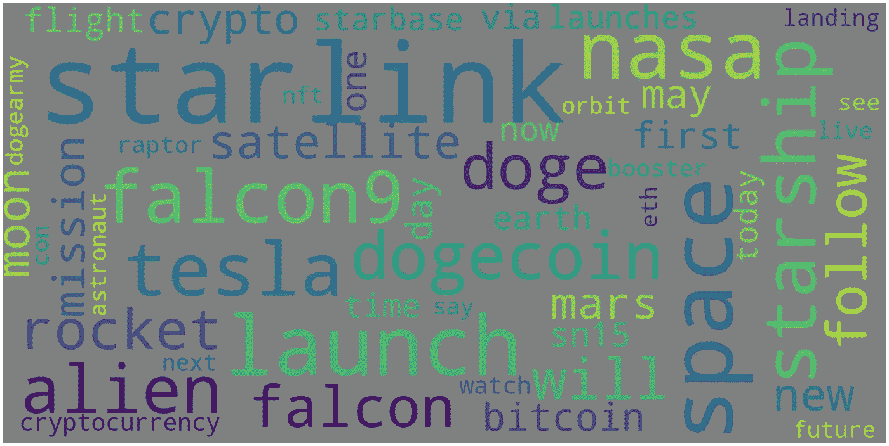

用#SpaceX 发布的文字云

Word Cloud 是一款流行的可视化工具，用于可视化文本数据。根据单词在语料库中出现的频率来确定它们的大小，并以随机顺序排列。Word Cloud 提供了关于文本语料库内部内容的快速而肮脏的洞察。

众所周知，Twitter 是一个微博客网站，以实时快速更新正在发生的事情而闻名。Word Cloud 可用于获得 Twitter 上提到的单词以及特定标签或关键字的概述。我们能想到的一个词云可视化的快速用例是，品牌可以跟踪他们的客户对他们的评价。

# **抓取并下载推文:**

在这篇文章中，我们将从包含#SpaceX 标签的推文中创建一个词云。您可以使用任何标签或关键字。

导入所需的库:

```
import tweepy
import pandas as pd
```

[*Tweepy*](https://docs.tweepy.org/en/latest/index.html) *是一个易于使用的 Python 库，用于访问 Twitter API。*

使用 Tweepy，我们将从 Twitter 中抓取推文。要使用 Tweepy，我们需要 Twitter 开发人员证书。申请[此处](https://developer.twitter.com/en)为开发者账户。你会被问到关于目的的问题。审批过程可能需要几天时间。获得批准后，在 dashboard 中设置开发环境，并转到应用程序的“密钥和令牌”选项卡以检索开发人员凭据— *消费者 API 密钥、消费者 API 密钥、访问令牌和访问令牌密钥*。

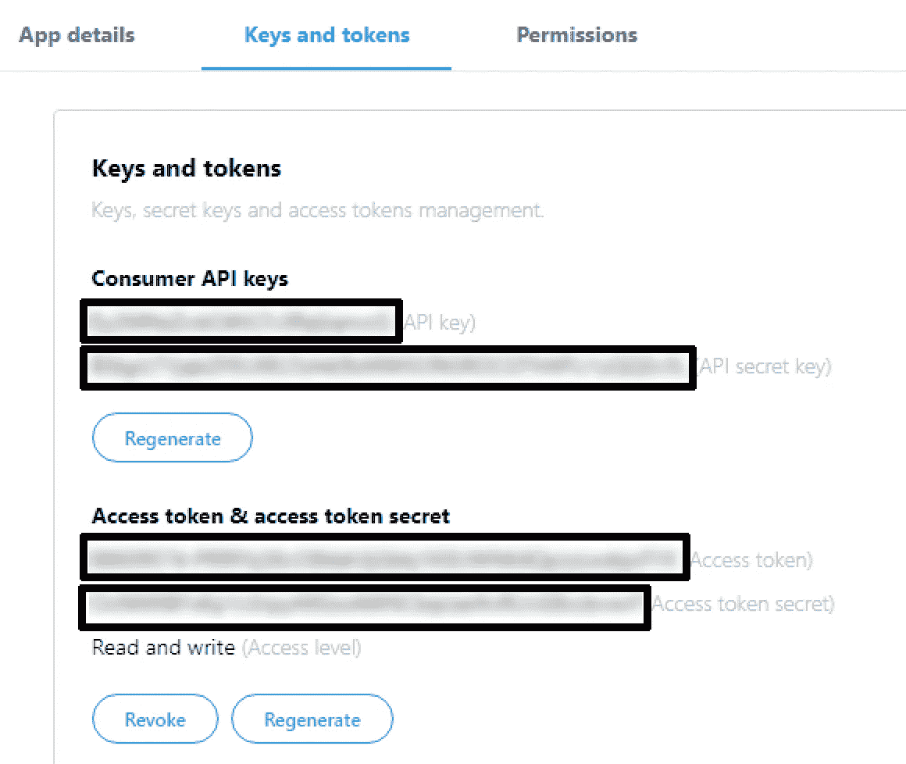

Twitter 上的开发者证书页面

现在你有了开发人员证书，你需要向 Twitter 申请授权来使用他们的数据。下面的代码片段完成了这项工作:

```
consumer_key = "Enter your consumer key" ***#Enter your key as string***
consumer_secret = "Enter your consumer key secret"
access_token = "Enter your access token"
access_token_secret = "Enter your access token secret"auth = tweepy.OAuthHandler(consumer_key, consumer_secret)
auth.set_access_token(access_token, access_token_secret)
api = tweepy.API(auth, wait_on_rate_limit=True)
```

我们将使用 [keyword_to_csv()](https://towardsdatascience.com/how-to-scrape-tweets-from-twitter-59287e20f0f1) 方法来抓取与所需关键字相关的推文，并将其保存到一个 csv 文件中。首先使用 *tweepy 创建一个查询方法。Cursor()* 方法输入我们的关键字作为参数。接下来，从 iterable 对象“tweets”中提取与 twitter 文本相关的信息，并将其保存在 *tweets_list* 中。然后从 *tweets_list* 创建一个熊猫数据框架。当调用这个方法时，将使用抓取的 tweets 创建一个 csv 文件。

```
def **keyword_to_csv(keyword,recent)**:
    **try:**
        **tweets** = tweepy.Cursor(api.search,q=keyword).items(recent) *#creates query method* **tweets_list** = [[tweet.text] for tweet in tweets] 
*#pulls text information from tweets* **df** = pd.DataFrame(tweets_list,columns=['Text']) 
*#creates a pandas dataframe* **df.to_csv**('{}.csv'.format(keyword), sep=',', index = False) 
 *#creates a csv from data frame* **except** BaseException as e:
        print('failed on_status,',str(e))
        time.sleep(3)
```

我们现在有兴趣抓取最近 3000 条带有#SpaceX 标签的推文，转发将被排除在外。

```
keyword = 'SpaceX'+ " -filter:retweets" *#excludes retweets*
recent  = 3000
keyword_to_csv(keyword, recent)
```

一个包含标签的 csv 文件(*# spacex-filter:retweets . CSV*)将被下载到你的路径中。

# 数据清理:

我们需要在用我们的推文制作文字云之前清理我们的数据。首先将生成的 csv 文件加载到 pandas dataframe 中。

```
df = pd.read_csv("./#spacex-filter:retweets.csv") *#loads csv file into pandas dataframe*pd.options.display.max_colwidth = 200 df.head() *#prints out first few columns in a dataframe*
```

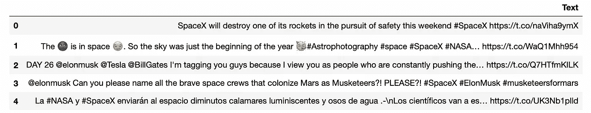

```
**df.shape** *#prints the shape of dataframe*
```

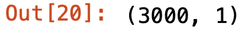

然后，我们将分四步清理加载到 pandas dataframe 中的数据。

**步骤 1:删除表情符号和符号**

表情符号、符号等。将使用 Python 中的[正则表达式](https://www.youtube.com/watch?v=K8L6KVGG-7o&t=2408s)移除。

```
a = df.loc[1272].to_string() #loads the row from dataframe
print(a)
```


下面的[图案](https://stackoverflow.com/questions/33404752/removing-emojis-from-a-string-in-python)将删除文本中的大部分表情符号和符号。

```
regex_pattern = re.compile(pattern = "["
        u"\U0001F600-\U0001F64F"  # emoticons
        u"\U0001F300-\U0001F5FF"  # symbols & pictographs
        u"\U0001F680-\U0001F6FF"  # transport & map symbols
        u"\U0001F1E0-\U0001F1FF"  # flags (iOS)
                           "]+", flags = re.UNICODE)match = re.sub(regex_pattern,'',a) *#replaces pattern with ''*
print(match)
```

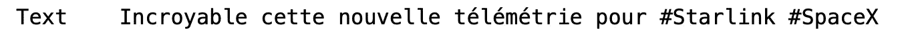

**第二步:删除网址**

```
a = df.loc[0].to_string()
print(a)
```

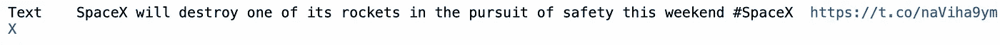

下面的代码块从文本中删除了 URL。

```
pattern = re.compile(r'(https?://)?(www\.)?(\w+\.)?(\w+)(\.\w+)(/.+)?')
match = re.sub(pattern,'',a)
print(match)
```

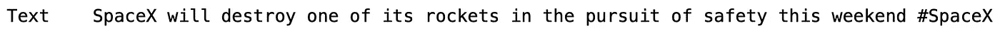

**步骤 3:删除@提及和散列符号**

```
a = df.loc[3].to_string()
print(a)
```

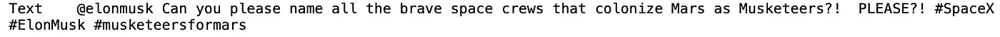

下面的块从文本中删除了@ references 和 hashes。

```
re_list = [’@[A-Za-z0–9_]+’, '#']
combined_re = re.compile( '|'.join( re_list) )
match = re.sub(combined_re,’’,a)
print(match)
```

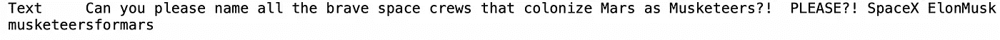

**步骤 4: HTML 到文本**

当 HTML 编码没有转换成文本时，我们会在文本中看到&amp，&quot，\n 等字符。为了转换成文本，我们将使用 [BeautifulSoup](https://www.youtube.com/watch?v=ng2o98k983k&t=1185s) 来实现。

```
**from bs4 import BeautifulSoup**a = df.loc[27].to_string()
print(a)
```

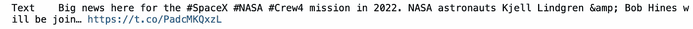

下面的块将从文本中删除 html 字符。

```
del_amp = BeautifulSoup(a, 'lxml')
del_amp_text = del_amp.get_text()
print(del_amp_text)
```

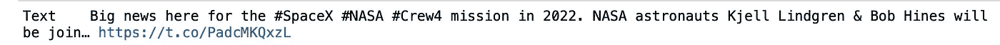

现在我们将所有这些步骤聚合成一个函数 [cleaning_tweets()](https://github.com/tthustla) 。此外，我们将对单词进行分词，以去除空格。此外，所有的单词都将被转换成小写，以避免类似“猎鹰”&“猎鹰”出现在单词云中。我们也将只考虑那些至少有三个字符的单词。

```
from bs4 import BeautifulSoup
from nltk.tokenize import WordPunctTokenizer
token = WordPunctTokenizer()def cleaning_tweets(t):
    del_amp = BeautifulSoup(t, 'lxml')
    del_amp_text = del_amp.get_text()
    del_link_mentions = re.sub(combined_re, '', del_amp_text)
    del_emoticons = re.sub(regex_pattern, '', del_link_mentions)
    lower_case = del_emoticons.lower()
    words = token.tokenize(lower_case)
    result_words = [x for x in words if len(x) > 2]
    return (" ".join(result_words)).strip()
```

现在将数据帧传递给我们的函数，并清理文本。该函数将返回一个清理过的 tweets 列表。您可以在输出窗口中看到进程的进度。

```
print("Cleaning the tweets...\n")
cleaned_tweets = []
for i in range(0,3000): *#3000 columns in our dataframe*
    if( (i+1)%100 == 0 ):
        print("Tweets {} of {} have ben processed".format(i+1,3000))                                                                  
    cleaned_tweets.append(cleaning_tweets((df.Text[i])))
```

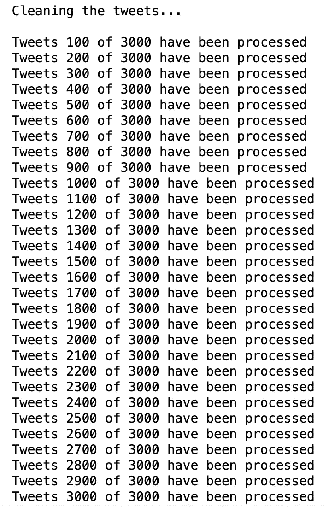

接下来我们将使用*熊猫。Series.str.cat()* 将列表中的字符串串联起来 c*lean _ tweets*用' '隔开。

```
string = pd.Series(cleaned_tweets).str.cat(sep=' ')
```

# 生成单词云:

在这最后一节，我们将使用 python 的 [*wordcloud*](https://github.com/amueller/word_cloud) 库来生成 tweets 的 wordcloud。

停用词是英语中常见的词，如“the”、“a”、“an”、“in”…这些词对句子没有多大意义。这些词在自然语言处理任务中被忽略。我们可以根据需要添加自己的停用词。我们知道，像“埃隆马斯克”、“埃隆马斯克”、“埃隆”、“马斯克”……这样的词在带有标签 *#SpaceX* 的推文中会很常见。所以我们将它们添加到停用词列表中，它们就不会出现在词云中。

```
from wordcloud import WordCloud, STOPWORDS
import matplotlib.pyplot as pltstopwords = set(STOPWORDS)stopwords.update(["elonmusk","elon musk","elon","musk","spacex"]) *#adding our own stopwords*
```

在 *WordCloud()* 函数中，我们可以根据需要传递参数。

*max_words:* 默认值为 200 字；建议使用 50-100 个单词，这样我们的单词云才会清晰易读。

*搭配:*默认值为*真值为*。我们将选择*假*来避免单词的二元模型*。*

*背景颜色:*使用任何你想要的颜色，如“蓝色”、“绿色”、“灰色”…黑色是默认值。

最后，我们用这段代码生成单词云。您可以使用 *WordCloud()* 函数中的参数来生成不同颜色和大小的云。

```
wordcloud = WordCloud(width=1600, stopwords=stopwords,height=800,max_font_size=200,max_words=50,collocations=False, background_color='black').generate(string)
plt.figure(figsize=(40,30))
plt.imshow(wordcloud, interpolation="bilinear")
plt.axis("off")
plt.show()
```

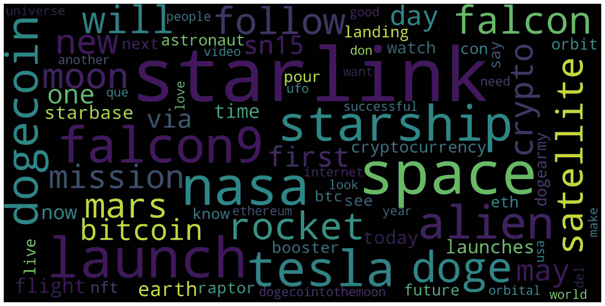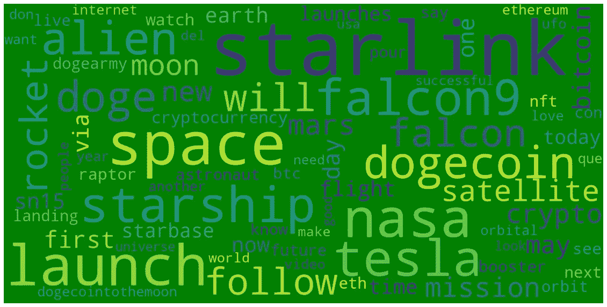

看着上面的云，我们可以看到#SpaceX 提到了哪些词——starlink、space、nasa、falcon9 等。单词越大，它们在推特上出现的频率就越高。

# **自定义字云:**

我们可以用 *WordCloud()中的附加参数 *mask* 生成自定义的词云。*

在你的路径中上传你自己的图片，下面的代码会完成剩下的工作。这对于白色背景的图像效果最好。你可以看到一些样本图像和相应的云。

```
import numpy as np
from PIL import Imagemask = np.array(Image.open('./your_image.jpg')) **wordcloud = WordCloud(**width=1600, mask =   mask,stopwords=stopwords,height=800,max_font_size=200,max_words=50,collocations=False**)**.**generate(string)**f = plt.figure(figsize=(50,50))
f.add_subplot(1,2, 1)
plt.imshow(mask, cmap=plt.cm.gray, interpolation='bilinear')
plt.title('Original Image', size=40)
plt.axis("off")
f.add_subplot(1,2, 2)
plt.imshow(wordcloud, interpolation='bilinear')
plt.title('Generated Word Cloud', size=40)
plt.axis("off")
plt.show()
```

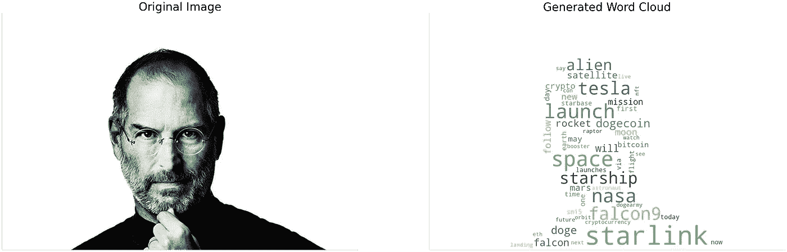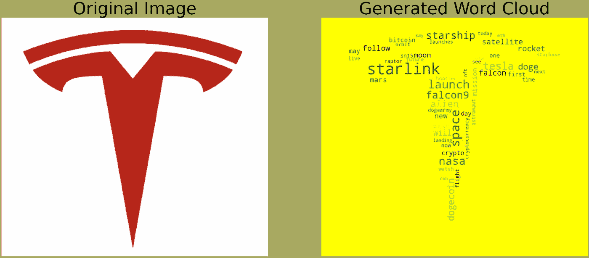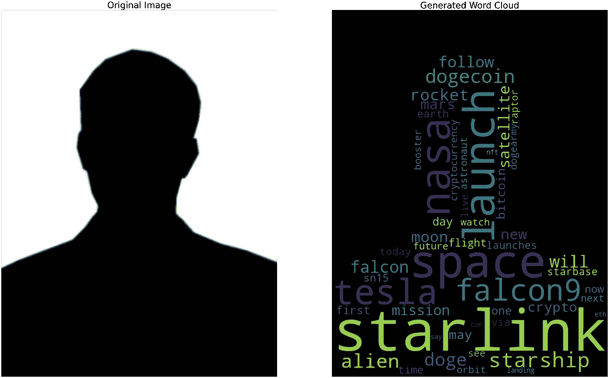

包含代码的 Jupyter 笔记本的链接可以在[这里](https://github.com/vijayv500/Machine-Learning)找到。