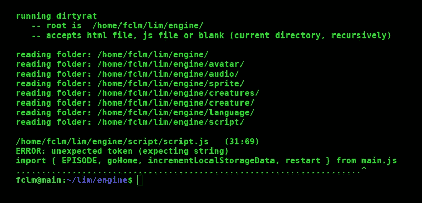
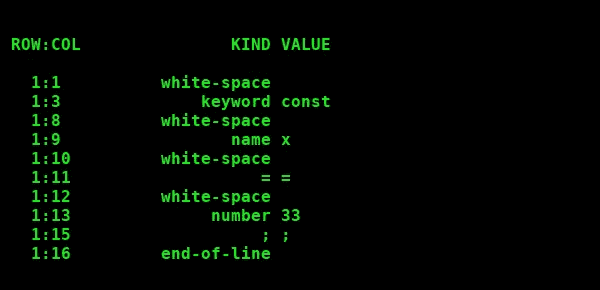

# 制作您自己的 JavaScript Linter(第 1 部分)

> 原文：<https://medium.com/codex/making-your-own-javascript-linter-part-1-ee9f91dc49d8?source=collection_archive---------1----------------------->

## 综合教程

奔跑的棉绒

这是关于构建 JavaScript linter 的综合教程的第一部分。linter 是一个检查源代码的工具。我们将看到用 JavaScript 编写的基本概念和源代码，包括复杂部分的 T2 算法。

注: [*dirtyrat*](https://github.com/JoanaBLate/dirtyrat) 是用来制作本教程的棉绒。

# 棉绒内部是如何工作的

我们怎样才能让一台计算机如此聪明地理解用复杂的 JavaScript 规则编写的一千行文件呢？如何应对这样的复杂性？答案总是一样的。

> *我们将大的复杂系统分解成小的、简单的组件，这些组件与其他组件有简单的关系。*

在棉绒的情况下，这些小而简单的部件被称为 ***记号*** 。所以林挺的第一步是从文本中产生一个记号集合。这正是我们人类阅读文本的方式。不同的是，我们说*单词*、*数字*和*标点符号*，而不是*记号*。

通常从文本中产生标记的模块被称为*标记器*。它可以产生原始令牌或过滤它们，并且只提供有意义的令牌。它可以一次对整个文件进行令牌化，也可以按需逐个生成令牌。

让我们看一个例子。在下面的代码中，第一行有多少个原始标记？

你猜是 5 吗？嗯，不仅仅是看上去的那样。

原始代币

考虑到有些种类被命名为“=”和“；”而不是*赋值*和*分号*，你可能会意识到 *dirtyrat* 这个名字有些贴切。

除了生成所有原始令牌，tokenizer(或另一个模块)还消除了无意义的令牌——空行、备注和空格。

尽早消除无用令牌的意义在于，它极大地简化了要做的检查。看下面的部分例子。它们都有有效的语法用于开始 *if* 语句。它们都归结为相同的两个有意义的记号(关键字 *if* 和左括号)。

当 linter 正在分析过滤后的(仅有意义的)令牌，并且它看到一个带有关键字 *if* 的令牌时，就可以说“现在给我一个内容为'('的令牌，否则我会喊'错误'！”。

当记号赋予器不过滤记号时……好吧，我不愿意想象这个 linter 在内部会是多么臃肿、丑陋和混乱！

什么样的标记是无用的取决于目标文本的编程语言的规则。c 不关心 EOLs(行尾)，它依赖分号。Python 在每一行的开头计算空格来结束代码块。

如果 linter 正在检查样式，那么必须保留空白标记。如果标记器是文档工具的一部分，则必须保留注释。记号赋予器不仅仅是为了 linters 和其他工具。编译器和解释器也有一个。

所以，基本上，林挺就是从源代码中创建一个有意义的令牌列表，然后分析每个令牌与其下一个邻居的关系。

# 令牌对象

对于一个过敏者来说，完美地发现错误是不够的。它应该指出每个错误发生的确切位置以及错误是什么。“where”部分很简单，只要我们注册每个标记的位置(文件名、行名和列名)。“是什么”的部分很难，因为有太多的可能性要涵盖；这就是为什么简单通用的错误消息 ***意外令牌*** 被广泛使用的原因。

因此，记号赋予器的工作不仅仅是将一个大字符串(源代码)转化为一系列小字符串(记号)。令牌化器必须创建一个*令牌对象*的列表。

字段*种类*特别有用。通常，linter 不会检查字段*的值*。如果它在等待一个数字，那么这个数字是 0、33 还是 44 都无关紧要。令牌的类型为“数字”就足够了。

在本教程中，从现在开始， *token* (单独)表示一个 *token 对象*。

# 记号赋予器如何工作

记号赋予器基本上是一个大循环。

注意，函数 *eatCharacter* 是记号赋予器的核心，因为记号赋予器是 linter 的核心。除了服务于下一个字符的基本职责之外，这个小而简单的函数还控制行尾、文件尾、有效字符和标记的位置。

修复为什么不可能有两个连续的空白标记。一旦 *createWhiteSpaceToken* 开始，它只在源代码中的下一个字符不是空白时停止。这是一个非常简单的案例。其他函数如 *createStringToken、createNumberToken、createNameToken* 等。更加复杂，但基本功能是相同的。

没有函数 *createKeywordToken* 。函数 *createNameToken* 检查 token.value 是否属于关键字列表。

上面的部分代码不处理符号有多个字符的情况，比如等号(" == ")。如果你想了解更多细节，可以在 GitHub 上找到 dirtyrat 的[源代码。](https://github.com/JoanaBLate/dirtyrat)

关于字符串插值，有三种处理方法。

*   好方法是:tokenizer 忽略插值，并提供一个标准的字符串标记。稍后将在特殊模块中处理插值。
*   坏的方面:为了产生插值的所有记号，函数 *createStringToken* 的复杂性和大小大大增加。
*   可怕的方式:tokenizer 忽略插值，传递一个标准的字符串令牌。但是，我们没有创建一个特殊的模块来处理插值，而是将插值视为一个源代码文件本身，并且([试图遵守 DRY 原则](https://joanaborgeslate.medium.com/repeat-yourself-sometimes-it-is-a-good-thing-141179c11dad))我们重构了令牌化器，以便能够处理这个“源代码文件”。真是一团糟！

你可能会认为，如果有一个变量来记忆源代码中当前字符的位置，而不是吃掉(缩小)一个大字符串(源代码)的数百倍，程序会更有性能。这是可行的，但是会使代码变得复杂。

事实上，dirtyrat 使用了第三种方法，将简单性和性能结合起来:首先将代码分成几行，然后逐行进行标记。

# 扫描仪

记号赋予器创建一个有意义的记号列表。现在我们必须分析记号之间的关系。这是在模块解析器(及其助手模块)中完成的。由于解析表达式和函数体有点复杂，我们创建了模块 *scanner* ，它包含一些简单但非常有用的函数，目的是向其他模块提供令牌。让我们来看看其中的一些功能。

扫描仪里所有的函数名都是以“看”或者“吃”开头的。当我们需要知道下一个令牌，但现在不打算使用它时，可以使用“see”函数。

函数*seeEndOfBlockOrTrueEndOfLine*甚至不返回令牌！它只是检查下一个令牌是否符合某些条件。

那么，什么样的终点不是真正的终点呢？分号("；").

扫描器是准备就绪后访问令牌列表的唯一模块。

当发现一个错误时，Dirtyrat *总是退出执行，否则它可能会指出几十个实际上并不存在的错误，仅仅因为第一个错误破坏了后面几行代码的结构。例如， *eatString* 返回一个字符串标记，或者 linter 在显示正确的错误消息后退出。*

# 模块错误

既然我们已经讨论了错误，让我们看看模块*错误*。

正如你所看到的，这个想法是每个模块都很简单，并使其他模块变得非常容易。比如，当模块*表达式*发现一个坏令牌，它要做的就是说*意外(令牌)*。并将显示一条精确的错误消息。

注意:在 dirtyrat 中，模块*错误*是模块*助手*的一部分。

# 待续

你可以在这里阅读教程的[第二部分。](/codex/making-your-own-javascript-linter-part-2-288841612f4d)