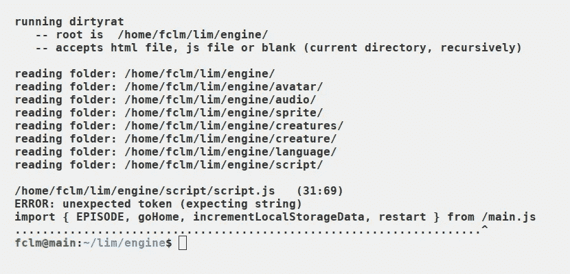

# 制作您自己的 JavaScript Linter(第 2 部分)

> 原文：<https://medium.com/codex/making-your-own-javascript-linter-part-2-288841612f4d?source=collection_archive---------6----------------------->

## [法典](https://medium.com/codex?source=logo-e10ad955760c---29038077e4c6)

## 综合教程

奔跑的棉绒

这是关于构建 JavaScript linter 的综合教程的第二部分。你可以在这里阅读[第一部](/codex/making-your-own-javascript-linter-part-1-ee9f91dc49d8)。

这里是 GitHub 中 dirtyrat 的[源代码。](https://github.com/JoanaBLate/dirtyrat)

在教程的第一部分，我们学习了记号赋予器、扫描器和错误显示。这三个实体各有一个文件就足够了。而且每个文件里面的代码很容易理解，也不是很大。小菜一碟！

现在我们必须检查表示我们想要 lint 的源代码的令牌对象之间的关系。负责这项任务的 linter 部分被称为*解析器*。解析器必须做的不仅仅是对照下一个邻居检查每个标记。我们刚刚到了事情变得棘手的地步！

有如此多的代码和多样的功能，我们不得不**将解析器分成一堆模块**。其中就有 *parser.js* 本身。我们会看着他们所有人。

# 陈述和表达

理论上，源代码有两种成分:语句和表达式。表达式是数据(值)或可以计算为数据的东西。一条语句是代码结构的一个元素，一般绑定一个关键字( *function* ， *return* ， *if* 等)。).

这个定义语句 x 表达式有些武断和混乱，可能会因编程语言的不同而不同。我相信以下概念:

> 计算机是一种遵循指令的机器。因此，任何源代码都是一组语句**(显式或隐式)，这些语句可能包含表达式，这些表达式可能包含包含表达式的语句。以此类推，循环往复。**

*语句和表达式(包括操作符)的概念是编写解析器的基础。*

# *模块解析器*

*基本上，模块*解析器*处理**一级语句** : *“使用严格”*，全局变量和函数的导入和声明。对于全局变量初始化，它依赖于模块*表达式*。在函数的情况下，它将几乎整个作业传递给模块*函数*。*

*这个解析器不接受函数之外的公共代码。它还调用模块*寄存器*，专门用于控制名称。*

# *解析函数头*

*正如我们在上面看到的，解析几种一级语句很容易。解析一个函数有点复杂，因为我们需要能够处理循环内表达式内的函数，循环内的函数，if 函数内的子句，whatever…*

*在 JavaScript 中，有三种以关键字 *function* 开头的函数:全局(第一级)函数、内部函数和匿名函数。由于它们仅在开始处不同(内部或非内部，匿名或非匿名)，解析器(模块*函数*)可以在解析开始后对它们使用相同的代码。*

# ***解析功能体——路由器***

*我们必须将函数体理解为一系列语句。即使没有关键字(赋值或函数调用)。即使一行中所写的只是一个右花括号。想象一下这个符号说“当前块/范围到此结束”。*

*因此，我们的任务是编写一个循环，将每一行的第一个令牌路由到适当的函数来处理它。*

*类似上面例子的压缩源代码告诉我们，每行只写一条语句的原则(这对于解析一级语句来说很好)在这里不适用。*

*路由器:*

*我们将更多地讨论路由器。*

# *解析函数体——处理程序(工人)*

*以上这三个函数足以帮助解释一些概念。我称他们为处理者或工作者，因为他们有效地工作，处理代币，吃代币；它们处理路由器(管理器)交付的工作。*

*这三个函数开始吃第一个可用的令牌，它包含各自的关键字。*

**eatElse* 检查上下文是否允许 *else* 语句位于该位置(不久将有更多关于该主题的内容)。*

**eaif*和 *eatReturn* 不需要检查上下文，因为任何可能的上下文(在函数体内部)对它们都是有效的，考虑到一些错误是在其他地方捕获的。例如:*

*无效令牌*返回*在函数*eaif*处被捕获为错误。并且棉绒在调用 *eatReturn* 之前退出。因此， *eatReturn* 永远不用担心令牌 *return* 之前的令牌。*

*因为每个语句都有自己的规则，所以检查下一个标记的最佳位置是在“eat statement”函数内部。*

*在解析(吃和分析)其令牌后， *eatReturn* 检查下一个令牌，而不吃(当没有错误时)，因为下一个令牌必须可用于路由器；它是负责解析块尾和行尾标记的函数。*

*解析完它的令牌后，*eaif*和 *eatElse* 通知解析器一个新的块和一个新的分支被创建了(很快会有更多关于这个主题的内容)。*

*正如我们看到的模式是**独立解析所有语句**。这条规则只有一个例外:语句 *catch* 。这是唯一不应该被路由器捕获的语句。*

*现在，是什么使得*捕捉*不同于*中断*或*否则*到了必须进行特殊解析的地步？简单回答。你可以有*如果*没有*其他*。您可以在不使*中断*或*继续*的情况下使*用于*。但是如果你有*试*你必须有*赶*。*最后*是可选的，所以它和其他语句一样。*

*每次 dirtyrat 关闭一个 *try* 块，它调用 *forceEatCatch* 。这就是为什么 *catch* 不应该被路由器捕获的原因:它被 *forceEatCatch* 捕获。*

# *待续*

*你可以在这里阅读[教程的第三部分](/codex/making-your-own-javascript-linter-part-3-da14e2aaf051)。*