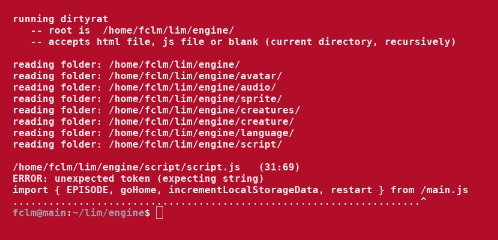

# 制作您自己的 JavaScript Linter(第 3 部分)

> 原文：<https://medium.com/codex/making-your-own-javascript-linter-part-3-da14e2aaf051?source=collection_archive---------5----------------------->

## [法典](http://medium.com/codex)

## 综合教程

奔跑的棉绒

这是关于构建 JavaScript linter 的综合教程的第三部分。你可以在这里阅读[第二部](/codex/making-your-own-javascript-linter-part-2-288841612f4d)。

这里是 GitHub 中 dirtyrat 的[源代码。](https://github.com/JoanaBLate/dirtyrat)

# 解析函数体—块

像 *if，else，for，while* 这样的语句总是会创建一个代码块，也称为*作用域*。例如，当解析器发现语句 *break* 时，它必须有办法知道这个语句是否在循环中。其他例子:当解析器发现一个右花括号时，它必须知道哪个块被关闭了。

通过两个全局变量和两个小函数来控制代码块。

如上面的代码所示，很容易知道语句 *break* 何时有效。只是在时询问或*是否有任何开放的区块。*

现在，语句 *else* 的检查必须不同:

我们通过检查 *lastClosedBlock == "if"* 来验证 *else* 语句。 *else* 的性质是不进入 *if* 块。其性质是在*之后如果*受阻。

# 为什么我们需要 JavaScript linter？

浏览器、Deno (JavaScript)和 NodeJs 不会运行有任何语法错误的代码。但是他们不会在意调用一个不存在的函数的错误，直到执行试图调用这个函数的那一刻。也许运行时人员认为“这个名称还没有定义，但是让我们给它时间来定义它；毕竟我们运行的是动态语言！”。

借用编译编程语言中的术语，我们可以说在 JavaScript 中，语法错误是一个*编译时错误*。其他的都是运行时间错误。

我个人的约定:“运行时”(不带空格)这个表述是指引擎，就像 Chrome V8 一样。而“运行时”(带空格)的表述是指代码运行的时刻。

*编译时错误*是诚实的。你马上就会知道他们所有人。它们很容易修复。没有人会发布带有编译时错误的软件。嗯……现在我正在考虑这个规则的一个可能的例外。

*运行时错误*是隐蔽的。他们也被称为臭虫。有时它们发生在代码开始运行 30 分钟后。有时它们发生在非常罕见的鼠标移动、按键和其他动作的组合上。他们是程序员的地狱。

JavaScript 太宽容了。例如，这种语言允许在相同的范围内创建任意数量的同名函数。最新的函数是唯一会运行的函数，所有其他同名函数的存在只是为了误导您。或者，更糟糕的是，可能存在其中一些运行一段时间的情况(我不知道这是否可能)。

我不反对覆盖一个函数，只要它确实是必要的，并且以一种非常清晰的方式完成。

有人在 *if* 语句的条件内写赋值吗？

> *使用 JavaScript linter 的两个主要原因是 1)将运行时错误转化为编译时错误，以及 2)将 JavaScript 认为没问题的东西捕捉为错误。*

# 控制名称

关于名字，一个好的短绒必须

1.  确保没有重复的声明，
2.  确保没有使用未定义的名称和
3.  警告未使用的名称(未使用的本地名称通常是一个错别字和错误)。

注意:dirtyrat 知道这可能是林挺一个正在建设中的代码。因此，它不是将错误指向未使用的局部变量，而是产生强烈的警告。

在逐个标记地解析标记时，每次声明或使用名称时，linter 都会注册相应的标记。稍后，linter 会尝试将消耗的名称(赋值、函数调用)与声明的名称进行匹配。

匹配必须在以后完成，因为函数在声明之前被调用是正常的。此外，对于导入和导出，有必要在开始匹配之前注册所有文件的所有名称。

命名的黄金法则是:**不同的东西必须有不同的名字**。

我们不能只依赖一个简单的名称作为标识符，因为不同的元素只要在不同的范围内就可能有相同的名称。

我们必须在上面代码的标识符中包含范围:“x”、“f1”、“f1.x”、“f2”、“f2.if.x”和“f2.else.x”。

看起来不错，但不是所有情况下的解决方案:

在上述情况下，标识符将是“f”、“f.if.x”和“f . if . x”；打破黄金法则！

我们需要另一个标准来创建唯一标识符。依赖代码块是行不通的。

# 解析函数体—分支

解决方法是使用分支的概念。分支与块非常相似，但是更加详细。它们的存在只是为了帮助创建唯一的标识符。

让我们看看它是如何工作的:

太棒了。现在每个名字的全称以一种明确的方式注册了它的作用域。

不同的东西有不同的名字。好的。问题是同一个东西(参数“a”)得到了不同的名称(“f.1.a”、“f.1.1.a”和“f.1.2.a”)。

别担心。我们稍后会处理这个问题。

# Rat —源代码文件对象

这是存储源代码文件数据的对象:

源代码以右修剪行的形式存储。这解决了当我们从不同的环境(例如，Microsoft Windows 或网页)导入文本时经常发生的不同的可能行尾问题(" \n" x "\r\n ")。

# 真正的令牌对象

我们之前看到的令牌对象是一个极简的对象。这是真的:

有些字段仅对名称为*的令牌有效。*

# 待续

这里是[教程第四部分也是最后一部分](/codex/making-your-own-javascript-linter-part-4-de4f106a9785)的链接。