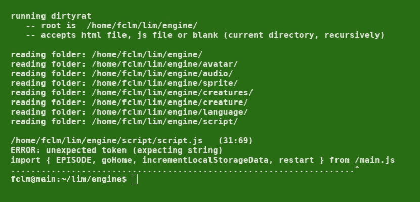

# 制作您自己的 JavaScript Linter(第 4 部分)

> 原文：<https://medium.com/codex/making-your-own-javascript-linter-part-4-de4f106a9785?source=collection_archive---------5----------------------->

## [法典](http://medium.com/codex)

## 综合教程

奔跑的棉绒

这是关于构建 JavaScript linter 的综合教程的第四部分，也是最后一部分。你可以在这里阅读[第三部](/codex/making-your-own-javascript-linter-part-3-da14e2aaf051)。

这里是 GitHub 中 dirtyrat 的[源代码。](https://github.com/JoanaBLate/dirtyrat)

# 注册名称

正如我们在本教程的其他部分所看到的，当 linter 在逐个解析令牌时，发现一个名为的令牌时，它会调用某个函数将这个名称(令牌)注册为已声明的或已使用的。

让我们来看看模块*寄存器*。

基本上，注册名称意味着使用模式***dictionary【branch edname】= token***填充源代码文件对象(rat)的字典。

除了为以后的名称匹配准备数据之外，寄存器还会立即指出双重声明错误。

# 检查姓名

虽然在模块 *check-names* 中没有技巧部分，但它的代码有点难读，因为我最近对它进行了修改，使其能够与 JavaScript 模块一起工作，但没有时间对它进行润色。因此，我们将查看该模块的示意图:

真正的代码要复杂得多，因为它关心的是每种警告的组织。因此，它必须用来自每个 rat(代表源代码文件的对象)的警告来填充列表。然后，逐个列表显示。

还记得我们有一个相同的名字有许多标识符(全名)的问题吗？这是我们解决问题的方法。我们使用一个函数递归地调整外部作用域/块的全名(分支名)。

# 解析表达式

Dirtyrat 有一个用于解析标准表达式的模块，还有一个用于解析文字表达式的模块。文字表达式是那些里面没有名字(变量或函数调用)的表达式。对于全局变量的初始化，dirtyrat 只接受文字表达式。

这是标准表达式模块:

解析表达式的代码完全是以递归方式编写的。基于主循环编写机制只会使事情复杂化。

尽管模块*扫描器*是完全线性的(一个接一个地服务一个令牌),模块*表达式*是完全递归的，但它们完全匹配。

# 该模块主要

只剩下一个模块需要检查了。而且是第一个运行的:模块*主*。它开始分析命令行参数，并将哪些文件设置为 lint:单个 JS 文件、由 HTML 文件链接的 JS 文件，或者文件夹和子文件夹中的 JS 文件。然后，它读取每个文件并发送要解析的文本。解析完所有文件后，它调用模块 *check-names* 。

# 额外收获:如何解析 Python 的缩进

首先，我们必须理解**缩进只是另一种关闭块**的语法。打开块不是缩进的职责。我知道新积木需要新的(更大的)压痕。这里有一个问题:

> *并不是更大的缩进量打开了一个新的区块。它是一个像“for”一样的语句，创建一个新的块，需要更大的缩进。*

你可能认为这只是废话。但是这是一个基本的概念(虽然很微妙)，就像其他的一样，在你写 linter 的时候，这是一个完全不同的概念。

其次，我们必须保持我们良好的架构，将源代码文件的所有信息放入一个标记列表中。我们如何做到这一点？我们必须在值和种类等于“{”或“}”的标记中转换源代码中的不同边距。

因此，分词器有工作要做。我们不能改变任何其他模块。任何其他模块都不知道源代码的缩进是有意义的。

我们修改了记号赋予器，但没有弄乱它。

1)记号赋予器必须在每一行的开始知道该行的空白是否应该被忽略。有三种情况。a)这是一个空行。b)该行仅包含备注。c)该行是上一行的延续(例如以“+”结尾)。

2)当页边空白的大小不是 4 的倍数时，记号赋予器必须“引发”错误。

3)记号赋予器必须记住先前的缩进，并且对于每 4 个空白，当前缩进不同于先前的缩进，它插入左(或右)花括号记号。

# 我创建 dirtyrat 的原因

在 JavaScript 有模块之前，我正在处理两个前端应用程序，每个大约有 100 个文件。性能对这两款应用都至关重要。因为性能至关重要，所以我用不同的代码测试每个功能。

曾经有一段时间，V8 引擎运行循环“for (var fruit of fruits) { … }”比运行循环“for(var I = 0；I

因此，由于担心对性能有任何负面影响，我用最简单明了的方式编写了所有代码。不要在任何类型的对象中构造函数，也不要使用内部函数来保护隐私。我需要一个工具来帮我检查名字冲突和拼写错误，比如“if (a = b) {”。此外，一个工具，以加强我选择的代码风格。

当时我尝试了著名的 JSLint。JSLint 检查了我的第一个文件，告诉我在文件顶部使用“use strict”(仅一次)是错误的。我应该把它从顶部移走，放在文件的每个函数里面…我能说什么呢？“你没有帮助！”。

所以我决定创造我自己的棉绒。我认为这是一个挑战，也是一个学习更多编程知识的机会。

注意:dirtyrat 当前版本的目标是 JavaScript 模块。你可以在 GitHub 上了解更多。

# 结论

dirtyrat 最初的想法只是为了补充 JavaScript 引擎检查。久而久之，得到了改善。但绝不是为了公共用途。它在这里的作用只是说明概念。如果我想让 dirtyrat 被广泛使用，我会给它起一个更迷人的名字，比如“CleanCat”。

如果你有任何问题，请写在“回复”部分，我会尽力回答。

谢谢大家！