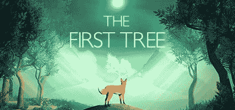

# 制作自己的视频游戏

> 原文：<https://medium.com/codex/making-your-own-video-game-b374669df0b7?source=collection_archive---------20----------------------->

制作电子游戏容易吗？一个普通的游戏开发者能赚多少钱？游戏行业的未来是什么？

照片由[西格蒙德](https://unsplash.com/@sigmund?utm_source=medium&utm_medium=referral)在 [Unsplash](https://unsplash.com?utm_source=medium&utm_medium=referral) 拍摄

## 游戏是怎么做出来的？

现在大多数视频游戏都是用游戏引擎制作的，比如 Unity 或 Unreal Engine。游戏引擎是提供基本工具和框架的软件，用于开发和构建跨不同平台的游戏。这意味着你不需要为不同的平台如 Android、IOS、PS5 等编写不同的代码。您可以为多个平台编写单个代码库。我们称之为平台无关。

## 游戏开发需要数学技能吗？

是的，至少有一点。这会让任务变得简单很多。微积分、向量、线性代数和概率等术语在现代游戏中经常使用。大多数游戏中都用到三角学和欧几里德数学。每个游戏都可能使用时间增量、比例和单位、矩阵、点积和叉积来计算游戏的不同方面。

## 制作独立游戏所需的技能

独立游戏或独立游戏是由个人或一小群开发者开发的游戏。独立游戏开发需要数字绘画、色彩理论、数字营销、谨慎数学、计算机科学基础、人工智能和机器学习、云计算以及一点点电影摄影、讲故事和情感心理学等技能。游戏开发者是好奇的人，他们不断挑战极限。制作一款视觉上赏心悦目又不失性能的游戏，需要大量的深度思考和创新思路。而且，给玩家讲故事。游戏太容易上瘾了吧？

## 制作电子游戏容易吗？

看情况。用现代游戏引擎制作 pong 或俄罗斯方块很容易。大部分游戏不需要上述条款。独立游戏很简单，但有惊人的故事，视觉上很美。你玩过[第一棵树](https://www.youtube.com/watch?v=85CPIv3kz6c)吗？大卫·维勒制作的游戏。

制作花了一年时间。有些游戏花了 5-8 年才制作完成。像托马斯刷的[从来没有的歌](https://www.youtube.com/watch?v=QXjXTbYQq5s)，用了他 5 年的时间。做[空心骑士](https://www.youtube.com/watch?v=UAO2urG23S4)和[拉娜星球](https://www.youtube.com/watch?v=r3E8O7QH5BI)这样的游戏没那么容易

## 一个普通的游戏开发者能挣多少钱？

第一棵树第一年筹集了**15 万美元**，空心骑士赚了 6000 万美元。并不是每个游戏都是这样。我的第一个免费游戏赚了**800 美元**。是啊，游戏开发是高薪工作。游戏开发人员的平均收入在**13021 美元**到**114709 美元**之间。尽管如此，还是很多。

## 游戏产业的未来

随着技术的进步，我们将看到游戏成为一种完全沉浸式的体验。像 AR、VR、XR 和 MR 这样的技术将打开一个充满机会的世界。如今，游戏正在成为一种职业。预计到 2026 年，全球博彩业收入将超过 3200 亿美元。游戏是商业和投资的更好选择，利润不断增长。

[**关注**](/@digital.talker) 了解更多， [**订阅我的简讯**](/subscribe/@digital.talker)

[*insta gram*](https://www.instagram.com/akshay._.vs__/)*[*Twitter*](https://twitter.com/Akshay_vs__)*[*脸书*](https://www.facebook.com/profile.php?id=100083569462586)*[*LinkTree*](https://linktr.ee/akshay_vs#)***