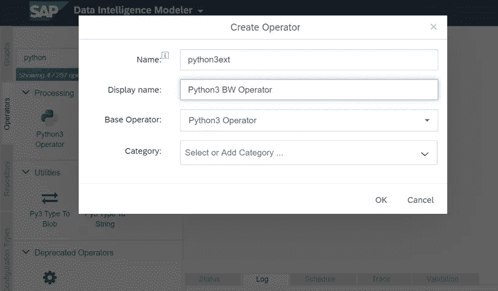

# 通过电报管理 ETL 流程

> 原文：<https://medium.com/codex/manage-etl-processes-via-telegram-f0043f197c39?source=collection_archive---------1----------------------->

[早些时候](https://agordienko.medium.com/soap-webservice-from-abap-fm-d53bc43b5b8d)，我们开发了一个创建 SOAP web 服务的流程，用于与 SAP Business Warehouse (BW) ETL 流程(也称为流程链)进行交互。Web 服务确实有助于整合公司环境中跨系统的功能。此外，我们可以从 web 服务和一些前端工具(比如 Telegram messenger)的集成中受益。


电报 Botfather 标志

Telegram 是一款简单免费的消息应用。您可以同时在所有设备上使用 Telegram，您的信息可以在任意数量的手机、平板电脑或电脑之间无缝同步。此外，Telegram 平台具有丰富的 Bot API，可用于满足您的许多业务需求。

本文将展示如何在数据仓库系统中监控 ETL 过程，只需通过 Telegram messenger 向 bot 发送命令，并接收关于当前 ETL 状态的返回信息。

让我们看看我们的目标所需的组件和任务清单:

*   **集成电报机器人 API 和 Web 服务的软件**。为此，我们将使用 Python 编程语言和一些第三方库。
*   **运行 Docker 容器**的服务器或虚拟机。实际上，我们可以在本地机器上运行我们的 Python 软件来进行测试。然而，我们将在 Docker 容器中运行我们的软件用于生产用例。在本文中，该示例运行在 SAP DI 平台上，但也可以是任何其他平台——AWS、Azure、GCP 等。
*   **SOAP web 服务获取 ETL 过程的状态**。在[之前的文章](https://agordienko.medium.com/soap-webservice-from-abap-fm-d53bc43b5b8d)中，我们做了一个从 SAP BW 系统获取状态的例子。
*   **容器化平台与 web 服务的连接**。必须在系统之间建立连接。这项任务不在本文讨论范围内，请让您公司的网络管理员来完成这些设置。在我的例子中，需要在公司的网络和云提供商之间创建一个新的 VPN 连接，你的 bot 软件将在其上运行。

该图展示了软件部件如何协同工作的全貌:


软件组件和集成图

首先，你必须注册一个新的电报机器人帐户。通过链接[https://t.me/botfather](https://t.me/botfather)通过电报信使进入机器人父亲机器人。使用命令**/新机器人**来创建你的新机器人。为您的机器人选择名称和用户名。用户名必须以“bot”结尾。之后，您将获得一个令牌，用于从您的 Python 程序访问 Telegram API。请将此令牌保密，因为它用于控制您的 bot 帐户:


与机器人父亲聊天

现在，您应该准备一个 Python 环境，并安装额外的库来调用 web 服务和使用 Telegram API。我更喜欢这个 [**pip**](https://github.com/pypa/pip) 包管理器。此命令将帮助您在本地安装额外的 Python 库:

```
pip -m install lxml bs4 python-telegram-bot requests
```

下面是一个 Python 脚本的例子，您可以使用它与我们在[上一篇文章](https://agordienko.medium.com/soap-webservice-from-abap-fm-d53bc43b5b8d)中创建的 SOAP web 服务进行交互。我从 SoapUI 中知道了我的服务的正确消息体格式，所以我只是把它放在了 body 变量中:

您必须在开始时更改一些参数:

*   **令牌**——你父亲给你的电报令牌；
*   **bot_usr** —可以向 bot 发送命令的电报用户 id 列表；
*   **bw_endpoint** ， **bw_user** ， **bw_pass** —您的 SOAP 服务凭证。

请填写这些变量并启动您的程序。如果您使用 Python IDLE，您应该会看到类似这样的内容:


Python 3.8.6 外壳处于空闲状态

尝试在 Telegram 应用程序中向机器人发送 **/start** 消息。如果您看到这个来自 bot 的响应，那么您的 web 服务无法被该程序访问(可能您需要建立一个 VPN 连接，如前所述):

```
WebService Unavailable
```

如果你做的都是正确的，那么答案将会是这样的:

```
**SAP BW process chain manipulation bot**
=================
Please, use one of the following commands:
**/start** returns this message
**/status** returns current chains status
```

尝试使用另一个命令 **/status** 来获取有关 SAP BW 系统中最后一个流程链执行的信息。答案应该是这样的:

```
Process Chain **ZCHAIN_TEST**
Last Run: Status G, Start Date/Time: 20201125 160656
```

哇！你刚刚做到了。您制作了一个电报机器人，用于监控公司数据仓库中的 ETL 过程。这里有很多你可以改进的地方。例如，最好不要将用户凭证保存在代码中，而是保存在云服务提供商提供的特殊密钥存储中，[这里有一个 AWS Secrets Manager](/swlh/you-dont-have-to-be-a-big-corporation-to-start-using-aws-secrets-manager-fc40e0e40b2d?source=friends_link&sk=c502f26e0a8c6f806a5a002a62c00c84) 的示例。另一个需要改进的地方是首先从服务中加载 SOAP 信封格式，并以这种格式发送请求([这里是一个使用 **zeep** 库的例子](/@ayushi21095/working-with-soap-based-web-service-using-python-8f532195bc6c))。然而，这段代码是一个很好的起点，您可以从这里开始您的 Python 和 web 服务之旅。

下一步是在 SAP Data Intelligence (DI)平台之上的 Docker 中运行您的 bot 软件，尽管它在不同的云计算平台上几乎是相同的。如果需要，不要忘记为您的云帐户设置 VPN 连接。

在运行 Python 软件之前，您需要创建一个 docker 映像。打开 SAP DI modeler 并点击窗口左侧的 Repository 选项卡。现在用鼠标右键点击上下文菜单，选择“创建 Docker 文件”。输入名称:


在 SAP DI 中创建新的 Docker 映像

在层次结构中导航到您的新文件夹，并在其中选择“Dockerfile”。这些是你需要放进去的线。关于 docker 文件内容的更多信息，请点击 Docker 官方文档网页[https://docs.docker.com/engine/reference/builder/](https://docs.docker.com/engine/reference/builder/)。

```
FROM $com.sap.sles.base
RUN python3 -m pip install --no-cache-dir --user lxml bs4 python-telegram-bot requests
```

给它添加一些标签。标签系统用于在 SAP DI modeler 中为您的新操作员轻松定义适当的 docker 图像。我已经输入了' **sapdibot** '。保存(1)您的 docker 文件并构建(2)映像:


Dockerfile 文件的内容

转到“Operators”选项卡，根据提供的 Python3 操作符创建一个新的。在 BW operator preferences 的“tags”选项卡中选择正确的标签。您必须创建新的，因为标准链接到另一个没有所需库的 docker 映像:



新 Python3 BW 运算符

由于我们计划只运行新的机器人软件，您只需将新的操作员放在新的图表中。使用“图表”选项卡创建您自己的图表。这是一个很好的方法，可以清除操作员脚本中的任何敏感信息，如用户名、端点等。您可以将此信息放入图形的元素中，并根据需要更改脚本(1 ),只对该图形有效。

此外，您可以使用各种内部工具在 SAP DI 本身中启动流程。总之，我们的目标是创建一个电报机器人，它将调用 SAP BW web 服务来消费和操作系统中的数据。

保存您的图表(2)并运行(3)。现在你的机器人已经在云中运行了:


SAP DI 平台上的运行图

坐下来放松。您刚刚获得了新的专业技能，可以通过聊天消息与您的数据仓库进行交互！


带有机器人聊天功能的 Telegram iOS 应用程序