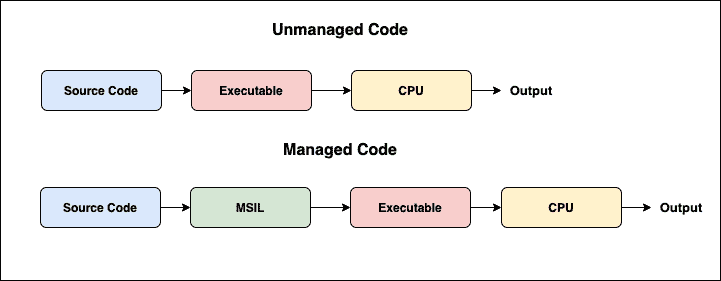

# 托管和非托管代码—主要区别

> 原文：<https://medium.com/codex/managed-and-unmanaged-code-key-differences-22fe9a7b3808?source=collection_archive---------10----------------------->

这是我们之前关于不安全代码的博客的延续。在这篇博客中，我们将了解 C#中托管代码和非托管代码的主要区别。非托管代码只不过是不安全的代码。

回想一下，在 C#中，代码通常是在。NET 框架。CLR 帮助运行代码，并提供各种服务来简化开发过程。由 CLR 控制的所有代码都被称为托管代码，而使用 unsafe 关键字编写的程序部分被称为非托管代码。这些都超出了 CLR 的控制范围。NET 框架。

**目录**

1.  C#中什么是托管代码？
2.  托管代码的执行
3.  托管代码的优势
4.  托管代码的缺点
5.  什么是 C#中的非托管代码？
6.  非托管代码的执行
7.  非托管代码的优势
8.  非托管代码的缺点
9.  托管代码和非托管代码之间的区别
10.  结论

# C#中什么是托管代码？

正如我们在开始时所看到的，使用。NET framework 被称为托管代码。换句话说，它是在 C#中直接执行的代码。托管代码的运行时环境为程序员提供了各种服务。提供的服务有异常处理、垃圾收集、类型检查等。上述服务自动提供给程序员。除了上述服务，运行时环境还提供内存分配、对象处理、对象创建等。

# 托管代码的执行

托管代码总是由 CLR 编译成一种称为 MSIL 的中间语言，然后创建代码的可执行文件。当程序员运行可执行程序时，源代码中的中间语言(MSIL)由名为“实时编译器”的编译器编译。在这里，整个过程是在运行时环境下进行的，因此运行时环境是程序工作背后的原因。

# 托管代码的优势

*   代码的安全性得到了提高，因为我们使用了运行时环境，它通过检查内存缓冲区来防止缓冲区溢出。
*   垃圾收集是自动实现的。
*   还提供了动态类型检查或运行时类型检查
*   运行时环境也做引用检查。它检查对象的参考点是否有效，还检查复制对象是否存在。

# 托管代码的缺点

*   不能直接分配内存。
*   在托管代码中，无法获得对 CPU 体系结构的低级访问。

# 什么是 C#中的非托管代码？

非托管代码也称为不安全代码。非托管代码依赖于计算机体系结构，因为它面向处理器体系结构。在 C#中，管理堆栈、分配和释放内存等活动。由 CLR 负责，因此这些活动超出了程序员的权限。程序员告诉编译器，当他/她使用关键字“不安全”时，代码的管理将由他/她来完成。然而，如果程序员编写了糟糕的代码，可能会发生像内存泄漏这样的问题。

# 非托管代码的执行

为了执行非托管代码，C#中使用包装类。在 C#中，非托管代码由操作系统直接执行。通常，非托管或不安全代码的可执行文件以二进制映像的形式加载到内存中。代码的执行步骤可以在上图中看到。

# 非托管代码的优势

*   不安全代码增加了程序的稳定性和性能
*   提供了对编程器的低级访问
*   不安全代码提供了与内存交互的媒介

# 非托管代码的缺点

*   不为应用程序提供安全性
*   程序员必须进行异常处理
*   没有垃圾收集的自动实现
*   使用不安全的代码可能会导致在绕过类型检查时出现错误。

# 托管代码和非托管代码的区别？

*   托管代码是由。而非托管或不安全代码由操作系统执行。
*   托管代码为代码提供安全性，而未损坏的代码会产生安全威胁。
*   在不安全或非托管代码中，unsafe 修饰符用于编写代码块，而在不安全代码块之外编写的任何其他代码都是托管代码。
*   内存缓冲区溢出问题不会发生在托管代码中，因为它由运行时环境处理，但这些问题会发生在非托管代码中。
*   运行时服务在托管代码中提供，而在非托管代码中不提供。
*   源代码首先转换为中间语言，然后在托管代码中转换为本机语言，而在非托管代码中则直接转换为本机语言。
*   非托管代码提供低级访问，而托管代码不提供这种访问。
*   在不安全或非托管代码中，unsafe 修饰符用于编写代码块，而在不安全代码块之外编写的任何其他代码都是托管代码。

# 结论

本文让您深入了解 C#中的托管和非托管代码。本文演示了每种代码的执行流程，这有助于您理解在开发任何类型的应用程序时如何正确使用这些代码。

*原载于*[*https://www . partech . nl*](https://www.partech.nl/nl/publicaties/2021/03/managed-and-unmanaged-code---key-differences)*。*