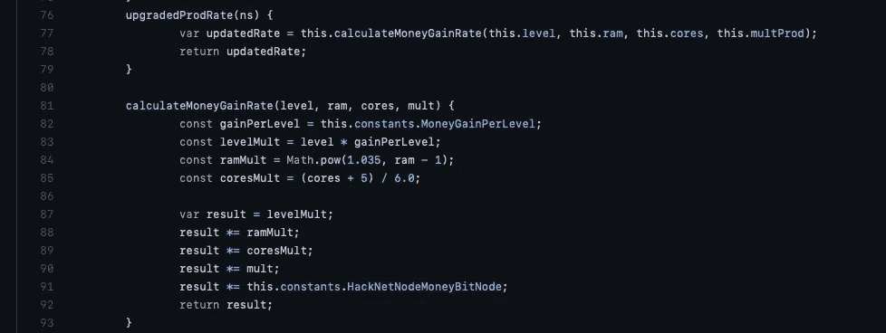
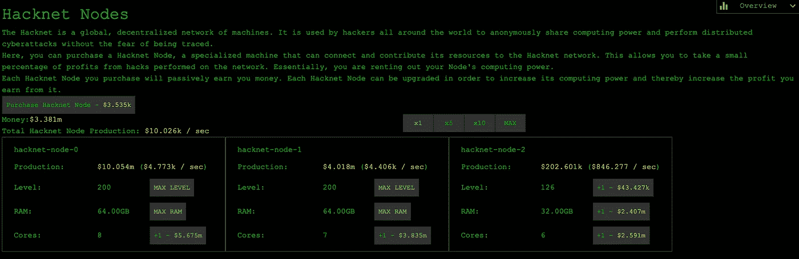

# 在 Bitburner 中管理黑客网络节点

> 原文：<https://medium.com/codex/managing-hacknet-nodes-in-bitburner-66ef1d796c8?source=collection_archive---------4----------------------->

对于那些不知道的人来说, [bitburner](https://www.pcgamer.com/uk/bitburner-is-an-idle-game-about-hacking-that-teaches-real-javascript/) 是一个半空闲的游戏，它鼓励脚本来完成事情。我说的半空闲——它当然符合空闲游戏的标准，因为它显然是离线运行的，当你第二天玩的时候就会恢复。然而，编程方面是相当引人入胜的，并使它比大多数更少空闲。

由[尼基塔·班达鲁克](https://unsplash.com/@n3nikita?utm_source=unsplash&utm_medium=referral&utm_content=creditCopyText)在 [Unsplash](https://unsplash.com/s/photos/programming-game?utm_source=unsplash&utm_medium=referral&utm_content=creditCopyText) 上拍摄的照片

最好的一点是，它包括甚至鼓励一个人的编程技能。尽管我是一名 web 开发人员，但我的大部分精力倾向于后端、API 和 DevOps。我最忽视的技术之一是 javascript。

这是我的脚本的快速演练，以控制游戏的黑客方面。黑客网是一系列通过出租筹集资金的虚拟计算机，它们变得越强大，租金就越高。最初，我只是将每个节点升级到最大，然后继续前进。然而，经过一番小小的分析，我意识到这可能不是最合适的策略。

基本上，有了 hacknet，你可以做 4 件事，你可以升级三个组件(级别、Ram 或内核数量)，或者购买一个新节点。做这些事情的成本和回报会随着购买量的增加而变化。关键是确定在回报减少之前要走多远。网上有许多建议的策略，但是脚本的妙处在于你可以得到更好的策略。

决定战略的第一步是确定一个人在看什么指标。对于黑客网络模拟，我建议应该是回报时间。也就是说，如果我做了 X 件事，花费了 Y，提高了 Z 的产量，需要多少秒才能收回成本？

一旦决定了策略，就可以编码选择最佳节点上的最佳动作来应用它。获取一些必要的信息有点棘手——您基本上有两种选择。每次重启时购买公式 API，或者参考源代码。例如，hacknet 公式都在同一个文件中——包括[这个易于转录的函数，用于计算具有给定值](https://github.com/danielyxie/bitburner/blob/master/src/Hacknet/formulas/HacknetNodes.ts#L4)的服务器的生产率。在上面的第 81–92 行中，第二个函数来自原始源代码，第一个函数最初指向 formulas API 方法。

[M](https://gist.github.com/grimley517/c2d531976db057cede4ac8e367418971) y 全部原码[通过此要诀](https://gist.github.com/grimley517/c2d531976db057cede4ac8e367418971)可得。

重启后，我直接运行了这个程序，看看它单独运行的效果如何。里程可能会有所不同，但一个小时后，这是结果；

重启后 1 小时

值得注意的是——在这个过程的开始，所有三个属性似乎都得到了相当程度的升级，第二个节点正好出现在级别最大值之后。在下一个节点出现后，ram 就达到最大值。核心似乎达到了一个极限。脚本中有一个条件，规定每个行为都应该能够在 12 小时内收回成本。所以让我们看看它的结局。

对那些感兴趣的人来说，我在公司制的第一层。所以这可能会让事情慢下来一点。尽管来自公司的额外资金也加快了事情的进展。