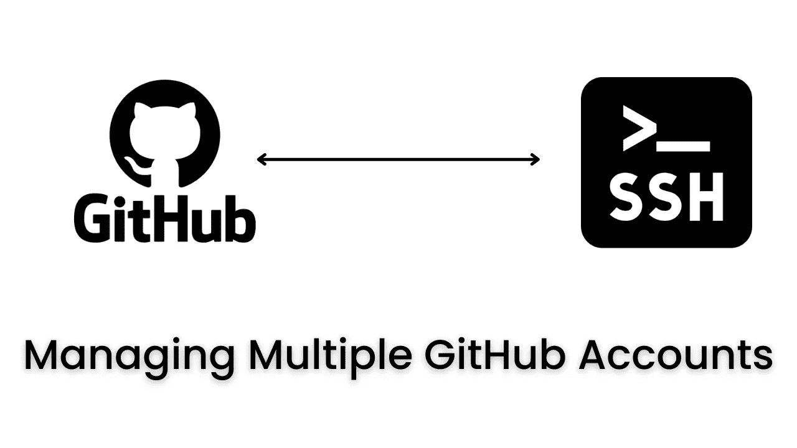
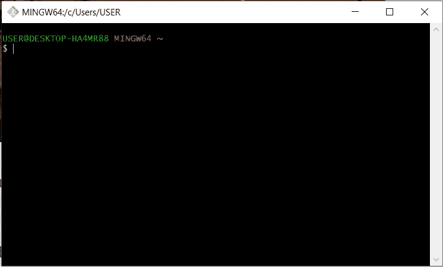
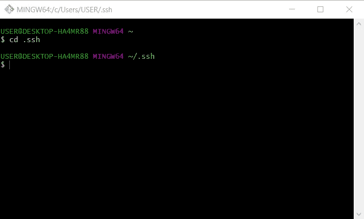
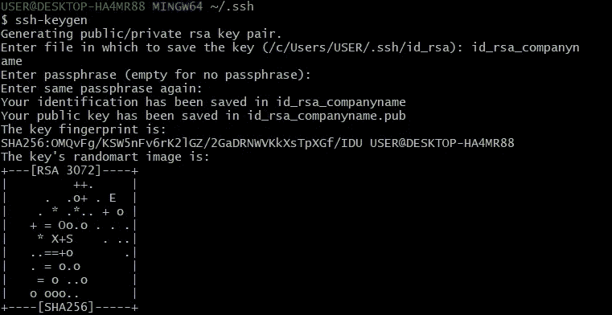
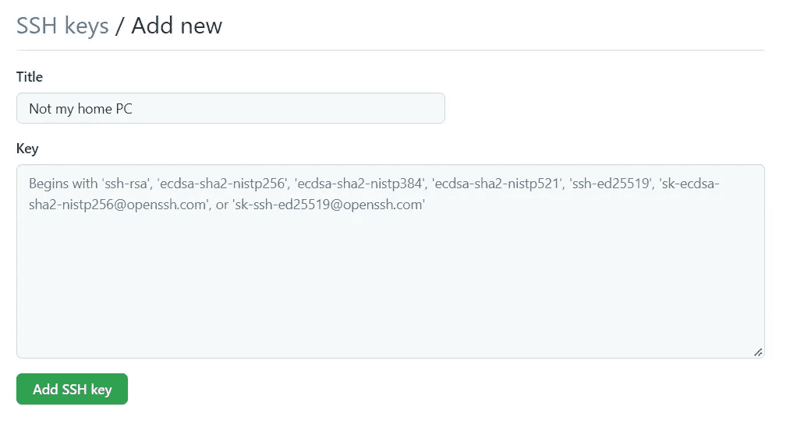

# 管理个人和工作 GitHub 账户

> 原文：<https://medium.com/codex/managing-personal-and-work-github-accounts-13b89ce7a9b4?source=collection_archive---------12----------------------->



最近，我面临着管理多个 GitHub 账户的困境，因为我必须用我的工作邮箱开一个新账户，显然是为了工作


然后，我不得不想办法同时使用个人和工作电子邮件。

由于我已经习惯了通过 HTTPS 连接到我的个人 GitHub 帐户，我决定继续使用这种方法来使用我的帐户，并设置 SSH 来使用我的工作帐户

(使用我的工作帐户😂😂)

让我向您展示我是如何设置 SSH 的

首先打开 Git Bash，我假设您已经设置好了。



默认情况下，这将在您的根目录中打开。接下来，你进入”。ssh "目录

```
*cd .ssh*
```



接下来，通过运行以下命令创建一个 ssh 密钥:

```
*ssh-keygen*
```

然后，您可以将其保存为“id_rsa_companyname ”,并且可以将密码留空



接下来，在同一个目录中创建一个指向 SSH 密钥的配置文件

```
*touch config**notepad config*
```

现在，您在文件中键入以下内容

```
*#companyname
Host github.com-companyname
 HostName github.com
 IdentityFile ~/.ssh/id_rsa_companyname.pub*
```

现在我们都设置好了，接下来要做的是复制我们的 SSH 密钥并在 GitHub 上更新它。我们可以通过运行以下命令快速获得 SSH 密钥

```
*cat id_rsa_companyname*
```

完成后，创建一个与您的 GitHub 帐户相关联的新 SSH 密钥

> ***设置> SSH 和 GPG 键***



粘贴你的 SSH 密钥，然后你就大功告成了😎

现在，我们如何使用 SSH 来拉/推我们在 GitHub 上的存储库🤷‍♀️

好吧，我希望你能明白。再见，✌

开玩笑，我抓到你了😁

您进入 GitHub 存储库并复制 SSH URL。而不是使用:

```
git remote add origin git@github.com:username/repo.git
```

您可以用您在配置文件中设置的内容来更新主机名。在我的例子“公司名称”中，这将为我们提供

```
git remote add origin git@github.com-companyname:username/repo.git
```

仅此而已。只要记住总是更新主机名

程序员们，编程快乐。干杯✌

