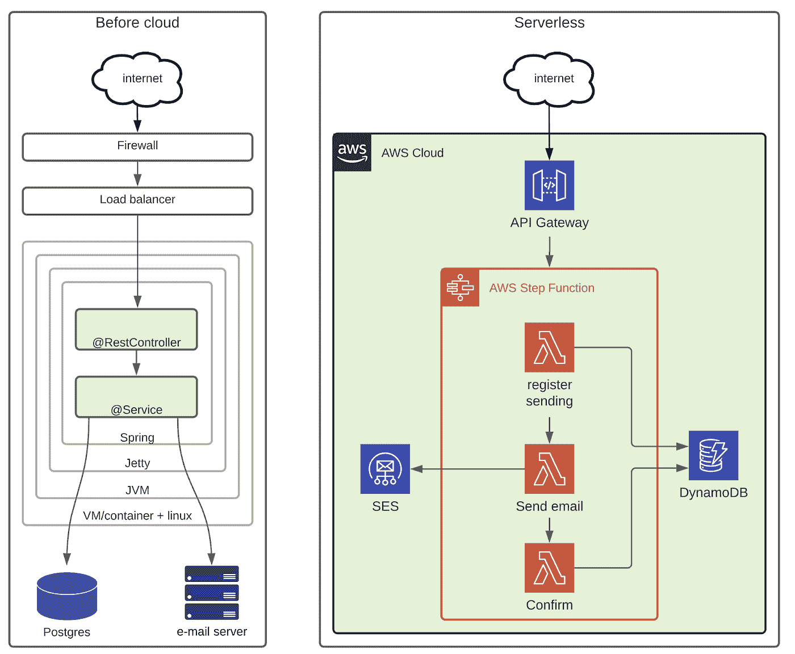
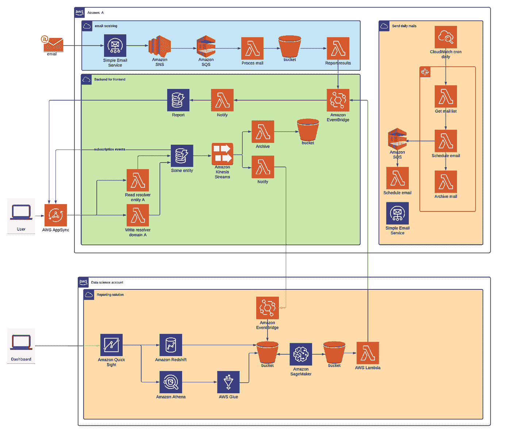

# 管理无服务器意大利面

> 原文：<https://medium.com/codex/managing-serverless-spaghetti-c2fb1a7db73e?source=collection_archive---------2----------------------->

> 我们的业务规则正在融入基础设施之中！

在这篇博客中，我想谈谈“无服务器意大利面”。在阅读了 AWS 的发布版[关于步进功能的文档](https://aws.amazon.com/blogs/aws/now-aws-step-functions-supports-200-aws-services-to-enable-easier-workflow-automation/)后，这个术语悄悄进入了我的脑海。这次更新宣布了 AWS Step 函数将 200 个 AWS 服务缝合在一起的能力。虽然从技术角度来看，这些功能很棒，但它也实现了“*无服务器*S*paghetti”。这篇博客将展示我们是如何吃意大利面条的，并给出一些保持健康的建议。这样你就不会像哈瓦那的普通住宅入口一样了。*

“意大利面条代码”可能是我学到的关于软件代码质量的第一句话。这绝对不是最后一次。它反映了源代码的一种不希望的状态，在这种状态下，跟踪软件的控制结构或执行异常困难。简单地说，跟踪程序的执行变得很困难。这就是为什么当我回顾一些现代的无服务器构建选项时，这份参考资料感觉很匹配。

## **不断发展的无服务器环境**

今年早些时候，我写了一篇名为“2020 年代的软件开发”的博客。在这篇文章中，我强调了开发现代后端架构的变化，以无服务器作为最新的范例。无服务器是使用高度抽象构建解决方案的行为。在给定应用程序的“早期”,函数或 lambda 是执行运行时的引擎。开发人员编写在预先创建的运行时中运行的代码。这些函数构成了应用程序中的“业务规则”。

然而，无服务器不仅仅是 Lambda！随着大量漂亮服务的加入，无服务器环境已经成为创建复杂应用程序的功能丰富的环境。

# 通过向上移动堆栈来创建无服务器意大利面

本着无服务器的精神，人们努力创造定位于“高栈”的解决方案。在堆栈中处于高位意味着最佳利用云提供的构建块。随着栈中的每一次上移，您要写入应用程序的一些代码会被连接到服务所取代。让我们想象一个例子。

**从容器转移到无服务器的例子**
在不久前，您构建的所有东西都包含在一个(或一些)可部署的。几乎所有的开发工作都包含在“应用程序”或服务中。一个例子是使用 Spring 框架在基于 Java / JVM 的运行时上构建的服务。让我们考虑一个服务，它接受一个请求，并发送一封电子邮件，该邮件被记录在数据库中。运行时包含抽象层，您可以在其上添加代码。基础设施代码可能只编写一次，不会经常更改。现在让我们看看这在无服务器环境下是如何工作的。来自公共互联网的相同请求可以由 AWS 的 API 网关服务处理。随后，为了创建一个类似于 Spring 事务边界的上下文，我们使用 Step 函数服务来协调我们的步骤。我们需要三个 lambda，第一个开始一个传奇模式，第二个通过 SES 服务发送电子邮件，第三/第四个结束传奇。因为云原生架构中的事情主要是异步的，所以我们需要来自客户端的第二个呼叫来确认传奇已经完成(或者我们可以使用回调)。在这个无服务器的例子中，基础设施代码至少构成了解决方案的一半。

让我们来看看一些不同之处:

*   在无服务器解决方案中，基础架构配置至少包括一半的工作。
*   程序员写的代码不再复杂。复杂性转移到云的配置(代码或手动)。
*   我们的业务规则现在更难定位。他们已经部分转向基础设施。我想意大利面就是从这里开始的。

这是一个很小的例子。我已经完成了小的单个团队，三/六个月的项目，这些项目产生了如下的图片。它是简化的，不包括大约 20 多个 IAM 策略/角色，以及许多小的配置细节。这实际上突出了我在本文中提出的主要问题。很难想象做出决定的地方。lambdas 是我们代码的主要来源，但它们不再是我们业务规则的唯一来源。它可以是主题订阅上的*过滤规则*，事件桥规则，AppSync 的自定义解析器。所有合法的有条件执行的地方。但在设计中几乎看不到，在调试时也越来越难发现。几个月或几年后，这些景观会像意大利面条一样纠缠在一起。SNS、Kinesis、S3 存储桶和 DynamoDB 流等消息中间件支持扇出模式，这种模式会迅速将您的平台变成一团乱麻。

十年前，当你参加一个关于软件工程的会议时，你会看到停止将业务逻辑放入我们的数据库的建议。几年后，我们信任的包含大量规则的 ESB 见证了同样的信念。人们现在喜欢像卡夫卡那样不那么固执己见的公共汽车。数据库或 ESB 与我绘制的无服务器平台之间的区别在于，后者的构建和操作可以在软件开发人员的控制之下。前者通常是一个集中的组件，由一个集中的专业团队维护。因此，分布式决策的位置已经从集中式转移到分布式，但事实仍然是，我们再次将我们的业务逻辑分解到我们的无服务器基础结构中。它甚至可能更难掌握，因为它现在分散在广泛的服务中。

# 防止无服务器意大利面

所以让我们看看我们能做些什么。因为让我们明确一件事。这种架构模式是一个巨大的转变！因此，为了获得最大的好处，最少的缺点，我们需要为此进行优化。

## **使用阶跃函数*选择*明确做出决策**

Step 函数正在成为 AWS 无服务器环境中的一等公民。他们的建模原语之一是[选择](https://docs.aws.amazon.com/step-functions/latest/dg/amazon-states-language-choice-state.html)。如果您使用选择对流程进行建模，您可以立即在平台中可视化您的决策位置。

## 以某种方式标准化您放置业务逻辑的位置

为了最大化业务逻辑的可见性，您可以通过命名和语义来标准化，或者通过创建某种库或框架来以可见和通用的方式捕获这些部分。这样，您就可以立即看到您的平台上做出决策的地方。如果您用正确的语义标记您的'*步进函数选择*或您的 *Eventbridge 规则*，您仍然能够获得无服务器的所有好处，而不会造成混乱。

## **优化配置代码为应用级代码**

将云配置作为代码在无服务器环境中很常见。因为基本上不可能手工配置几十个小部件来使它工作。让我们回到大约五年前。脚本化基础架构看起来，嗯…剧本。使用定制 bash 或 python 脚本的 CLI 指令统治着许多组织。后来的地形和云系标准化符号。然而，基础设施代码和应用程序代码仍然是天壤之别。有了像 CDK 这样的现代基础设施即代码工具，这种差距几乎消失了。我们可以使用适当的编程语言来构建基础设施，并且——一旦设置正确——从 Lambda 到基础设施代码几乎可以无缝过渡。开发人员现在需要考虑他们的基础设施代码和他们的应用程序代码一样有价值。测试、林挺、度量和过程必须到位，类似于您处理应用程序代码的方式。

## **培训，了解无服务器意大利面**

了解并承认这种新架构已经改变了我们构建、调试和监控的方式，已经帮了我们很多。

## **您的团队中有多面手或技能广泛的工程师**

在构建云时，许多组织都有一个团队专家负责云操作。有些强制团队使用 DevOps 组织。因此，一个服务/应用程序是由一个团队构建和维护的。这需要在一个团队中具备多种技能。然而，我认为这还不够！当您的业务规则分散在您的基础设施中时，您基本上希望一个工程师来处理您的堆栈的端到端流程。所以你希望你的工程师既要写 lambda 中的业务逻辑，也要写你的基础设施代码。

# 包装它

我们走吧！我希望能够提高一些关于如何在无服务器架构中应对不断变化的云环境的意识。当您采取适当的对策时，这是一个很好的架构范例！！！