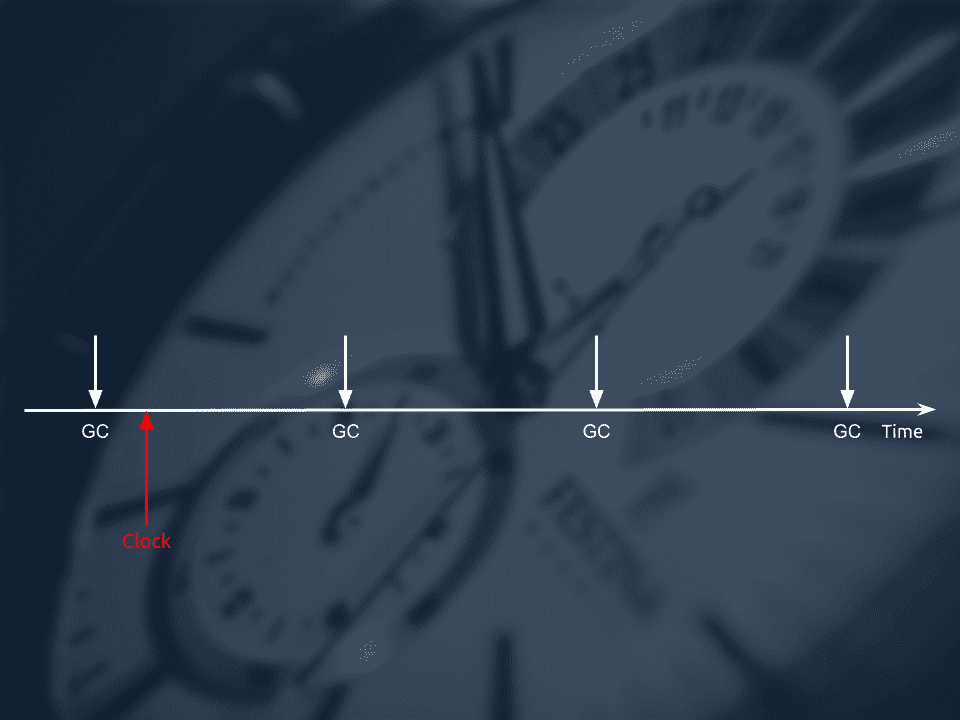
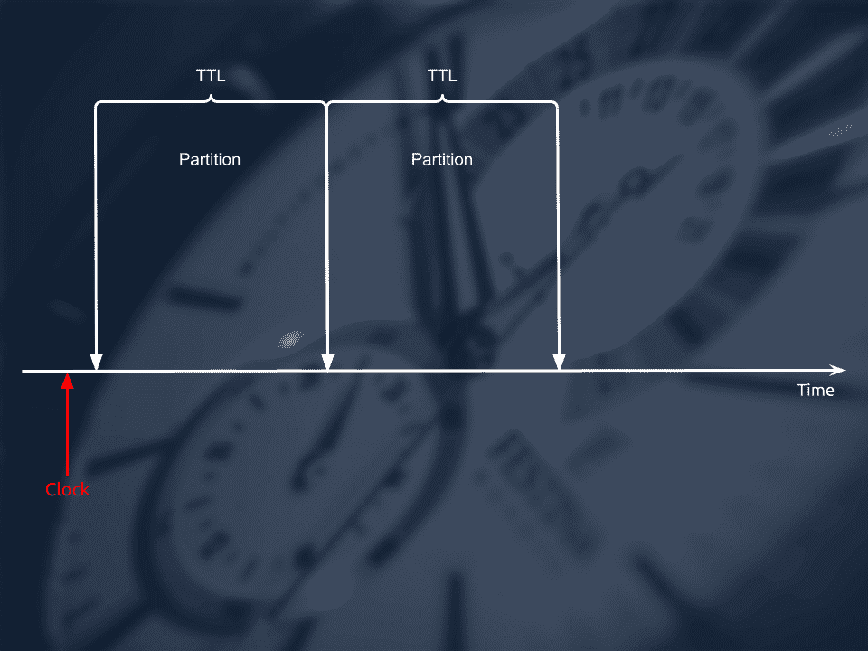

# 使用生存时间表管理数据生命周期

> 原文：<https://medium.com/codex/managing-your-data-lifecycle-with-time-to-live-tables-e06dd3cc45ad?source=collection_archive---------10----------------------->


作者:[孙晓光](https://github.com/sunxiaoguang)(知乎软件架构师，TiKV 项目维护人员)

创世:[黄然](https://github.com/ran-huang)；编辑:汤姆·万德

您的组织与日俱增；你的数据也是。更多的数据带来了更多的商机，但也带来了更高的存储成本。你想要一个更好的方法来管理成本吗？我们希望我们的开源数据库 TiDB 也是如此。

[TiDB](https://docs.pingcap.com/tidb/stable) 是一个为海量数据设计的分布式 SQL 数据库。我们的目标是以合理的成本支持大规模数据集。在 TiDB Hackathon 2020 上，我们朝着那个方向迈出了一大步。**我们引入了一个特性，** [**生存时间(TTL)表**](https://github.com/tidb-hackathon/t4) **，使 TiDB 能够根据数据的生命周期自动管理数据的生命周期。** TiDB 确保其资源的每一部分都被高价值的新鲜数据所消耗。

在本文中，**我将详细描述 TTL 表以及我们如何在 TiDB 中实现它。**此外，**我将分享一些如何在开源项目中使用 TTL 表的例子，包括 dimension reports、Kubernetes long term events storage、MQTT for IoT 等。**时间不等人，我们开始吧。

# 什么是 TTL 表？

TiDB 社区已经做出了许多努力来限制 TiDB 存储成本。例如，我们探索了分层管理数据存储的方法，这允许数据库将冷数据存储在更便宜的存储介质上。我们还希望通过增加数据 TiDB 存储的价值来降低成本。**在很多情况下，特定数据集的价值与其生命周期密切相关。**数据越旧，价值越低。为了帮助 TiDB 存储高价值数据，我们在 TiDB 中引入了 TTL。

TTL，即生存时间，是一种限制系统中数据生命周期的机制。经过指定时间后，数据将被删除。它广泛用于缓存和存储系统，如 Redis、RocksDB 和 MyRocks。

在 TiDB 中，TTL 被实现为 TTL 表。与上面的系统类似，**TiDB 中的 TTL 表可以自动管理写入表中数据的生命周期，无需人工干预。**数据到达生命周期的终点后，会自动过期，TiDB 会回收被占用的资源。这种机制将用户从繁琐的生命周期管理中解放出来，并使用更少的资源快速删除数据。

# 我们如何在 TiDB 中实现 TTL 表

考虑到 TiDB 的内部机制和使用复杂度，我们为数据表增加了两个配置项:生存时间(`TTL`)和生存粒度(`TTL_GRANULARITY`)。有了这两个参数，TTL 表可以管理您的数据生命周期。您可以为 TTL 表设置两种粒度:`row`和`partition`。

## 行粒度 TTL 表

TiDB 使用多版本并发控制(MVCC)来控制事务并发。当您更新一系列数据时，原始数据不会立即删除，而是与新数据保存在一起，并带有时间戳以区分版本。然后，一个周期性的[垃圾收集](https://docs.pingcap.com/tidb/stable/garbage-collection-overview) (GC)过程清除过时的数据。每当 TiKV 对行粒度 TTL 表进行 GC 时，它还会回收符合过期条件的数据行。



行粒度 TTL 表

当 TiDB 将 GC 任务分派给 TiKV 时，这些任务包括对应于 TTL 表及其 TTL 配置的键范围。基于 TTL 配置，TiKV 计算 TTL 密钥范围内的数据生命周期。如果 TiKV 找到在 MVCC 有效但超过 TTL 的数据，TiKV 会在 GC 过程中删除这些数据并释放存储空间。

值得注意的是，**目前大多数 TiDB 表都使用** [**非聚集索引**](https://docs.pingcap.com/tidb/stable/clustered-indexes) **。**如果主键索引或辅助索引与记录的删除进度不一致，则已经从表中删除的一组数据可能仍然在索引中可见。当使用任何索引时，这会导致查询失败。为了解决这个问题，我们将 TTL 表分成两个键范围:数据和索引。`The TTL for data = the TTL for index + the interval between the recent two rounds of GC`。这样，在至少一个 GC 周期内，所有数据的寿命都比索引长。

除了在 GC 期间删除过期数据之外，压缩过程也是回收过期数据的好时机。因为我们在 Hackathon 上的时间有限，我们只为 GC 实现了 TTL，但是我们计划进一步优化 TTL 的实现。

要在行粒度创建 TTL 表，请使用以下语句:

```
CREATE TABLE ttl_table {
    id BIGINT PRIMARY KEY AUTO_RANDOM,
    author VARCHAR(255),
    post VARCHAR(255)
} TTL='1h', TTL_GRANULARITY='ROW';
```

您还可以使用`ALTER TABLE`将现有的表切换到行粒度的 TTL 表。

## 分区粒度 TTL 表

删除大量数据会消耗很多资源，所以数据库通常采用定期 GC 或压缩来节约资源。您可能想知道为什么不使用`TRUNCATE`更有效地删除过期数据？为了解决这个问题，我们将 TTL 表实现为一个特殊的分区表，它对用户是不可见的。

若要创建分区粒度 TTL 表，请运行以下语句:

```
CREATE TABLE ttl_table {
    id BIGINT PRIMARY KEY AUTO_RANDOM,
    author VARCHAR(255),
    post VARCHAR(255)
} TTL='1d', TTL_GRANULARITY='PARTITION';
```

通过使用滑动窗口在分区之间切换，我们可以按时间顺序将粗粒度数据分配给多个物理分区。循环创建一个新分区，同时最早的分区被截断和删除。最旧分区中的所有过期数据都会以较低的成本被快速删除。在这个特殊的删除操作中，RocksDB 直接删除被删除逻辑数据的物理文件。然后，几乎零成本地释放存储空间。



分区粒度 TTL 表

目前，TiDB 不支持将普通表切换到分区表，也不支持将一个分区表切换到另一个分区表。因此，不能将现有的表更改为分区粒度的 TTL 表。

# 在哪里使用 TiDB 的 TTL 表

现在你知道了 TTL 表是如何工作的，你能在哪里应用它？我们修改了一些开源项目，以便他们可以使用 TiDB 作为存储介质，并将他们的数据存储在 TTL 表中。在这些系统中，TiDB 可以自动维护数据生命周期，而无需系统感知。

## 阿帕奇麒麟

维度报告广泛用于大数据场景，为决策提供高价值、及时的数据。Apache Kylin 以多维在线分析处理(MOLAP)方式处理原始数据，以提供数据分析，如切片、切片、汇总和钻取。

在 Apache Kylin 中，报告中使用的维度和基数越多，数据量就越大。在许多情况下，数据量远远超过了一个独立数据库所能容纳的量。久而久之，用户不太可能对过时的数据进行实时分析。旧数据失去了与业务的相关性。通过有效地清理历史数据，可以减少不必要的资源消耗。

这就是 TTL 表的用武之地。**TTL 表管理维度报告数据的生命周期，并且通过 TiDB 的索引查询功能，简化了 Apache Kylin 的实现。通过统一报告数据和元数据的管理，TiDB 进一步降低了管理 Apache Kylin 的成本。**

## 耶格追踪

[Jaeger Tracing](https://github.com/jaegertracing/jaeger) 是一个分布式追踪平台，支持 OpenTracing 标准，为 OpenTelemetry 提供实验支持。Jaeger 可以使用 Cassandra 和 Elasticsearch 作为存储后端，还提供了一个 gRPC 插件，用于与其他存储系统集成。

我们使用插件在 TiDB 上运行 Jaeger。 **TiDB 为 Jaeger 带来了 TiKV 的高吞吐量和可扩展性。它自动管理历史跟踪数据的生命周期，降低系统运营成本。**

## Kubernetes 事件

Kubernetes `event`对象记录集群中发生的所有事件。这些事件帮助您排除异常行为并审核群集操作。当 Kubernetes 集群很大并且变化频繁时，您可以选择将集群事件存储在一个单独的 etcd 集群中。但是，当 Kubernetes 频繁更新时，集群会生成大量事件。由于存储空间有限，etcd 集群无法记录所有的 Kubernetes 事件，只能记录最近发生的事件。

为了解决这个问题，**您可以将 Kubernetes 事件存储在 TiDB 中，这样可以在更长的时间内存储更多的数据。**此外， **TiDB 的二级索引使您能够快速灵活地查询存储的事件。**在 TTL 表的帮助下，TiDB 中存储的历史事件自动过期，节省了你的存储空间。

## MQTT 服务质量

消息队列遥测传输(MQTT)是用于物联网(IoT)消息传递的轻量级发布/订阅协议。由于移动和物联网设备可能具有不稳定的网络连接，因此系统需要保存消息，以便即使客户端长时间离线，消息传递仍能达到服务质量(QoS)级别 1 或 2。

**具有内置数据过期机制的存储后端非常适合需要可靠和及时交付的应用**，例如突发新闻、黄色警报和天气预报。

在黑客马拉松期间，我们采用了一个流行的 MQTT 代理来支持 MySQL 作为后端存储。由于 TiDB 兼容 MySQL， **TiDB 的 TTL 表可以根据用户设置的保留周期**自动删除过期的数据。

# 摘要

在一个万物互联的时代，数据量正在快速增长。如何用更少的成本支持更多的数据是所有数据库管理系统都试图回答的问题。我们对这个问题的回答是 TTL 表。

对于 TiDB 来说，这个问题的核心是如何平衡 TiDB 的成本和它所承载的数据价值。数据越相关越新鲜，TiDB 为你的企业创造的价值就越多。毕竟时间不等人，不如给更有价值的数据腾出空间。

*原载于 2021 年 6 月 10 日*[*【www.pingcap.com】*](https://pingcap.com/blog/managing-you-data-lifecycle-with-time-to-live-tables)