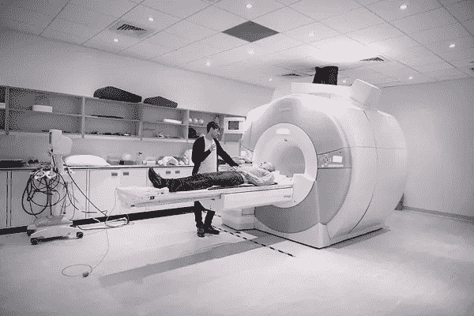

# 遗传思维/记忆和连接组学/基因组学人工智能

> 原文：<https://medium.com/codex/map-the-brain-or-genome-thought-memory-bear-sentience-codex-march-26-2022-6172bc6c6637?source=collection_archive---------12----------------------->

功能磁共振成像通过托马斯·安格斯 [ICL](https://www.imperial.ac.uk/communications/photography/consent-and-permissions/)

如果一个活细胞知道在一个环境中该做什么并去做，或者当它不能做时进行调整，那么这个细胞中就有某种东西扮演着一种思想形式的角色[作者或表达]，从记忆中浮现[机制来源]。

虽然复制可以说是他们的天性，但是这种协调与一种通过思考正确的时刻、地点或位置来做出决策的形式是一致的。

什么代表了活细胞中的一种思想形式，以及记忆？

细胞有一个细胞核，那里有它们的遗传物质，那么思想还可能来自哪里呢？从[思想/记忆](/mlearning-ai/ml-neuroscience-genetic-memory-thoughts-active-passive-5f0c55d08e62)的角度来看很重要的一个原因是因为对身体造成伤害的外来细胞的数量。如果他们可以忘记该做什么，或者失去拥有一种思想形式的能力，那么可能更容易对抗更多的疾病。

医学科学的进步使某些细胞的某些抑制成为可能，然而，思想可能来自哪里的特定点，以及一种形式的记忆存储在哪里，为基因组学带来了新的希望。

记忆为基因提供一致的菜单。基因有一个类似记忆的操作方面。

绘制大脑地图会带来新的信息，但是寻找的最重要的途径是思想或思想的一种形式。

思想在大脑中是如何传输的？[它去哪里](/mlearning-ai/brain-robotics-neurons-thoughts-e62dc05931dd)？为什么？它激活了什么？它的类型、长度和强度是什么？思想的目的地决定了什么——用什么去感受？

感觉是整合的并不新鲜，但是安全地从理论上证明它们与思想是整合的是重要的一步。它不一定是关于感官、感觉或反应，它是被感觉到的东西的思想等价物，然后它们去哪里给予感觉和反应。

没有思想去情感所在的地方，情感就不会被感觉到。从感官转换而来的思想可以到达那里。那些来自记忆，或者说内部的，也可以。

大脑中思维遵循的规则对神经元来说更适用，因为神经元的解剖学和生理学已经广为人知。

思想对于大脑的意义不同于神经成像所显示的。思想的形式是多种多样的，但是思想是被传递到大脑皮层、杏仁核等等的感觉或信号。

了解思想传输将如何改变心理健康，老年病的治疗方法，以及人工智能中情感思想的数据模拟。