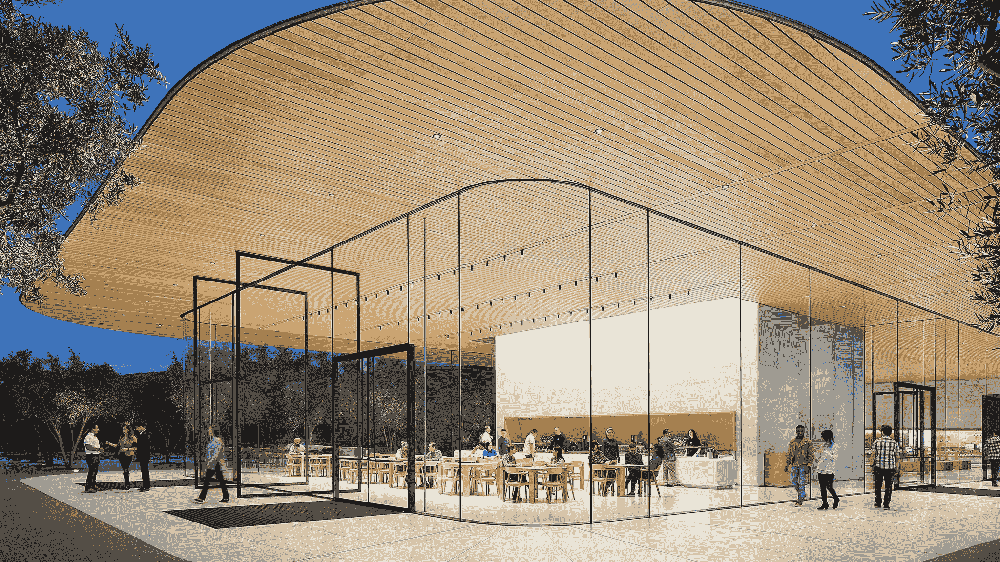
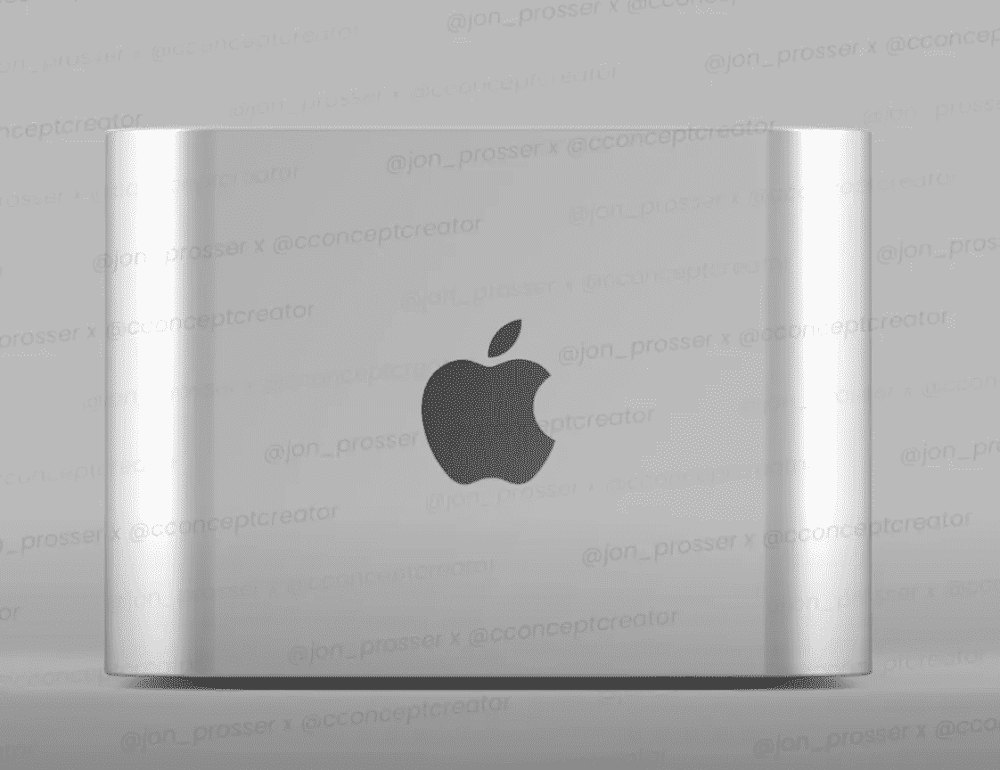
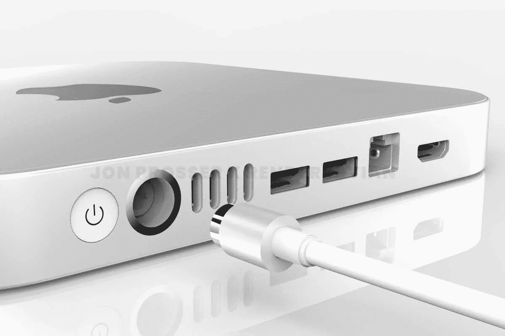
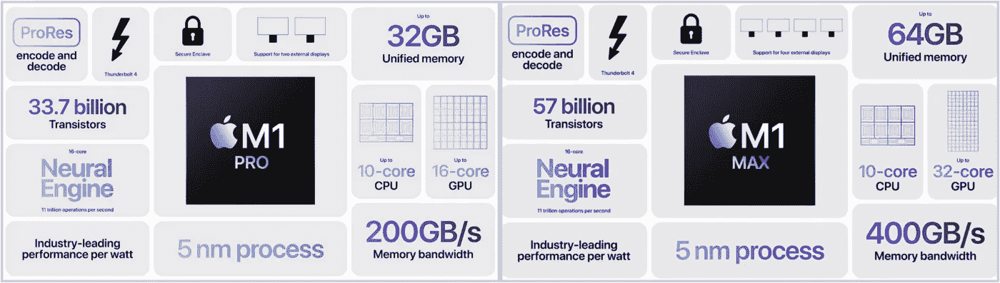
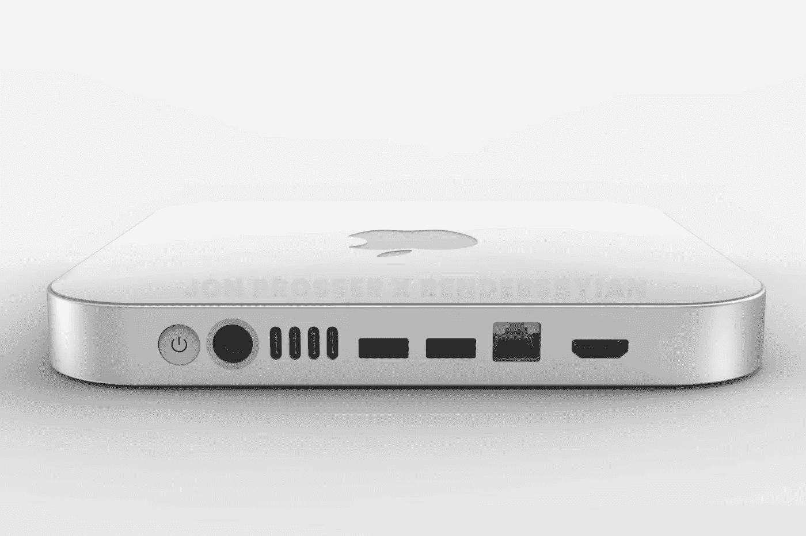

# Mac Mini 进行曲

> 原文：<https://medium.com/codex/march-of-the-mac-mini-9fd7d6cbbfee?source=collection_archive---------2----------------------->

## 这台神奇的 Mac 可能是一个梦想

今年有这么多值得期待的事情，至少如果谣言和泄密者是可信的，那么到 2022 年底，我们应该会有大量新的 MAC 电脑。可能比我们知道的要多得多。那么，为什么新款 Mac mini 的问世会让我如此感兴趣呢？

## 我们得到了什么承诺？

首先，不要对即将到来的三月事件过分宣传。虽然还没有得到苹果公司的证实，但是看起来很有可能，在 3 月 8 日，我们将迎来今年的第一次活动。但是…坦率地说，看来我们会得到很少。一部 iPhone SE，看起来像一部旧 iPhone，但有 5G(耶！！)，一款 iPad Air，还可能为 iPhone 系列推出一系列新的春夏颜色。

预计今年将有大量 Mac 电脑发布。苹果从英特尔到他们的硅芯片的两年过渡期即将结束，我们还没有看到 Mac Pro 或 iMac 27 英寸的任何新芯片。所以，我们确定他们会来。此外，由于苹果已经在欧亚数据库中注册了三款新的 MAC 电脑，我们知道一些事情正在酝酿之中。如果你想成为超级极客，注册的 Mac 是 A2615，A2686 和 A2681。我知道——令人兴奋，对吧？他们注册了两台 Mac 台式机和一台 Mac 笔记本电脑。现在，虽然我们可能不会在春季发布会上发布所有这些版本，但可能会发布两个更简单的更新。我的猜测是，笔记本电脑将是“预算”的 14 英寸 MacBook Pro，仍然有 Touch Bar，更少的端口和新的 M2 芯片，台式机可能是 Mac Mini 的两个变体。我们可能只会看到一台 M1 Mac Mini Max 和一台 Mac Mini M2。这将有一定的意义，然后给我们两个高端*和*消费级迷你。此外，别忘了，发布一些新的 Mac Minis 也很有意义，因为苹果今年也将在我们身上发布显示器。价格可能在 999-4999 之间，提供的尺寸可能是 24 英寸、27 英寸和 32 英寸，最后一个取代了当前的 Pro XDR 型号。还有，你需要 Mac Mini 做什么？没错——一台显示器。他们可以在这里清理，你知道！

 [## iOS 15.4——你激动吗？

### 目前，仅处于测试阶段，但很快就会出现在你身边的 iOs 设备上！

medium.com](/codex/ios-15-4-are-you-excited-886be765138c) 

## 为什么感兴趣？

我一直是迷你车的崇拜者。它们总是以惊人的性能表现出巨大的性价比。设计是华丽的，形状因素意味着他们可以适合几乎任何地方。去年，它被赋予了 M1 芯片，它们迅速下架，受到了使用它们的每个人的好评。我女儿的男朋友是一名高端音频和福利编辑，在一级防范禁闭期间每天都用一个，对它的评价再高也不过分。而他的也只有 8 GB 的基础版！如果这些庞然大物有 M1·马克斯和 M2 在里面，为它们提供动力，想象一下它们所代表的价值。这就是我所期待或希望的。

## 设计

在我看来，它一直是一台简单而漂亮的机器。对于一个小盒子来说，除了把它变得更小之外，没有什么可以让它变得更现代的了！预计它们的高度会降低，使它们更薄，只有 25 毫米左右。美学也可能发生变化，铝制设计让位于有机玻璃设计，使其看起来几乎像 iPhone。预计底部也会有一个小变化，无处不在的圆形底座让位于两条橡胶横条，以便将其固定在桌子上。

 [## 我的 Mac 及其邮件

### 尽管竞争激烈，我仍然热爱原生应用

medium.com](/codex/my-mac-and-its-mail-9ca6b02f762e) 

## 薯片在里面

显然，这是机器的心脏。这将是有意义的地方在迷你 M2，因为我想象这是一个直接的交换。但是，不要错误地认为 M2 的分配意味着它比 M1 Pro 或 Max 芯片更强大。它不是，相当令人困惑。苹果的芯片名称似乎搬起石头砸了自己的脚。M2 是一个更好的，新的和改进的版本，从去年的原始 M1。不过，可行的是，Mac Mini Pro 可以安装 M1 Max，使其多达 10 个 CPU 核心和 16 个 GPU 核心。

## 端口选择

你不会被遗忘，这是肯定的。迷你一直有一个奇妙的端口阵列。今年，我听说总共将有四个 Thunderbolt 4 端口，以及磁充电、两个 USB-A 端口(为了旧时代)，当然还有以太网和 HDMI。总而言之，我认为这是一个相当全面的选择。

## 我们什么时候能期待他们？

希望，希望，我们将在 3 月份的苹果春季发布会上看到 Mini。定价很难衡量。如果他们在里面植入 M2 芯片，那可能会直接取代我们现有的芯片。然而，如果他们也选择使用专业版，那就要付出一定的代价。不过，别忘了我是从那三个新注册号码开始的。苹果公司现在拥有两台台式机和一台笔记本电脑。这两款台式机很容易成为 Mac Mini M2 和 M1 Max。而且，如果我的梦想超难的话，还会同时发布一个显示。24 英寸显示器 1500 英镑，M1 Max 迷你显示器 1300 英镑。听起来像是我的梦想。

## 在你走之前

[**加入我的幕后邮件列表**](https://www.talkingtechandaudio.com)

**原载于 2022 年 2 月 16 日 https://www.talkingtechandaudio.com/blog******。****

****

****在 Spotify、Apple Podcasts 和 Google Podcasts too 上查看并订阅 my Minus-sixth podcast too**[https://podcast . Apple . com/GB/podcast/the-Minus-sixth-podcast/id 1608899642？i=1000550310853](https://podcasts.apple.com/gb/podcast/the-minus-sixteen-podcast/id1608899642?i=1000550310853)**