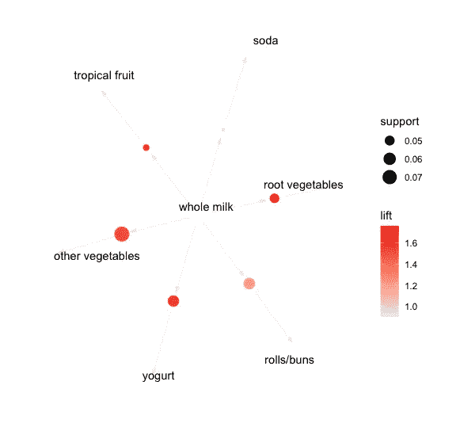

# 市场基础分析

> 原文：<https://medium.com/codex/market-bask-analysis-175aa2919981?source=collection_archive---------15----------------------->

## **使用 R Studio 进行市场基础分析(示例-杂货数据集)**

这是这样写的:“当一个用户购买了左边物品中的一个产品，这个用户很可能购买了右边的产品。一个更人性化的例子是:

三个**重要比例**可以理解:支持、信心和提升。我将在下面的要点中描述这些的重要性

1.  **支持:**我们的项目集在我们的数据集中出现的部分。支持告诉我们包含项目 A 和 b 的组合的交易的百分比。它有助于识别足够频繁以至于令人感兴趣的组合(例如，单独购买鱼或一起购买鱼和柠檬)。
2.  **置信度:**对于一个新的交易，左边的项目规则正确的概率。置信度告诉我们有项目 A 也有项目 b 的交易的百分比(例如，有多少有面包的交易也有黄油)。
3.  **提升:**规则的置信度超过预期置信度的比率。使用该模型获得的应答者数量与不使用该模型获得的应答者数量之比称为 lift。

*   **Lift (A = > B) = 1** 意味着在一组元素中没有相关性。
*   **Lift (A = > B) > 1** 表示在产品集合中的产品之间，即在项目 A 和 B 中，正相关更常见。
*   **Lift(A = > B) < 1** 表示不太可能因为项目集负相关而一起购买，即项目集 A 和 B 中的产品。

**基于规则的关联算法被视为两步法:**

*   **生成频繁元素:**查找所有具有支持度的公共项目集> =预先确定的最小支持度
*   **规则生成:**列出频繁项目集中的所有关联规则。要计算所有的规则，支持和信任。以不满足最小支持阈值和最小置信度的规则为例。


*分析所需的包*

**###A-rules & A-rulesViz 是购物篮分析的必备包:**

```
library(arules)
library(arulesViz)
library(datasets)
###Inbuilt Data available from the package datasets:data(“Groceries”)
View(“Groceries”)
itemFrequencyPlot(Groceries, topN=20, type= “absolute”)
class(“Groceries”)
rules <- apriori(Groceries, parameter = list(supp = 0.001, conf = 0.8))
rules <- sort(rules, by = “confidence”, decreasing = TRUE)
rules <- apriori(Groceries, parameter = list(supp = 0.001, conf = 0.8,maxlen=3))
subset.matrix <- is.subset(rules, rules)
subset.matrix[lower.tri(subset.matrix, diag=T)] <- NA
redundant = 1
rules.pruned <- rules[!redundant]
rules<-rules.pruned
rules<-apriori(data=Groceries, parameter=list(supp=0.001,conf = 0.08),
 appearance = list(default=”lhs”,rhs=”whole milk”),
 control = list(verbose=F))
rules<-sort(rules, decreasing=TRUE,by=”confidence”)
inspect(rules[1:5])
rules<-apriori(data=Groceries, parameter=list(supp=0.001,conf = 0.15,minlen=2),
 appearance = list(default=”rhs”,lhs=”whole milk”),
 control = list(verbose=F))
rules<-sort(rules, decreasing=TRUE,by=”confidence”)
inspect(rules[1:5])
plot(rules, method=”graph”)
```

