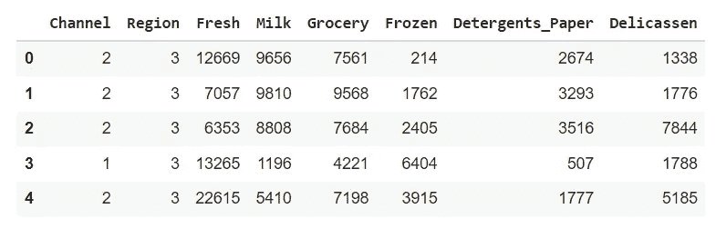
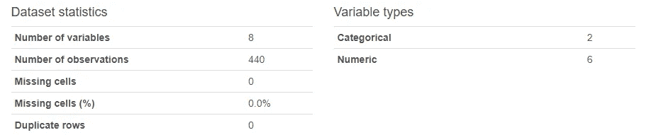
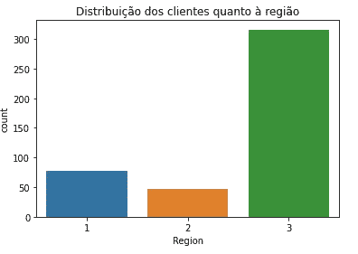
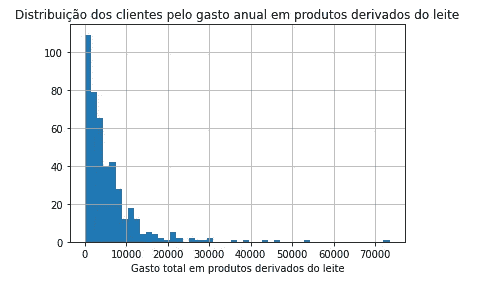
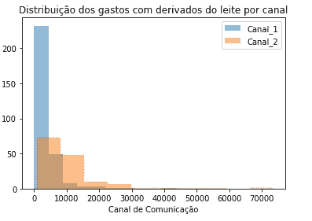
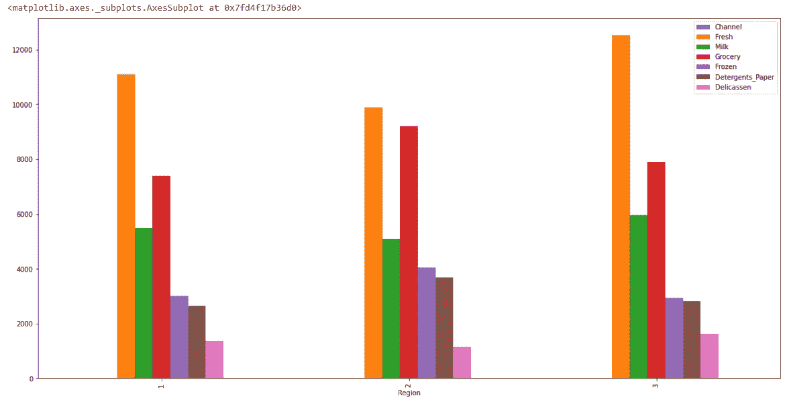
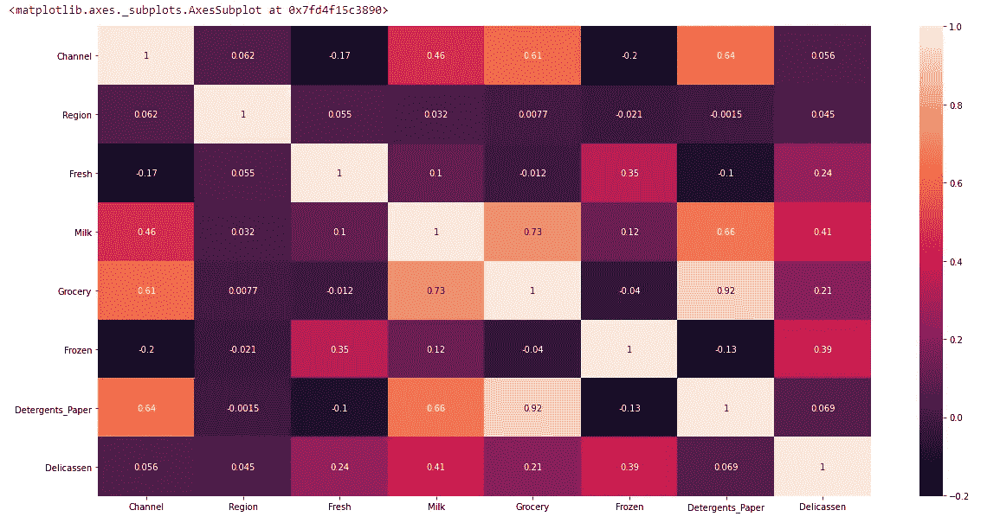
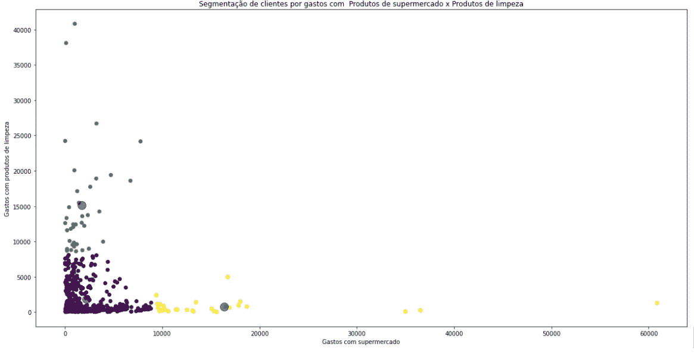

# 基于人工智能的批发市场营销策略

> 原文：<https://medium.com/codex/marketing-strategies-for-the-wholesale-market-using-ai-79dd75b72ce8?source=collection_archive---------25----------------------->

从事批发业务的公司非常清楚竞争困境:低价、多个竞争对手，有时还有不忠实的客户。因此，这些公司需要使用细分消费者市场、预测需求和创造竞争优势的营销策略脱颖而出。

使用人工智能和机器学习算法，我们可以创建模型来帮助识别最佳客户，并为营销渠道引导资源，此外还可以预测股票和销售高峰。营销对每个企业来说都至关重要，如果运用得当，它可以增强品牌实力，改善客户关系，并减少为维持业务运营而实施低价的必要性。

在本文中，我们将展示一个案例，分析一家位于葡萄牙的批发市场公司。
数据是真实的，可以从存储库访问:UCI 批发客户。

我们通过导入此分析所需的 Python 库开始了我们的项目，因为 Pandas、Numpy 和 Matplotlib 将在此过程中首先确保数据集导入和数据的初始探索性分析。

导入后，我们已经可以看看我们的数据是如何构造的了:

我们的变量反映了批发公司中一个简单但非常常见的数据库。我们来看看它的构成:

新鲜——每年花在新鲜产品上的总费用；
牛奶——每年花在乳制品上的总费用；
杂货——每年花费在超市产品上的总支出；
冷冻——每年在冷冻产品上的总支出；
洗涤剂 _ 纸张—每年花费在清洁产品上的总费用；
熟食——每年花费在熟食产品上的总费用；
渠道——消费渠道的类型，1。Horeca(酒店/餐厅/咖啡厅)，2。零售)
地区——消费者所在的地区，1。里斯本 2 分。波尔图，3。其他人

更详细地描述我们的数据集，我们意识到我们有 8 个变量(2 个分类变量和 6 个数字变量)和 440 个观察值。我们没有重复的行或丢失的值，所以我们可以继续我们的分析，而不必进行任何初始调整。

现在我们可以研究这些数据，看看一些客户关系和行为。让我们从客户的地区分布开始:

我们的客户集中在其他地方，虽然里斯本是主要的，如果我们认为这是一个独特的地区。
现在，让我们观察一下消费者在乳制品年支出中的分布情况:

我们从图表中注意到，大多数客户的年度支出都低于 10K，只有一些“异常值”客户，也就是说，很少有客户在这一年中支出了大笔金额。

当我们按渠道分析乳制品支出时(见下图)，我们注意到酒店、餐厅和咖啡馆部门的购买量很大，但价值较低。零售部门代表较小的数量和更昂贵的采购。

接下来，让我们绘制一张图表，显示按地区划分的所有变量，并了解我们客户的年度购买行为:

我们从图表中注意到，生鲜(fresh)和超市(杂货)产品在这三个地区销售良好。我们可以利用这些信息来确定需求，甚至开展一项活动来利用每个地区销量最少的产品。

但是，变量之间是否存在其他相关性，从而导致更准确的见解？让我们用一张热图来看看并理解这些相关性:

嗯……现在有趣的模式开始出现供分析。请注意，Detergents_Paper 变量与 Grocecy 变量的相关性接近 1 (0.92)，表明清洁和卫生产品的购买与普通超市产品的购买之间存在密切关系。

利用其他变量，如超市产品(杂货)和清洁产品(洗涤剂 _ 纸)，我们可以创建一个人工智能模型(机器学习)，对我们的消费者进行细分，并允许为这些客户推出个性化的营销活动。为了创建此模型，我们使用了 KMeans 算法，分割结果显示在下面的“散点图”中:

我们的客户被细分为三个不同的群体，通过这些群体，我们可以将我们的营销行动引导到高容量和低购买价值、低容量和高购买力的客户或购买特定产品的客户。

我希望这份分析为你提供了查看数据的思路，并为你的营销和目标活动寻求有力的见解。

回头见！

莱昂纳多·诺盖拉
数据科学家&Code 4 业务发展总监基德兹
nogueira@internetmedia.com