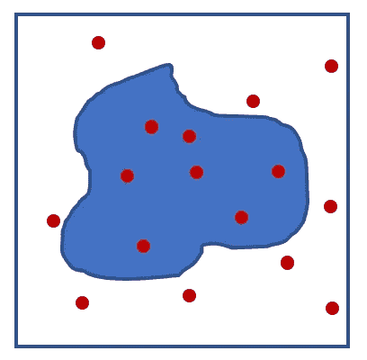
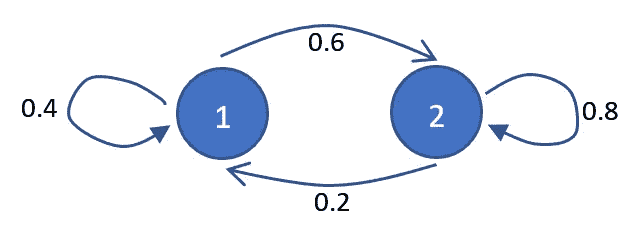
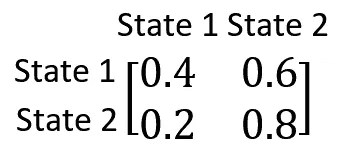
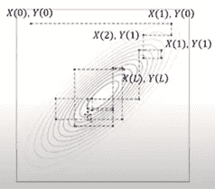
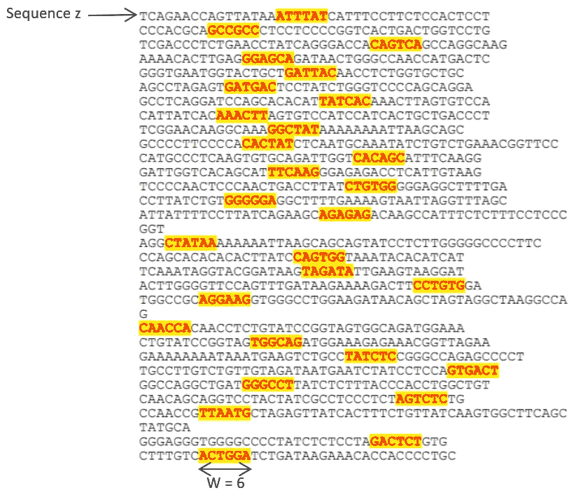
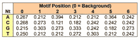
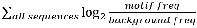
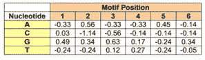
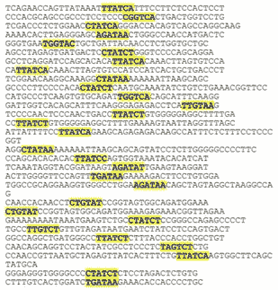

# 用于 DNA 序列比对的马尔可夫链蒙特卡罗—吉布斯抽样

> 原文：<https://medium.com/codex/markov-chain-monte-carlo-gibbs-sampling-for-dna-sequence-alignment-678fe6e36b98?source=collection_archive---------5----------------------->

## [法典](http://medium.com/codex)

Markov chain Monte Carlo (MCMC)是一种采样方法，它允许我们通过从一个称为建议分布的简单分布中随机采样来估计难以处理或未知的、可能是高维(取决于许多参数)分布的参数。这在应用贝叶斯统计从未知或难以处理的后验分布(考虑数据后的修正概率分布)中获取样本时特别有用。它对于许多涉及大量数据的生物学应用也是有用的，否则这些数据很难分析。

在本文中，我们将简要介绍 MCMC 和一种最通用的 MCMC 算法，称为 *Gibbs 抽样*。特别是，我们将展示它如何应用于 DNA 序列比对问题——生物学中的基本问题之一。通过识别在许多序列中重复的基因组(或蛋白质)区域，我们可以识别已经保守的结构，因此可能在功能上是重要的或者可以作为药物治疗的潜在靶点。希望这篇文章能帮助读者对 MCMC 有一个更直观的了解，以及为什么它是一个如此强大和方便的数值方法。

MCMC 这个名字是蒙特卡罗和马尔可夫链的结合。*蒙特卡罗*指的是一类依靠随机抽样来估计数值结果的方法。例如，我们可能想找出任意形状的面积。我们首先在形状周围画一个方框。这个盒子可以被认为是我们的点可以取的值域或值域范围。然后，我们在盒子中随机生成点，使得每个点都具有相同的可能性。

蒙特卡罗方法允许我们通过计算区域内随机生成的点的数量来估计阴影区域的大小。

然后，我们可以用阴影区域内的点的数量与生成的随机点的总数来近似阴影区域与盒子的比率。随着生成的随机点数量的增加，这种近似会得到改善。这种方法适用于我们无法精确求解面积的任意复杂形状。

马尔可夫链是描述一系列可能状态的随机模型，其中下一个状态的概率仅取决于当前状态。例如，如果今天下雨，明天下雨的概率为 0.4(因此，如果今天下雨，明天不下雨的概率为 0.6)，如果今天不下雨，明天下雨的概率为 0.2(因此，如果今天不下雨，明天不下雨的概率为 0.8)。因此，在这个模型中有两种状态——下雨(状态 1)和不下雨(状态 2)。可以举例如下:

马尔可夫链的图解表示

链是指由箭头连接的事件序列。我们可以将从一种状态改变或转换到另一种状态的概率写成矩阵的形式，称为转换矩阵:

我们可以看到，马尔可夫链的一个重要性质是，转移到下一个状态的概率只取决于当前状态，即明天是否下雨只取决于今天是否下雨。这种特性被称为无记忆性。在 MCMC 的上下文中，这意味着每个随机样本是基于它之前的最后一个随机样本生成的，而不依赖于之前的任何样本。[1]

MCMC 的一个很好的类比是蚂蚁寻找食物。许多蚂蚁离开巢穴寻找面包屑，它们会留下气味痕迹。这些蚂蚁中的一些会碰巧朝着正确的方向去寻找食物，它们会回到巢穴，标记它们的气味轨迹来指示潜在食物的位置。这条气味轨迹指示了一个粗略的方向，它可能不是找到食物的最佳路径。在这里，我们可以把寻找食物的最佳路径看作是 MCMC 中要估计的参数，而离开巢穴的蚂蚁是随机样本。当它们偶然靠近目标时，它们会通过留下气味轨迹来增加那个方向的“重量”。这使得其他蚂蚁更有可能追踪这条线索，并进一步强化这条线索。蚂蚁不会严格遵循路径，最终可能会找到一条更直接的路径，而不是曲折的初始路径。这类似于 MCMC 过程，在该过程中，我们尝试探索待估计参数的整个可能解决方案，当我们接近解决方案时，我们将尝试确保我们未来的样本被优化以针对接近解决方案的区域，并最终达到解决方案的良好估计。

为了说明 MCMC 如何将蒙特卡罗方法与马尔可夫链结合起来，我们再看第一个例子，其中有一个被方框包围的阴影区域。我们不是要找到阴影区域的面积，而是要找到该区域的“边缘”，即分隔阴影区域和非阴影区域的线。我们可以使用 MCMC 通过在盒子中定义一系列像素来实现这一点。首先，我们从蒙特卡洛过程开始，在该过程中，我们随机地将一个像素指定为序列中的第一个像素。然后我们可以基于一个马尔可夫链过程来决定是否保留这个点。假设我们基于该像素与其相邻像素的不同程度，以及该像素与现有序列中的其他像素的相似程度，定义了某个评分函数 *S* 。然后我们可以定义一个马尔可夫链，这样就有 2 个状态，其中状态 1 是接受该像素作为序列的一部分，状态 2 是拒绝该像素。然后，我们可以定义一个概率，使得如果该像素与其相邻像素更不同，并且与序列中已经存在的其他像素更相似，则该像素被添加到序列中的概率更高。相反，它与现有集合中的其他像素越不相似，与其邻居越相似，它被添加到序列中的概率就越低。注意，这仍然是一个随机过程，因此理论上与其邻居非常相似的像素(因此不可能是边缘)仍然可以被添加到边缘像素序列中。随机性质允许蒙特卡罗马尔可夫链探索整个解空间(整个盒子),而不管我们在哪里选择第一个点。我们可以重复这个接受或拒绝采样点的过程(我们可以定义采样点的逻辑，可能集中在现有点附近的区域),并因此向序列中添加更多的像素，直到达到设定的迭代次数或一些其他停止点，例如当我们在序列中获得一定数量的重复像素时。我们获得的最终像素序列应该给我们一个阴影区域边缘的良好近似。

最常见的 MCMC 算法之一是“吉布斯采样”。当给定感兴趣的参数的条件概率时，可以使用吉布斯抽样，我们感兴趣的是找到它们的联合无条件概率。*条件概率*是假设满足某些条件的概率。在雨天的例子中，假设今天下雨，明天下雨的条件概率是 0.4；另一方面，如果今天不下雨，条件概率是 0.2。是否下雨的*无条件概率*是任何一天下雨的概率，在这个简单的例子中，就是:

P(明天下雨|今天下雨)x P(今天下雨)+ P(明天下雨|今天不下雨)x P(今天不下雨)

*联合无条件概率*是指多个事件一起发生的概率，例如:在任意一天(不考虑昨天的天气)下雨的概率*和*你带了伞。这个可以写成 P(今天下雨，带了伞)。

我们可以想象一个场景，我们有 2 个变量 X 和 Y，我们知道 P(X|Y)是一个有一些均值和标准差的正态分布，P(Y|X)的概率也是一个有一些均值和标准差的正态分布。我们现在想从它们的联合概率 P(X，Y)中抽取样本。应用吉布斯采样算法，我们可以从 P(X，Y)采样，而无需显式计算 P(X，Y)。我们首先假设 X 和 y 的某个值，这是第 0 步，也是样本链中的第一个“入口”。我们将这表示为 X(0)和 Y(0)。我们现在从 P(X|Y=Y(0))采样得到 X(1)。使用 X(1)，我们使用 P(Y|X=X(1))对下一个值 Y(1)进行采样。我们在采样 X 和 Y 之间交替重复采样步骤。如果我们允许该采样运行足够长的时间，则所得样本将具有与联合分布 P(X，Y)相同的分布，而无需计算 P(X，Y):

使用 Gibbs 抽样从 2 个条件正态分布中抽取样本的图。资料来源:摘自[2]

我们可以将此扩展到具有许多因变量的模型，对于这些模型，获得 P(x1，x2，…，xn)分布的解析表达式可能是不切实际的。

我们现在将遍历应用于 DNA 序列比对的 Gibbs sampler 算法，以识别单个基序(在许多序列中重复出现的整个 DNA 序列中的较短序列，如“ATTTAT ”,就像马赛克、一段音乐或你的桌布中的重复图案)。首先，我们将计算所有待比对序列中每个核苷酸 A、T、C 和 G 的数量。这使我们能够确定它们在序列中出现的频率，它被称为背景频率。然后，我们在每个序列中随机选择基序的位置(下图 4 中突出显示)，并计算随机选择的基序中每个位置的核苷酸的频率；这将被称为基序频率。

图 4。初始随机初始化的基序位置。资料来源:摘自[4]

随机或顺序选择其中一个序列(我们称之为序列 z)。我们根据加权分布通过取样为该序列选择新的基序位置。我们首先考虑预定义宽度 W(待发现的主题宽度)的所有可能片段。我们通过取序列中每个核苷酸的背景频率的乘积来计算由随机机会产生的宽度为 W 的每个可能片段的概率。举个例子，

图 5。基序中不同位置的核苷酸频率。资料来源:摘自[4]

在图 5 中，背景频率为 A: 0.267，C: 0.268，G: 0.215，T: 0.250。那么对于一个序列 ATTTAT，这个序列的概率将是(0.267)(0.25)(0.267)(0.250)= 2.75 e-4。我们还使用基序频率计算每个序列出现的概率，在图 5 中为(0.212)(0.212)(0.272)(0.303)(0.364)(0.242)= 3.26 e-4。然后，我们通过使用基序频率计算的每个序列的概率除以使用背景概率计算的每个序列的概率来计算每个序列的权重，3.26/2.78=1.17。然后根据这个加权分布抽取一个样本。因此，权重较高的基序被取样的机会较高。在每个采样步骤之后，我们可以用新采样的模体更新模体频率。然后，我们对所有要比对的序列重复这一过程。当我们对所有序列进行采样后，我们可以通过对所有采样的基序取所有对数(基序频率/背景频率)的总和来计算最大后验概率(观察数据后的概率)估计值，

图 6。对数优势比，log2( <motif freq="">/ <background freq="">)。资料来源:摘自[4]</background></motif>

对于基序中位置 1 的核苷酸 A，对数优势比为。我们想在整个主题和所有序列中总结这一点。举个例子。我们必须对所有序列求和，因此对于接下来的序列“GCCGCC”、“CAGTCA”等(见图 4)。

我们的目标是最大化最大后验估计。通过重复这种取样和基序频率的更新，希望当偶然选择了一些正确的基序位置时，不同的权重将开始有利于正确的基序，并导致更准确的比对(图 7):

图 7。最终校准。资料来源:摘自[4]

关于方法和样本结果的更详细讨论，建议读者参考 Eric Rouchka 的技术报告[4]。这种随机方法具有近似线性的时间复杂度，这意味着运行它所花费的时间长度大致与待比对序列的数量成比例增加。这与许多用于比对遗传序列的确定性期望最大化算法形成对比，这些算法的时间复杂度呈指数增长。它也比通过成对比较序列工作的算法更快，后者具有至少二次的时间复杂度。[5]这种基本算法允许我们在没有任何先验信息的情况下检测基序。基本算法已经得到改进，能够结合额外的先验知识，如系统发育[6]和基序结构[7]，以进一步优化特定生物应用的性能。

除了吉布斯采样，MCMC 还有许多其他算法，包括 Metropolis-Hastings[8]和 Hamilton [9]。它已经应用于许多不同的领域，从药物发现[10–12]，流行病学[13]到生态学[14]。总之，MCMC 是一种强大的方法，允许我们从复杂的数据中估计参数。作为典型的随机数值方法，它不能保证正确或最佳的答案，也不能保证解是收敛的。然而，它给了我们另一个工具来在合理的时间内近似解决棘手的问题。本文概述了如何实现这一点的一般思想，并举例说明了如何将其应用于 DNA 序列比对这一重要问题。

参考

[1] D. van Ravenzwaaij，P. Cassey，S. D. Brown，“马尔可夫链蒙特卡罗抽样的简单介绍”，*心理计量学通报&综述，*第 25 卷，第 143–154 页，2018/02/01 2018。

[2] M. Pyrcz，“11e 机器学习:马尔可夫链蒙特卡罗”，ed。YouTube:【https://www.youtube.com/watch?v=7QX-yVboLhk，2019 年[。](https://www.youtube.com/watch?v=7QX-yVboLhk)

[3] X .夏，《生物信息学与药物发现》，*药物化学当前话题，*第 17 卷，第 1709–1726 页，// 2017。

[4] E. C. Rouchka，“吉布斯采样概述”，*生物信息学技术报告系列，编号 TR-ULBL-2008–02，路易斯维尔大学，*第 9 卷，1997 年。

[5] C. E. Lawrence，S. F. Altschul，M. S. Boguski，J. S. Liu，A. F. Neuwald 和 J. C. Wootton，“检测细微序列信号:多重比对的 Gibbs 取样策略”， *Science，* vol. 262，p. 208，1993。

[6] R. Siddharthan，E. D. Siggia 和 E. van Nimwegen，“PhyloGibbs:一个包含系统发育的 Gibbs 采样基序查找器”， *PLOS 计算生物学，*第 1 卷，第 e67 页，2005 年。

[7] A. V. Favorov、M. S .盖尔范德、A. V. Gerasimova、D. A. Ravcheev、A. A. Mironov 和 V. J. Makeev，“用于识别对称结构、间隔 DNA 基序的 Gibbs 采样器，具有改进的信号长度估计”，*生物信息学，*第 21 卷，第 2240-2245 页，2005 年。

[8] S. Chib 和 E. Greenberg，“理解 Metropolis-Hastings 算法”，*《美国统计学家》，*第 49 卷，第 327-335 页，1995 年 11 月，1995 年 1 月。

[9] R. M. Neal，《使用哈密顿动力学的 MCMC》，*马尔可夫链蒙特卡罗手册，*第 2 卷，第 2 页，2011。

[10] B. Jayawardhana、D. B. Kell 和 M. Rattray，“通过马尔可夫链蒙特卡罗对代谢途径中扰动位置的贝叶斯推断”，*生物信息学，*第 24 卷，第 1191-1197 页，2008 年。

[11] R. Frank 和 R. Hargreaves，“药物发现和开发中的临床生物标志物”，*《自然评论药物发现》，*第 2 卷，第 566-580 页，2003 年 7 月 1 日。

[12]m . trg rdh，M. J .沙佩尔，A. Ahnmark，D. Lindén，N. D. Evans 和 P. Gennemark，“使用最优控制和马尔可夫链蒙特卡罗方法进行药物发现的输入估计”，*《药代动力学和药效学杂志》，*第 43 卷，第 207–221 页，2016 年。

[13] G. Hamra，R. MacLehose 和 D. Richardson，“马尔可夫链蒙特卡罗:流行病学家导论”，*《国际流行病学杂志》，*，第 42 卷，第 627-634 页，2013 年。

[14] G. W. Cobb 和 Y.-P. Chen，“Markov Chain Monte Carlo 在群落生态学中的应用”，*《美国数学月刊》，*，第 110 卷，第 265-288 页，2003 年 4 月 1 日。