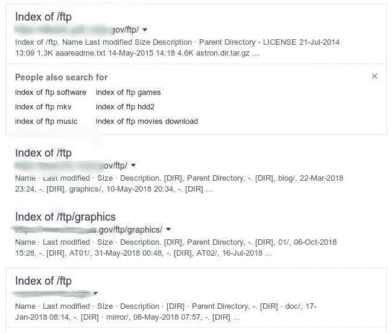
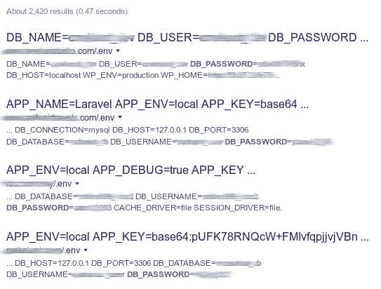

# 谷歌黑客大师(Dorking)

> 原文：<https://medium.com/codex/master-at-google-hacking-dorking-27d14e7249be?source=collection_archive---------2----------------------->


谷歌是互联网历史上最可靠和最有效的搜索引擎之一。它是专门设计来显示结果根据我们的需要，甚至有时当我们不知道确切的查询什么是搜索，通过输入一些与查询相关的词，我们得到的结果。

Google hacking 有时被称为 Google Dorking，是攻击者利用高级 Google 搜索技术使用的一种信息收集技术。Google hacking 搜索查询可用于识别 web 应用程序中的安全漏洞，收集任意或单个目标的信息，发现泄露敏感信息的错误消息，发现包含凭据和其他敏感数据的文件。

这里有一些小技巧，它会改变你的谷歌搜索体验，让你像专业人士一样使用谷歌。

# 流行的谷歌呆子运营商

谷歌的搜索引擎有自己内置的查询语言。可以运行下面的查询列表来查找文件列表，查找关于您的竞争对手的信息，跟踪人员，获取关于 SEO 反向链接的信息，建立电子邮件列表，当然，还可以发现 web 漏洞。

让我们看看最受欢迎的谷歌呆子和他们做什么。

*   `cache`:这个呆子会给你看任何网站的缓存版本，比如`cache:securitytrails.com`
*   `allintext`:搜索任何网页上包含的特定文本，例如`allintext: hacking tools`
*   `allintitle`:与 allintext 相同，但将显示包含带有 X 字符的标题的页面，例如`allintitle:"Security Companies"`
*   `allinurl`:可用于获取 URL 包含所有指定字符的结果，例如:`allinurl:clientarea`
*   `filetype`:用于搜索任何类型的文件扩展名，例如，如果您想搜索 pdf 文件，您可以使用:`email security filetype: pdf`
*   `inurl`:同`allinurl`，但只对一个单一关键字有用，如`inurl:admin`
*   `intitle`:用于搜索标题中的各种关键字，例如`intitle:security tools`将搜索以“安全”开头的标题，但“工具”可以在页面上的其他地方。
*   `inanchor`:当您需要搜索任何链接上使用的精确锚文本时，这很有用，例如`inanchor:"cyber security"`
*   `intext`:用于定位文本中包含特定字符或字符串的页面，例如`intext:"safe internet"`
*   `site`:将显示指定域名和子域的所有索引网址的完整列表，例如`site:securitytrails.com`
*   `*`:通配符用于搜索单词前包含“任何东西”的页面，例如`how to * a website`，将返回“如何……设计/创建/破解……一个网站”。
*   `|`:这是一个逻辑运算符，例如`"security" "tips"`将显示所有包含“安全”或“提示”或两个单词的站点。
*   `+`:用于连接单词，用于检测使用多个特定键的页面，例如`security + trails`
*   `–`:减号运算符用于避免显示包含特定单词的结果，例如`security -trails`将显示文本中使用“security”的页面，但不会显示包含单词“trails”的页面

如果你在寻找完整的谷歌运营商，你可以关注这篇 [SEJ 邮报](https://www.searchenginejournal.com/google-search-operators-commands/215331/)，它几乎涵盖了当今所有已知的傻瓜。

# 谷歌呆子例子

让我们来看看一些最好的谷歌黑客的实际例子。你会惊讶地发现，仅仅通过使用谷歌黑客技术，从任何来源提取私人信息是多么容易。

# 日志文件

日志文件是敏感信息在任何网站中被发现的最好例子。错误日志、访问日志和其他类型的应用程序日志经常出现在网站的公共 HTTP 空间中。这可以帮助攻击者找到您运行的 PHP 版本，以及您的 CMS 或框架的关键系统路径。

对于这种呆子，我们可以组合两个 Google 操作符，例如 allintext 和 filetype:

`allintext:username filetype:log`

这将显示许多包含用户名的结果。日志文件。

在结果中，我们发现一个特定的网站显示了来自数据库服务器的 SQL 错误日志，其中包含关键信息:

```
MyBB SQL Error
SQL Error: 1062 - Duplicate entry 'XXX' **for** key 'username'
Query:
INSERT
INTO XXX (`username`,`password`,`salt`,`loginkey`,`email`,`postnum`,`avatar`,`avatartype`,`usergroup`,`additionalgroups`,`displaygroup`,`usertitle`,`regdate`,`lastactive`,`lastvisit`,`website`,`icq`,`aim`,`yahoo`,`msn`,`birthday`,`signature`,`allownotices`,`hideemail`,`subscriptionmethod`,`receivepms`,`receivefrombuddy`,`pmnotice`,`pmnotify`,`showsigs`,`showavatars`,`showquickreply`,`showredirect`,`tpp`,`ppp`,`invisible`,`style`,`timezone`,`dstcorrection`,`threadmode`,`daysprune`,`dateformat`,`timeformat`,`regip`,`longregip`,`language`,`showcodebuttons`,`away`,`awaydate`,`returndate`,`awayreason`,`notepad`,`referrer`,`referrals`,`buddylist`,`ignorelist`,`pmfolders`,`warningpoints`,`moderateposts`,`moderationtime`,`suspendposting`,`suspensiontime`,`coppauser`,`classicpostbit`,`usernotes`)
VALUES ('XXX','XXX','XXX','XXX','XXX','0','','','5','','0','','1389074395','1389074395','1389074395','','0','','','','','','1','1','0','1','0','1','1','1','1','1','1','0','0','0','0','5.5','2','linear','0','','','XXX','-655077638','','1','0','0','0','','','0','0','','','','0','0','0','0','0','0','0','')
```

这个 Google hack 示例将当前的数据库名称、用户登录、密码和电子邮件值暴露给了互联网。我们已经用“XXX”替换了原始值。

# 易受攻击的 web 服务器

以下 Google Dork 可用于检测易受攻击或被黑客攻击的服务器，这些服务器允许将“/proc/self/CWD/”直接附加到您网站的 URL 上。

`inurl:/proc/self/cwd`

正如您在下面的屏幕截图中所看到的，易受攻击的服务器结果将会出现，同时还会显示可以从您自己的浏览器上浏览的暴露目录。


# 打开 FTP 服务器

Google 不仅索引基于 HTTP 的服务器，它还索引开放的 FTP 服务器。

有了下面的呆子，你将能够探索公共 FTP 服务器，这往往可以揭示有趣的事情。

`intitle:"index of" inurl:ftp`

在这个例子中，我们发现一个重要的政府服务器的 FTP 空间是打开的。这可能是故意的，但也可能是一个安全问题。



# 环境文件

。env 文件是流行的 web 开发框架用来声明本地和在线开发环境的通用变量和配置的文件。

建议的做法之一是移动这些。env 文件到不可公开访问的地方。然而，正如你将看到的，有很多开发者并不关心这个，并插入他们的。主公共网站目录中的 env 文件。

由于这是一个关键的呆子，我们不会告诉你如何去做；相反，我们将只向您展示关键结果:



您会注意到，未加密的用户名、密码和 IP 地址直接显示在搜索结果中。您甚至不需要点击链接来获得数据库登录的详细信息。

# SSH 私钥

SSH 私有密钥用于解密在 SSH 协议中交换的信息。作为一般的安全规则，私钥必须始终保留在用于访问远程 SSH 服务器的系统上，不应该与任何人共享。

有了下面的呆子，你就能找到被谷歌叔叔索引的 SSH 私有密钥。

in title:id _ RSA 的索引-id_rsa.pub

让我们继续另一个有趣的宋承宪呆子。

如果今天不是你的幸运日，并且你正在使用带有 PUTTY SSH 客户端的 Windows 操作系统，请记住这个程序总是记录你的 SSH 连接的用户名。

在这种情况下，我们可以使用一个简单的 dork 从 PUTTY 日志中获取 SSH 用户名:

`filetype:log username putty`

下面是预期的输出:


# 电子邮件列表

使用谷歌呆子很容易找到电子邮件列表。在下面的例子中，我们将获取可能包含大量电子邮件地址的 excel 文件。

`filetype:xls inurl:"email.xls"`


我们进行了筛选，只检查了。edu 找到了一所受欢迎的大学，收到了大约 1800 封来自学生和老师的电子邮件。

`site:.edu filetype:xls inurl:"email.xls"`

请记住，谷歌呆子的真正力量来自于你可以使用的无限组合。垃圾邮件发送者也知道这种伎俩，并每天使用它来建立和扩大他们的垃圾邮件列表。

# 现场摄像机

你有没有想过，你的私人摄像机不仅能被你自己观看，还能被互联网上的任何人观看？

以下 Google 黑客技术可以帮助你获取不受 IP 限制的直播摄像头网页。

下面是获取各种基于 IP 的摄像机的呆子:

`inurl:top.htm inurl:currenttime`

要查找基于 WebcamXP 的传输:

`intitle:"webcamXP 5"`

另一个用于一般的现场摄像机:

`inurl:"lvappl.htm"`

有很多现场摄像傻瓜可以让你观看世界的任何地方，现场直播。你可以找到没有 IP 限制的教育，政府，甚至军用摄像机。

如果你有创意，你甚至可以在这些相机上做一些白帽渗透测试；你会惊讶地发现，你可以远程控制整个管理面板，甚至可以随意重新配置摄像头。


# MP3、电影和 PDF 文件

现在 Spotify 和 Apple Music 上市后几乎没人下载音乐了。然而，如果你是那些仍然下载合法音乐的经典用户之一，你可以使用这个工具来查找 mp3 文件:

`intitle: index of mp3`

这同样适用于您可能需要的合法免费媒体文件或 PDF 文档:

`intitle: index of pdf` `intext: .mp4`

# 天气

谷歌黑客技术可以用来获取任何类型的信息，包括许多不同类型的连接到互联网的电子设备。

在这种情况下，我们运行了一个让您获取天气翼设备传输的呆子。如果你对气象学感兴趣或者只是好奇，看看这个:

`intitle:"Weather Wing WS-2"`

输出将显示世界各地连接的几个设备，这些设备共享诸如风向、温度、湿度等天气细节。


# 缩放视频

2020 年，在最初的封锁期间，“缩放轰炸”成为扰乱在线会议的一种流行手段。该公司后来设置了一些限制，使其更难找到/破坏 Zoom 会议，但只要一个 URL 被共享，Zoom 会议仍然可以被找到:

`inurl:zoom.us/j and intext:scheduled for`

唯一的缺点是谷歌索引网站的速度。当一个站点被编入索引时，缩放会议可能已经结束了。


# SQL 转储

错误配置的数据库是发现暴露数据的一种方式。另一种方法是寻找存储在服务器上并可通过域/IP 访问的 SQL 转储。

有时，这些转储通过在 web 服务器上存储备份的站点管理员使用的不正确的备份机制出现在站点上(假设它们没有被 Google 索引)。为了找到一个压缩的 SQL 文件，我们使用:

`"index of" "database.sql.zip"`

我们省略了截图，以避免暴露任何可能的数据泄露。

# WordPress 管理

关于是否模糊你的 WordPress 登录页面的观点有正反两方面的争论。一些研究人员表示，这是不必要的，使用 web 应用程序防火墙(WAF)等工具可以比模糊处理更好地防止攻击。

对于一个呆子来说，找到 WP 管理登录页面并不困难:

`intitle:"Index of" wp-admin`


# 阿帕奇 2

这可以被认为是上面提到的“易受攻击的 web 服务器”的子集，但是我们专门讨论 Apache2 是因为:

*   LAMP (Linux，Apache，MySQL，PHP)是托管应用/网站的流行堆栈
*   这些 Apache 服务器可能配置错误/被遗忘，或者处于正在设置的某个阶段，使它们成为僵尸网络的巨大目标

使用以下代码查找 Apache2 网页:

`intitle:"Apache2 Ubuntu Default Page: It works"`


# phpMyAdmin

LAMP 服务器上另一个有风险但经常被发现的工具是 phpMyAdmin 软件。这个工具是损害数据的另一种方法，因为 phpMyAdmin 用于通过 web 管理 MySQL。要用的呆子是:

`"Index of" inurl:phpmyadmin`

# JIRA/基巴纳

Google dorks 还可以用来查找托管重要企业数据的网络应用程序(通过 JIRA 或基巴纳)。

`inurl:Dashboard.jspa intext:"Atlassian Jira Project Management Software"`
`inurl:app/kibana intext:Loading Kibana`


找到 JIRA 实例的一个更简单的方法是使用 SurfaceBrowser 这样的工具，它可以识别子域以及这些子域上的应用程序(除了 JIRA，还有许多其他应用程序)。

# cPanel 密码重置

另一个可以作为侦察的第一步的呆子是托管 cPanel，然后利用密码重置中的各种弱点来接管 cPanel(以及托管在其上的所有网站)。为此目的的呆子是:

`inurl:_cpanel/forgotpwd`


# 政府文件

敏感的政府文件是最不应该暴露在互联网上的东西，但对于呆子来说，它们并不太难找到，如下所示:

`allintitle: restricted filetype:doc site:gov`


# 防止谷歌呆子

有很多方法可以避免落入谷歌呆子的手中。

这些措施是为了防止你的敏感信息被搜索引擎索引。

*   通过用户和密码验证以及使用基于 IP 的限制来保护私人区域。
*   加密您的敏感信息(用户、密码、信用卡、电子邮件、地址、IP 地址、电话号码等)。
*   定期对你的网站进行漏洞扫描，这些通常已经使用了流行的谷歌呆子查询，可以非常有效地检测最常见的漏洞。
*   对你自己的网站进行定期的傻瓜查询，看看你是否能在坏人之前找到任何重要的信息。你可以在 [Exploit DB 呆子数据库](https://www.exploit-db.com/google-hacking-database/)中找到一个很棒的流行呆子列表。
*   如果您发现敏感内容暴露，请使用[谷歌搜索控制台](https://support.google.com/webmasters/answer/1663419?hl=en)请求删除。
*   使用位于根级网站目录中的 robots.txt 文件阻止敏感内容。

# 使用 robots.txt 配置来防止 Google Dorking

防止谷歌呆瓜的最好方法之一是使用一个 [robots.txt](https://support.google.com/webmasters/answer/6062596?hl=en) 文件。让我们看一些实际的例子。

以下配置将拒绝从您的网站内的任何目录进行所有抓取，这对于不依赖于公开可索引互联网内容的私人访问网站非常有用。

```
**User-agent**: *
**Disallow**: /
```

您还可以阻止特定目录从 web 爬网中排除。如果您有一个/admin 区域，并且需要保护它，只需将以下代码放入其中:

```
**User-agent**: *
**Disallow**: /admin/
```

这也将保护里面的所有子目录。

限制对特定文件的访问:

```
**User-agent**: *
**Disallow**: /privatearea/file.htm
```

限制对包含“？”的动态 URL 的访问标志

```
**User-agent**: *
**Disallow**: /*?
```

要限制对特定文件扩展名的访问，您可以使用:

```
**User-agent**: *
**Disallow**: /*.php$/
```

在这种情况下，所有对。php 文件将被拒绝。

## 结论

Google Hacking 不仅仅是一种在不被提交给目标框架的情况下查找和查看网站页面的奇妙方法，它还是一种在攻击的典型信息收集阶段泄露数据的合法方法。对于大多数信息安全评估来说，这是一个毋庸置疑的要求，如果执行得当，可以产生非凡的效果。许多问题在 GHDB 公开参与，任何人都可以找到并分析，而针对目的地的明确、定制的测试可以使用高级管理员进行。

来源:
[搜索高手——如何成为搜索高手！(youngisthan.in)](https://www.youngisthan.in/science-technology/how-become-master-in-googling/67734)
[谷歌黑客:什么是谷歌黑客？(acunetix.com)](https://www.acunetix.com/websitesecurity/google-hacking/)
[Google Hacking—免费的 Google Dorks for recon | Pentest-Tools.com](https://pentest-tools.com/information-gathering/google-hacking)
[什么是 Googlehacking❓—Google hack(wallarm.com)](https://www.wallarm.com/what/what-is-a-google-hack)
[最流行的 Google hacking 技术—顶级 Google dorks 和 hacks(securitytrails.com)](https://securitytrails.com/blog/google-hacking-techniques)
[Google hacking | imper va](https://www.imperva.com/learn/application-security/google-hacking/)