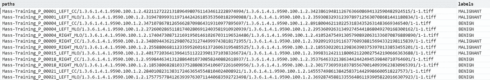

# 主 Keras 的图像数据生成器

> 原文：<https://medium.com/codex/master-keras-imagedatagenerator-class-989ea21fc489?source=collection_archive---------4----------------------->


照片由[玛格丽特·韦尔](https://unsplash.com/@margotd1?utm_source=medium&utm_medium=referral)在 [Unsplash](https://unsplash.com?utm_source=medium&utm_medium=referral) 拍摄

## 训练深度学习模型而不用担心记忆

对于所有希望使用图像数据为分类任务开发深度学习模型的新手、热切的数据科学家来说，你们来对地方了！

在这篇文章中，我将解释使用 Keras API 正确训练深度学习模型的最简单方法，更具体地说是**imagedata generator 类**，以及适当利用自己的数据和数据结构所需的所有位和块。这在处理大量图像时变得非常有价值，而依靠 RAM 来使你的数据随时可用是不可行的。

# 1.您的数据是如何组织的？

在训练深度学习模型时，数据结构是非常重要的。拥有一个定制的、有组织的结构肯定会让你的生活更轻松，尤其是在使用图像数据的时候。

根据您的图像数据集，您可能在特定的文件夹中有松散的图像，或者在不同的子文件夹中有每类数据，甚至在每个图像的子文件夹中有一个图像，这在处理医疗数据时很常见，因为每个文件夹可能代表不同的患者。然而，Keras 提供了两种主要方法来处理大图像数据。

## **训练和验证子文件夹**

将数据放在两个不同的文件夹中分别用于模型训练和模型验证是最直接、最自然的组织方式。在 *Train* 和 *Validation* 文件夹中，有更多的子文件夹，与数据的类别数量一样多，最后，在每个类别子文件夹中，您可以找到图像。为了更清楚，下面有一个**子文件夹方法**的例子:

```
image_data/
           /train/
                  /class_1/
                           image1.png
                           image2.png
                           .
                           .                   /class_2/
                           .
                           .
                           . /validation/
                      /class_1/
                               .
                               .
                               . /class_2/
                               .
                               .
                               .
```

从上面可以清楚地看到，主文件夹中有两个子文件夹，它们又有对应于数据集每个类的子文件夹。一些数据集已经按照这种结构进行了组织，但是，如果您从一开始就没有这种数据结构，那么通过定义一个训练分割(通常为 0.8)，然后相应地组织您的图像(80%的图像将用于训练，20%用于验证)，就可以相对容易地完成。

按照类别以及训练和验证文件夹来组织图像是机器学习中最常见的组织方案，也是大型数据集的首选。

**注意:**如果您的数据是用每个图像的子文件夹(即医疗数据)组织的，您可能要考虑第二种方法，因为将每个图像从其文件夹移动到另一个文件夹可能会很麻烦。

## **带有图像路径和相应类别的数据帧**

如果您正在使用以特定方式组织的影像数据集，并且您想知道将训练和验证文件夹放在一起会有多麻烦，请不要担心！有一个功能一样的替代品。

Keras 的 ImageDataGenerator 允许另一种方法，它不需要包含所有不同类的培训文件夹和验证文件夹。然而，它需要**一个有两列**的数据帧:第一列应该包含**图像的完整路径**和**第二列对应的类**。这对于提供包含文本/数字要素以及图像路径的. csv 文件的数据集尤其有用。



包含图像路径和相应标签的示例数据帧。作者图片

请注意，您将需要一个用于训练集的数据帧，以及另一个用于验证图像的数据帧！

现在您的数据已经组织好了，一切都准备好了！让我们开始制造那些发电机。

# 2.建筑图像生成器

现在您的数据已经组织好了，我们终于可以开始导入图像并构建批量数据了。

建造发电机的第一步是…你猜对了！检查依赖性。这种情况下唯一需要的依赖项主要是 *Tensorflow* 和 *Pandas* ，如果你使用 dataframe 方法的话。如果您尚未安装 Tensorflow，您可以使用命令提示符通过 *pip* 进行安装。熊猫应该是预装的，所以不用担心。

```
pip install tensorflow
```

之后，用必要的导入开始你的脚本/笔记本。

```
import pandas as pd
from tensorflow import keras
from keras.preprocessing.image import ImageDataGenerator
```

很好！现在，不管您的数据结构如何，下一步是构建 ImageDataGenerator 对象。根据 [Keras 文档](https://keras.io/api/preprocessing/image/#imagedatagenerator-class)，可以实现多种数据增强技术，如旋转、裁剪、放大/缩小等。，使用 ImageDataGenerator 对象，并声明要应用于每个图像的预处理函数。现在，我们将构建一个简单的 ImageDataGenerator 对象。例如，如果您打算将数据扩充技术应用于验证集或测试集，而不是定型集，也可以创建多个 ImageDataGenerator 对象。

```
data_generator = ImageDataGenerator()
```

有许多不同的参数来定制表示方法，如 Keras 文档中的[](https://keras.io/api/preprocessing/image/#flowfromdataframe-method)*所示。在 *flow_from_dataframe()* 方法中使用的最重要的是:*

*   *包含图像路径和类的熊猫数据帧*
*   ***目录** =如果数据帧中声明的路径不是绝对路径，则应在此声明存储图像的目录。*
*   ***x_col** =包含图像路径的数据帧中的列*
*   ***y_col** =包含图像类的数据帧中的列*

*在 *flow_from_directory()* 方法中，只有一个特定的参数:*

*   ***目录** =包含训练和验证文件夹的主文件夹的路径*

*然而，定义两种方法共享的一些额外参数是很重要的:*

*   ***target_size** =一个元组，包含您希望图像采用的尺寸/调整到的尺寸。默认的尺寸是(256，256)，不考虑图片的大小，所以我总是声明目标尺寸。*
*   ***color_mode** =声明颜色通道数量的字符串。默认为*‘RGB’*，所以如果想要灰度或者 RGBA 图像，就声明为*‘灰度’*或者*‘rgba’*。*
*   ***class_mode** =定义模型分类类型的字符串。如果模型的输出层只有一个节点和 sigmoid 激活，使用*‘二进制’*，如果它的节点数与类数相同，并且有一个 softmax 激活，使用*‘分类’*。*
*   ***batch_size** =定义每批图像数量的整数。默认值为 32。*

*如果您已经在**训练和验证文件夹**中组织了图像数据，使用 *flow_from_directory()* 方法，如下所示。*

```
*training_generator = data_generator.flow_from_directory(
    directory= 'image_data/training',
    batch_size= 64,
    target_size= (500,500),
    color_mode= 'grayscale',
    class_mode= 'binary'
)validation_generator = data_generator.flow_from_directory(
    directory= 'image_data/validation',
    batch_size= 64,
    target_size= (500,500),
    color_mode= 'grayscale',
    class_mode= 'binary'
)*
```

*然而，如果您的数据是根据包含图像路径和类的**数据帧**来组织的，您应该使用 *flow_from_dataframe()* 方法。*

```
*training_generator = data_generator.flow_from_dataframe(
    dataframe= training_dataframe,
    x_col= 'paths',
    y_col= 'labels',
    batch_size= 128,
    target_size= (350,350),
    color_mode= 'rgba',
    class_mode= 'categorical'
)validation_generator = data_generator.flow_from_directory(
    directory= validation_dataframe,
    batch_size= 128,
    target_size= (350,350),
    color_mode= 'rgba',
    class_mode= 'categorical'
)*
```

*太棒了。由于我们刚刚创建的生成器的特殊设计，想到您可以利用大型图像数据集而不需要大量计算能力，这真是令人惊讶:*

***尽管它们批处理了我们想要的那么多图像，但创建它们只需要很少甚至不需要内存，因为批处理只在您尝试访问生成器时生成:在训练阶段，或者当您调用特定的批处理时。***

*我第一次使用图像生成器时，我很难理解它们的结构，所以我深入研究了它们。此外，我的结论是，这样做很重要，只是为了确认生成的图像具有所需的特征。可以通过订阅访问生成的批处理:*

```
*first_batch= training generator[0]*
```

*每个批次由一个大小为 2 的元组表示，其中第一项是一个包含图像的数组，第二项是另一个包含标签的数组。因此，如果您想检查 ImageDataGenerator 是否正确地拾取了您的图像，我建议绘制生成的图像。下图是第一批中的第一幅图像。*

```
*generated_image = training_generator[0][0][0]
matplotlib.pyplot.imshow(generated_image)*
```

# *3.该训练了！*

**

*维克多·弗雷塔斯在 [Unsplash](https://unsplash.com?utm_source=medium&utm_medium=referral) 上拍摄的照片*

*数据准备好了，该训练模型了！使用 Keras 和图像生成器来训练深度学习模型是非常容易的。假设你已经建立了一个深度学习模型，你只需要编译它并训练它。在 **model.fit()** 方法中，您不需要声明 *y* 和 *batch_size* 参数，因为这些参数已经包含在生成器对象中。因此，在编译完您的架构之后，一个 *fit()* 方法将看起来像这样:*

```
*model.fit(
    training_generator,
    epochs = 100,
    validation_data = validation_generator
)*
```

*就是这样！您现在可以使用您想要的多少图像来训练模型，而不用担心内存或输入形状，所有这些都在一天的工作中完成！*

*我希望你理解了处理大量图像的基本原理和 Keras 图像生成器的潜力！*

**如有任何问题，欢迎留言评论！**

**玩得开心！*😄*