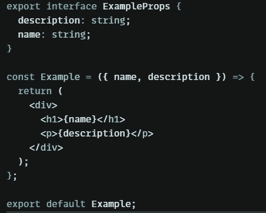
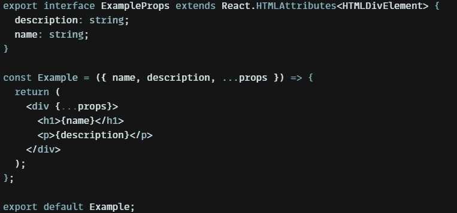
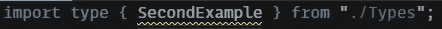
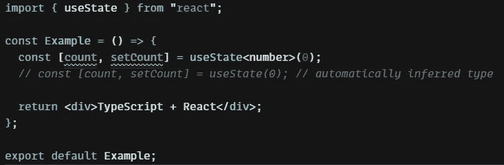
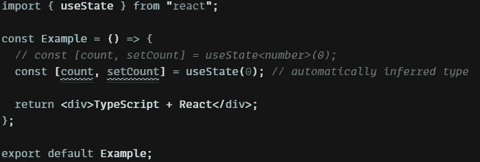
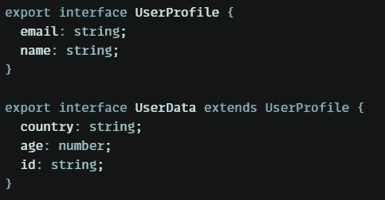

# 掌握 React —使用 TypeScript 时的良好实践

> 原文：<https://medium.com/codex/mastering-react-good-practices-when-using-typescript-7240cbaf4fc6?source=collection_archive---------0----------------------->

当你想提高这方面的技能时，读读这篇短文。

[Pixabay](https://pixabay.com/users/yuri_b-2216431/)

# ✨简介

如果你正因为 React + TypeScript 的糟糕体验而苦苦挣扎，请阅读这篇文章——它会非常有帮助！

# 道具延伸

如果您正在为任何本机 HTML 标记创建自定义属性，并且仍然希望使用本机 HTML 元素属性。很多人不知道如何恰当地做到这一点，因为他们没有任何使用 TS 的经验。但这真的很简单——看看下面的例子。

错误定义的属性示例

如果你像这样定义属性类型，你需要知道现在你不能仅仅使用样式化组件来直接样式化你的组件，你不能添加任何本地 div 标签属性等等。那么如何修复呢？

正确定义的道具

所以，如果这种差异真的很微妙，为什么它如此重要呢？
因为现在你可以使用所有的原生 div 元素特性，并直接从 styled-components 应用样式。

# 导入类型

当你导入你的类型时，只需要考虑它们将只用于开发。项目结束后，建筑类型应完全删除！

那么如何才能做到呢？就像这样用`import type …`代替`import...`

导入类型

这是在 React with TypeScript 中导入类型的正确方法。

# 不要在推断类型上浪费时间

有时候我们可以把一个类型传递给任何一个变量或函数，而它是完全无用的！通常如果你初始化你的变量，类型会被自动推断出来。

定义的类属

自动推断类型

虽然差别很小，但你并没有浪费时间。这个例子很短，但是如果你正在实现任何复杂的业务逻辑，你可以节省大量的代码行和时间，并且代码的质量是一样的！

# 使您的类型可重用

如果你正在用复杂的接口实现任何复杂的逻辑，当你用像这样的 **DRY** (不要重复)规则扩展类型时，你可以节省很多时间。

接口扩展

# 🍟摘要

如果您是 TypeScript 的初学者，这些提示会很有帮助。使用它们可以让你写干净的代码，节省很多时间。

# 👌谢谢你

希望你喜欢这一课。如果你想通过这种方式学习，就跟着我的简介吧！