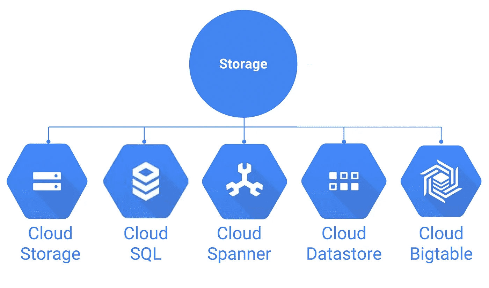

# 掌握谷歌云上的存储

> 原文：<https://medium.com/codex/mastering-storage-on-google-cloud-37c076ffa9a2?source=collection_archive---------16----------------------->

## 准备好接受谷歌云平台认证了吗？让我们重温一些存储知识。

谷歌云平台——存储服务

# 那么，什么是存储呢？

你要知道 GCP 上的*存储*远远不止*只是* *存储*。在这一类服务中，您可以找到*云 SQL*-这是一个完全托管的关系数据库-或者*大表**-这是一个非 SQL 数据库。*

*有 5 项关键服务被归类为 ***存储*** ，它们包含在认证考试中。这表示，复习它们是你必须做的准备，我们将先睹为快:*

1.  *云存储。*
2.  *云 SQL。*
3.  *云扳手。*
4.  *云 Bigtable。*
5.  *云数据存储。*

# *云存储*

*是其中最基本的，它提供了*耐用*和*高可用存储*。它将您的文件存储为字节序列或*二进制大对象*，目的是让您仅**将**数据保存在其中，因此，*存储*与*文件系统不同，*换句话说——*云存储*对象是不可变的。*

*安全性是内置的。静态加密和传输期间加密是默认特性(我不认为你可以选择退出…)。*

> *默认情况下，使用 HTTPS/TLS(传输层安全性)对客户设备和 Google 之间传输的数据进行加密。-谷歌*

*数据导入/导出有几个不同的选项。从简单的 *CLI* 命令或在浏览器中拖放到第三方服务，您可以发送数 Pb 的数据并为您加载。*

*还有 Storage Transfer Service，它允许您计划和管理从另一个云提供商、不同的云存储区域或 HTTP(S)端点到云存储的批量传输。*

## *存储类别*

*目前，有四种不同类型的*存储*类:*

*   *地区性-高性能，适合日常使用。*
*   *多区域-相同+复制且昂贵。*
*   *近线-低成本，意味着不经常访问。*
*   *Coldline -更便宜，用于存档、在线备份和灾难恢复(但是，检索数据很昂贵)。*

*按照此- [存储链接](https://cloud.google.com/storage)深入了解他们的文档。*

# *云 SQL*

*它提供了一个完全托管的关系数据库，你可以在 MySQL 和 PostgressSQL 之间进行选择。*

**完全托管*意味着您将许多维护任务移交给 Google，如应用补丁和更新、管理备份和配置复制。这种类型的服务的思想是，您可以将您的注意力和精力放在构建您的应用程序上，而不是管理数据库(或任何其他服务)。*

*这还意味着该服务开箱即用:*

*   *自动复制。*
*   *托管备份。*
*   *垂直缩放(读取和写入)。*
*   *水平缩放(读取)。*
*   *Google security(数据在内部网络、数据库表、临时文件和备份中是加密的)。*

*按照 SQL 的[链接，深入了解他们的文档。](https://cloud.google.com/sql)*

# *云扳手*

*谷歌自己的关系数据库:*

*   *完全管理，规模不限。*
*   *自动复制。*
*   *强大的全球一致性。*
*   *具有高可用性的托管实例。*
*   *SQL(带扩展的 ANSI 2011)。*
*   *数据库大小超过 2 TB。*
*   *许多 IOPS(每秒数万次读/写或更多)。*

> *您对关系数据库的所有期望。-谷歌*

*就我个人而言，我还没有使用过这项服务，谷歌表示，它非常适合任何商业需求，适合从金融服务到游戏的广泛行业。其思想是——如果您需要一个具有高处理能力、可伸缩性和可用性的*关系数据库*——Spanner 应该为您提供这三者中最好的一个，以获得最佳的性价比。*

*点击扳手的[链接，深入了解他们的文档。](https://cloud.google.com/spanner)*

# *云大表*

**NoSQL-WideColumn* 完全托管的数据库。这是支持许多核心谷歌服务的同一个数据库，包括搜索、分析、地图和 Gmail。*

*   *设计用于**Pb+**的数据。*
*   ***持续低于 10 毫秒的延迟**。-如果你问我的话，那是疯狂的。*

*像大多数 NoSQL 数据库一样，它寻求满足诸如非常高的吞吐量和可伸缩性之类的要求，在这种情况下，您必须处理非结构化数据。您还可以将其用作键/值数据库，其中每个值通常不超过 10 MB，或者用作用于批量 MapReduce 操作、流处理/分析和机器学习应用程序的*存储*引擎。*

*它使用与 Hadoop 的 *HBase* 相同的 API。这给了你从 Bigtable 迁移到 HBase 的自由，你可以随时逃离 Google。:D*

> *云 Bigtable 不支持 SQL 查询，也不支持多行事务。*

*按照 Bigtable 的[链接，深入了解他们的文档。](https://cloud.google.com/bigtable)*

# *云数据存储*

*这是另一个 NoSQL 数据库，但主要是针对文件。*

*   *设计用于**TB+**的数据。*
*   *支持 ACID 事务。*
*   *强大和最终的一致性能力。*
*   *免费每日配额。*

> *如果要管理结构化对象，或者需要支持事务和类似 SQL 的查询，可以考虑使用 Bigtable*

*按照此数据存储库的[链接，深入了解他们的文档。](https://cloud.google.com/datastore)*

# *结论*

*这些服务中的每一项都不仅仅是看上去那么简单。您需要慢慢来，深入研究每一种方法的文档。*

*为了对您的应用做出明智的选择，有必要了解您的需求和这些服务中的每一项，以便做出正确的选择。一个随机的选择——虽然可以帮助你完成工作——很可能会导致关键功能的缺失或本来可以避免的过高成本。*