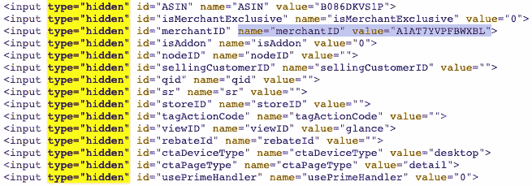
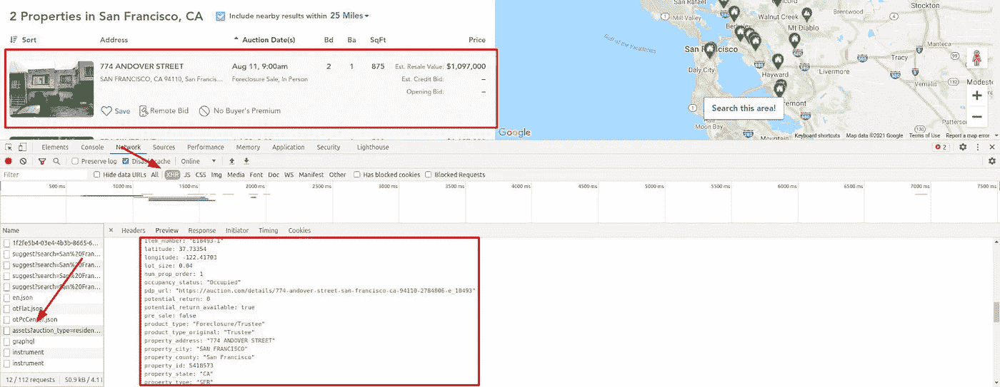
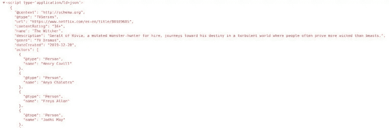
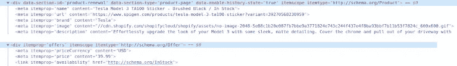

# 掌握 Python 中的 Web 抓取:从零到英雄

> 原文：<https://medium.com/codex/mastering-web-scraping-in-python-from-zero-to-hero-51e27705b51b?source=collection_archive---------5----------------------->


网站抓取不仅仅是用一些 CSS 选择器提取内容。我们在本指南中总结了多年的专业知识。有了这些新的技巧和想法，您将能够更可靠、更快速、更高效地收集数据。并获得一些您认为不存在的额外字段。

## 先决条件

为了让代码工作，你需要安装的 [python3。有些系统已经预装了它。之后，通过运行`pip install`安装所有必要的库。](https://www.python.org/downloads/)

```
pip install requests beautifulsoup4 pandas
```

使用请求库可以很容易地从 URL 获取 HTML。然后将内容传递给 BeautifulSoup，我们就可以开始用选择器获取数据和查询了。我们就不多赘述了。简而言之，你可以使用 [CSS 选择器](https://www.crummy.com/software/BeautifulSoup/bs4/doc/#css-selectors)来获取页面元素和内容。有些需要不同的语法，但是我们稍后会发现。

```
import requests
from bs4 import BeautifulSoup

response = requests.get("https://zenrows.com")
soup = BeautifulSoup(response.content, 'html.parser')

print(soup.title.string) *# Web Data Automation Made Easy - ZenRows*
```

为了避免每次都请求 HTML，我们可以将它存储在一个 HTML 文件中，并从那里加载 BeautifulSoup。对于一个简单的演示，我们可以手动完成。一个简单的方法是查看页面源代码，复制并粘贴到一个文件中。像爬虫一样，不登录就访问页面是很重要的。

在这里获取 HTML 可能看起来是一个简单的任务，但事实并非如此。我们不会在这篇博文中涉及它，但它值得一个完整的指南。我们的建议是使用这种静态方法，因为许多网站会在几次请求后将你重定向到登录页面。有些人会显示验证码，在最坏的情况下，你的 IP 将被禁止。

```
with open("test.html") as fp:
	soup = BeautifulSoup(fp, "html.parser")

print(soup.title.string) *# Web Data Automation Made Easy - ZenRows*
```

一旦我们从一个文件中静态加载，我们就可以尽可能多的测试，而不会出现任何网络或阻塞问题。

# 编码前探索

在我们开始编码之前，我们必须理解页面的内容和结构。为此，我们知道的更简单的方法是使用浏览器检查目标页面。*我们将使用 Chrome 的 DevTools，但其他浏览器也有类似的工具。*

例如，我们可以打开亚马逊上的任何产品页面，快速浏览就会显示产品的名称、价格、可用性和许多其他字段。在复制所有这些选择器之前，我们建议花几分钟时间寻找隐藏的输入、元数据和网络请求。

小心不要用 Chrome DevTools 或类似的工具来做这件事。一旦 Javascript 和网络请求(可能)修改了内容，您就会看到它。这很烦人，但有时我们必须探索原始的 HTML 以避免运行 Javascript。如果我们找到了所有的东西，就不需要运行一个无头浏览器——也就是木偶师——节省了时间和内存消耗。

免责声明:我们不会在每个例子的代码片段中包含 URL 请求。他们看起来都像第一个。请记住，如果您要多次测试 HTML 文件，请将其存储在本地。

## 隐藏输入

隐藏输入允许开发人员包含终端用户看不到也不能修改的输入字段。许多表单使用这些来包含内部 id 或安全令牌。

在[亚马逊产品](https://www.amazon.com/dp/B08F7PTF54)，我们可以看到更多。有些将在其他地方或格式，但有时他们是独一无二的。不管怎样，隐藏输入的名字比类更稳定。



## [计]元数据

虽然有些内容可以通过用户界面看到，但使用元数据提取可能更容易。你可以在 [YouTube 视频](https://www.youtube.com/watch?v=tmNXKqeUtJM)中获得数字格式的观看次数和 YYYY-mm-dd 格式的发布日期。这两个可以从可见部分通过手段获得，但没有必要。花几分钟做这些技术是值得的。

```
interactionCount = soup.find('meta', itemprop="interactionCount")
print(interactionCount['content']) *# 8566042*

datePublished = soup.find('meta', itemprop="datePublished")
print(datePublished['content']) *# 2014-01-09*
```

## XHR 请求

其他一些网站决定加载一个空模板，并通过 XHR 请求带来所有数据。在这种情况下，只检查原始 HTML 是不够的。我们需要检查网络，特别是 XHR 请求。

[拍卖](https://www.auction.com/)就是这种情况。在表格中填入任意一个城市并进行搜索。这将把您重定向到一个带有框架页面的结果页面，同时它对您输入的城市执行一些查询。

这迫使我们使用可以执行 Javascript 和拦截网络请求的无头浏览器，但我们也会看到它的好处。有时您可以直接调用 XHR 端点，但它们通常需要 cookies 或其他身份验证方法。或者他们可以立即禁止你，因为这不是一个常规的用户路径。小心点。



我们挖到了金子。再看一下图像。

您可以拥有的所有数据都已经过清理和格式化，可以提取了。然后更多。地理位置、内部 id、没有格式的数字价格、制造年份等等。

# 提取可靠内容的方法和技巧

暂时抛开你的冲动。用 CSS 选择器获取一切是一种选择，但还有更多。看看这些，直接用选择器之前再想一想。我们并没有说这些是不好的，而我们的是好的。不要误解我们。

我们试图给你更多的工具和想法。那每次都会是你的决定。

## 获取内部链接

现在，我们将开始使用 BeautifulSoup 来获取有意义的内容。这个库允许我们通过 id、类、伪选择器等等获取内容。我们将只介绍它的一小部分功能。

这个例子将从页面中提取所有的内部链接。为了简单起见，只有以斜杠开头的链接才被认为是内部链接。在完整的情况下，我们应该检查域和子域。

```
internalLinks = [
	a.get('href') for a in soup.find_all('a')
	if a.get('href') and a.get('href').startswith('/')]
print(internalLinks)
```

一旦我们拥有了所有这些链接，我们就可以对它们进行重复数据删除和排队，以备将来使用。通过这样做，我们将建立一个完整的网站爬虫，而不仅仅是一个页面。由于这是一个完全不同的问题，我们想提到它并准备一篇博文来处理它的使用和可伸缩性。要抓取的页面数量可以滚雪球。

*需要注意的是:在自动运行时要谨慎。你可以在几秒钟内获得数百个链接，这将导致对同一个网站的太多请求。如果不小心处理，验证码或禁令可能会适用。*

## 提取社交链接和电子邮件

另一个常见的抓取任务是提取社交链接和电子邮件。“社交链接”没有确切的定义，所以我们将基于域来获取它们。至于电子邮件，有两种选择:“mailto”链接和检查全文。

我们将在这个演示中使用一个[刮擦测试站点](https://www.webscraper.io/test-sites/e-commerce/allinone)。

第一个代码片段将获得所有的链接，与上一个类似。然后遍历所有邮件，检查是否存在任何社交域或“mailto”。在这种情况下，将该 URL 添加到列表中，最后打印出来。

```
links = [a.get('href') for a in soup.find_all('a')]
to_extract = ["facebook.com", "twitter.com", "mailto:"]
social_links = []
for link in links:
	for social in to_extract:
		if link and social in link:
			social_links.append(link)
print(social_links)
*# ['mailto:****@webscraper.io',*
*# 'https://www.facebook.com/webscraperio/',*
*# 'https://twitter.com/webscraperio']*
```

如果您不熟悉正则表达式，那么第二个问题就有点棘手了。简而言之，它们将尝试匹配给定搜索模式的任何文本。

在这种情况下，它会尝试匹配一些字符(主要是字母和数字)，然后是[@]，然后是字符—域名—[点]，最后是两到四个字符—互联网顶级域名或 TLD。例如，它会找到`test@example.com`。

*注意，这个正则表达式不是一个完整的正则表达式，因为它不会匹配像* `*co.uk*` *这样的组合 TLD。*

我们可以在整个内容(HTML)中运行这个表达式，也可以只在文本中运行。我们使用 HTML 来完成，尽管我们将复制电子邮件，因为它显示在文本和 href 中。

```
emails = re.findall(
	r"[A-Za-z0-9._%+-]+@[A-Za-z0-9.-]+\.[A-Za-z]{2,4}",
	str(soup))
print(emails) *# ['****@webscraper.io', '****@webscraper.io']*
```

## 自动解析表格

HTML 表格已经存在很久了，但是它们仍然被用来显示表格内容。我们可以利用这一点，因为它们通常是结构化的和格式良好的。

以[维基百科的畅销专辑列表](https://en.wikipedia.org/wiki/List_of_best-selling_albums)为例，我们将把所有的值提取到一个数组和一个熊猫数据帧中。这是一个简单的例子，但是您应该像处理数据集一样处理所有的数据。

我们首先找到一个表并遍历所有的行(“tr”)。对于每个单元格，查找单元格(“td”或“th”)。下面几行将删除维基百科表格中的注释和可折叠内容，并非绝对必要。然后，将单元格的剥离文本追加到行中，并将行追加到最终输出中。打印结果以检查一切正常。

```
table = soup.find("table", class_="sortable")
output = []
for row in table.findAll("tr"):
	new_row = []
	for cell in row.findAll(["td", "th"]):
		for sup in cell.findAll('sup'):
			sup.extract()
		for collapsible in cell.findAll(
				class_="mw-collapsible-content"):
			collapsible.extract()
		new_row.append(cell.get_text().strip())
	output.append(new_row)

print(output)
*# [*
*#     ['Artist', 'Album', 'Released', ...],*
*#     ['Michael Jackson', 'Thriller', '1982', ...]*
*# ]*
```

另一种方法是使用`pandas`并直接导入 HTML，如下所示。它将为我们处理一切:第一行将匹配标题，其余的将以正确的类型作为内容插入。`read_html`返回一个数组，所以我们取第一项，然后删除一个没有内容的列。

一旦进入数据框架，我们就可以做任何操作，比如按销售额排序，因为 pandas 将一些列转换成了数字。或者所有索赔销售的总和。在这里并不真正有用，但你得到的想法。

```
import pandas as pd

table_df = pd.read_html(str(table))[0]
table_df = table_df.drop('Ref(s)', 1)
print(table_df.columns) *# ['Artist', 'Album', 'Released' ...*
print(table_df.dtypes) *# ... Released int64 ...*
print(table_df['Claimed sales*'].sum()) *# 422*
print(table_df.loc[3])
*# Artist			Pink Floyd*
*# Album				The Dark Side of the Moon*
*# Released			1973*
*# Genre				Progressive rock*
*# Total certified copies...	24.4*
*# Claimed sales*		45*
```

## 从元数据而不是 HTML 中提取

如前所述，有很多方法可以不依赖于视觉内容而获得基本数据。让我们看一个使用[网飞的《巫师](https://www.netflix.com/title/80189685)》的例子。我们会尽力找到演员。很简单，对吧？一句俏皮话就够了。

```
actors = soup.find(class_="item-starring").find(
	class_="title-data-info-item-list")
print(actors.text.split(','))
*# ['Henry Cavill', 'Anya Chalotra', 'Freya Allan']*
```

如果我告诉你有十四个男女演员呢？你会试着把它们都拿走吗？如果您想自己尝试，请不要继续滚动。我会等的。

还没有吗？记住，有比看起来更多的东西。你知道其中的三个；在原始 HTML 中搜索。老实说，下面还有一个地方可以展示全部演员阵容，但要尽量避开。

《网飞》包括一段 Schema.org 片段，以及男女演员名单和许多其他数据。与 YouTube 的例子一样，有时使用这种方法更方便。例如，日期通常以“类似机器”的格式显示，这在抓取时更有帮助。



```
import json 

ldJson = soup.find("script", type="application/ld+json") 
parsedJson = json.loads(ldJson.contents[0]) 
print([actor['name'] for actor in parsedJson['actors']]) 
*# [... 'Jodhi May', 'MyAnna Buring', 'Joey Batey' ...]*
```

有时，如果我们不想呈现 Javascript，这是一种实用的方法。我们将使用 Instagram Billie Eilish 的简介展示一个例子。他们是众所周知的阻挡者。访问几个页面后，您将被重定向到登录页面。抓取 Instagram 时要小心，使用本地 HTML 进行测试。

我们将在以后的文章中讨论如何避免这些阻塞或重定向。敬请期待！

通常的方法是搜索一个类，在我们的例子中是“Y8-fY”。我们建议不要使用这些类，因为它们可能会改变。它们看起来是自动生成的。许多现代网站都使用这种 CSS，并且每次改变都会生成，这意味着我们不能依赖它们。

B 计划:`"header ul > li"`，对吗？会有用的。但是我们需要 Javascript 渲染，因为它在第一次加载时不存在。如前所述，我们应该尽量避免这种情况。

看一下源 HTML:标题和描述包括关注者、跟随者和帖子号。这可能是一个问题，因为它们是字符串格式，但我们可以克服它。如果我们只想要那些数据，我们就不需要一个无头浏览器。太好了！

```
metaDescription = soup.find("meta", {'name': 'description'})
print(metaDescription['content'])
*# 87.9m Followers, 0 Following, 493 Posts ...*
```

## 隐藏的电子商务产品信息

结合一些已经看到的技术，我们的目标是提取不可见的产品信息。我们的第一个例子是 Shopify 电子商务， [Spigen](https://www.spigen.com/collections/tesla/products/tesla-model-3-ta100-sticker?variant=39270568230959) 。

如果你想的话，可以先自己看看。

提示:寻找品牌🤐。

我们将能够可靠地提取它，而不是从产品名称或面包屑中，因为我们不能说它们是否总是相关的。



你找到他们了吗？在这种情况下，他们使用“itemprop”并包括来自 schema.org 的产品和报价。我们可以通过查看表单或“添加到购物车”按钮来判断产品是否有货。但是没有必要，我们可以相信`itemprop="availability"`。至于 brand，与用于 YouTube 的代码片段相同，但是将属性名改为“brand”

```
brand = soup.find('meta', itemprop="brand")
print(brand['content']) *# Tesla*
```

另一个 Shopify 例子: [nomz](https://nomz.com/collections/energy-bites/products/gift-box?variant=31459597090948) 。我们希望提取评分计数和平均值，可以在 HTML 中访问，但有些隐藏。使用 CSS 隐藏平均评级。

附近有一个屏幕阅读器专用标签，上面有平均值和计数。那两个包括文字，没什么大不了的。但是我们知道我们可以做得更好。

如果你检查源代码，这是一个简单的问题。产品模式将是您看到的第一个东西。应用网飞例子中的相同知识，获得第一个“ld+json”块，解析 json，所有内容都将可用！

```
import json

ldJson = soup.find("script", type="application/ld+json")
parsedJson = json.loads(ldJson.contents[0])
print(parsedJson["aggregateRating"]["ratingValue"]) *# 4.9*
print(parsedJson["aggregateRating"]["reviewCount"]) *# 57*
print(parsedJson["weight"]) *# 0.492kg -> extra, not visible in UI*
```

最后但同样重要的是，我们将利用数据属性，这在电子商务中也很常见。在考察 [Marucci 运动木棒](https://maruccisports.com/wood-bats/)的时候，我们可以看到每一款产品都有几个数据点会派上用场。数字格式的价格、ID、产品名称和类别。我们那里有我们可能需要的所有数据。

```
products = []
cards = soup.find_all(class_="card")
for card in cards:
	products.append({
		'id': card.get('data-entity-id'),
		'name': card.get('data-name'),
		'category': card.get('data-product-category'),
		'price': card.get('data-product-price')
	})
print(products)
*# [*
*#    {*
*#	"category": "Wood Bats, Wood Bats/Professional Cuts",*
*#	"id": "1945",*
*#	"name": "6 Bat USA Professional Cut Bundle",*
*#	"price": "579.99"*
*#    },*
*#    {*
*#	"category": "Wood Bats, Wood Bats/Pro Model",*
*#	"id": "1804",*
*#	"name": "M-71 Pro Model",*
*#	"price": "159.99"*
*#    },*
*#    ...*
*# ]*
```

# 剩余的障碍

好吧！你从那一页得到了所有的数据。现在你必须把它复制到第二个，然后第三个。规模很重要。所以不会被禁赛。

但是你也必须转换和存储这些数据:CSV 文件或数据库，无论你需要什么。嵌套字段不容易导出为任何一种格式。

我们已经占用了你足够的时间。吸收所有这些新信息，在日常工作中使用它们。同时，我们将致力于以下指南，以克服所有这些障碍！

# 结论

我们希望你参加三节课:

1.  CSS 选择器很好，但是还有其他选择。
2.  一些内容是隐藏的，或者不存在，但是可以通过元数据访问。
3.  尽量避免加载 Javascript 和无头浏览器来提升性能。

每一种都有优缺点，不同的方法，以及很多很多的选择。写一本完整的指南会是一本很长的书，而不是一篇博客文章。

如果你知道更多的网站抓取技巧或者对应用它们有疑问，请联系我们。

记住，我们讨论了抓取，但是还有更多:爬行、避免被阻塞、转换和存储内容、扩展基础设施等等。敬请期待！

不要忘记看看本系列的其他文章。
+ [缩放到分布式爬行](https://www.zenrows.com/blog/mastering-web-scraping-in-python-scaling-to-distributed-crawling?utm_source=medium&utm_medium=blog&utm_campaign=mastering_scraping) (4/4)
+ [从零开始爬行](https://www.zenrows.com/blog/mastering-web-scraping-in-python-crawling-from-scratch?utm_source=medium&utm_medium=blog&utm_campaign=mastering_scraping) (3/4)
+ [像忍者一样躲避阻挡](https://www.zenrows.com/blog/stealth-web-scraping-in-python-avoid-blocking-like-a-ninja?utm_source=medium&utm_medium=blog&utm_campaign=mastering_scraping) (2/4)

如果你喜欢这个内容，请分享。👇

*原载于*[*https://www.zenrows.com*](https://www.zenrows.com/blog/mastering-web-scraping-in-python-from-zero-to-hero?utm_source=medium&utm_medium=blog&utm_campaign=mastering_scraping)