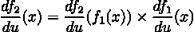

# 深度学习的数学基础

> 原文：<https://medium.com/codex/math-foundations-for-deep-learning-57c8b238d79b?source=collection_archive---------16----------------------->

如果你想精通深度学习(DL)领域的高级主题，你必须知道你将使用的模型之外的基本数学。如果你想真正了解在训练或测试你的模型时发生了什么，这是最基本的:为什么模型过拟合/欠拟合，如何提高性能，如何准备你的数据等等。

这就是为什么我决定开始写一些关于数学和 DL 的帖子。我不知道它会走多远，但如果你喜欢这个教程，并且你想深化一些话题，就给我发电子邮件，或者在 LinkedIn 上联系我(你可以在我的简历中找到 contact)。好吧，让我们从实际的东西开始。

# 功能

让我们从[维基百科](https://en.wikipedia.org/wiki/Function_(mathematics))中获取函数的定义:

> 在数学中，从集合 *X* 到集合 *Y* 的**函数**恰好给 *X* 的每个元素分配一个 *Y* 的元素。集合 *X* 称为函数的定义域，集合 *Y* 称为函数的共定义域。

我们可以用图形来看这个定义，如下:

将四种颜色形状中的任何一种与其颜色相关联的函数。

到现在为止，函数的概念应该够清楚了。让我们看一个例子来更好地阐明这个想法。

> 我们有一个函数 f，它接受一个整数 x 作为输入，定义如下 **f(x) = x + 1。**这意味着函数 f，取一个整数 x 作为输入，它将返回下一个整数作为输出。例如，如果 x=5，那么 f(5) = 5+1 = 6。图形化:

f(x) = x+1 的图表

我不打算深化这个话题，因为我知道每个人都将阅读这篇文章是已经熟悉的功能。只是给你一个简短的提醒。无论如何，如果你在函数上有困难，给我发个信息或者电子邮件就行了。

# 导数

导数是理解深度学习和优化算法如何工作的另一个极其重要的概念。我知道你们大多数人已经熟悉了这个概念，但是让我们简单看看什么是导数。

在高层次上，函数在某一点的导数是该函数的输出相对于其在该点的输入的“变化率”。我们可以用图表来看。

如果你对数学定义更熟悉，你可以这样做:

他的数学形式的导数

通过为 delta 设置一个非常小的值，例如 0.0001，可以在数值上近似计算该限值，然后我们可以计算导数。导数的结果是一个数字，即**点**处切线的斜率(正如我们在上面的 gif 中看到的)。

# 嵌套函数

理解神经网络如何工作的另一个重要概念是理解函数可以被*嵌套*以创建**复合**函数。嵌套意味着如果我们有两个函数，f₁和 f₂，其中一个函数的输出成为下一个函数的输入。数学上:

嵌套函数是另一个函数，所以我们可以计算导数，并且能够计算嵌套函数的导数对于神经网络是必不可少的。让我们看看如何计算嵌套函数的导数。

# 链式法则

链式法则是一个数学定理，它让我们可以计算复合函数的导数。深度学习模型在数学上是复合函数，对其导数的推理对于训练它们是必不可少的[1]。

为了计算上述复合函数 y 的导数，对于任何给定值 x，我们有:

这里的 *du* 表示我们正在推导 wrt *u.*

> 为了澄清任何疑问，让我们举个例子。考虑复合函数 *f(x) = (x +1)。*我们可以把这个函数威胁为嵌套函数，定义 *u(x) = x +1* 和 *f(x) = u(x)* 。然后我们可以应用链式法则如下:

注意，每一步都是简单的微积分步骤，在 python 例程中实现这一点非常容易。如果你对此感到疑惑:是的，链式法则可以应用于更复杂的嵌套函数(例如 3、4 甚至更多的嵌套函数)。

# 多输入函数

大多数时候，在深度学习中，我们必须面对具有多个输入的函数，我们可以将这些输入视为描述数据集中条目的特征。

我们来看一个有两个输入的小例子: *f(x，y) = s(x + y)* 其中 sis 是另一个连续函数。你可以想象，我们现在对推导这个函数感兴趣。但是我们怎么做呢？我们可以简单地应用链式法则，分别导出 wrt x 和 y。

我们可以把前面的函数看作嵌套函数 f(x，y) = s(a(x，y))，其中函数 *a* 做加法 *x+y* 。然后我们有:

和推导 wrt y 是一样的。这些被称为**偏导数。**

# 结论

在这篇简短的文章中，我们已经看到了有助于理解深度学习和神经网络背后的基本数学知识。在下一篇文章中，我们将看到如何使用 pandas 库在 python 中实现这个概念，然后我们将看到向量形式以及使用向量和矩阵的原因。

希望你喜欢这篇文章💪🏻

# 文献学

[1] **深度学习从零开始**，*赛斯·魏德曼*