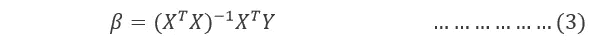

# 套索和岭回归的数学背景

> 原文：<https://medium.com/codex/mathematical-background-of-lasso-and-ridge-regression-23b74737c817?source=collection_archive---------0----------------------->

在某些情况下，简单的模型可能无法概括数据，当在训练数据上实现非常复杂的模型时，它会过度拟合。正则化是一种用于解决模型过拟合问题的技术。正则化只不过是将系数项(β)添加到成本函数中，从而使这些项受到惩罚并且数量很小。这在本质上有助于捕捉数据中的趋势，同时通过不让模型变得太复杂来防止过度拟合。(即在训练数据上表现良好的同时尽可能简单的模型)。通过正则化，人们试图在保持模型简单和不使其过于天真之间取得微妙的平衡。

两种最常见的正则化技术:

①L1 或拉索回归

(2) L2 或岭回归

## **线性回归:**

在线性回归设置中，给我们 yᵢ)}ᴺᵢ₌₁{(xᵢ的 n 个样本，其中每个 xᵢ = (xᵢ₁,…,xᵢₚ)是特征的 p 维向量，每个 yᵢ ∈ ℝ是相关的响应变量。我们的目标是使用特征的线性组合来近似响应变量 yᵢ。

该模型由回归权重向量β = (β₁,…,βₚ) ∈ ℝᵖ和截距(或偏差)项β₀ ∈ ℝ来参数化

为了评估最佳拟合线，需要优化相应的成本函数(或损失函数)。例如，考虑均方误差(MSE)作为成本函数

上述成本函数的系数由以下封闭形式的解确定。

## 岭回归或 L2 回归:

在岭回归中，“系数平方和”的附加项被添加到成本函数中[2]。岭回归本质上是试图最小化误差项的总和以及我们试图确定的系数的平方和。系数的平方和被称为“正则项”,它也具有由λ表示的正则化系数。

上述成本函数的系数值由以下封闭形式的解确定。

## 拉索或 L1 回归:

在 lasso(最小绝对收缩选择算子)回归中，将“系数绝对值之和”的正则化项添加到成本函数中[2]。Lasso 将冗余变量的系数修剪为零，因此也直接执行特征选择。

因此，一般形式的脊和套索的成本函数由下式给出:

这里 E(β)是误差项，R(β)是正则项。如果我们使用λ的高值，我们将会在控制模型的复杂性上付出很多额外的代价。它根本不允许系数太大。如果我们允许λ接近于零，则意味着没有正则化，并且很有可能过度拟合。这里λ是目标函数中的超参数，我们将其最小化用于正则化回归。

Lasso 将冗余变量的系数修剪为零，因此也直接执行特征选择。另一方面，Ridge 将系数降低到任意低值，尽管不是零。

在 lasso 中，我们用系数的绝对值之和作为正则项，这使得事情有点不方便，绝对值在为零的情况下是不可微的。因此，我们不再像在岭回归[4]中那样得到任何封闭形式的解

现在让我们了解 Lasso 的正则化项如何有助于特征选择。套索回归产生稀疏解-这意味着许多模型系数自动精确为零，βⱼ = 0。

如果β*是我们最终得到的最佳模型，则为:

这里 argmin 计算表达式 E(β)+ λR(β)最小的β值。稀疏度(β*)随着λ的增加而增加，其中模型的稀疏度(β*)由β*中恰好等于零的参数的数量来定义。在现实世界的问题中，我们经常有大量的特征，但是我们希望模型能够只选取最有用的特征(因为我们不想要不必要的复杂模型)。由于套索正则化产生稀疏解，它会自动执行要素选择。

## **为什么 Lasso 提供了稀疏解，而 Ridge 没有？**

为了理解为什么 lasso 最终得到了稀疏解，而 ridge 没有，我们需要理解这两个损失函数的性质。如果我们能把这些功能形象化，这将会很方便。如图 1 所示，函数 f(x，y)以各种方式可视化。

图 1:功能的可视化

对于一个给定为第三轴的函数 f(x，y ),比方说 Z 用来绘制函数的输出值，一旦我们连接所有的值，我们就得到一个曲面。

还有另一种方法，使用下图所示的等高线来显示函数。例如，写出 f(x，y) = x + y 和 x + y

图 2:函数 f(x + y)(左)和 f(x + y)(右)的等高线

对于等高线，我们连接函数值相同的所有点，最终得到该函数的等高线，这是该函数的可视化表示[图 2]。没有两条等高线可以相交，这意味着一个函数不能有两个不同的 x 和 y 的值，但是两条等高线可以相切。

图 3 描述了只有两个参数时的套索(左)和岭回归(右)。残差平方和具有椭圆轮廓，以完全最小二乘估计为中心。套索的正则化区域是菱形|β₁|+|β₂|≤ t，而脊的正则化区域是圆盘|β₁ |+|β₂ |≤ t。这两种方法都找到椭圆轮廓碰到正则化区域的第一个点。与圆盘不同，钻石有角；如果解出现在拐角处，那么它的单参数βⱼ等于零。当 p>2(大于 2 个特征)时，菱形变成菱形，并有许多角、平边和面；估计参数为零的机会更多。

图 3:*lasso(左)和 ridge regression(右)的估计图。显示的是误差和正则化函数的等高线。实心蓝色区域是正则化区域，而红色椭圆是误差函数*的轮廓

我们可以推广岭和套索，并将其视为贝叶斯估计。考虑标准

其中 q=1 对应于套索，而 q=2 对应于岭回归

*图 4:对于给定的 q 值*，恒定值的等高线(来自方程 9)

## 参考资料:

[1]j . Friedman、t . Hastie 和 r . TiB shirani(2001 年)。《统计学习的要素》(第 1 卷，第 10 期)。纽约:统计学中的斯普林格系列。