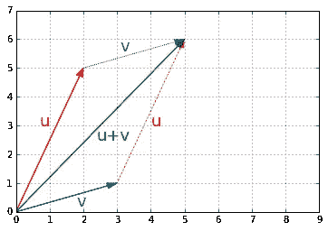

# 数学(线性代数)

> 原文：<https://medium.com/codex/mathematics-linear-algebra-7b431be2c2d4?source=collection_archive---------7----------------------->

# 线性代数

*   线性代数是数学的一个分支，研究[向量空间](https://en.wikipedia.org/wiki/Vector_space)和向量空间之间的线性变换，比如旋转一个形状，放大或缩小，平移(即移动)等。
*   机器学习在很大程度上依赖于线性代数，因此理解什么是向量和矩阵，可以用它们执行什么操作，以及它们如何有用是至关重要的。

# 向量

## 定义

*   矢量是由大小和方向定义的量。例如，火箭的速度是一个三维向量:它的大小是火箭的速度，方向是向上的。一个向量可以用一个叫做*标量*的数组来表示。每个标量对应于向量在每个维度上的大小。
*   例如，假设火箭以微小的角度上升:它的垂直速度为 5000 米/秒，向东的速度为 10 米/秒，向北的速度为 50 米/秒。火箭的速度可由以下矢量表示:


*   注意:按照惯例，向量通常以列的形式出现。此外，向量名通常是小写的，以区别于矩阵(我们将在下面讨论),并且是粗体的(如果可能),以区别于简单的标量值，例如米每秒=5026 米每秒= 5026。
*   一列 NN 数也可能表示一个点在 NN 维空间中的坐标，所以把向量表示为简单的点而不是箭头是相当频繁的。有 1 个元素的向量可能表示为轴上的箭头或点，有 2 个元素的向量表示为平面上的箭头或点，有 3 个元素的向量表示为空间中的箭头或点，有 NN 个元素的向量表示为 NN 维空间中的箭头或点……这是大多数人难以想象的。

## 目的

*   向量在机器学习中有许多用途，最显著的是用来表示观察和预测。例如，假设我们建立了一个机器学习系统，根据我们对视频的了解将视频分为 3 类(好的、垃圾的、点击诱饵的)。对于每个视频，我们将有一个向量来表示我们对它的了解，例如:


*   这个向量可以表示一个持续 10.5 分钟的视频，但是只有 5.2%的观众观看超过一分钟，它平均每天获得 3.25 次观看，并且它被标记为垃圾邮件 7 次。如您所见，每个轴可能有不同的含义。
*   基于这个向量，我们的机器学习系统可以预测它有 80%的概率是垃圾视频，18%的概率是点击诱饵，2%的概率是好视频。这可以表示为以下向量:


# Python 中的向量

*   在 python 中，向量可以用多种方式表示，最简单的是一个常规的 python 数字列表:

```
[10.5, 5.2, 3.25, 7.0]
```

*   因为我们计划进行大量的科学计算，所以使用 NumPy 的`ndarray`会好得多，它提供了许多对向量的基本数学运算的方便和优化的实现，例如:

```
import numpy as np
video = np.array([10.5, 5.2, 3.25, 7.0])
video
```

*   向量的大小可以使用`size`属性获得:

```
video.size
```

*   向量 v 的第 I 个元素(也称为*条目*或*条目*)记为 vi
*   请注意，数学中的索引一般从 1 开始，但编程中的索引通常从 0 开始。因此，要以编程方式访问 video3，我们应该编写:

```
video[2] ## 3rd element
```

# 绘制向量

*   为了绘制向量，我们将使用 matplotlib，所以让我们从导入它开始(关于 Matplotlib 的详细信息，请查看我们的 [Matplotlib 教程](https://aman.ai/primers/matplotlib)):

```
import matplotlib.pyplot as plt
```

*   在 Jupyter/Colab 笔记本中，我们可以通过运行`%matplotlib inline`魔术命令简单地输出笔记本中的图形。

```
%matplotlib inline
```

# 2D 向量

*   现在，为数组容器导入 NumPy 来处理我们要绘制的输入数据:

```
import numpy as np
```

*   让我们创建几个非常简单的 2D 向量来绘制:

```
u = np.array([2, 5])
v = np.array([3, 1])
```

*   这些向量每个都有两个元素，因此可以很容易地在 2D 图上用图形表示，例如用点表示:

```
x_coords, y_coords = zip(u, v)
plt.scatter(x_coords, y_coords, color=["r","b"])
plt.axis([0, 9, 0, 6])
plt.grid()
plt.show()
```


# 三维矢量

*   绘制 3D 矢量也相对简单。首先让我们创建两个 3D 向量:

```
import numpy as np
```

```
a = np.array([1, 2, 8])
b = np.array([5, 6, 3])
```

*   现在让我们使用 matplotlib 的`Axes3D`来绘制它们。注意，我们将使用`mpl_toolkits`来执行这一步(并且`matplotlib`在安装过程中不会加载`mpl_toolkits`作为依赖项)，所以让我们首先使用`pip install --upgrade matplotlib`来加载它(如果您在 Jupyter 笔记本中运行这一步，请使用`!pip install --upgrade matplotlib`)。

```
import matplotlib.pyplot as plt
from mpl_toolkits.mplot3d import Axes3D
```

```
subplot3d = plt.subplot(111, projection='3d')
x_coords, y_coords, z_coords = zip(a,b)
subplot3d.scatter(x_coords, y_coords, z_coords)
subplot3d.set_zlim3d([0, 9])
plt.show
```


*   很难想象这两个点在空间中的确切位置，所以让我们添加垂直线。我们将创建一个方便的小函数来绘制一个附有垂直线的 3D 向量列表:

```
def plot_vectors3d(ax, vectors3d, z0, **options):
    for v in vectors3d:
        x, y, z = v
        ax.plot([x,x], [y,y], [z0, z], color="gray", linestyle='dotted', marker=".")
    x_coords, y_coords, z_coords = zip(*vectors3d)
    ax.scatter(x_coords, y_coords, z_coords, **options)
```

```
subplot3d = plt.subplot(111, projection='3d')
subplot3d.set_zlim([0, 9])
plot_vectors3d(subplot3d, [a,b], 0, color=("r","b"))
plt.show()
```


# 标准

*   ∣∣u∣∣指出，向量 u 的范数是 u 的长度的度量。有多种可能的范数，但最常见的是欧几里德范数，其定义为:


*   回想一下，我们可以用纯 python 轻松实现这一点


```
def vector_norm(vector):
    squares = [element**2 for element in vector]
    return sum(squares)**0.5
```

```
u = np.array([2, 5])
print("||", u, "|| =")
vector_norm(u) # Prints 5.385164807134504
```

*   然而，使用 NumPy 的`norm`函数更有效，该函数在`linalg`(**Lin**ear**Alg**ebra)模块中可用:

```
import numpy.linalg as LA
LA.norm(u) # Prints 5.385164807134504
```

*   让我们画一个小图来证实向量 v 的长度确实是≈5.4:

```
radius = LA.norm(u)
plt.gca().add_artist(plt.Circle((0,0), radius, color="#DDDDDD"))
```

```
def plot_vector2d(vector2d, origin=[0, 0], **options):
    return plt.arrow(origin[0], origin[1], vector2d[0], vector2d[1], head_width=0.2, 
           head_length=0.3, length_includes_head=True, **options)plot_vector2d(u, color="red")
plt.axis([0, 8.7, 0, 6])
plt.grid()
plt.show()
```


*   看起来差不多吧！

# 添加

*   相同大小的向量可以加在一起。逐元素执行添加*:*

```
*import numpy as np*
```

```
*u = np.array([2, 5])
v = np.array([3, 1])print(" ", u)
print("+", v)
print("-"*10)
u +*
```

*   *哪些输出:*

```
*[2 5]
+ [3 1]
----------
array([5, 6]*
```

*   *让我们看看矢量加法是什么样的图形:*

```
*plot_vector2d(u, color="r")
plot_vector2d(v, color="b")
plot_vector2d(v, origin=u, color="b", linestyle="dotted")
plot_vector2d(u, origin=v, color="r", linestyle="dotted")
plot_vector2d(u+v, color="g")
plt.axis([0, 9, 0, 7])
plt.text(0.7, 3, "u", color="r", fontsize=18)
plt.text(4, 3, "u", color="r", fontsize=18)
plt.text(1.8, 0.2, "v", color="b", fontsize=18)
plt.text(3.1, 5.6, "v", color="b", fontsize=18)
plt.text(2.4, 2.5, "u+v", color="g", fontsize=18)
plt.grid()
plt.show()*
```

**

*   *向量加法是**可换的**，意思是 u+v=v+u，你可以在上一张图中看到:跟随 uu *然后* vv 导致的点与跟随 vv *然后* uu 的点相同。*
*   *向量加法也是**联想**，意思是 u+(v+w)=(u+v)+w*
*   *如果你有一个由多个点(向量)定义的形状，你在所有这些点上加上一个向量 v，那么整个形状就会移动 v，这叫做几何平移:*

```
*t1 = np.array([2, 0.25])
t2 = np.array([2.5, 3.5])
t3 = np.array([1, 2])*
```

```
*x_coords, y_coords = zip(t1, t2, t3, t1)
plt.plot(x_coords, y_coords, "c--", x_coords, y_coords, "co")plot_vector2d(v, t1, color="r", linestyle=":")
plot_vector2d(v, t2, color="r", linestyle=":")
plot_vector2d(v, t3, color="r", linestyle=":")t1b = t1 + v
t2b = t2 + v
t3b = t3 + vx_coords_b, y_coords_b = zip(t1b, t2b, t3b, t1b)
plt.plot(x_coords_b, y_coords_b, "b-", x_coords_b, y_coords_b, "bo")plt.text(4, 4.2, "v", color="r", fontsize=18)
plt.text(3, 2.3, "v", color="r", fontsize=18)
plt.text(3.5, 0.4, "v", color="r", fontsize=18)plt.axis([0, 6, 0, 5])
plt.grid()
plt.show()*
```

**

*   *最后，减去一个向量就像加上相反的向量。*