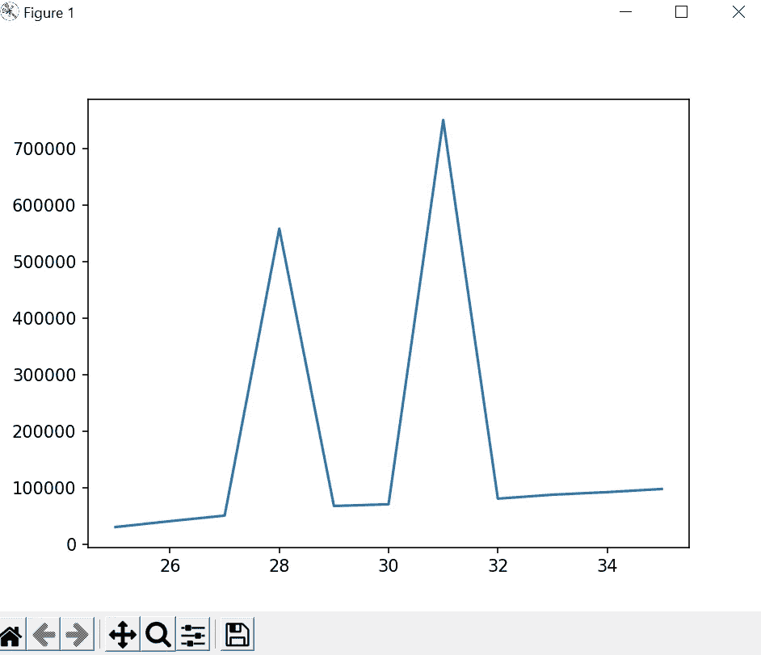
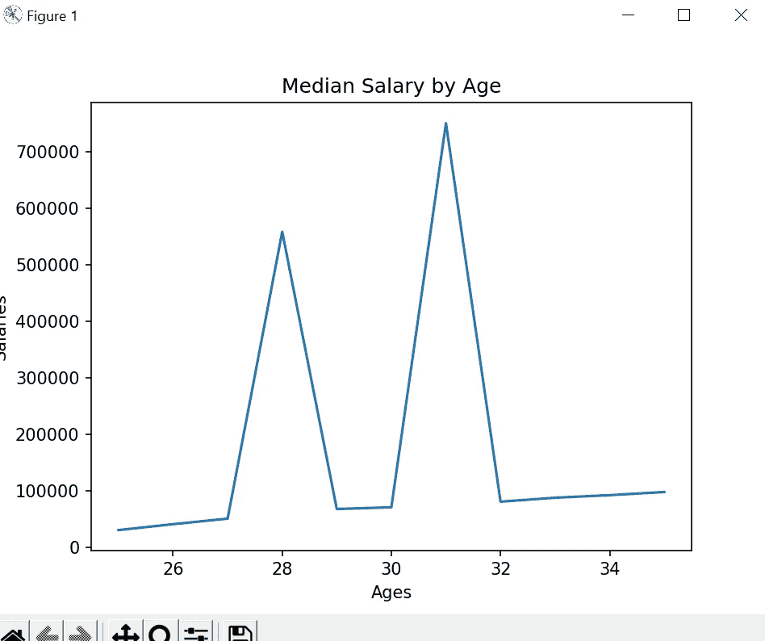
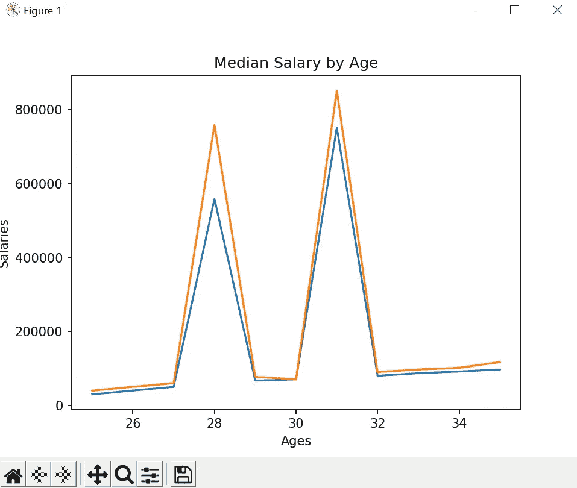
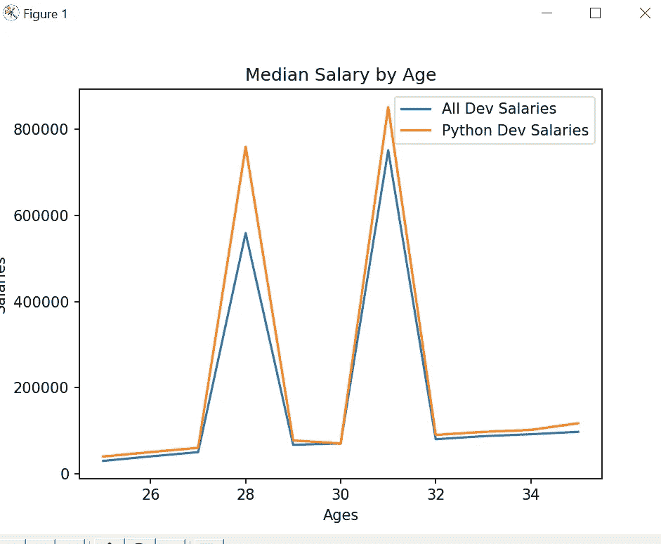
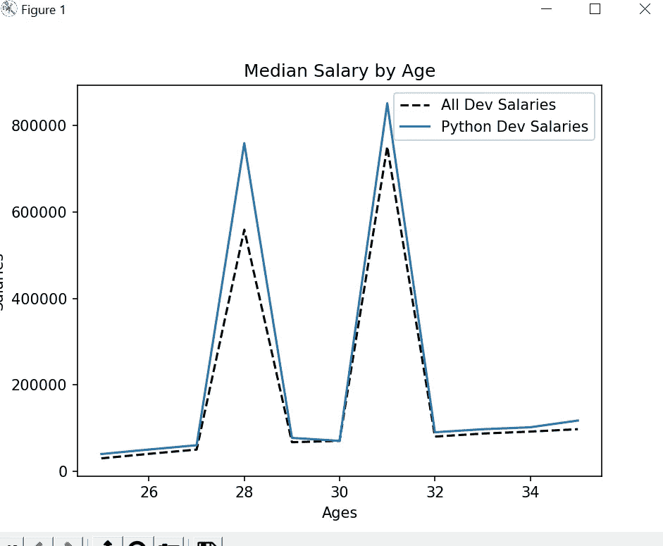
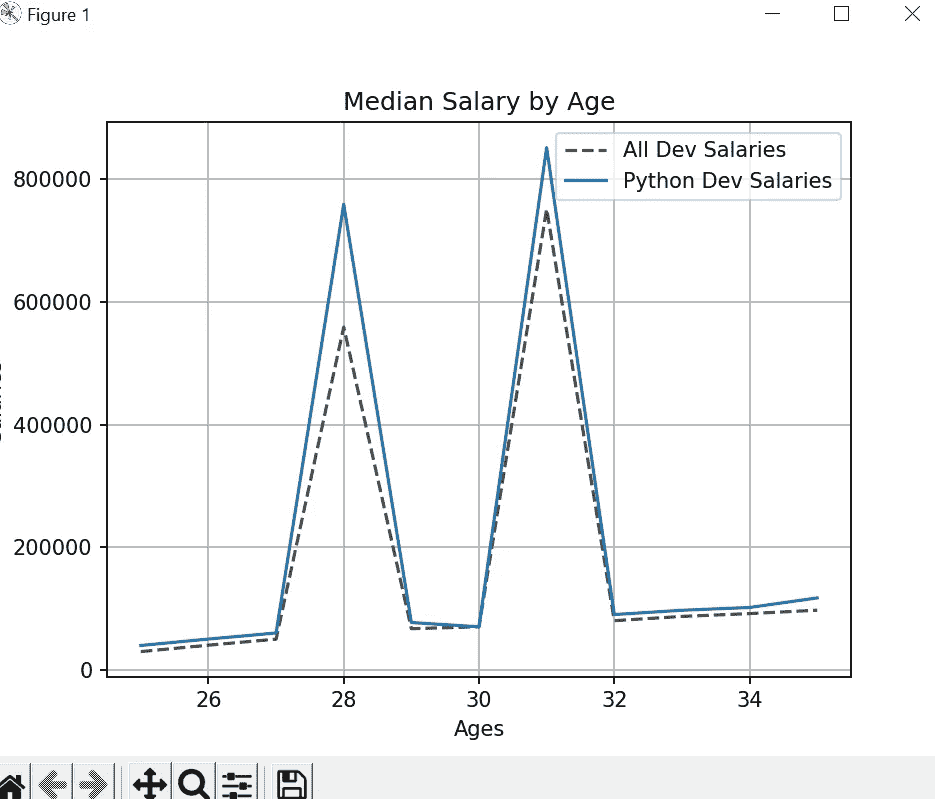
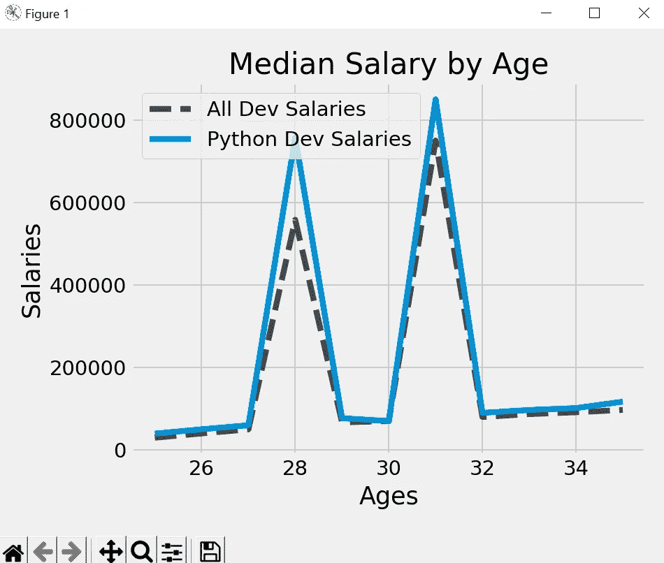

# Matplotlib 教程— 1

> 原文：<https://medium.com/codex/matplotlib-tutorial-1-ebcddc93644f?source=collection_archive---------15----------------------->

本教程将介绍如何开始使用 Matplotlib。Matplotlib 是一个绘图库，具有很多功能，可以以易于理解的格式可视化我们的数据。我们将学习如何制作简单的线图，自定义我们的图形，以及使用 Matplotlib 的基础知识。

让我们从我们将使用下面的 pip 命令执行的 Matplotlib 安装开始。

```
pip install matplotlib
```

我在这个系列教程中使用 Pycharm，但是你也可以使用任何编辑器。

现在，开始用样本数据创建第一个基本图，并理解代码。

```
from matplotlib import pyplot as plt

dev_x = [25,26,27,28,29,30,31,32,33,34,35]
dev_y = [30123,40589,50445,558889,67454,70555,751122,80456,87456,92000,97585]

plt.plot(dev_x,dev_y)
plt.show()
```

在上面的代码中，我们从 matplotlib 导入了 pyplot，并创建了样本数据 dev_x 作为 x 轴，dev_y 作为 y 轴。然后在作图法中，我们给出了 x 和 y 轴的 ais 数据。“plt.show()”方法用于展示情节。

如果我们运行上面的代码，我们将得到一个简单的图形，如下所示。



在图表中，我们将 x 轴作为年龄，y 轴作为工资，此外，我们还有一些选项，如“在家评级”、“撤消”、“重做”、“追加”、“最大化”和“保存”。

现在，我们在图表上没有任何标题，这里也没有表示 x 轴和 y 轴值的标签，让我们添加相同的标签。

```
from matplotlib import pyplot as plt

dev_x = [25,26,27,28,29,30,31,32,33,34,35]
dev_y = [30123,40589,50445,558889,67454,70555,751122,80456,87456,92000,97585]

plt.plot(dev_x,dev_y)
plt.xlabel('Ages')
plt.ylabel('Salaries')
plt.title('Median Salary by Age')
plt.show()
```



x 轴标签使用 xlabel 方法，类似地，y 轴标签使用 ylabel，绘图标题使用 title()方法。

现在，我们想在 Python 开发人员工资图中再添加一行，我们可以使用下面的代码添加同样的内容。

```
from matplotlib import pyplot as plt

dev_x = [25,26,27,28,29,30,31,32,33,34,35]
dev_y = [30123,40589,50445,558889,67454,70555,751122,80456,87456,92000,97585]

plt.plot(dev_x,dev_y)

python_y = [40123,50589,60445,758889,77454,70555,851122,90456,97456,102000,117585]
plt.plot(dev_x,python_y)

plt.xlabel('Ages')
plt.ylabel('Salaries')
plt.title('Median Salary by Age')
plt.show()
```



我们已经为 Python 开发人员的薪水添加了一行，但是我们不知道哪一行代表哪一份薪水，所以我们必须为其添加一个图例，有两种方法可以添加图例，第一种是使用下面代码中所示的 legend 方法。

```
plt.legend(['All Dev Salaries', 'Python Dev Salaries'])
```

在第二个例子中，我们可以在创建绘图时传递标签，这与前面的例子相比不容易出错，并且在我们的代码中也提供了一个很好的参考，下面是例子。

```
from matplotlib import pyplot as plt

dev_x = [25,26,27,28,29,30,31,32,33,34,35]
dev_y = [30123,40589,50445,558889,67454,70555,751122,80456,87456,92000,97585]

plt.plot(dev_x,dev_y, label = 'All Dev Salaries')

python_y = [40123,50589,60445,758889,77454,70555,851122,90456,97456,102000,117585]
plt.plot(dev_x,python_y, label =  'Python Dev Salaries')

plt.xlabel('Ages')
plt.ylabel('Salaries')
plt.title('Median Salary by Age')
plt.legend()
plt.show()
```



现在，我们想改变绘图的格式，我们可以使用相同的格式字符串，下面是 matplotlib 格式字符串的链接，格式字符串由颜色、标记和线条组成。

```
fmt = '[marker][line][color]'
```

[](https://matplotlib.org/stable/api/_as_gen/matplotlib.pyplot.plot.html) [## Matplotlib . py plot . plot-Matplotlib 3 . 6 . 2 文档

### 用线条和/或标记绘制 y 与 x 的关系。调用签名:点或线节点的坐标由 x…

matplotlib.org](https://matplotlib.org/stable/api/_as_gen/matplotlib.pyplot.plot.html) 

假设对于 Python 开发者，我们想要黑色和虚线，我们可以在创建绘图时传递下面的格式字符串。

```
plt.plot(dev_x,dev_y,'--k', label = 'All Dev Salaries')
```

我们没有使用标记，所以直接传递了第二个参数，虚线用双破折号，黑色用字符“k”。



但是代码中的格式字符串可读性不强，所以我们可以显式地传递参数，而不是放置格式字符串，以使代码可读性更好，下面是相同的示例。

```
plt.plot(dev_x,dev_y,linestyle = '--',color = 'k', label = 'All Dev Salaries')
```

我们还可以为颜色传递哈希值，这很容易在网上获得不同的组合，例如，我在这里使用哈希值' #444444 '。在散列值中，前两个数字表示红色，后两个表示绿色，最后一个表示蓝色，所以这里一切都是一样的，它将生成暗灰色的组合。

```
plt.plot(dev_x,dev_y,linestyle = '--',color = '#444444', label = 'All Dev Salaries')
```

此外，我们可以在绘图中使用网格，下面是相同的代码。

```
plt.grid(True)
```



此外，我们可以使用多种可用于我们的绘图的样式，要检查可用的样式，只需打印' plt.style.available，它会给你一个所有样式的列表。

['Solarize_Light2 '，' _classic_test_patch '，' _mpl-gallery '，' _mpl-gallery-nogrid '，' bmh '，' classic '，' dark_background '，'['Solarize_Light2 '，' _classic_test_patch '，' _mpl-gallery-nogrid '，' _ mpl-gallery-no grid '，' bmh '，' classic '，' dark_background '，' fast '，' fivethirtyeight '，' ggplot '，' gray '，' seaborn '，' seaborn-color

因此，在我们的绘图中，如果我们想使用“fivethirtyeight”样式，我们可以通过下面的代码简单地使用它。

```
plt.style.use('fivethirtyeight')
```



因此，我们可以尝试多种风格，以获得更好的表现，如果您想保存绘图，我们可以使用 savefig 方法做同样的事情，并传递位置。

```
plt.savefig('plot.png')
```

我的下一个教程将涵盖条形图和分析 CSV 数据。