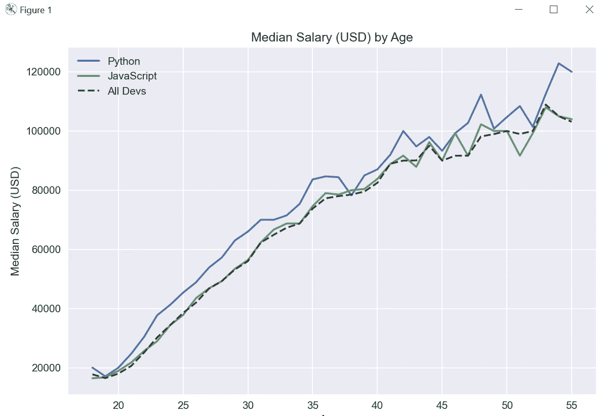
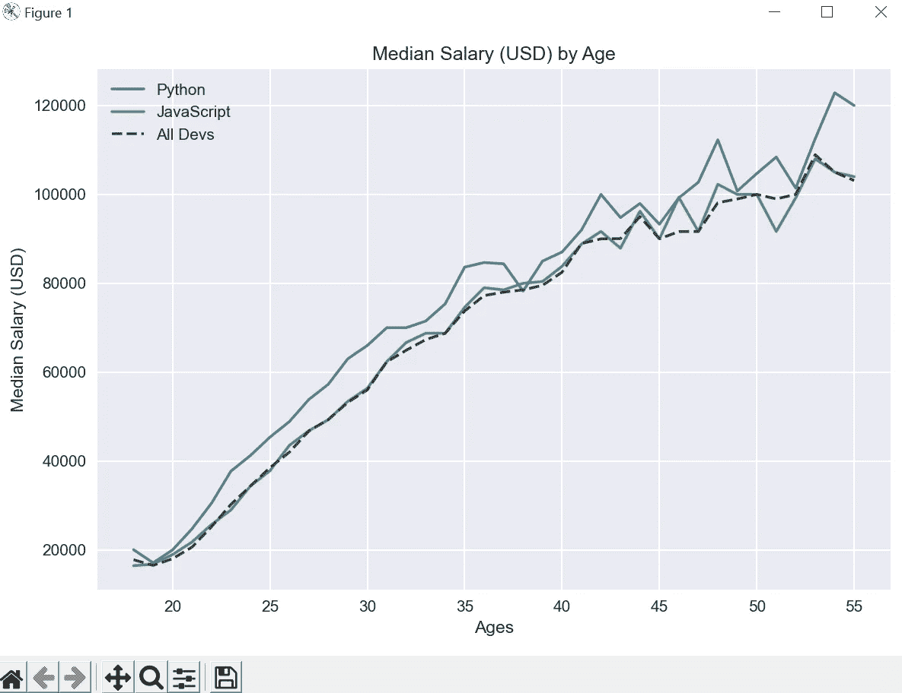
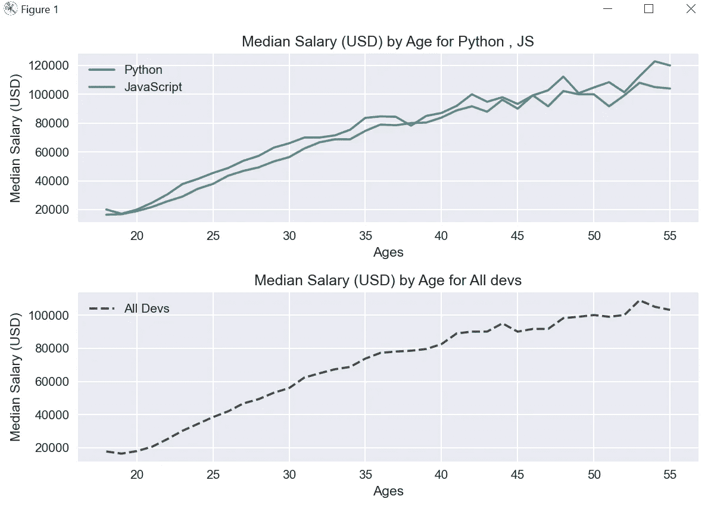

# Matplotlib 教程— 10

> 原文：<https://medium.com/codex/matplotlib-tutorial-10-9ce249b22889?source=collection_archive---------5----------------------->

本教程将介绍使用 matplotlib 的支线剧情。

matplotlib 库的 pyplot 模块中的 **subplots()函数**用于创建一个图形和一组 subplots。

让我们先检查一下我们在上一篇博客中创建的基本线剧情，然后我们将在支线剧情中进行同样的转换。

```
import pandas as pd
from matplotlib import pyplot as plt

plt.style.use('seaborn')

data = pd.read_csv('subplotData.csv')
ages = data['Age']
dev_salaries = data['All_Devs']
py_salaries = data['Python']
js_salaries = data['JavaScript']

plt.plot(ages, py_salaries, label='Python')
plt.plot(ages, js_salaries, label='JavaScript')

plt.plot(ages, dev_salaries, color='#444444',
         linestyle='--', label='All Devs')

plt.legend()

plt.title('Median Salary (USD) by Age')
plt.xlabel('Ages')
plt.ylabel('Median Salary (USD)')

plt.tight_layout()

plt.show()
```

在这里，我们已经从 CSV 导入了开发数据，并为 Python 和 Javascript 绘制了一个折线图，我们将运行此代码的所有开发都将得到一个简单的折线图。



现在，我们需要以这样一种方式绘制这个图，Python 和 javascript 行将出现在一个图中，而所有 dev 将出现在另一个图中，我们将使用 subplot()方法来执行这一点。

不带参数的 subplots()返回一个图形和一个坐标轴。

这实际上是创建单个图形和轴的最简单和推荐的方法。

```
fig, ax = plt.subplots()
ax.plot(x, y)
ax.set_title('A single plot')
```

现在，在我们的代码中创建一个 subplot 对象，并使用 subplot()创建相同的图形。

```
import pandas as pd
from matplotlib import pyplot as plt

plt.style.use('seaborn')

data = pd.read_csv('subplotData.csv')
ages = data['Age']
dev_salaries = data['All_Devs']
py_salaries = data['Python']
js_salaries = data['JavaScript']

fig , ax = plt.subplots()
ax.plot(ages, py_salaries, label='Python')
ax.plot(ages, js_salaries, label='JavaScript')

ax.plot(ages, dev_salaries, color='#444444',
         linestyle='--', label='All Devs')

ax.legend()

ax.set_title('Median Salary (USD) by Age')
ax.set_xlabel('Ages')
ax.set_ylabel('Median Salary (USD)')

plt.tight_layout()

plt.show()
```

这里，我们创建了一个没有任何参数的 subplots 方法的对象，所以它将返回一个图形和一个轴，我们将使用 ax.plot()代替 plt.plot()。

图例也是如此，当我们使用 subplots 时，标题标签被更改为 set_title、xlabel 和 ylabel，所以当我们运行相同的代码时，我们将得到相同的图形，但使用 subplots()方法。



现在，回到我们最初的需求，我们希望在一个轴上创建 Python 和 Java 脚本，在另一个轴上创建所有的 dev。

为了达到同样的目的，我们必须传递两行一列的参数。

```
fig , (ax1,ax2) = plt.subplots(nrows=2,ncols=1)
```

因为它现在返回两个轴，所以我们将在这里解包并为两个轴创建 ax1 和 ax2，ax1 将为 Python 和 JS 使用它们，ax2 为所有开发人员使用，类似地，我们将为两个图分别创建标题和轴。

```
import pandas as pd
from matplotlib import pyplot as plt

plt.style.use('seaborn')

data = pd.read_csv('subplotData.csv')
ages = data['Age']
dev_salaries = data['All_Devs']
py_salaries = data['Python']
js_salaries = data['JavaScript']

fig , (ax1,ax2) = plt.subplots(nrows=2,ncols=1)
ax1.plot(ages, py_salaries, label='Python')
ax1.plot(ages, js_salaries, label='JavaScript')

ax2.plot(ages, dev_salaries, color='#444444',
         linestyle='--', label='All Devs')

ax1.legend()

ax1.set_title('Median Salary (USD) by Age for Python , JS')
ax1.set_xlabel('Ages')
ax1.set_ylabel('Median Salary (USD)')

ax2.legend()

ax2.set_title('Median Salary (USD) by Age for All devs')
ax2.set_xlabel('Ages')
ax2.set_ylabel('Median Salary (USD)')

plt.tight_layout()

plt.show()
```



现在，不是一个图形，如果我们想将这些图形分成两个图形，我们可以简单地为同一个图形创建两个对象。

```
fig1 ,ax1 = plt.subplots()
fig2 , ax2 = plt.subplots()
```

代码的其余部分保持不变，当我们运行代码时，我们将得到两个数字而不是一个。

下面是本教程中使用的代码和数据表的链接。

[](https://github.com/vivalka/Matplotlib-Tutorials/tree/main/Tutorial_10) [## Matplotlib-Tutorials/Tutorial _ 10 位于 main vival ka/Matplotlib-Tutorials

### 此时您不能执行该操作。您已使用另一个标签页或窗口登录。您已在另一个选项卡中注销，或者…

github.com](https://github.com/vivalka/Matplotlib-Tutorials/tree/main/Tutorial_10)