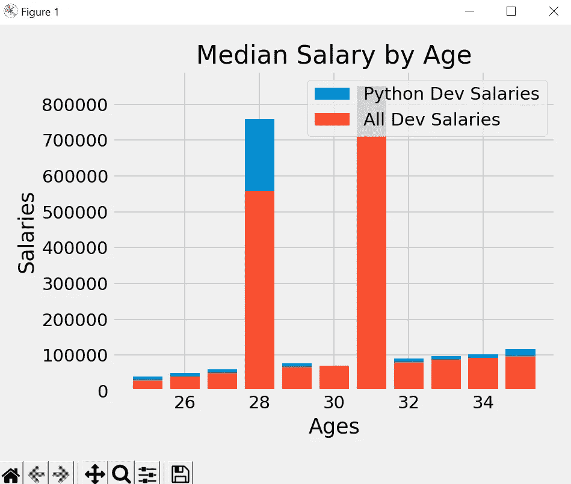

# Matplotlib 教程— 2

> 原文：<https://medium.com/codex/matplotlib-tutorial-2-6297e7ad9fa7?source=collection_archive---------10----------------------->

本教程将涵盖条形图和分析 CSV 数据。

在上一个教程中，我们使用示例数据创建了一个绘图，但如果我们想以条形图格式表示数据，我们可以使用 bar 方法，下面是代码。

```
from matplotlib import pyplot as plt
plt.style.use('fivethirtyeight')
dev_x = [25,26,27,28,29,30,31,32,33,34,35]
dev_y = [30123,40589,50445,558889,67454,70555,751122,80456,87456,92000,97585]

plt.bar(dev_x,dev_y, label = 'All Dev Salaries')
plt.xlabel('Ages')
plt.ylabel('Salaries')
plt.title('Median Salary by Age')
plt.legend()
plt.tight_layout()
plt.show()
```

我们已经用条形图代替了绘图法，它将为相同的数据生成一个条形图。


但如果我们有两个或两个以上的数据相似的图，如果我们用条形图的方法生成条形图，我们会得到一些意想不到的结果。让我们检查一下，然后我们将介绍解决方案。

```
from matplotlib import pyplot as plt
plt.style.use('fivethirtyeight')
dev_x = [25,26,27,28,29,30,31,32,33,34,35]
dev_y = [30123,40589,50445,558889,67454,70555,751122,80456,87456,92000,97585]

python_y = [40123,50589,60445,758889,77454,70555,851122,90456,97456,102000,117585]
plt.bar(dev_x,python_y, label =  'Python Dev Salaries')

plt.bar(dev_x,dev_y, label = 'All Dev Salaries')
plt.xlabel('Ages')
plt.ylabel('Salaries')
plt.title('Median Salary by Age')
plt.legend()
plt.tight_layout()
plt.show()

python_y = [40123,50589,60445,758889,77454,70555,851122,90456,97456,102000,117585]
plt.plot(dev_x,python_y, label =  'Python Dev Salaries')
```



在这里，结果是重叠的，我们没有得到每个数据单独的条形图，这是我们以前用绘图方法得到的。

分离条形图有点棘手，首先，我们需要导入 NumPy 模块，并将 X 轴值转换为 NumPy 列表。

```
from matplotlib import pyplot as plt
import numpy as np
plt.style.use('fivethirtyeight')
dev_x = [25,26,27,28,29,30,31,32,33,34,35]
dev_y = [30123,40589,50445,558889,67454,70555,751122,80456,87456,92000,97585]

x_indexs = np.arange(len(dev_x))
```

现在每个条形都有了自己的宽度，所以我们必须定义一个自定义的宽度，然后用 x_indexs 值加上或减去该宽度，以向左或向右移动条形图。让我们检查下面的代码。

```
from matplotlib import pyplot as plt
import numpy as np
plt.style.use('fivethirtyeight')
dev_x = [25,26,27,28,29,30,31,32,33,34,35]
dev_y = [30123,40589,50445,558889,67454,70555,751122,80456,87456,92000,97585]

x_indexs = np.arange(len(dev_x))
width = 0.25
python_y = [40123,50589,60445,758889,77454,70555,851122,90456,97456,102000,117585]
plt.bar(x_indexs,python_y,width = width, label =  'Python Dev Salaries')

plt.bar(x_indexs + width,dev_y,width = width, label = 'All Dev Salaries')
plt.xlabel('Ages')
plt.ylabel('Salaries')
plt.title('Median Salary by Age')
plt.legend()
plt.tight_layout()
plt.show() 
```

这里，我们将自定义宽度定义为 0.25，在第二个图形中，我们添加了宽度和 x 轴值，以向左移动第二个条形。

此外，我们还向 bar 方法添加了一个参数宽度，并传递了自定义宽度值。现在它将生成预期的条形图。


当可以使用 x-ticks 方法并将年龄作为参数传递时，更正 X 轴中的标签。

```
plt.xticks(ticks=x_indexs,label= dev_x)
```

现在，我们将看到如何创建大型数据表示的水平条形图，我有一个 data.csv 文件，它有两列，一列有响应 id，另一列有 langauge_work_with。


因此，首先我们将使用熊猫导入文件数据并打印出来。

```
import pandas as pd

data = pd.read_csv('data.csv')

respondant = data['Responder_id']
langauge = data['LanguagesWorkedWith']

print(respondant)
print(langauge)
```

现在，我们已经加载了数据，我们需要每种语言的计数，所以我们可以在我们的绘图中使用它，所以我们将在这里使用 counter 函数，并计算语言出现的次数。

```
from builtins import print
from collections import Counter

import pandas as pd
data = pd.read_csv('data.csv')
respondant = data['Responder_id']
langauges = data['LanguagesWorkedWith']

langaugecounter = Counter()
for row in langauges:
    langaugecounter.update(row.split(';'))

print(langaugecounter)

Output-
Counter({'JavaScript': 59219, 'HTML/CSS': 55466, 'SQL': 47544, 'Python': 36443, 'Java': 35917, 'Bash/Shell/PowerShell': 31991, 'C#': 27097, 'PHP': 23030, 'C++': 20524, 'TypeScript': 18523, 'C': 18017, 'Other(s):': 7920, 'Ruby': 7331, 'Go': 7201, 'Assembly': 5833, 'Swift': 5744, 'Kotlin': 5620, 'R': 5048, 'VBA': 4781, 'Objective-C': 4191, 'Scala': 3309, 'Rust': 2794, 'Dart': 1683, 'Elixir': 1260, 'Clojure': 1254, 'WebAssembly': 1015, 'F#': 973, 'Erlang': 777})
```

现在，我们有了条形图的数据，让我们将这些数据分成两个列表，一个用于 x 轴，一个用于 y 轴，然后我们将使用 barh 创建水平条形图。

```
from builtins import print
from collections import Counter
from matplotlib import pyplot as plt
import pandas as pd

plt.style.use('fivethirtyeight')

data = pd.read_csv('data.csv')
respondant = data['Responder_id']
langauges = data['LanguagesWorkedWith']

langaugecounter = Counter()
for row in langauges:
    langaugecounter.update(row.split(';'))

langauge = []
popularity  = []

for row in langaugecounter.most_common(15):
    langauge.append(row[0])
    popularity.append((row[1]))

plt.barh(langauge,popularity)
plt.xlabel('Popularity')
plt.title('Langauge Popularity')
plt.legend()
plt.tight_layout()
plt.show()
```

因此，我们将语言和流行数据分为两个列表，并使用 barh 方法创建水平条形图。此外，我们还使用了已经在 counter 中出现的最常用的方法，并提供了最常用的结果，在这里，我们为这个条形图使用了 15 种更常用的语言。


在下一篇教程中，我们将介绍如何使用 Matplotlib 制作饼状图。