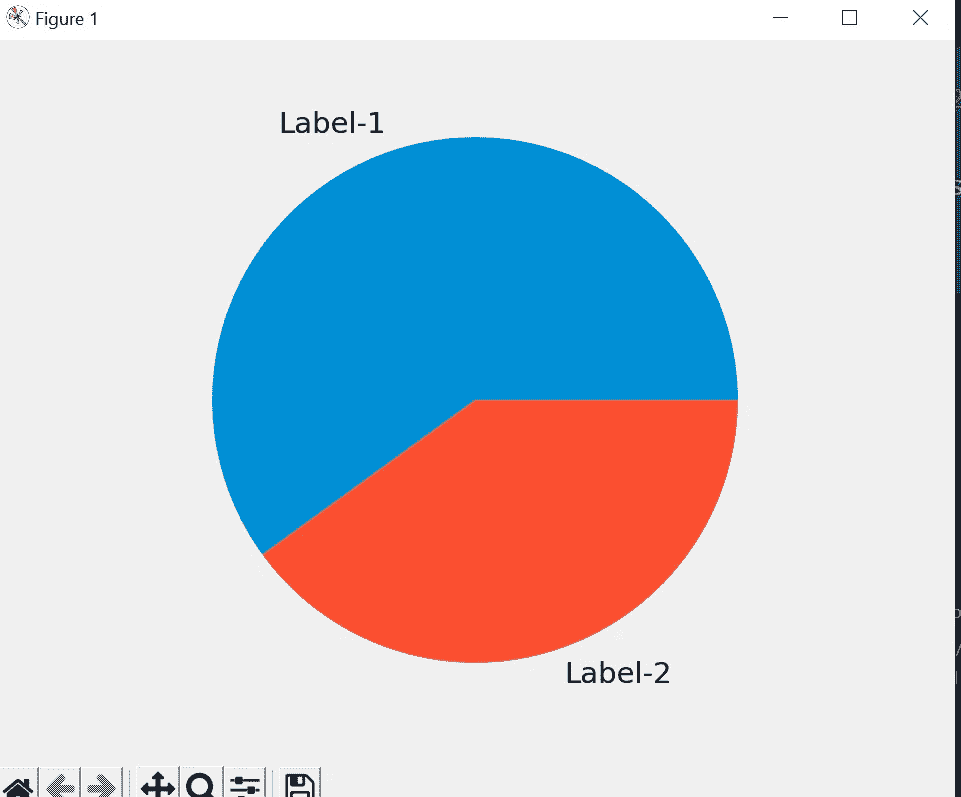
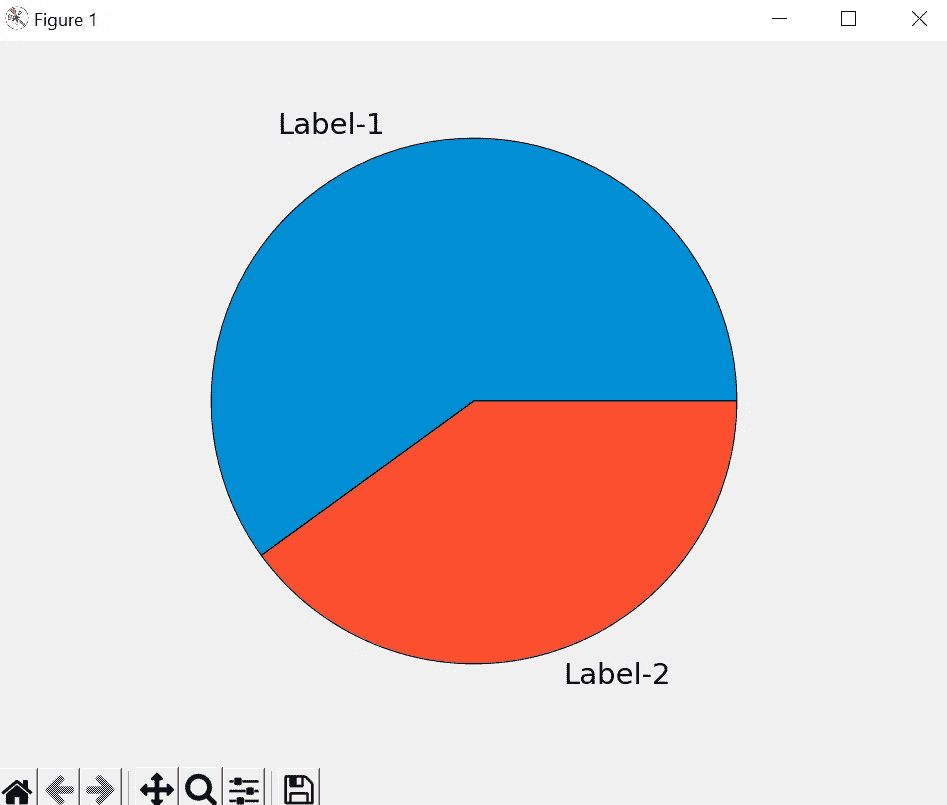
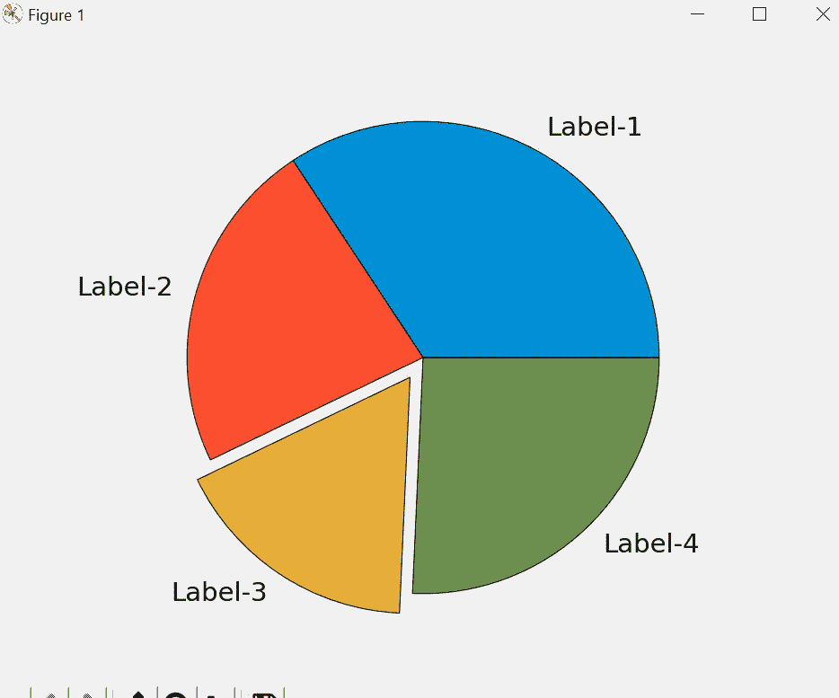
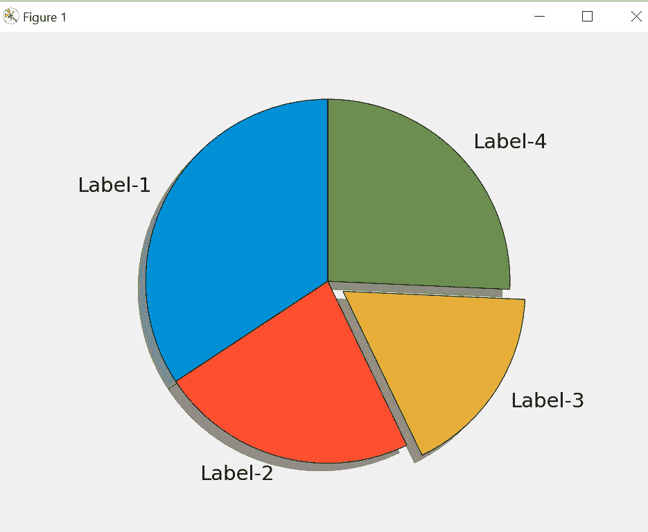
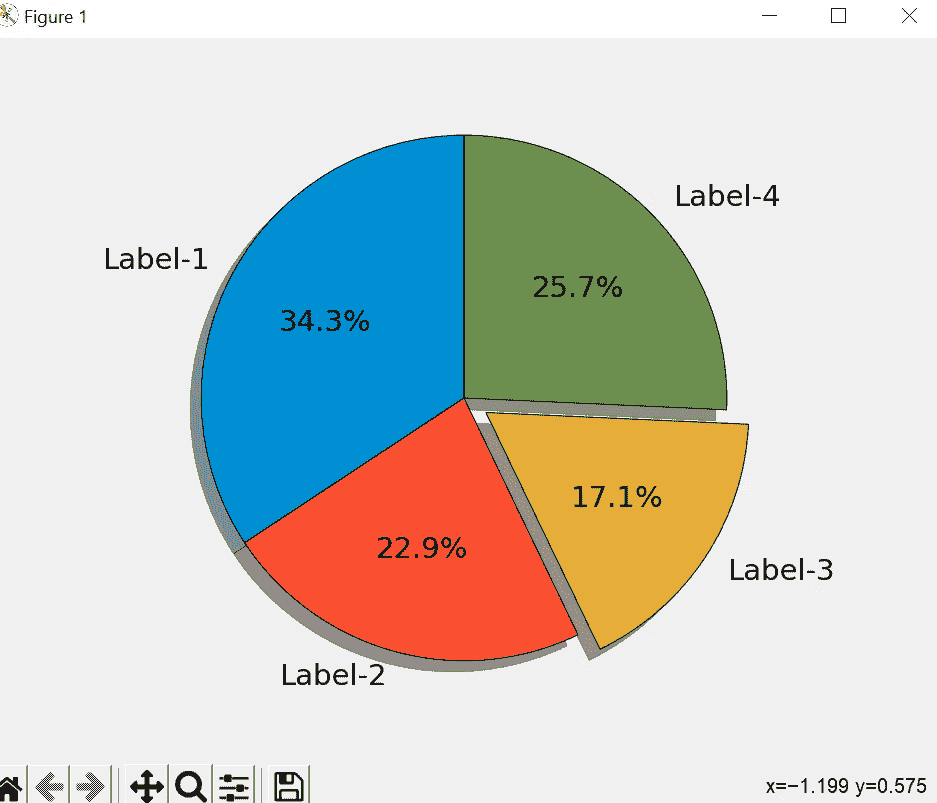

# Matplotlib 教程-3

> 原文：<https://medium.com/codex/matplotlib-tutorial-3-19a707918ae4?source=collection_archive---------13----------------------->

本教程将涵盖，饼状图使用 matplotlib 和相同的配置。

在上一个教程中，我们介绍了使用 Stackoverflow 调查数据的条形图和水平条形图，因此我们将首先介绍饼图的基础知识，然后使用相同的调查数据创建饼图。

```
from matplotlib import pyplot as plt
plt.style.use('fivethirtyeight')
slices = [60,40]
labels = ['Label-1','Label-2']

plt.pie(slices,labels=labels)

plt.tight_layout()
plt.show()
```

在本例中，我创建了包含两个值的切片和一个包含两个值的标签的“标签”列表。

pie()方法用于使用 matplotlib 创建饼图，我们传递了两个参数，第一个是切片值，第二个是切片值的标签。它将生成基本的饼图。



在这个饼图中，颜色是重叠的，所以如果我们想用线条将它们分开，我们可以添加一个参数，下面是代码。

```
from matplotlib import pyplot as plt
plt.style.use('fivethirtyeight')
slices = [60,40]
labels = ['Label-1','Label-2']

plt.pie(slices,labels=labels,wedgeprops={'edgecolor':'black'})

plt.tight_layout()
plt.show()
```



现在，如果我们想为饼图添加自定义颜色，我们可以为其添加颜色参数并传递颜色列表。

```
from matplotlib import pyplot as plt
plt.style.use('fivethirtyeight')
slices = [60,40,30,45]
labels = ['Label-1','Label-2','Label-3', 'Label-4']
colors = ['#008fd5','#fc4f30','#e5ae37','#6d904f']

plt.pie(slices,labels=labels,wedgeprops={'edgecolor':'black'},colors=colors)

plt.tight_layout()
plt.show()
```


现在，假设我们在这里显示 Label-3 数据，并希望单独显示该切片，我们可以使用 explode 选项。

```
from matplotlib import pyplot as plt
plt.style.use('fivethirtyeight')
slices = [60,40,30,45]
labels = ['Label-1','Label-2','Label-3', 'Label-4']
colors = ['#008fd5','#fc4f30','#e5ae37','#6d904f']
explode = [0,0,0.1,0]

plt.pie(slices,labels=labels,wedgeprops={'edgecolor':'black'},colors=colors,explode=explode)

plt.tight_layout()
plt.show()

# Colors:
# Blue = #008fd5
# Red = #fc4f30
# Yellow = #e5ae37
# Green = #6d904f
```

我在 explode 列表中传递了四个值，所以零之后的任何值都意味着它离图表有多远，所以 0.1 意味着，Label-3 切片将移动图表半径的 10%。



我们可以在代码中将阴影选项设为 true，这样我们的饼状图就会呈现 3D 效果。

此外，如果我们想旋转饼图，我们可以传递 startangle 选项。

```
from matplotlib import pyplot as plt
plt.style.use('fivethirtyeight')
slices = [60,40,30,45]
labels = ['Label-1','Label-2','Label-3', 'Label-4']
colors = ['#008fd5','#fc4f30','#e5ae37','#6d904f']
explode = [0,0,0.1,0]

plt.pie(slices,labels=labels,wedgeprops={'edgecolor':'black'},
        colors=colors,explode=explode,shadow=True,startangle=90)

plt.tight_layout()
plt.show() 
```



最后，如果我们想在切片上显示百分比，我们可以传递一个格式化的字符串作为 autopct 参数，这在文档中可以找到。

```
from matplotlib import pyplot as plt
plt.style.use('fivethirtyeight')
slices = [60,40,30,45]
labels = ['Label-1','Label-2','Label-3', 'Label-4']
colors = ['#008fd5','#fc4f30','#e5ae37','#6d904f']
explode = [0,0,0.1,0]

plt.pie(slices,labels=labels,wedgeprops={'edgecolor':'black'},
        colors=colors,explode=explode,
        shadow=True,startangle=90,autopct='%1.1f%%')

plt.tight_layout()
plt.show() 
```



下一篇教程将介绍如何使用 matplotlib 堆叠绘图。