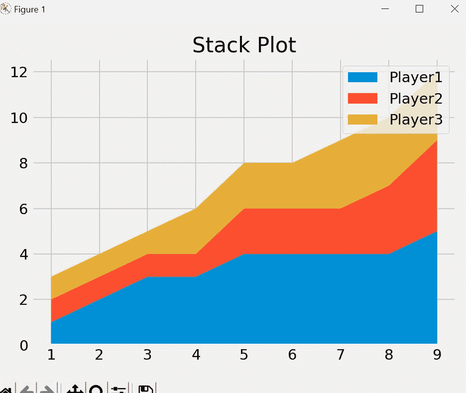

# Matplotlib 教程— 4

> 原文：<https://medium.com/codex/matplotlib-tutorial-4-825c5837add7?source=collection_archive---------11----------------------->

本教程将涵盖使用 Matplotlib 的股票图。

堆栈图显示了一段时间内“部分到整体”的情况；基本上，它就像一个饼图，只是随着时间的推移。堆栈图主要用于查看特定时间段内变量的各种趋势。Matplotlib 有一个用于创建堆栈图的内置函数，称为 stackplot()。

让我们来理解一下我们将用于堆栈图的示例。

```
from matplotlib import pyplot as plt

plt.style.use("fivethirtyeight")

minutes = [1, 2, 3, 4, 5, 6, 7, 8, 9]

player1 = [1, 2, 3, 3, 4, 4, 4, 4, 5]
player2 = [1, 1, 1, 1, 2, 2, 2, 3, 4]
player3 = [1, 1, 1, 2, 2, 2, 3, 3, 3]

plt.title("Stack Plot")
plt.tight_layout()
plt.show()
```

在这个例子中，我们有一个代表 x 轴的分钟列表。此外，我们有三名球员，每个球员名单代表他们每一分钟的表现。比如第二分钟，玩家 1 得 2 分，玩家 2 和玩家 3 得 1 分。

因此，如果我们对相同的数据执行股票绘图，我们将看到每个玩家根据时间的进展。

```
from matplotlib import pyplot as plt

plt.style.use("fivethirtyeight")

minutes = [1, 2, 3, 4, 5, 6, 7, 8, 9]

player1 = [1, 2, 3, 3, 4, 4, 4, 4, 5]
player2 = [1, 1, 1, 1, 2, 2, 2, 3, 4]
player3 = [1, 1, 1, 2, 2, 2, 3, 3, 3]

plt.stackplot(minutes,player1,player2,player3)
plt.title("Stack Plot")
plt.tight_layout()
plt.show()
```


在这里，我们可以看到每个球员在每分钟的贡献，蓝色的球员在整个比赛中贡献更多。

我们还可以通过传递 label 参数来添加标签，并传递 label 的列表值。

```
labels = ['Player1','Player2','Player3']
plt.stackplot(minutes,player1,player2,player3,labels=labels)
plt.legend()
```



默认情况下，legend()为标签选择最佳位置，但是如果您想要更改，我们可以将位置作为参数传递，它将相应地更新，因此我将这里的标签位置更新为左上角而不是右上角。

```
plt.legend(loc = 'upper left')
```


我们也可以定义自定义颜色，作为一个自定义参数来改变股票图的颜色。

```
colors = ['#008fd5','#fc4f30','#e5ae37']
plt.stackplot(minutes,player1,player2,player3,labels=labels,colors=colors)
```

