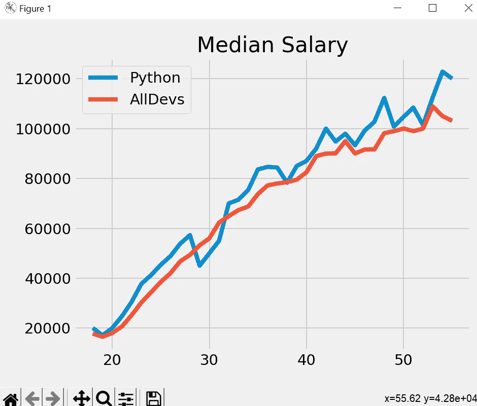
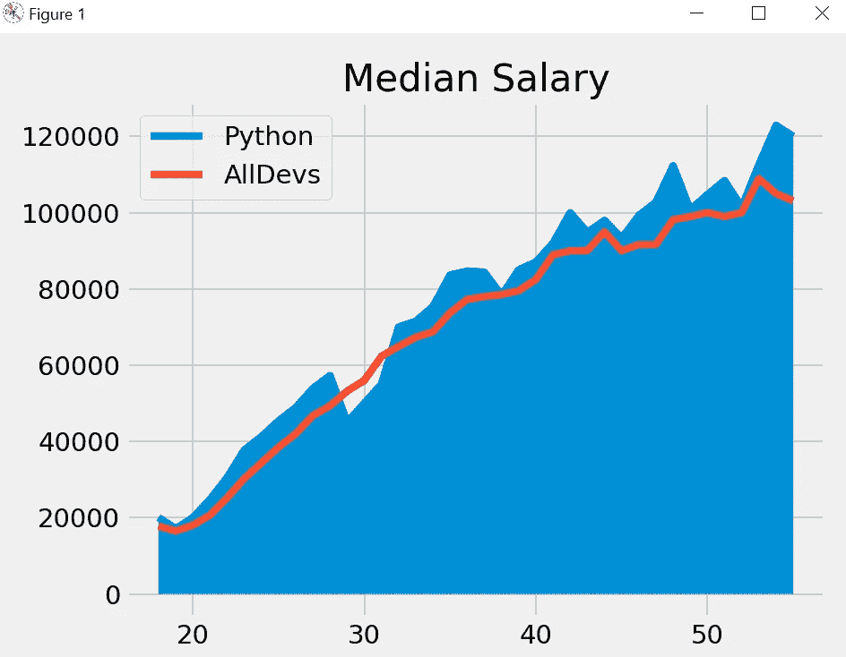
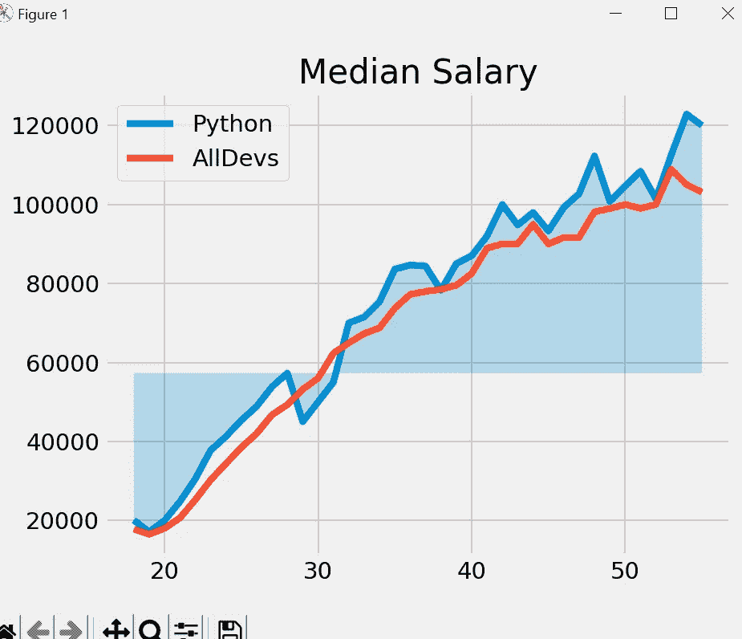
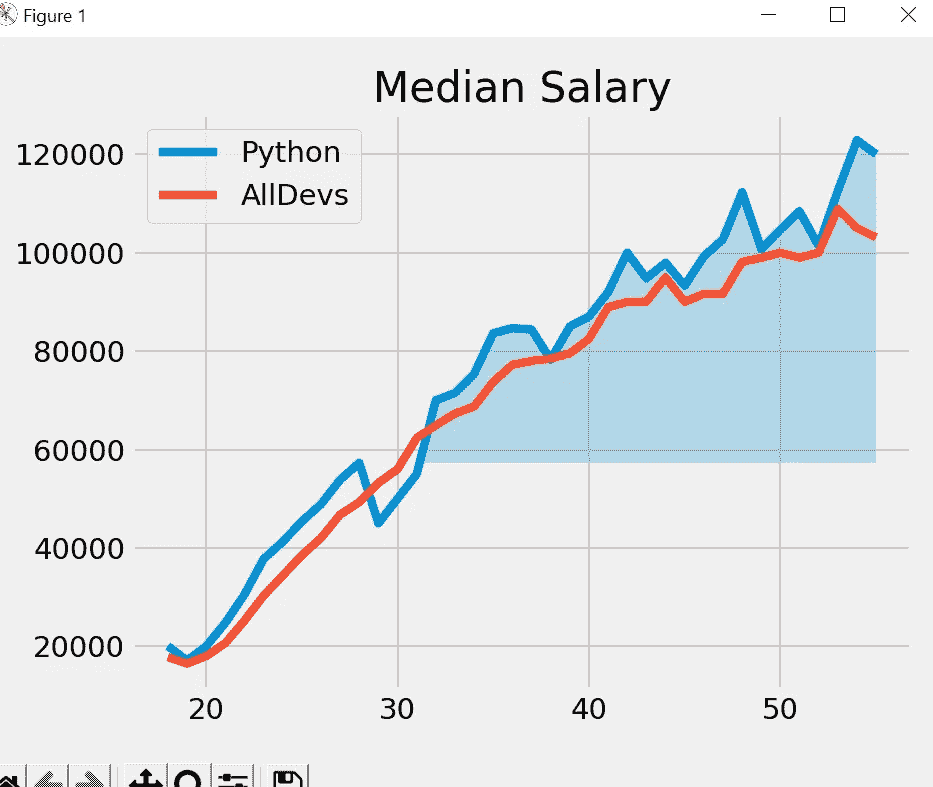
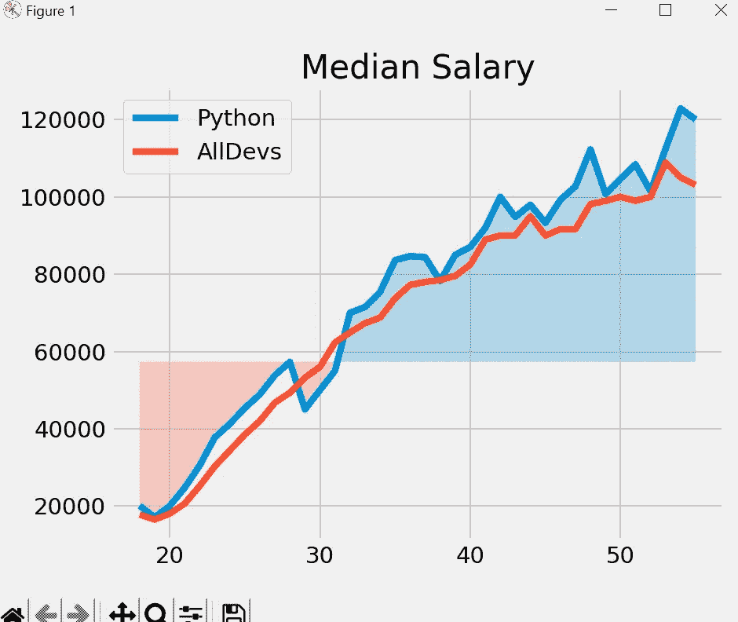

# Matplotlib 教程-5

> 原文：<https://medium.com/codex/matplotlib-tutorial-5-69e9c190f377?source=collection_archive---------8----------------------->

本教程将涵盖，填充线图上的区域。

在第一个教程中，我们讨论了线图，这里是相同的示例代码。

```
from matplotlib import pyplot as plt
import pandas as pd
plt.style.use('fivethirtyeight')
data = pd.read_csv('data_fill.csv')

Ages = data['Age']
PythonDev = data['Python']
AllDevs = data['All_Devs']

plt.plot(Ages,PythonDev, label='Python' )
plt.plot(Ages,AllDevs, label= 'AllDevs')

plt.legend()
plt.title('Median Salary')
plt.tight_layout()
plt.show()
```



fill_between()用于填充两条水平曲线之间的区域。两点(x，y1)和(x，y2)定义了曲线。这将创建一个或多个描述填充区域的多边形。“where”参数可用于有选择地填充某些区域。

因此，假设我们想要填充皮顿德夫和年龄之间的区域，我们可以添加下面的线。

```
plt.fill_between(Ages,PythonDev)
```



这填补了 Ages 和 Python Dev 之间的区域，但在这里没有更大的意义，所以如果我们设置一些阈值并在此图中使用相同的值，那么它将更有意义。

```
Threshold_Value = 57287
plt.fill_between(Ages,PythonDev, Threshold_Value, alpha = 0.25)
```

这里，我们将阈值设置为 57257，alpha = 0.25，用于调整图形的透明度。默认情况下，alpha=1。如果你想让图形的绘制更加透明，那么你可以让 alpha 小于 1，比如 0.5 或者 0.25。



因此，在图表中，我们可以清楚地看到，在 Python-Dev 工资越过阈值点的地方，当工资低于阈值点时，它填充上面的数据，当工资高于阈值点时，它填充下面的数据。

此外，我们还可以添加一个条件，如果我们想填写工资高于阈值的地方，我们可以添加一个相同的条件。

此外，我还使用了插值选项，该选项主要用于在预处理数据时估算数据框或数据系列中的缺失值。

```
plt.fill_between(Ages,PythonDev, Threshold_Value,
                 where = (PythonDev > Threshold_Value )
                 ,interpolate= True,alpha = 0.25)
```



因此，当工资高于阈值时，它将填充该区域，我们也可以设置两个条件，一个大于阈值，另一个小于阈值。

```
plt.fill_between(Ages,PythonDev, Threshold_Value,
                 where = (PythonDev > Threshold_Value )
                 ,interpolate= True,alpha = 0.25)
plt.fill_between(Ages,PythonDev, Threshold_Value,
                 where = (PythonDev < Threshold_Value )
                 ,interpolate= True,alpha = 0.25)
```



所以，我们可以很容易地通过填充区域来分析数据。

在下一篇教程中，我们将使用 matplotlib 介绍直方图。