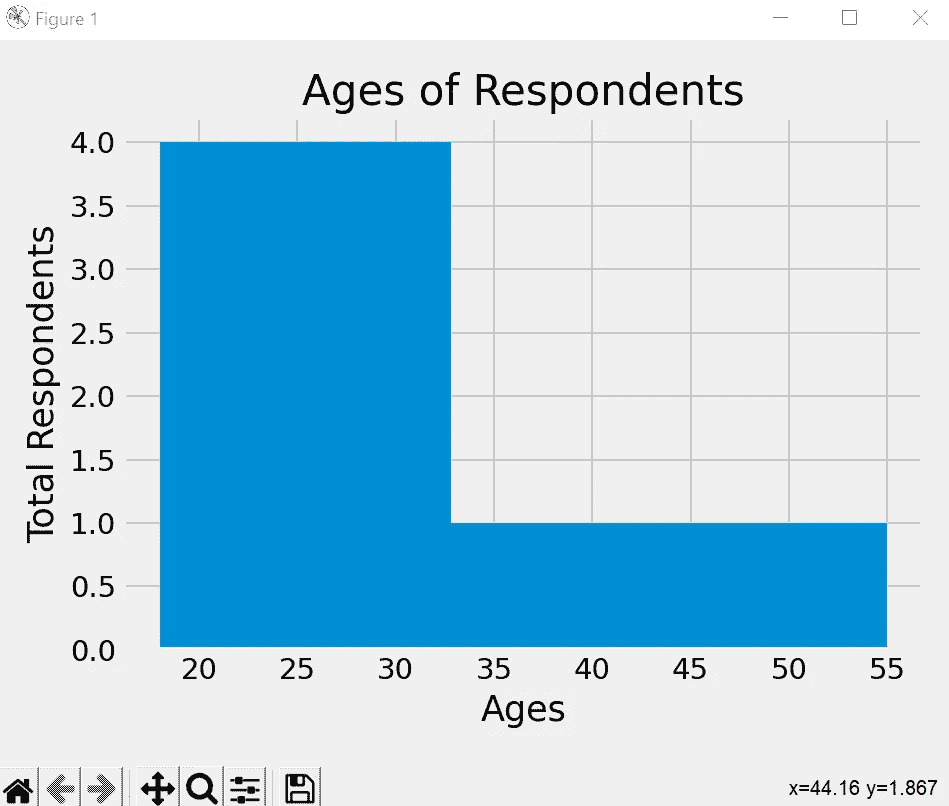
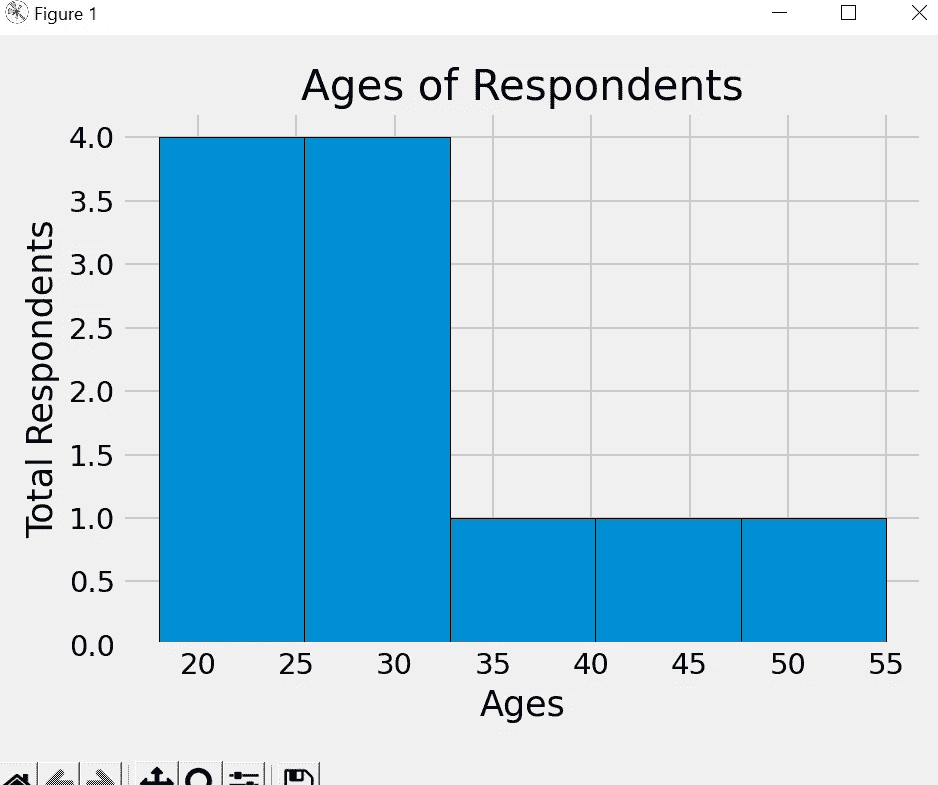
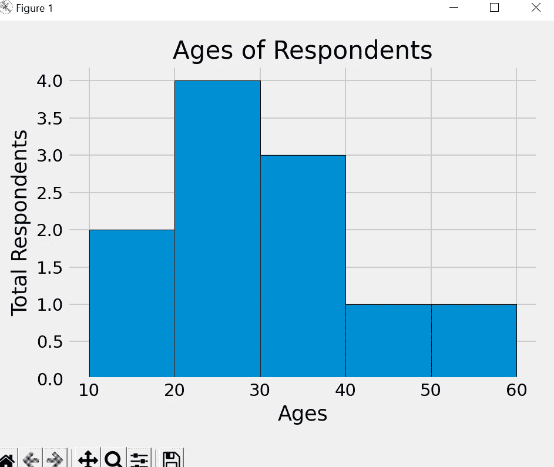
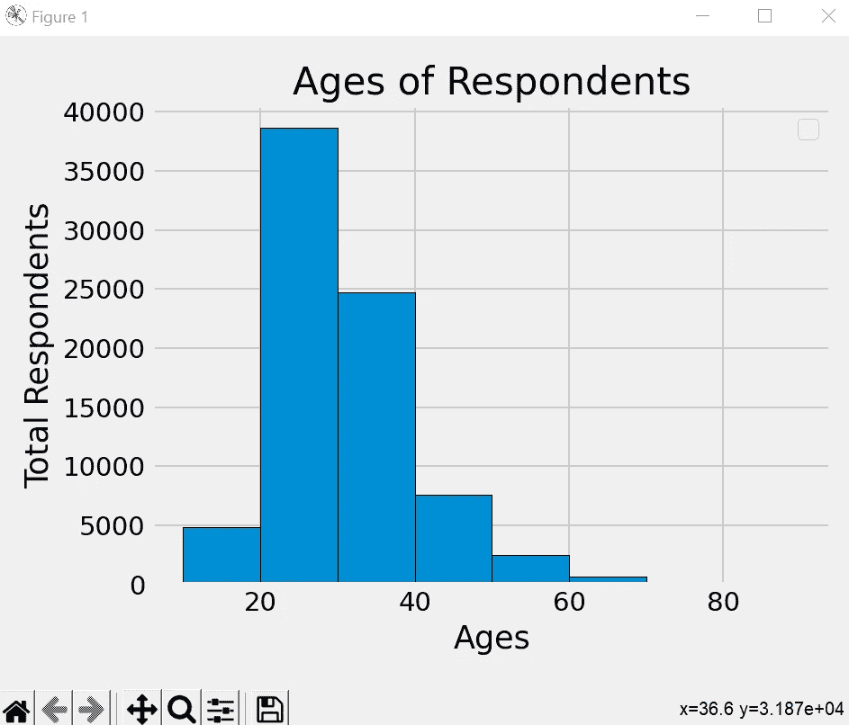
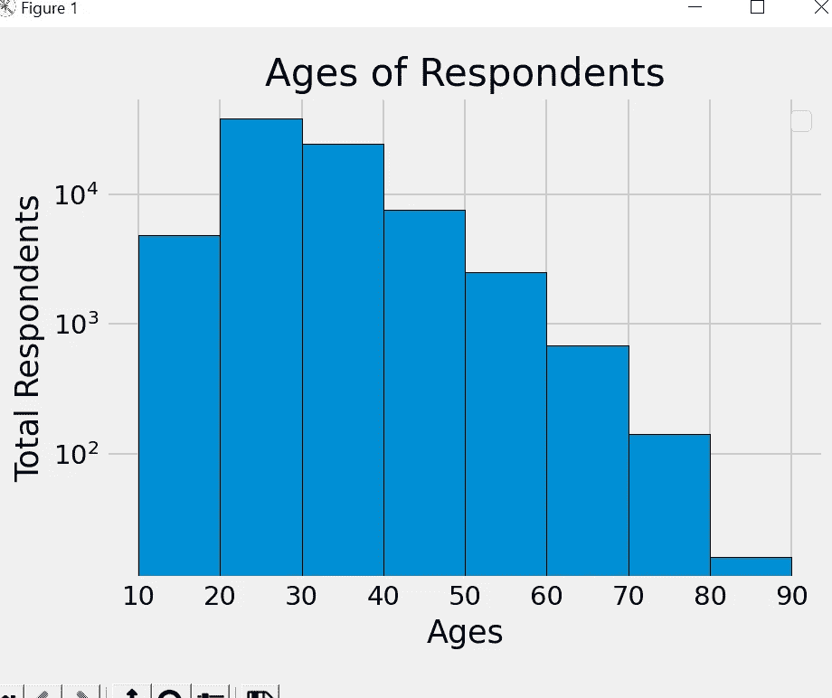
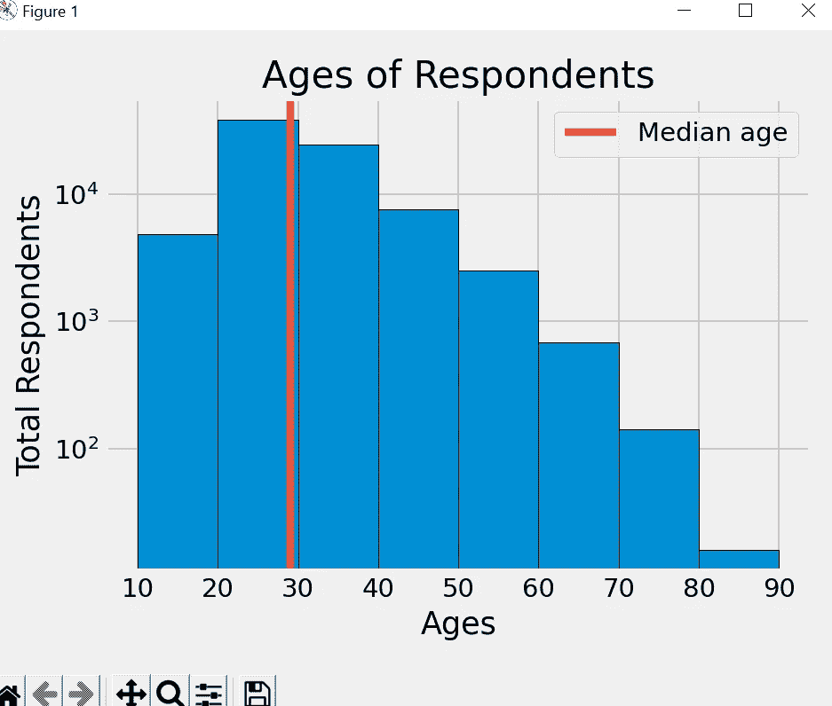

# Matplotlib 教程— 6

> 原文：<https://medium.com/codex/matplotlib-tutorial-6-2945daafabdc?source=collection_archive---------9----------------------->

本教程将涵盖，直方图使用 matplotlib。

直方图是显示频率分布的图表。它是一个图表，显示每个给定间隔内的观察次数。

这里，我们有年龄的例子来创建直方图。

```
import pandas as pd
from matplotlib import pyplot as plt

plt.style.use('fivethirtyeight')

ages = [18, 19, 21, 25, 26, 26, 30, 32, 38, 45, 55]

plt.hist(ages,bins=5)
plt.title('Ages of Respondents')
plt.xlabel('Ages')
plt.ylabel('Total Respondents')

plt.tight_layout()

plt.show()
```

在本例中，我们有一个年龄在 18 岁到 55 岁之间的列表，如果我们为该列表创建一个条形图，我们将获得多个柱状图，它会将数据划分为多个条块并绘制图表，因此我们将整个数据划分为五个 din 并创建柱状图。



因此，这里创建了五个箱，但我们能够看到确切的五个箱在哪里，为了更好地看，我将添加一个黑色的边缘颜色。

```
plt.hist(ages,bins=5,edgecolor= 'black')
```



现在，我们可以清楚地看到所有五个区间，并且能够看到 4–4 个用户属于 20–25 和 25–30 范围，依此类推。此外，我们可以定义一个存储箱范围，并相应地创建存储箱，而不是创建自动存储箱。

```
bins = [10,20,30,40,50,60]
plt.hist(ages,bins= bins,edgecolor= 'black')
```



因此，它将在一个明确的范围内划分数据，以便我们可以轻松地分析相同的数据。

现在，我们将使用堆栈溢出调查数据，我只采取了两列响应 id 和年龄，我会把 github 链接也同样的整个代码，我写在这个 tuotrial。

```
import pandas as pd
from matplotlib import pyplot as plt

plt.style.use('fivethirtyeight')

# ages = [18, 19, 21, 25, 26, 26, 30, 32, 38, 45, 55]
bins = [10,20,30,40,50,60,70,80,90]
# # plt.hist(ages,bins= bins,edgecolor= 'black')

data = pd.read_csv('data_age.csv')
ids = data['Responder_id']
ages = data['Age']

median_age = 29
color = '#fc4f30'
plt.hist(ages,bins= bins,edgecolor = 'black')
plt.legend()

plt.title('Ages of Respondents')
plt.xlabel('Ages')
plt.ylabel('Total Respondents')

plt.tight_layout()

plt.show()
```

这里，我们导入了 data_age.csv 文件，并使用该文件创建了直方图。



因此，我们可以看到最大反应，我们将从 20 至 30 岁的年龄组中获得，在 70 至 80 岁之间有一些反应，但由于数据庞大，这不是很明显。因此，如果您也想检查这些值，我们可以再传递一个参数 log = True。

```
plt.hist(ages,bins= bins,edgecolor = 'black', log=True)
```



此外，如果我们想设定一个中值年龄，并想为此画一条线，我们可以使用下面的代码执行相同的操作。

```
color = '#fc4f30'
plt.axvline(median_age,label = 'Median age', color = color)
plt.legend()
```



下面是包含代码和数据文件的 Git 库的链接。

[](https://github.com/vivalka/Matplotlib-Tutorials/tree/main/Tutorial_6) [## Matplotlib-Tutorials/Tutorial _ 6 位于 main vival ka/Matplotlib-Tutorials

### 在 GitHub 上创建一个帐户，为 vivalka/Matplotlib 教程开发做贡献。

github.com](https://github.com/vivalka/Matplotlib-Tutorials/tree/main/Tutorial_6) 

在下一个教程中，我们将涵盖散点图。