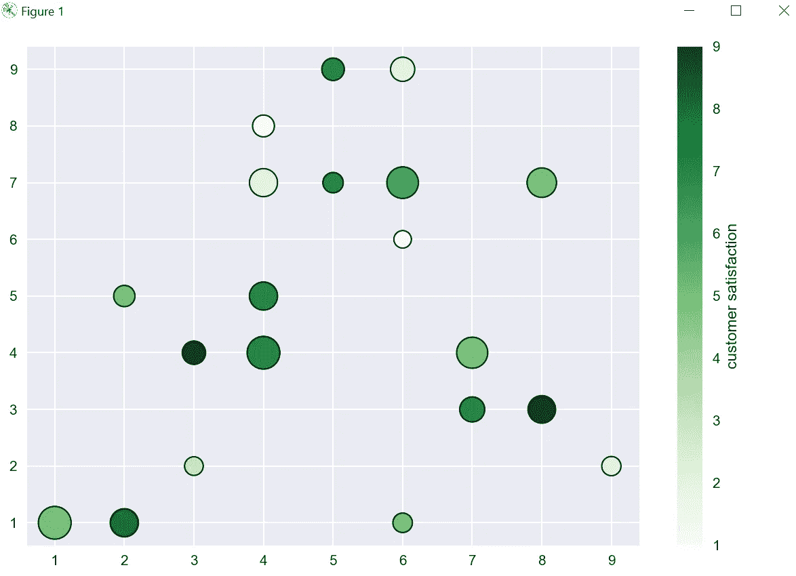

# Matplotlib 教程— 7

> 原文：<https://medium.com/codex/matplotlib-tutorial-7-855846f0d9be?source=collection_archive---------7----------------------->

本教程将涵盖散点图与 Matplotlib。

散点图使用点来表示两个不同数值变量的值。水平轴和垂直轴上每个点的位置表示单个数据点的值。散点图用于观察变量之间的关系。

让我们检查一个散点图的基本例子，然后，我们将检查所有的定制。

```
import pandas as pd
from matplotlib import pyplot as plt

plt.style.use('seaborn')

x = [5, 7, 8, 5, 6, 7, 9, 2, 3, 4, 4, 4, 2, 6, 3, 6, 8, 6, 4, 1]
y = [7, 4, 3, 9, 1, 3, 2, 5, 2, 4, 8, 7, 1, 6, 4, 9, 7, 7, 5, 1]

plt.scatter(x,y)
plt.tight_layout()

plt.show()
```

这里，我们使用了随机的 x 和 y 值，并使用 scatter()方法创建了一个散点图。


在散点图中，每个值用点表示，因为我们有随机数据，它没有显示任何关系，但我们将在后面的示例中检查真实世界的数据。

现在，让我们玩一些散点图的定制选项，我将提供定制文档的链接。

```
plt.scatter(x,y,s=100,c= 'Green',marker = 'X')
```


这里，我们使用“s”设置点的大小，使用“c”设置颜色，使用“X”设置标记，让我们运行整个代码并检查图形。现在，我们可以为每个点设置不同的颜色，而不是为每个标记设置绿色，让我们来看看这个例子。

```
colors = [7, 5, 9, 7, 5, 7, 2, 5, 3, 7, 1, 2, 8, 1, 9, 2, 5, 6, 7, 5]

plt.scatter(x,y,s=100,c=colors , cmap = 'Greens')
```

这里，我们有一个 x 和 y 值的颜色列表，我们传递了参数“c ”,并使用 cmap 参数为每个值提供一些好的颜色。

为了更好的表现，我们也可以使用边缘颜色和线宽。

```
colors = [7, 5, 9, 7, 5, 7, 2, 5, 3, 7, 1, 2, 8, 1, 9, 2, 5, 6, 7, 5]

plt.scatter(x,y,s=100,c=colors , cmap = 'Greens',
            edgecolors='black',linewidths=1)
```


现在，我们也可以为每个标记设置不同的大小，因为我们已经创建了一个大小列表，并在' s '参数中传递了相同的大小。

```
sizes = [209, 486, 381, 255, 191, 315, 185, 228, 174,
         538, 239, 394, 399, 153, 273, 293, 436, 501, 397, 539]

plt.scatter(x,y,s=sizes,c=colors , cmap = 'Greens',
            edgecolors='black',linewidths=1)
```


现在，我们还可以添加一个标签，所以当我们展示这个图表时，很容易理解，假设所有的值都代表客户满意度，让我们添加相同的标签。

```
plt.scatter(x,y,s=sizes,c=colors , cmap = 'Greens',
            edgecolors='black',linewidths=1)
cbar = plt.colorbar()
cbar.set_label('customer satisfaction')
```



现在，我们已经介绍了示例数据中的定制，请找到下面的文档链接。

[](https://matplotlib.org/stable/api/_as_gen/matplotlib.pyplot.plot.html) [## Matplotlib . py plot . plot-Matplotlib 3 . 6 . 2 文档

### 用线条和/或标记绘制 y 与 x 的关系。调用签名:点或线节点的坐标由 x…

matplotlib.org](https://matplotlib.org/stable/api/_as_gen/matplotlib.pyplot.plot.html) [](https://matplotlib.org/3.1.0/tutorials/colors/colormaps.html) [## 在 Matplotlib - Matplotlib 3.6.2 文档中选择色彩映射表

### Matplotlib 有许多内置的色彩映射表，可通过 matplotlib.colormaps 访问。还有外部库…

matplotlib.org](https://matplotlib.org/3.1.0/tutorials/colors/colormaps.html) 

现在，用真实世界的数据来检查例子，以便更好地理解。我有一个 excel，其中有 youtube 交易视频的数据，让我们绘制相同的。

```
import pandas as pd
from matplotlib import pyplot as plt

plt.style.use('seaborn')

data = pd.read_csv('youtube_data.csv')
view_count = data['view_count']
likes = data['likes']
ratio = data['ratio']
plt.scatter(view_count,likes,c=ratio,cmap='summer',
            edgecolors='black',linewidths=1)
plt.xscale('log')
plt.yscale('log')
cbar = plt.colorbar()
cbar.set_label("Youtube like/dislike ratio")
plt.title('Trending YouTube Videos')
plt.xlabel('View Count')
plt.ylabel('Total Likes')

plt.tight_layout()

plt.show()
```

在这里，我从 csv，view_count 和 likes 中读取数据，我用于 x 和 y 轴。比例，我是用颜色。

此外，我还将 cmap 设置为夏季，并对 x 轴和 y 轴使用对数刻度。


这向我们展示了实时数据的良好表现，请查找代码和数据 excel 的 git hub 链接。

[](https://github.com/vivalka/Matplotlib-Tutorials/tree/main/Tutorial_7) [## Matplotlib-Tutorials/Tutorial _ 7 位于 main vival ka/Matplotlib-Tutorials

### 在 GitHub 上创建一个帐户，为 vivalka/Matplotlib 教程开发做贡献。

github.com](https://github.com/vivalka/Matplotlib-Tutorials/tree/main/Tutorial_7) 

在下一个教程中，将涵盖绘制时间序列数据。