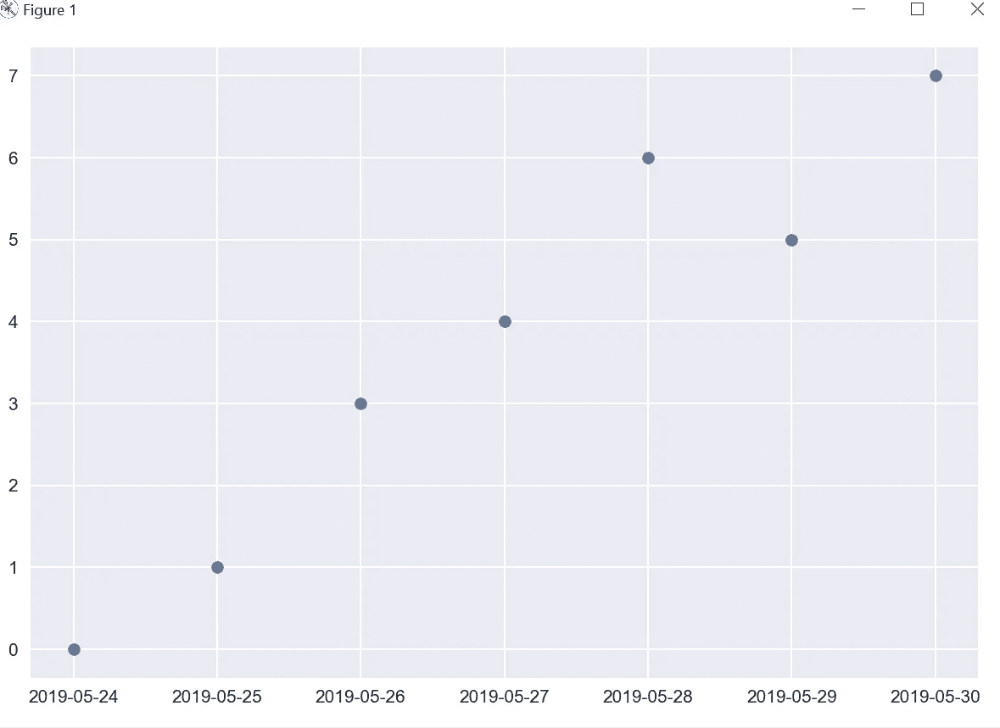
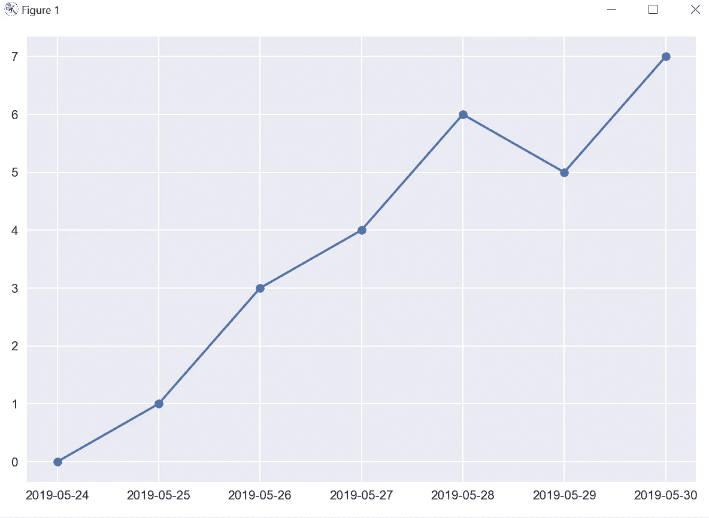
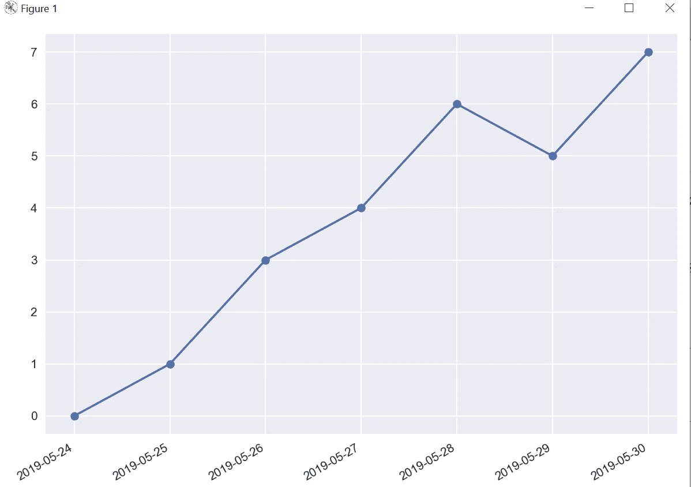
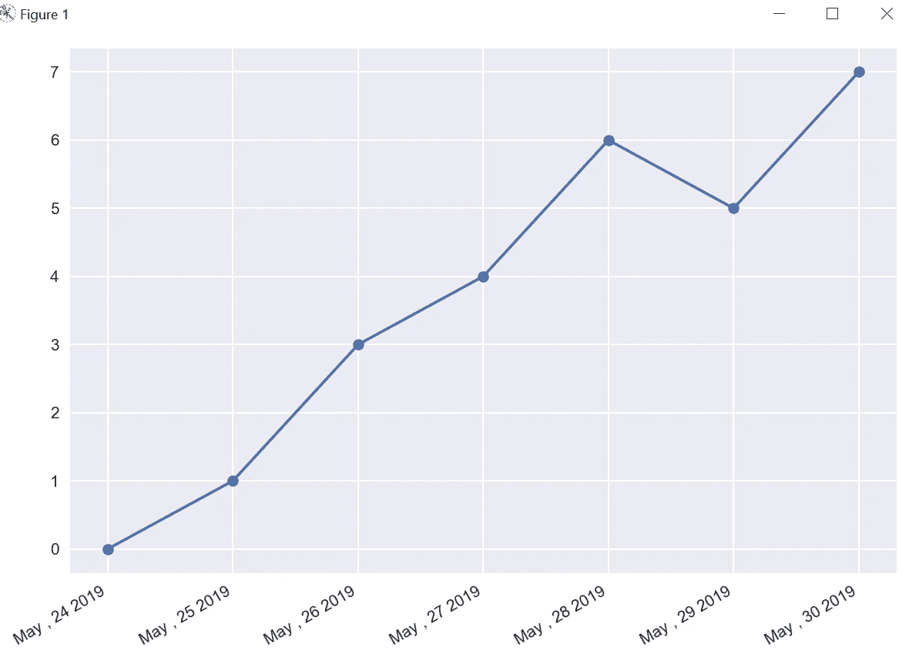
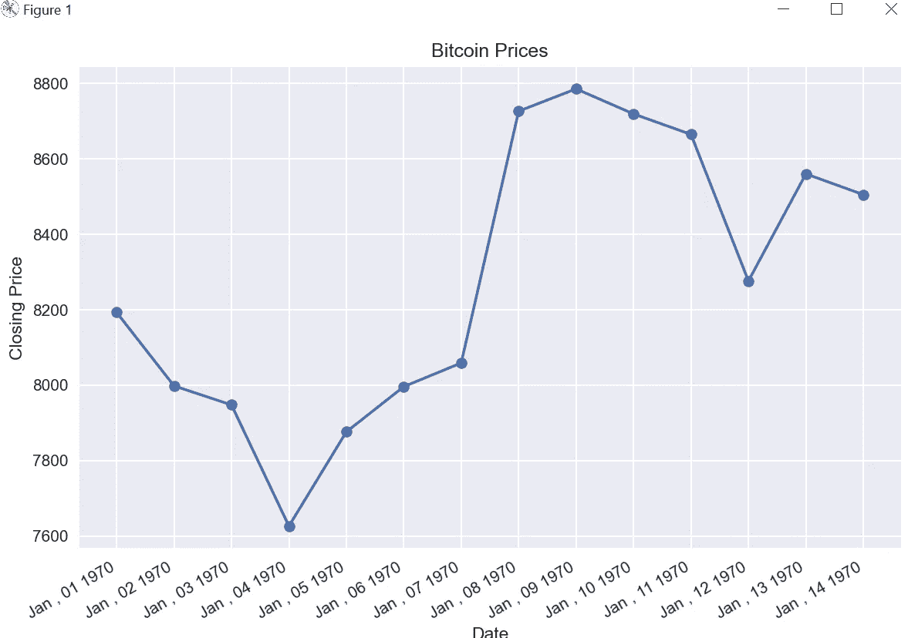
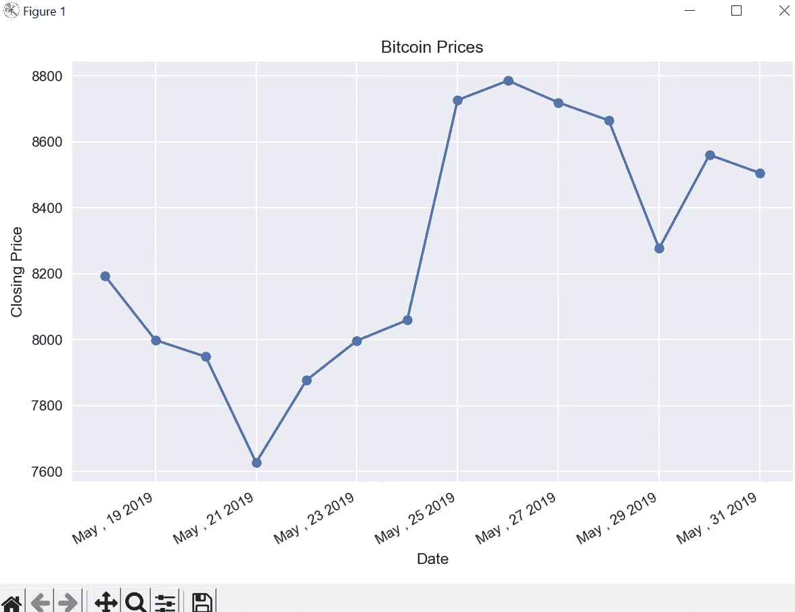

# Matplotlib 教程— 8

> 原文：<https://medium.com/codex/matplotlib-tutorial-8-63ffff8fa912?source=collection_archive---------8----------------------->

本教程将涵盖，绘制时间序列数据。

我有下面的示例代码，我将用它来覆盖时间序列数据，让我们先检查一下代码。

```
import pandas as pd
from datetime import datetime, timedelta
from matplotlib import pyplot as plt
from matplotlib import dates as mpl_dates

plt.style.use('seaborn')

dates = [
    datetime(2019, 5, 24),
    datetime(2019, 5, 25),
    datetime(2019, 5, 26),
    datetime(2019, 5, 27),
    datetime(2019, 5, 28),
    datetime(2019, 5, 29),
    datetime(2019, 5, 30)
]

y = [0, 1, 3, 4, 6, 5, 7]

plt.tight_layout()

plt.show()
```

这里，我们从 matplotlib 导入了 pandas、DateTime、timedelta 和 dates。此外，我们有 x 轴的样本日期和 y 轴的一些随机值。

让我们使用 plot_date 绘制相同的图形，然后我们将检查配置选项。

```
plt.plot_date(dates,y)
```



默认情况下，它将只绘制标记，但是如果你想要一个实线连接，我们可以通过传递一个额外的参数来实现。

```
plt.plot_date(dates,y,linestyle='solid')
```



现在，我们将使用 gcf()方法格式化我们的 x 轴数据，它代表获取当前数字。

```
plt.gcf().autofmt_xdate()
```



这提供了我们的 x 轴日期，以便更好地表示。现在，我们将使用 matplotlib 中作为 mpl_dates 导入的日期来格式化日期。对于格式字符串，我会提供下面的链接，所以你可以使用不同的格式，如果你想的话。

```
date_format = mpl_dates.DateFormatter('%b , %d %Y')
plt.gca().xaxis.set_major_formatter(date_format)
```

 [## 日期时间-基本日期和时间类型- Python 3.11.0 文档

### 模块只提供一个具体的类，即类。该类可以表示简单的时区，具有固定的…

docs.python.org](https://docs.python.org/3/library/datetime.html#strftime-and-strptime-behavior) 

现在，x 轴日期以我们提供的格式出现，现在我们将使用 CSV 数据对更大的数据集执行操作。

```
data = pd.read_csv('Data_TimeSeries.csv')
price_date = data['Date']
price_close = data['Close']

plt.title('Bitcoin Prices')
plt.xlabel('Date')
plt.ylabel('Closing Price')

plt.plot_date(price_date,price_close,linestyle='solid')
plt.gcf().autofmt_xdate()
date_format = mpl_dates.DateFormatter('%b , %d %Y')
plt.gca().xaxis.set_major_formatter(date_format)
plt.tight_layout()

plt.show()
```

我们有一个样本数据 csv 文件，其中包含样本比特币价格(下面是相同的 github 链接)，我们使用熊猫读取相同的数据，我们绘制的日期为 x 轴，价格为 y 轴。



但是当我们从 pandas 读取数据时，它会默认读取字符串，所以假设我们有一些未排序的日期，那么它会按原样绘制，这实际上没有任何意义。

为了进行排序，我们首先需要将数据从字符串转换为日期时间，然后排序，以绘制实际结果，下面是相同的代码。

```
price_date = pd.to_datetime(data['Date'])
data.sort_values('Date',inplace=True)
```



下面是代码和数据表的链接。

[](https://github.com/vivalka/Matplotlib-Tutorials/tree/main/Tutorial_8) [## Matplotlib-Tutorials/Tutorial _ 8 位于 main vival ka/Matplotlib-Tutorials

### 此时您不能执行该操作。您已使用另一个标签页或窗口登录。您已在另一个选项卡中注销，或者…

github.com](https://github.com/vivalka/Matplotlib-Tutorials/tree/main/Tutorial_8) 

在下一教程中，将介绍实时绘制实时数据。