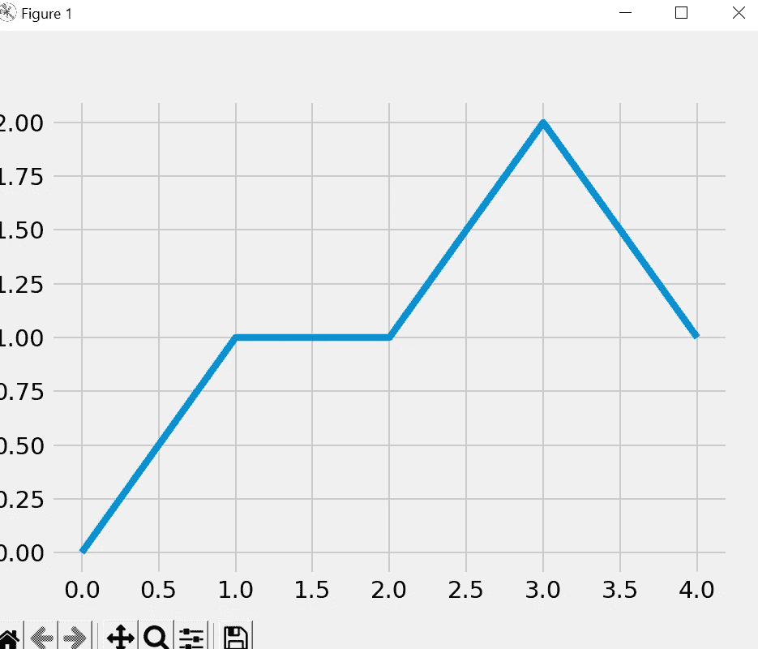
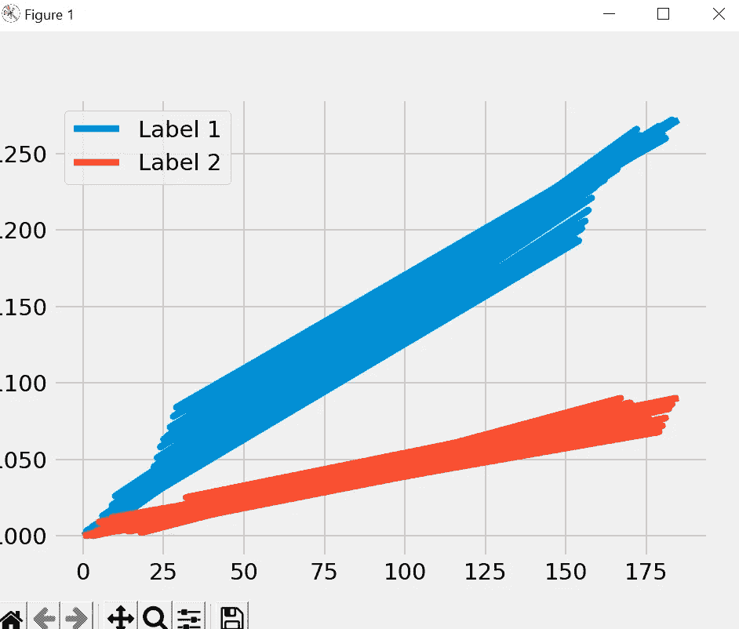

# Matplotlib 教程— 9

> 原文：<https://medium.com/codex/matplotlib-tutorial-9-fe1166e57aed?source=collection_archive---------13----------------------->

本教程将涵盖实时绘制实时数据。

当使用传感器、不断从 API 提取数据或拥有经常更新的文件时，您可能希望实时分析数据。

为了绘制实时数据，我们将使用 matplotlib 中的 FuncAnimation()。

让我们理解下面的代码，然后我们将导入 FuncAnimation()来绘制实时数据。

```
import random
from itertools import count
import pandas as pd
import matplotlib.pyplot as plt

plt.style.use('fivethirtyeight')

x_vals = [0, 1, 2, 3, 4, 5]
y_vals = [0, 1, 3, 2, 3, 5]

plt.plot(x_vals, y_vals)
```

这里，我们有用 X 和 Y 值绘制线图的基本代码，但是如果我们想对 X 和 Y 轴都使用动态值，我们可以使用下面的函数来代替静态值。

```
index = count()

def animate(i):
    x_vals.append(next(index))
    y_vals.append(random.randint(0, 5))
```

在这个函数中，我们使用计数函数，每次将 X 值增加 1，对于 Y 轴，我们使用 1 到 5 之间的随机值。

让我们从 matplotlib 导入 FuncAnimation()，并使用动态值来绘制数据。

```
import random
from itertools import count
import pandas as pd
import matplotlib.pyplot as plt
from matplotlib.animation import  FuncAnimation

plt.style.use('fivethirtyeight')

x_vals = []
y_vals = []
index = count()

def animate(i):
    x_vals.append(next(index))
    y_vals.append(random.randint(0, 5))
    plt.cla()
    plt.plot(x_vals,y_vals)

ani = FuncAnimation(plt.gcf(),animate,interval=1000)

plt.tight_layout()
plt.show()
```

在这里，我们已经导入了 FuncAnimation，创建了一个变量 ani，并传递了三个参数，第一个是 gcf()，这意味着获取当前数字，第二个是我们正在传递的函数，在这里我们生成值并绘制图形，interval 表示它将在什么时间间隔内运行该函数，这里我传递了 1000，这意味着它将每秒运行一次。

plt.cla()用于在每次运行该函数时清除图形，否则它每次都会重叠线条。所以我们将运行这段代码，每秒钟得到一个动态图。



现在，了解了具有实时数据的真实示例，我已经创建了一个脚本，该脚本将生成数据并将其连续写入 CSV，我们将使用该 CSV 来绘制图表，因此我将快速浏览一下用于更新 CSV 的脚本。

```
import csv
import random
import time

x_value = 0
total_1 = 1000
total_2 = 1000

fieldnames = ["x_value", "total_1", "total_2"]

with open('data.csv', 'w') as csv_file:
    csv_writer = csv.DictWriter(csv_file, fieldnames=fieldnames)
    csv_writer.writeheader()

while True:

    with open('data.csv', 'a') as csv_file:
        csv_writer = csv.DictWriter(csv_file, fieldnames=fieldnames)

        info = {
            "x_value": x_value,
            "total_1": total_1,
            "total_2": total_2
        }

        csv_writer.writerow(info)
        print(x_value, total_1, total_2)

        x_value += 1
        total_1 = total_1 + random.randint(-6, 8)
        total_2 = total_2 + random.randint(-5, 6)

    time.sleep(1)
```

我使用 CSV 模块打开一个 CSV 文件，添加三列 X_value、total_1 和 total_2，现在在一个无限 while 循环中，使用 csv_writer 将这些值追加到 CSV 文件中，最后，我将 x_value 的值加 1，将随机值添加到 total_1 和 total_2。

现在，我们将在代码中读取 CSV 并绘制数据。

```
import random
from itertools import count
import pandas as pd
import matplotlib.pyplot as plt
from matplotlib.animation import  FuncAnimation

plt.style.use('fivethirtyeight')

index = count()

def animate(i):
    data = pd.read_csv('data_random.csv')
    x = data['x_value']
    y1 = data['total_1']
    y2 = data['total_2']
    plt.cla()
    plt.plot(x,y1,label = 'Label 1')
    plt.plot(x,y2,label = 'Label 2')
    plt.legend()

ani = FuncAnimation(plt.gcf(),animate,interval=1000)

plt.tight_layout()
plt.show()
```



下面是代码和数据表的 GitHub 链接。

[https://github . com/vival ka/Matplotlib-Tutorials/tree/main/Tutorial _ 9](https://github.com/vivalka/Matplotlib-Tutorials/tree/main/Tutorial_9)

在下一个教程将涵盖子图。