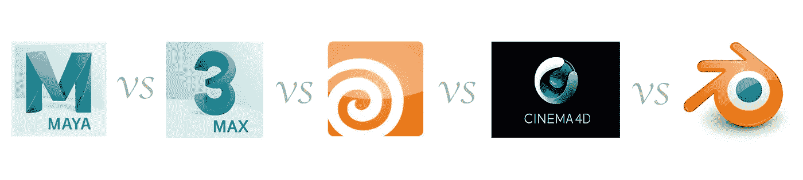

# 玛雅 vs 3ds Max vs 胡迪尼 vs 电影院 4D vs 搅拌机

> 原文：<https://medium.com/codex/maya-vs-3ds-max-vs-houdini-vs-cinema-4d-vs-blender-76d173696f2a?source=collection_archive---------0----------------------->

## 药典

本季度@ [斯坦福大学](https://medium.com/u/1022fa5dee6d?source=post_page-----76d173696f2a--------------------------------)，我选修的课程之一是 CS148 计算机图形与成像导论。

作为一个计算机图形学的初学者，你可能想知道:对于我想要实现的东西，有什么工具？这些工具有什么不同？