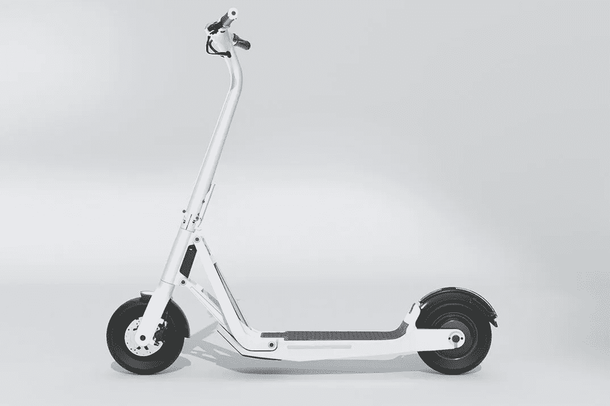

# 迈凯轮凭借其首款电动滑板车重新定义了个人移动性？

> 原文：<https://medium.com/codex/mclaren-redefines-personal-mobility-with-its-first-ev-scooter-9d47dc219a7?source=collection_archive---------0----------------------->

## 把超级跑车的知识带给滑板车！

[系列 1(拉沃伊媒体)](https://www.lavoielectric.com/)

我们都知道交通的未来是电动的，每个人都在争先恐后地进行转换。著名的超级跑车制造商迈凯轮最近推出了他们的第一辆电动汽车，但它不是一辆汽车。这是一辆踏板车——确切地说，是 Lavoie 系列 1。更了不起的是，迈凯轮…