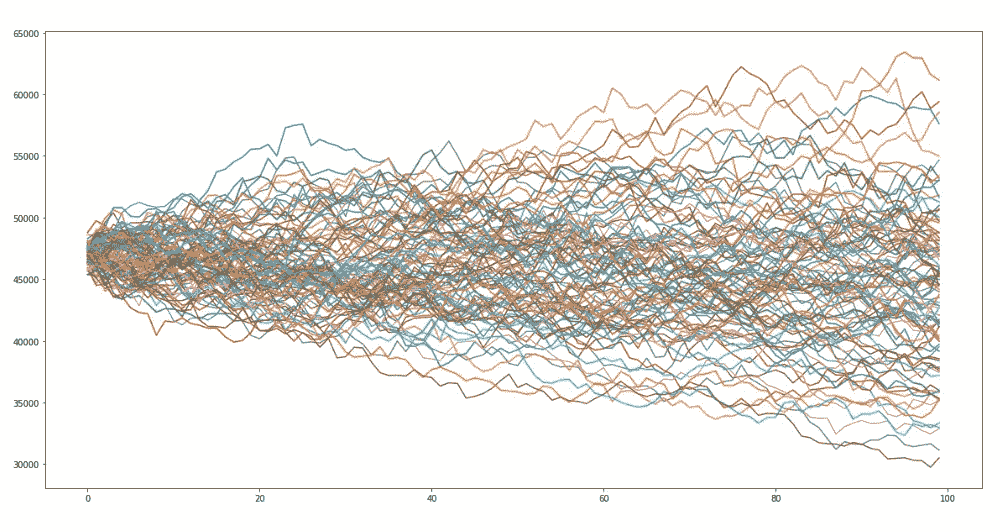

# 使用 python 中的蒙特卡罗模拟测量投资组合风险—第 1 部分

> 原文：<https://medium.com/codex/measuring-portfolio-risk-using-monte-carlo-simulation-in-python-part-1-ac69ea9802f?source=collection_archive---------3----------------------->

**简介**

作为一名数据科学家，我的优势之一是我总是使用最简单的方法和技术来解释复杂而密集的数据和人工智能相关概念。

因此，我将尽力解释蒙特卡罗模拟的概念，以及为什么它是投资组合风险管理的重要方法，也是金融领域主要参与者使用的重要方法。

作为数据科学家，我们总是有处理不确定性的任务，并通过简单地预测与我们试图追求或实现的每个事件相关的风险，为意外情况做好准备。

想象一下，你正在管理一份股票清单或一个投资组合，你的投资任务只是实现资本增长，同时降低风险。

蒙特卡罗模拟方法用于在定量分析和决策中考虑风险。总而言之，这种方法被金融、能源、项目管理、石油和天然气、交通、环境和社会治理等领域的专业人士以及更多行业的专业人士所采用。

**什么是蒙特卡洛模拟？**

蒙特卡罗模拟通过建立可能结果的模型来执行风险分析，只需用一系列值(称为概率分布)代替任何具有内在不确定性的因素。简单来说，蒙特卡罗模型用于预测不同结果的概率，或者在我们的情况下，基于所有相关股票的不同波动率结果的投资组合价值。该模型的结果将解释预测和预报模型中风险和不确定性的影响。这些风险将以 cVar 和 Var 值的形式呈现。

我将在本文的第 2 部分解释什么是 cVar 和 Var，但是现在你需要理解这些简单的解释。

**蒙特卡罗方法如何工作**

基本上，蒙特卡罗模型通过以概率分布的形式替换模型中呈现的一系列值，为任何具有内在不确定性的因素建立可能结果的模型。然后，它一遍又一遍地计算和运行这些结果，每次都使用概率函数中不同的随机值。

基于所讨论的不确定性的数量，该模型在完成之前可能涉及成百上千次的重新计算。

**什么使用概率分布，为什么它对蒙特卡洛模拟模型很重要**

要回答这些问题，你必须记住一件事，蒙特卡罗是正态或钟形曲线概率分布，钟形曲线是蒙特卡罗方法。

**编码第 1 部分—蒙特卡罗模拟模型**

在我们开始之前，我想澄清一点，由于我在金融领域的经验，我决定将这种方法应用于股票市场，换句话说就是资本市场。

你可以将这种方法运用到经济的任何其他子领域来衡量你的整体风险。只要你有史料。

现在我们已经很好地理解了什么是蒙特卡罗模拟，以及为什么大玩家使用这种方法，让我们来看看如何用 Python 编写蒙特卡罗模拟方法。

您需要以下内容

首先，让我们调用正确的库来执行蒙特卡罗模拟(MCS)模型

我假设你们中的一些人知道调用这些库的功能，如果你不知道，这里有这些库的简要描述(来源:维基百科和其他网络渠道)

**代码**

```
import pandas as pd
import numpy as np
import matplotlib.pyplot as plt
import datetime as dt
from pandas_datareader import data as pdr
```

**Pandas** :这是一个用于数据操作和分析的软件库，它提供数据结构和操作来操作数字表格和时间序列。

**pandas_datareader** :这是 pandas 图书馆的一个扩展或包，它帮助我们从广泛的互联网资源中提取数据到 pandas 数据框架中。

Numpy:这是一个软件库，用于增加对大型多维数组和矩阵的支持，以及对这些数组进行操作的大量高级数学函数。

**Matplotlib :** 这个 python 库用于通过使用 python 脚本来创建 2D 图形和绘图。它有一个名为 pyplot 的模块，通过提供控制线条样式、字体属性、格式轴等功能，使绘图变得容易。

**导入和提取数据**

**代码**

```
# import data
def get_data(stocks, start, end):
    stockData = pdr.get_data_yahoo(stocks, start, end)
    stockData = stockData['Close']
    returns = stockData.pct_change()
    meanReturns = returns.mean()
    covMatrix = returns.cov()
    return meanReturns, covMatrix
```

这里我们用 python 定义了一个函数，我们称之为 get_data()，只需借助我们的 pandas_data reader 库，我们就可以从 Yahoo Finance 中提取金融相关数据。

在这个函数中，我们提取以下内容，指定股票的收盘价，每日价格变化，平均价格表现或收益的均值和协方差，我指的是股票的价格百分比变化。

**提示**:计算两个随机变量或收益的协方差是蒙特卡罗模拟方法的主要组成部分。协方差评估两个随机股票的平均值如何一起移动。如果当股票 B 的收益上升时，股票 A 的收益也上升，当每只股票的收益下降时，也发现了同样的关系，那么这些股票就被称为具有正协方差。

为什么我们在蒙特卡罗方法中使用协方差作为风险的度量，因为在现代投资组合理论中，我们简单地使用协方差通过协方差通知的多样化来保护投资组合免受波动的影响，从而在统计上降低投资组合的总体风险。

下面是 get_data()函数的相关公式列表:

**平均公式**:

**哪里**:

**Xn** =该股票的所有日收益率或价格百分比变化。

**n** =退货总数或价格百分比变化或样本量。

**价格百分比变化:**

要计算价格变化的百分比，首先要计算出你所比较的两个数字之间的差异(增加或减少)

如果我们一开始就涨价

**增加** =新号码—原号码

如果我们开始降价

**减少**=原号码-新号码

​

因此，价格百分比(%)的变化计算如下

例如，如果你以 178 美元/股的成本价持有一些百事可乐的股票，该股票以 189 美元/股开始交易，按照上述计算，你的

增加= 189–178 = 11 美元(这是成本和当前市场价格之间的差额，理论上你获得了每股 11 美元的未实现收益)

因此，您的价格百分比变化为:

**%** **变化** = (11/178) * 100 = 6.179%

**协方差**:

至于协方差下面是协方差公式，假设我们需要测量两只股票之间的方向关系，**股票 A** 和**股票 B** 。

**哪里**

**返回**:是股票的价格变化

平均价格:就是股票的平均价格

**n** :是尺寸的大小或总数。

**提取财务数据**

```
stockList = ['BNS.TO', 'GOOGL', 'XOM', 'NIO', 'KO', 'PEP','ARCC','IBM','AGNC','LCID']
stocks = [stock for stock in stockList]
endDate = dt.datetime.now()
startDate = endDate - dt.timedelta(days=300)

meanReturns, covMatrix = get_data(stocks, startDate, endDate)

weights = np.random.random(len(meanReturns))
weights /= np.sum(weights)
```

在这里，我选择了大约 10 只股票，其中 9 只在美国上市，1 只在加拿大上市，这些股票代表了我们的投资组合。一个完善的投资组合通常由股票、债券、商品、期货和衍生品组成。这些资产类别的价值或投资分配由基金经理决定，基金经理必须根据他或她工作的公司的投资异议，遵循严格的投资指令。

一些基金经理更喜欢投资股票和债券，70%的资产配置是股票，20%是债券，其余的是现金。其他人有不同的投资议程等等。

无论如何，我们总是可以在另一篇文章中谈论资产配置技术，我认为我应该这样做。

回到我们的案例，我们将根据所有这些股票的 300 天表现来衡量我们的投资组合风险。通过使用我们从协方差、均值和股价变化的前置函数中收集的所有数据。

至于投资组合或股票的权重，我是随机定义的，当然，如你所知，投资组合的所有权重应该加 1，代表 100%的权重，或者如我前面提到的权重矩阵等于 1。

现在，我们准备开始执行蒙特卡洛模拟方法

**蒙特卡洛模拟分析**

```
# Monte Carlo simulation
mc_sims = 100 # number of simulations
T = 100 #timeframe in days

meanM = np.full(shape=(T, len(weights)), fill_value=meanReturns)
meanM = meanM.T

portfolio_sims = np.full(shape=(T, mc_sims), fill_value=0.0)

initialPortfolio = 47000

for m in range(0, mc_sims):
    Z = np.random.normal(size=(T, len(weights)))#uncorrelated RV's
    L = np.linalg.cholesky(covMatrix) #Cholesky decomposition to Lower Triangular Matrix
    dailyReturns = meanM + np.inner(L, Z) #Correlated daily returns for individual stocks
    portfolio_sims[:,m] = np.cumprod(np.inner(weights, dailyReturns.T)+1)*initialPortfolio

font = {'family': 'serif',
        'color':  'white',
        'weight': 'normal',
        'size': 25,
        }
plt.figure(figsize=(20, 10))
plt.plot(portfolio_sims)
plt.ylabel('Portfolio Value ($)',  fontdict=font)
plt.xlabel('Days',  fontdict=font)
plt.title('Monte carlo simulation of a stock portfolio',  fontdict=font)
plt.show()
```

使用 python 来运行这样一个模拟的美妙之处在于，您可以对数百个投资组合运行尽可能多的测试和模拟，并在几秒钟内(如果不是几分钟的话)获得这些结果。

对于我们的投资组合，我们将在规定的 300 天中的 100 天内运行 100 次模拟。

通过定义 meanM 和 portfolio_sims，我们基本上创建了一个空数组，并用我们定义的股票的平均回报率及其权重来填充它。

然后，我们创建一个事件或测试的循环，以确定一个可能的投资组合，给出关于这些股票的协方差和平均回报的已有数据。

我们将假设每日收益服从 u 多元正态分布，其中我们将计算出 Z 变量，它们是正态分布的样本，然后我们使用乔莱斯基分解来确定下三角矩阵。

*提示:乔莱斯基分解是将一个埃尔米特正定矩阵分解成一个下三角矩阵与其共轭转置的乘积，这对高效的数值解很有用(来源维基:*[*【https://en.wikipedia.org/wiki/Cholesky_decomposition*](https://en.wikipedia.org/wiki/Cholesky_decomposition)*)*

简单地说，我们将把不相关的数百只股票变成相对相关的一组，这样我们就可以看到 100 个投资组合的结果。

现在我们需要做的是将所有这些投资组合模拟记录到每日回报中，并将它们累积到天数中，然后根据模拟结果保存它们，我们将使用这行代码来完成 portfolio_sims[:，m] = np.cumprod(np.inner(weights，dailyReturns。t)+1)*初始投资组合。(请参考上面的代码片段)。

这里，我决定初始投资组合金额为 47，000 美元，然后我们简单地使用 matplotlib 库绘制我们的方法，如上面的代码所示。



图 1 蒙特卡罗模拟结果

看上面的图，我们可以看到 100 个不同的投资组合模拟，折线图在这一点上意味着什么，我们可以看到初始投资组合金额在 47，000 美元大关。因此，在接下来的 100 天里，投资组合的价值应该超过 6.3 万美元，或者不应该低于 3 万美元。

为了确定您的投资组合的最坏情况，我们需要更深入地挖掘我们的代码，并计算出 VAR 和 cVar 值，这将告诉我们，如果市场或投资组合暴跌或跌至某个水平，我们可能会损失多少。

基本上， **Var** 和 **cVar** 是金融风险度量领域中用于评估投资组合的市场风险或信用风险的概念。

我们将在本文的下一部分 python 中的**蒙特卡罗模拟——第二部分**中触及这个概念

在第二部分的**中，你将能够通过采用 Var 和 cVar 来量化市场对你的头寸不利时可能的损失。如果你们中的任何人看过电影“**保证金通知**”，你就会明白这种策略对于捕捉最糟糕的情况并在它发生之前采取行动是很方便的。**

如果你需要关于这篇论文的任何帮助，请不要犹豫来找我。